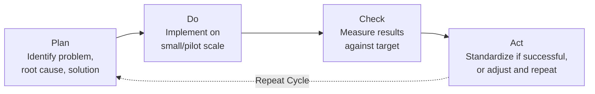
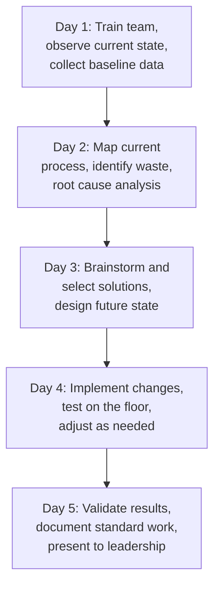

## Kaizen and Continuous Improvement Events

### Definition and Purpose

Kaizen (改善, Japanese for "change for the better" or "continuous improvement") is both a philosophy and a structured event methodology for making incremental, sustained improvements to processes, typically driven by the people who perform the work daily. A **Kaizen Event** (also called a Kaizen Blitz or Rapid Improvement Event) is a focused, time-boxed workshop — typically 3–5 days — in which a cross-functional team analyzes and improves a specific process.

In a QMS/ISO context, Kaizen supports:

- **ISO 9001** Clause 10.3 (Continual Improvement) — Kaizen is one of the most direct operational implementations of this requirement
- **ISO 9001** Clause 10.2 (Nonconformity and Corrective Action) — Kaizen events are frequently used to resolve recurring nonconformities
- **ISO 9001** Clause 7.2/7.3 (Competence and Awareness) — event participation builds employee engagement and process ownership
- **ISO 9004** (Quality management — Quality of an organization — Guidance for sustained success), which emphasizes organizational learning and improvement culture

### Key Points

- Kaizen is fundamentally about **small, incremental changes** made continuously, as distinct from large-scale disruptive change (Kaikaku/"radical change").
- A Kaizen **Event** is a time-boxed, structured project format; Kaizen as a **philosophy** is an ongoing daily practice (sometimes called "Kaizen Teian" for individual suggestion systems).
- Events are cross-functional and typically include frontline workers who perform the process — not just managers or engineers.
- Success is measured by **implemented, sustained change**, not just ideas generated.
- Closely related to, but distinct from, formal Six Sigma DMAIC projects (Kaizen events are shorter, more tactical, and less statistically rigorous).

### Kaizen Philosophy vs. Kaizen Event

| Aspect | Kaizen Philosophy | Kaizen Event |
| --- | --- | --- |
| Timeframe | Ongoing, daily | Time-boxed (typically 3–5 days) |
| Scope | Any/all processes, individual suggestions | One specific, pre-scoped process |
| Participants | All employees, individually | Dedicated cross-functional team, full-time for event duration |
| Formality | Informal suggestion systems, daily huddles | Structured agenda with defined roles and deliverables |
| Change Magnitude | Small, continuous | Moderate — bigger than daily tweaks, smaller than a full project |

### The PDCA Cycle Foundation

Kaizen is built on the **Plan-Do-Check-Act (PDCA)** cycle, originally developed by Walter Shewhart and popularized by W. Edwards Deming.

### Kaizen Event Structure (Typical 5-Day Format)

#### Day 1 — Preparation and Training

- Team receives Lean/Kaizen tool training (waste identification, 5S basics, process mapping)
- Baseline data collection begins (cycle times, defect rates, current metrics)
- Team charter reviewed: scope, goals, boundaries ("in scope" vs. "out of scope")

#### Day 2 — Current State Analysis

- Detailed current-state process map or Value Stream Map created
- Waste identification using TIMWOODS/DOWNTIME framework
- Root cause analysis (5 Whys, Fishbone Diagram)
- Direct gemba observation of the actual process

#### Day 3 — Solution Design

- Brainstorming sessions (often using affinity diagrams to cluster ideas)
- Prioritization matrix (e.g., Impact vs. Effort) to select which changes to implement during the event
- Future-state process design

#### Day 4 — Implementation

- Physical changes implemented: layout changes, new visual controls, standard work documents drafted, poka-yoke devices installed
- Rapid PDCA cycling — test small changes immediately, adjust based on results
- This is the defining characteristic of a Kaizen event vs. a typical project: **changes are implemented during the event itself**, not just planned

#### Day 5 — Validation and Report-Out

- Post-implementation data collected and compared to baseline
- Standard Work documents finalized
- Formal report-out presentation to leadership/Champion
- 30-60-90 day follow-up action plan assigned with owners

### Prioritization Matrix Example (Impact vs. Effort)

|  | Low Effort | High Effort |
| --- | --- | --- |
| **High Impact** | Quick Wins — implement immediately | Major Projects — plan carefully, may exceed event scope |
| **Low Impact** | Fill-Ins — implement if time allows | Avoid — deprioritize |

### Roles in a Kaizen Event

| Role | Responsibility |
| --- | --- |
| Sponsor/Champion | Approves scope, attends report-out, removes organizational barriers |
| Facilitator/Team Leader | Guides the team through the agenda, keeps discussions on track, trained in Lean tools |
| Team Members | Frontline operators, supervisors, and support staff (maintenance, quality, IT as needed) |
| Process Owner | Accountable for sustaining the change after the event ends |
| Timekeeper/Scribe (optional) | Documents decisions, tracks agenda timing |

### Common Kaizen Tools Used During Events

- **5S** (Sort, Set in Order, Shine, Standardize, Sustain) — workplace organization
- **Spaghetti Diagram** — visualize and reduce unnecessary motion
- **Standard Work Documents** — capture the new best-known method
- **Visual Management Boards** — make process status visible at a glance
- **Poka-Yoke (mistake-proofing)** devices
- **Andon Systems** — visual/audible alerts for abnormalities
- **A3 Problem-Solving Report** — single-page summary of problem, analysis, and countermeasures

### Worked Example

**Scenario**: A hospital's outpatient lab experiences long specimen turnaround times, causing delayed diagnoses.

**Day 1**: Team of 8 (2 lab techs, 1 nurse, 1 phlebotomist, IT support, lab manager, quality lead, facilitator) trained on waste types; baseline data shows average turnaround of 95 minutes against a target of 60 minutes.

**Day 2**: Process map reveals specimens sit in a batch tray for up to 30 minutes before being walked to the lab (waiting + inventory waste); labeling errors cause 8% rework rate (defect waste).

**Day 3**: Team designs solution: replace batch-and-carry with a continuous pickup schedule every 10 minutes; redesign label template with barcode verification.

**Day 4**: New pickup schedule implemented same-day; barcode scanner mistake-proofing tested and refined through 3 rapid PDCA cycles.

**Day 5**: Post-implementation data shows turnaround reduced to 68 minutes; rework rate down to 2%. Standard Work poster created and posted at each workstation. 30-60-90 day plan assigned to lab manager to monitor sustainment.

### Sustaining Kaizen Gains

A frequently cited failure mode is the "Kaizen event high" — improvements achieved during the event week regress within weeks once the dedicated team disperses. Sustainment mechanisms include:

- Daily huddle/tier board reviews of the new metric
- Formal handoff to the Process Owner with defined KPI ownership
- 30-60-90 day follow-up audits by the facilitator or quality team
- Integration of new Standard Work into the QMS document control system (ISO 9001 Clause 7.5)

### Kaizen Event vs. Six Sigma DMAIC Project

| Aspect | Kaizen Event | DMAIC Project |
| --- | --- | --- |
| Duration | 3–5 days | Weeks to months |
| Statistical Rigor | Low to moderate | High (hypothesis testing, DOE) |
| Scope | Narrow, tactical | Can be broader, more complex |
| Team Composition | Frontline-heavy | Often includes dedicated Black Belt/Green Belt |
| Implementation Timing | During the event | After Analyze/Improve phases, often weeks later |
| Best Suited For | Visible, well-understood process issues | Complex problems with unclear or multiple root causes |

### Common Pitfalls

- Selecting a Kaizen event scope that is too large for the time-boxed format (should be a DMAIC project instead)
- Excluding frontline employees who actually perform the process from the team
- Failing to implement changes during the event itself (reducing it to a planning meeting, not a true Kaizen event)
- No follow-up mechanism after Day 5, leading to regression
- Leadership not attending the report-out, signaling low organizational priority

### Related Topics

- Value Stream Mapping
- 5S Workplace Organization
- PDCA Cycle (Plan-Do-Check-Act)
- A3 Problem-Solving Methodology
- Standard Work Documentation
- Six Sigma DMAIC Methodology
- Gemba Walks and Genchi Genbutsu
- Visual Management and Andon Systems
- Poka-Yoke (Mistake-Proofing)