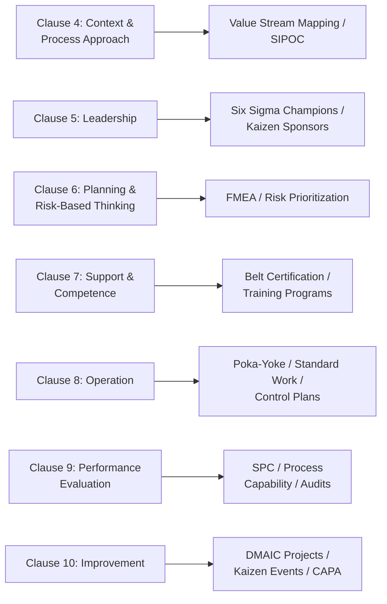
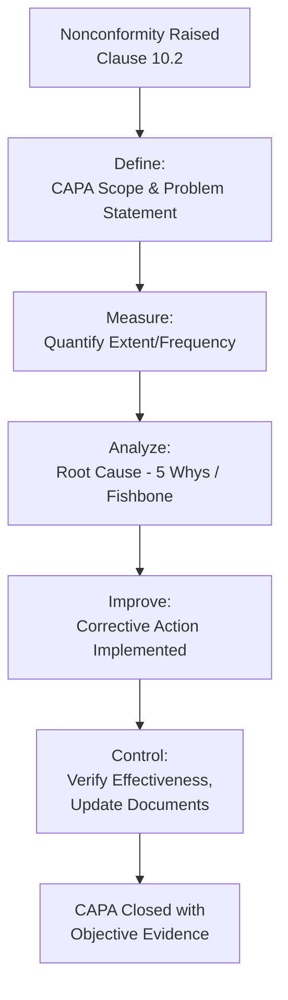

## Integrating Lean and Six Sigma with ISO Based QMS

### Definition and Purpose

Integrating Lean and Six Sigma (often combined as "Lean Six Sigma") with an ISO-based Quality Management System means embedding these improvement methodologies as the operational engine that fulfills the QMS's structural and documentation requirements — rather than treating them as separate, parallel initiatives. ISO standards (principally **ISO 9001**) define *what* an organization must do to manage quality; Lean and Six Sigma define *how* to actually achieve and improve it.

This integration is not mandated by name in any ISO standard — ISO 9001 does not require "Lean" or "Six Sigma" specifically — but the methodologies provide a practical, evidence-generating mechanism for satisfying several ISO 9001 clauses simultaneously.

### Key Points

- ISO 9001 specifies **requirements** (the "what"); Lean/Six Sigma provide **methods and tools** (the "how").
- Integration prevents the common failure mode of QMS and improvement programs operating as disconnected, siloed initiatives.
- Lean/Six Sigma projects generate **objective evidence** (data, control charts, corrective action records) that satisfies audit requirements naturally, rather than as separate documentation burden.
- The **PDCA cycle** is the conceptual bridge connecting ISO 9001's overall management system structure to Kaizen/Six Sigma's project methodology.
- Successful integration requires **top management commitment** (ISO 9001 Clause 5) — without it, Lean/Six Sigma initiatives tend to become isolated "tool" programs disconnected from the QMS.

### Conceptual Mapping: ISO 9001 Clauses to Lean/Six Sigma Practice

### Detailed Clause-by-Clause Integration

#### Clause 4 — Context of the Organization / Process Approach

ISO 9001 Clause 4.4 requires organizations to determine processes and their interactions. **SIPOC diagrams** and **Value Stream Maps** are direct, practical tools for satisfying this requirement — they document process inputs, outputs, and interactions in a format auditors readily recognize as objective evidence.

#### Clause 5 — Leadership

ISO 9001 Clause 5.1 requires top management to demonstrate leadership and commitment. In Lean Six Sigma deployments, this is operationalized through the **Champion/Sponsor role** — executives who select projects, allocate resources, and remove organizational barriers for Black Belts and Kaizen teams.

#### Clause 6 — Planning (Risk-Based Thinking)

ISO 9001 Clause 6.1 requires organizations to address risks and opportunities. **FMEA (Failure Mode and Effects Analysis)**, a core Six Sigma Analyze/Improve phase tool, directly generates the risk prioritization data (Risk Priority Number, RPN) that satisfies this clause.

$$RPN = Severity \times Occurrence \times Detection$$

#### Clause 7 — Support (Competence, Awareness, Documented Information)

- Clause 7.2 (Competence) is satisfied via documented **Belt certification records** (Green Belt, Black Belt, etc.)
- Clause 7.5 (Documented Information) is satisfied via **Standard Work documents**, control plans, and updated procedures produced during Kaizen events and the Six Sigma Control phase

#### Clause 8 — Operation

Operational controls required under Clause 8.5 (Production and Service Provision) are directly implemented through **Poka-Yoke (mistake-proofing) devices**, **Standard Work**, and **Control Plans** developed in the Six Sigma Improve/Control phases.

#### Clause 9 — Performance Evaluation

- Clause 9.1 (Monitoring, Measurement, Analysis, Evaluation) is satisfied by **SPC charts**, **process capability studies** ($C_p$, $C_{pk}$), and DMAIC Measure-phase baselines
- Clause 9.2 (Internal Audit) can incorporate Lean audits (e.g., 5S audits) as a component of the broader internal audit program

#### Clause 10 — Improvement

This is the most direct integration point. Clause 10.2 (Nonconformity and Corrective Action) and 10.3 (Continual Improvement) are essentially *requirements* for the exact activity that DMAIC projects and Kaizen events *perform*.

### Governance Model: Integrated vs. Siloed Deployment

| Aspect | Siloed Deployment | Integrated Deployment |
| --- | --- | --- |
| Project Selection | Separate Six Sigma project pipeline, unrelated to audit findings | Projects sourced from CAPA records, internal audit findings, and management review |
| Documentation | Separate Six Sigma project files, not linked to QMS document control | Control plans and standard work become QMS-controlled documents (Clause 7.5) |
| Metrics | Six Sigma dashboard tracked independently | Sigma level / PCE integrated into Management Review inputs (Clause 9.3) |
| Training | Belt training separate from QMS competence records | Belt certifications recorded in the same competence/training matrix as ISO awareness training |
| Governance | Separate "CI (Continuous Improvement) Office" reporting outside QMS | Quality Manager or MBB reports improvement portfolio as part of QMS governance |

### Using DMAIC as the CAPA Engine

A common and effective integration pattern is using DMAIC (or a lightweight version of it) as the formal methodology behind Corrective and Preventive Action (CAPA) records, rather than treating CAPA as a simple form-filling exercise.

This satisfies the ISO 9001 Clause 10.2.1 requirement to "evaluate the need for action to eliminate the cause(s) of the nonconformity" with statistically defensible root cause analysis, rather than a superficial or assumed cause.

### Management Review Integration

ISO 9001 Clause 9.3 requires Management Review to include inputs on process performance, nonconformities, and improvement opportunities. An integrated approach feeds the following Lean/Six Sigma outputs directly into Management Review:

- DMAIC project portfolio status and financial impact (cost of poor quality reduction)
- Sigma level / $C_{pk}$ trends for key processes
- Kaizen event outcomes and sustainment audit results
- 5S audit scores across facilities

### Worked Example

**Scenario**: A manufacturer certified to ISO 9001 receives a customer complaint (nonconformity) about inconsistent product dimensions.

**Integration in Practice**:

1. **Clause 10.2 triggers**: Nonconformity logged in the QMS
2. **Define**: Quality Engineer (a certified Green Belt) scopes a mini-DMAIC as the CAPA investigation
3. **Measure**: Baseline data pulled from existing SPC charts (already required under Clause 9.1) shows $C_{pk} = 0.85$ (below acceptable 1.33 threshold)
4. **Analyze**: Gage R&R (MSA) reveals 40% of variation is from the measurement system itself, not the process — a finding a non-statistical CAPA investigation likely would have missed
5. **Improve**: Fixture redesigned (Poka-Yoke) to eliminate operator-induced measurement variation
6. **Control**: New control plan issued as a controlled document (Clause 7.5); $C_{pk}$ re-verified at 1.45 after 30 days
7. **Clause 10.2 closure**: CAPA closed with statistically validated evidence of effectiveness — satisfying the audit trail requirement with far stronger evidence than a simple "retrained operator" corrective action

### Common Integration Models in Practice

| Model | Description |
| --- | --- |
| Quality Function Owns Both | Quality Manager/Director oversees both ISO 9001 compliance and the Lean Six Sigma program — strongest integration |
| Separate CI Office, QMS Liaison | Continuous Improvement function is separate but has a formal liaison role/reporting line into QMS governance |
| Fully Siloed | CI/Six Sigma program reports to Operations; QMS reports to Quality — weakest integration, highest risk of duplicated/conflicting documentation |

### Benefits of Integration

- Reduces duplicate documentation effort (one set of controlled documents, not two)
- Improvement projects generate audit-ready objective evidence as a natural byproduct
- Belt training counts toward ISO 9001 competence records
- Strengthens Management Review with quantitative, statistically valid data
- Aligns "check the box" compliance activity with genuine performance improvement

### Common Pitfalls

- Running Six Sigma/Kaizen as a program entirely separate from QMS document control, creating duplicate and potentially conflicting procedures
- Failing to link DMAIC project selection to CAPA and internal audit findings, missing the most natural integration point
- Treating ISO 9001 certification as a paperwork exercise disconnected from actual process performance data
- Belt-certified staff operating outside the QMS change control process when implementing Improve-phase changes (creating uncontrolled document/process changes)
- Lack of top management visibility into the Lean/Six Sigma project portfolio during Management Review

### Related Topics

- Six Sigma DMAIC Methodology
- Value Stream Mapping
- Kaizen and Continuous Improvement Events
- ISO 9001 Clause 10 — Improvement
- Corrective and Preventive Action (CAPA) Systems
- Risk-Based Thinking (ISO 9001 Clause 6.1)
- Failure Mode and Effects Analysis (FMEA)
- Management Review Process (ISO 9001 Clause 9.3)
- ISO 13053 and ISO 18404 — Six Sigma Standards