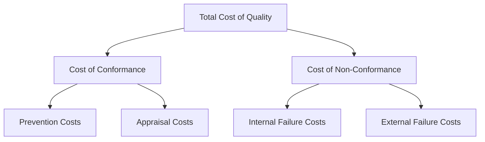

## Prevention Appraisal and Failure Cost Categories

### Definition and Purpose

The Prevention-Appraisal-Failure (PAF) model, also known as the Cost of Quality (COQ) or Cost of Poor Quality (COPQ) framework, categorizes all quality-related costs an organization incurs into four distinct categories: Prevention, Appraisal, Internal Failure, and External Failure. Developed originally by Armand Feigenbaum and later refined by Joseph Juran, this model provides the economic foundation for justifying quality investments and prioritizing improvement initiatives.

In a QMS/ISO context, the PAF model supports:

- **ISO 9001** Clause 9.1.3 (Analysis and Evaluation) — cost of quality data is a key performance indicator
- **ISO 9004** (Guidance for sustained success) — explicitly references economic considerations of quality
- **ISO 10014** (Quality management — Guidance for realizing financial and economic benefits) — provides direct guidance on quantifying quality's financial impact
- Business case justification for Six Sigma and Lean initiatives (linking DMAIC projects to COPQ reduction)

### Key Points

- The model is often visualized as an **iceberg**: failure costs are highly visible, while many quality costs (rework, lost capacity, customer goodwill) remain hidden beneath the surface.
- A foundational premise is that **spending more on prevention reduces total quality cost**, because failure costs (especially external) are typically far more expensive than prevention costs.
- **1:10:100 Rule**: the cost of correcting a defect increases roughly by a factor of 10 at each subsequent stage (prevention vs. detection during production vs. detection after delivery to the customer). [Inference — this is a widely cited industry heuristic illustrating the principle of cost escalation, not a fixed universal ratio applicable to every industry]
- COQ is typically expressed as a **percentage of sales/revenue** to allow benchmarking over time and across organizations.
- The goal of quality economics is not to eliminate all failure costs at any expense, but to find the **optimal investment level** in prevention and appraisal.

### The Four PAF Categories

### Category 1: Prevention Costs

**Definition**: Costs incurred to prevent defects from occurring in the first place — investments made *before* production or service delivery.

**Examples**:

- Quality planning and QMS documentation development
- Design reviews and Design for Six Sigma (DFSS)
- Supplier quality assurance and supplier audits
- Employee training (including Six Sigma Belt certification)
- Preventive maintenance
- Statistical Process Control (SPC) system setup
- Quality circles and Kaizen event facilitation
- FMEA conducted during design phase

**Characteristic**: This is the only category considered a genuine "investment" — money spent here is expected to reduce costs in all other three categories.

### Category 2: Appraisal Costs

**Definition**: Costs incurred to determine the degree of conformance to quality requirements — the cost of *checking* whether prevention worked.

**Examples**:

- Incoming material inspection
- In-process and final inspection/testing
- Calibration of measurement and test equipment
- Quality audits (internal and supplier)
- Test equipment depreciation
- Proficiency testing / Measurement System Analysis (Gage R&R studies)
- Product/process certification costs

**Characteristic**: Appraisal costs are necessary but do not themselves *prevent* defects — they only detect them. A quality system relying heavily on appraisal (inspection) rather than prevention is generally considered less mature and more costly long-term. [Inference — this reflects a widely accepted quality management principle rather than a claim applicable to every specific operational context]

### Category 3: Internal Failure Costs

**Definition**: Costs incurred when defects are found **before** the product or service reaches the customer.

**Examples**:

- Scrap and rework
- Re-inspection and re-testing after rework
- Downtime caused by defects (machine stoppage, line stoppage)
- Failure analysis / root cause investigation
- Downgrading (selling as a lower-grade product)
- Excess inventory held to buffer against known defect rates

**Characteristic**: These costs are "contained" — the customer never sees the defect — but they still represent wasted resources, time, and capacity.

### Category 4: External Failure Costs

**Definition**: Costs incurred when defects are found **after** delivery to the customer.

**Examples**:

- Warranty claims and product recalls
- Customer complaint handling and returns processing
- Field service and repair costs
- Liability claims and litigation
- Lost sales due to customer dissatisfaction
- Reputational damage / brand erosion (often the largest but hardest to quantify component)
- Regulatory fines and penalties

**Characteristic**: This is typically the **most expensive category per defect**, and includes intangible costs (lost customer trust, brand damage) that are difficult to quantify but can dominate total impact. [Inference — "most expensive per defect" reflects the general cost-escalation principle in quality literature; actual magnitude varies significantly by industry and defect type]

### The 1:10:100 Rule (Cost Escalation Principle)

$$Cost_{external\ failure} \approx 10 \times Cost_{internal\ failure} \approx 100 \times Cost_{prevention}$$

| Stage Detected | Relative Cost | Example |
| --- | --- | --- |
| Prevention (design stage) | 1x | Design review catches a flaw before tooling is built |
| Internal Failure (production) | 10x | Defective part scrapped on the line before shipment |
| External Failure (post-delivery) | 100x | Field recall, warranty replacement, litigation |

### COQ Optimization Model (Traditional View)

Classical quality economics theory presents an optimal quality level where total cost is minimized — the point where the sum of conformance costs (prevention + appraisal) and non-conformance costs (internal + external failure) is lowest.

$$TotalCOQ = (Prevention + Appraisal) + (InternalFailure + ExternalFailure)$$

As prevention/appraisal spending increases, failure costs decrease — but classical theory suggests a point of diminishing returns exists.

**Note on Modern Interpretation**: Later quality thought (particularly from the Total Quality Management movement and Philip Crosby's "Quality is Free" philosophy) challenges the classical U-shaped curve, arguing that for most real-world organizations operating below Six Sigma performance levels, the optimal point is effectively at or near zero defects — meaning continued investment in prevention nearly always yields net savings, since failure costs (especially hidden/external ones) are consistently underestimated. [Inference — this represents a documented divergence in quality economics theory (classical optimization vs. Crosby's "zero defects" philosophy) rather than a single settled consensus]

### COQ as a Percentage of Revenue — Typical Benchmarks

| Quality Maturity Level | Total COQ (% of Sales) |
| --- | --- |
| Reactive / Low Maturity | 20–40% |
| Developing | 10–15% |
| Mature | 5–10% |
| World-Class / Six Sigma Level | < 3% |

[Unverified — these ranges are commonly cited in quality management literature and training materials as general industry benchmarks; actual figures vary substantially by industry, product complexity, and measurement methodology]

### Worked Example

**Scenario**: An automotive parts supplier tracks quarterly COQ data (in $ thousands):

| Category | Q1 | Q2 (after Kaizen event) |
| --- | --- | --- |
| Prevention | $45 | $75 |
| Appraisal | $120 | $110 |
| Internal Failure | $310 | $180 |
| External Failure | $425 | $140 |
| **Total COQ** | **$900** | **$505** |
| Revenue | $9,000 | $9,200 |
| **COQ % of Revenue** | **10.0%** | **5.5%** |

**Analysis**: A $30K increase in prevention spending (Q1→Q2) correlates with a $130K reduction in internal failure costs and a $285K reduction in external failure costs — illustrating the cost-escalation principle in practice. Total COQ as a percentage of revenue nearly halved.

### Using COQ Data to Justify Six Sigma/Lean Projects

COQ analysis is one of the most effective tools for building a **project business case** in the DMAIC Define phase:

1. Quantify current failure costs (internal + external) for a specific process
2. Estimate the prevention/appraisal investment required (e.g., new inspection fixture, SPC training)
3. Project the expected reduction in failure costs
4. Present as expected **Return on Quality (ROQ)** to secure Champion sponsorship

### Data Sources for COQ Tracking

| Cost Category | Common Data Sources |
| --- | --- |
| Prevention | Training budgets, QMS software licensing, planning labor hours |
| Appraisal | Inspection labor hours, calibration invoices, audit costs |
| Internal Failure | Scrap reports, rework labor tracking, MRB (Material Review Board) records |
| External Failure | Warranty claim systems, CRM complaint logs, legal/insurance claims |

### Common Pitfalls

- Tracking only **visible** costs (scrap, warranty claims) while ignoring hidden costs (lost capacity, customer goodwill, employee morale)
- Treating appraisal (inspection) investment as equivalent to prevention investment — appraisal catches defects but does not reduce their occurrence rate
- Failing to capture COQ data consistently across departments, making trend analysis unreliable
- Underestimating external failure costs due to difficulty quantifying reputational/goodwill damage
- Viewing COQ reduction as a one-time cost-cutting exercise rather than an ongoing management review input (ISO 9001 Clause 9.3)

### Related Topics

- Cost of Poor Quality (COPQ) Analysis
- ISO 10014 — Financial and Economic Benefits of Quality Management
- Return on Quality (ROQ) and Business Case Development
- Six Sigma DMAIC Methodology (Define Phase business case)
- Failure Mode and Effects Analysis (FMEA)
- Total Quality Management (TQM) Philosophy
- Philip Crosby's "Quality is Free" Concept
- Warranty and Field Failure Data Analysis
- Supplier Quality Cost Management