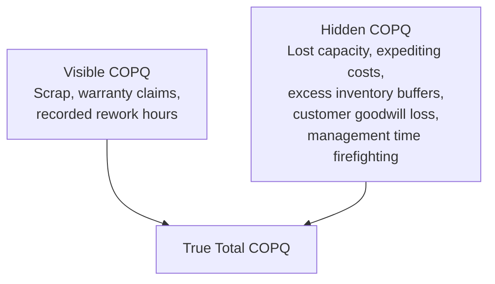
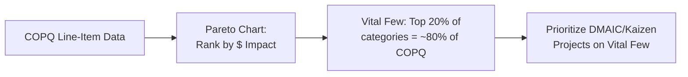

## Calculating the Cost of Poor Quality

### Definition and Purpose

Cost of Poor Quality (COPQ) is the quantified financial impact of all activities that arise because a product, service, or process did not conform to requirements the first time. COPQ is a subset of the broader Cost of Quality (COQ) framework, specifically encompassing the **Internal Failure** and **External Failure** categories — it deliberately excludes prevention and appraisal costs, which are considered "good" costs (investments) rather than costs of *poor* quality.

In a QMS/ISO context, COPQ calculation supports:

- **ISO 9001** Clause 9.1.3 (Analysis and Evaluation) — using quantitative data to evaluate QMS performance
- **ISO 10014** (Financial and economic benefits of quality management) — provides guidance on quantifying quality's business impact
- Six Sigma DMAIC **Define phase** business case development
- **ISO 9001** Clause 10.2 (Corrective Action) — COPQ data helps prioritize which nonconformities warrant formal CAPA investigation

### Key Points

- COPQ = Internal Failure Costs + External Failure Costs (it excludes prevention and appraisal, unlike total COQ).
- COPQ is often called the **"hidden factory"** — the portion of organizational capacity consumed entirely by fixing mistakes, which produces no value and is often invisible in standard financial reporting.
- Accurate COPQ calculation requires data from **multiple systems** (finance, quality, operations, customer service) that are frequently not integrated.
- COPQ figures are most powerful when expressed as a **percentage of revenue** or **cost of goods sold (COGS)**, enabling trend tracking and benchmarking.
- A primary practical challenge is that many COPQ elements (lost capacity, overtime to catch up, customer goodwill) are **not captured by standard cost accounting systems** and must be estimated.

### The "Hidden Factory" Concept

The hidden factory concept, popularized in quality literature, holds that the visible, easily tracked portion of COPQ (scrap tickets, warranty logs) often represents only a fraction of true COPQ — the majority remains buried in indirect costs that standard accounting does not categorize as quality-related. [Inference — the specific proportion of "hidden" vs. "visible" COPQ varies substantially by organization and is not a fixed, universally documented ratio]

### General COPQ Calculation Formula

$$COPQ = \sum(Internal\ Failure\ Costs) + \sum(External\ Failure\ Costs)$$

Expressed as a percentage of revenue for benchmarking:

$$COPQ\% = \frac{COPQ}{Total\ Revenue} \times 100\%$$

### Step-by-Step Calculation Methodology

#### Step 1: Define Scope and Boundaries

Determine whether COPQ will be calculated at the organizational level, business unit level, product line level, or single-process level. Broader scope requires more data integration; narrower scope (e.g., a single production line) is often a better starting point for a pilot COPQ program.

#### Step 2: Identify and Categorize Cost Elements

Build a comprehensive list of failure-related activities and assign each to Internal or External Failure.

**Internal Failure Cost Elements**:

- Scrap material cost (material + labor + overhead already invested)
- Rework labor hours × fully burdened labor rate
- Re-inspection/re-testing costs
- Downtime cost (lost production capacity × contribution margin, or downtime hours × burdened machine/labor rate)
- Failure analysis / root cause investigation labor
- Downgraded product value loss (difference between intended sale price and downgraded sale price)

**External Failure Cost Elements**:

- Warranty repair/replacement cost (parts + labor + shipping)
- Product recall costs (logistics, replacement, administrative)
- Customer complaint handling labor
- Returns processing and restocking costs
- Liability/litigation settlements and legal fees
- Regulatory fines
- Estimated lost future sales (customer churn attributable to quality issues)

#### Step 3: Gather Data from Source Systems

| Cost Element | Typical Data Source |
| --- | --- |
| Scrap | ERP/MRP scrap transaction codes |
| Rework Labor | Time tracking / labor routing systems |
| Downtime | MES (Manufacturing Execution System) or production logs |
| Warranty Claims | CRM or warranty claims management system |
| Customer Complaints | Complaint/CAPA tracking system |
| Litigation/Fines | Legal and finance department records |

#### Step 4: Apply Costing Methodology

**Scrap Cost Calculation**:

$$Scrap\ Cost = (Material\ Cost + Labor\ Cost\ Incurred + Applied\ Overhead) \times Units\ Scrapped$$

**Rework Cost Calculation**:

$$Rework\ Cost = Rework\ Hours \times Fully\ Burdened\ Labor\ Rate + Re\text{-}inspection\ Cost$$

**Downtime Cost Calculation** (opportunity-cost approach):

$$Downtime\ Cost = Downtime\ Hours \times \left(\frac{Contribution\ Margin\ per\ Hour\ of\ Production}{1}\right)$$

**Warranty Cost Calculation**:

$$Warranty\ Cost = \sum_{i=1}^{n}(Parts_i + Labor_i + Shipping_i) \text{ for all claims in period}$$

#### Step 5: Aggregate and Normalize

Sum all elements, then normalize against a stable denominator (revenue, COGS, or units produced) to allow trend comparison across periods where volume fluctuates.

#### Step 6: Validate with Cross-Functional Review

Present preliminary COPQ figures to Finance, Operations, and Quality stakeholders to validate assumptions (especially burdened labor rates and contribution margin figures used for downtime/lost capacity estimates) before publishing as an official metric.

### Worked Example: Detailed COPQ Calculation

**Scenario**: A plastic injection molding facility calculates COPQ for Q3.

**Internal Failure Data**:

| Element | Calculation | Cost |
| --- | --- | --- |
| Scrap (12,000 units) | $3.20/unit (material+labor+OH) × 12,000 | $38,400 |
| Rework labor (450 hrs) | 450 hrs × $42/hr burdened rate | $18,900 |
| Re-inspection (200 hrs) | 200 hrs × $35/hr | $7,000 |
| Downtime (65 hrs, line stoppages) | 65 hrs × $850/hr contribution margin | $55,250 |
| **Internal Failure Subtotal** |  | **$119,550** |

**External Failure Data**:

| Element | Calculation | Cost |
| --- | --- | --- |
| Warranty claims (85 units) | 85 × $210 avg (parts+labor+shipping) | $17,850 |
| Complaint handling (120 hrs) | 120 hrs × $38/hr | $4,560 |
| Return processing (60 units) | 60 × $45/unit | $2,700 |
| Estimated churn impact | 2 accounts lost, est. $95,000 annual value, prorated | $23,750 |
| **External Failure Subtotal** |  | **$48,860** |

**Total COPQ** = $119,550 + $48,860 = **$168,410**

**Q3 Revenue** = $2,650,000

$$COPQ\% = \frac{168,410}{2,650,000} \times 100\% \approx 6.4\%$$

### COPQ Trend Tracking Example

Tracking COPQ% over time is generally more valuable than a single snapshot, since it reveals whether improvement initiatives are working.

| Quarter | COPQ ($) | Revenue ($) | COPQ % |
| --- | --- | --- | --- |
| Q1 | $215,000 | $2,480,000 | 8.7% |
| Q2 | $189,000 | $2,590,000 | 7.3% |
| Q3 | $168,410 | $2,650,000 | 6.4% |
| Q4 (target) | — | — | < 5.0% |

### Estimating "Hidden" COPQ Elements

For costs not directly captured in accounting systems, common estimation approaches include:

- **Activity-Based Costing (ABC)**: allocate overhead/indirect costs based on actual activity drivers related to failure (e.g., % of engineering time spent on failure investigations)
- **Time-driven surveys**: periodically survey supervisors/managers on percentage of time spent on unplanned firefighting vs. planned work
- **Proxy metrics**: using customer churn rate and average customer lifetime value to estimate lost-sales impact of external failures

These estimation methods introduce a degree of uncertainty into hidden-cost figures; organizations should document methodology and assumptions transparently rather than presenting estimates as precise accounting figures. [Inference — this is a standard caution in quality cost literature regarding the reliability of indirect/estimated cost components]

### Using COPQ to Prioritize Improvement Projects

A **Pareto analysis** of COPQ by category, product line, or defect type is a standard technique to identify where DMAIC or Kaizen resources will have the greatest financial return.

### Common Pitfalls

- Including prevention and appraisal costs in the COPQ figure, which conflates "good" quality investment with the cost of failure, understating the case for improvement
- Using standard (not fully burdened) labor rates, which understates true rework/downtime costs
- Omitting downtime/lost-capacity costs entirely because they don't appear as a line item in standard financial statements
- Failing to normalize COPQ against revenue or volume, making period-over-period comparisons misleading during periods of growth or decline
- Treating estimated "hidden factory" figures with the same precision/confidence as directly measured costs like scrap dollars
- Calculating COPQ once as a one-time study rather than establishing it as an ongoing tracked metric feeding Management Review

### Related Topics

- Prevention, Appraisal, and Failure Cost Categories (PAF Model)
- ISO 10014 — Financial and Economic Benefits of Quality Management
- Six Sigma DMAIC Methodology (Define Phase Business Case)
- Activity-Based Costing (ABC) for Quality
- Pareto Analysis and the 80/20 Rule
- Warranty and Field Failure Data Analysis
- Management Review Process (ISO 9001 Clause 9.3)
- Return on Quality (ROQ) Business Case Development