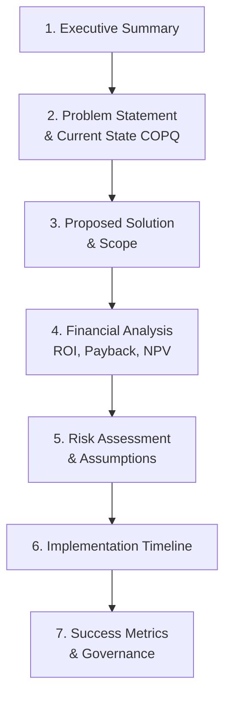

## Building a Quality Return on Investment Business Case

### Definition and Purpose

A Quality Return on Investment (Quality ROI or Return on Quality/ROQ) business case is a structured financial and strategic justification document used to secure funding, resources, and executive sponsorship for a quality improvement initiative — whether a Six Sigma project, a QMS implementation/certification effort, a Kaizen program, or a capital investment in prevention/appraisal capability. It translates quality improvement into the financial language executives use to make investment decisions.

In a QMS/ISO context, this supports:

- **ISO 9001** Clause 5.1 (Leadership and commitment) — top management must be able to justify resource allocation decisions
- **ISO 10014** (Quality management — Guidance for realizing financial and economic benefits) — the primary ISO standard directly addressing this topic
- **ISO 9001** Clause 6.2 (Quality Objectives) — objectives must be measurable, and a business case establishes the financial baseline against which they are tracked
- Six Sigma DMAIC **Define phase** — nearly every formal DMAIC project charter requires a financial business case section

### Key Points

- A strong business case connects a quality initiative to **metrics executives already track**: revenue, margin, cash flow, risk exposure — not just quality-specific metrics like defect rate alone.
- ROI calculations must distinguish between **hard savings** (directly reduce recorded costs, e.g., less scrap) and **soft savings** (avoid future costs or risk, e.g., reduced litigation exposure) — and be transparent about which is which.
- Executives evaluate competing investment proposals using standard finance tools: **ROI, Payback Period, and Net Present Value (NPV)** — a quality business case should speak this language.
- A business case is strongest when grounded in **actual COPQ/COQ data** rather than industry-average assumptions.
- Business cases should include a **risk-adjusted or conservative case**, not just best-case projections, to maintain credibility with finance stakeholders.

### Core Financial Metrics Used in Quality Business Cases

#### Return on Investment (ROI)

$$ROI = \frac{Net\ Benefit}{Investment\ Cost} \times 100\% = \frac{(Total\ Savings - Investment\ Cost)}{Investment\ Cost} \times 100\%$$

#### Payback Period

$$Payback\ Period\ (years) = \frac{Investment\ Cost}{Annual\ Net\ Savings}$$

#### Net Present Value (NPV)

$$NPV = \sum_{t=1}^{n} \frac{CF_t}{(1+r)^t} - Initial\ Investment$$

Where $CF_t$ = net cash flow in year $t$, and $r$ = discount rate (organizational cost of capital).

#### Cost-Benefit Ratio (CBR)

$$CBR = \frac{Total\ Benefits}{Total\ Costs}$$

A CBR greater than 1.0 indicates the initiative is financially justified on a pure cost basis.

### Business Case Structure

### Section 1: Executive Summary

A one-page synthesis stating the problem, proposed investment, expected return, and payback period — written to be understood by a reader with no quality background. Should lead with the financial headline (e.g., "This project requires a $140K investment and is projected to deliver $95K in annual savings, a 14-month payback").

### Section 2: Problem Statement and Current State (Baseline COPQ)

Quantify the current cost of the problem using COPQ methodology — this section anchors the entire business case in real data rather than assumption.

**Example Problem Statement**:

> "The final assembly line currently experiences a 6.8% first-pass yield loss, generating $312,000 annually in scrap, rework, and associated downtime costs (Q1–Q4 COPQ data), representing 4.1% of the line's total revenue."

### Section 3: Proposed Solution and Scope

Describe the specific intervention (e.g., new fixture design, SPC implementation, Kaizen event, automated inspection system) and clearly define scope boundaries — what is included and excluded — to prevent scope creep once approved.

### Section 4: Financial Analysis

This is the core of the business case. Break costs and benefits into clear categories.

**Investment Costs (one-time and recurring)**:

| Category | Example |
| --- | --- |
| Capital Equipment | New inspection fixture, automated poka-yoke device |
| Training | Belt certification, operator training on new process |
| Labor (project team time) | Black Belt salary allocation during project |
| Software/Systems | SPC software licensing, MES integration |
| Ongoing Operating Costs | Additional calibration, maintenance |

**Benefit Categories**:

| Type | Description | Example |
| --- | --- | --- |
| Hard Savings | Directly reduces recorded costs | Scrap reduction, reduced overtime |
| Cost Avoidance | Prevents future costs not yet incurred | Avoided warranty claims from a known emerging trend |
| Risk Mitigation (Soft) | Reduces exposure to low-probability, high-impact events | Reduced recall/litigation risk |
| Revenue Protection/Growth | Prevents customer churn or enables new business | Retained account due to improved on-time delivery |

**Worked Example**:

*Investment*:

| Item | Cost |
| --- | --- |
| Automated vision inspection system | $95,000 |
| Installation and integration | $18,000 |
| Operator training (40 hrs × 12 operators) | $14,400 |
| **Total Investment** | **$127,400** |

*Annual Benefits*:

| Item | Annual Savings |
| --- | --- |
| Scrap reduction (from COPQ baseline) | $78,000 |
| Rework labor reduction | $34,000 |
| Reduced re-inspection labor | $11,500 |
| Avoided warranty claims (conservative estimate) | $9,000 |
| **Total Annual Benefit** | **$132,500** |

*Financial Metrics*:

$$ROI = \frac{132,500 - 127,400}{127,400} \times 100\% \approx 4.0\% \text{ (Year 1)}$$

$$Payback\ Period = \frac{127,400}{132,500} \approx 0.96 \text{ years (≈ 11.5 months)}$$

For a 3-year NPV at a 10% discount rate (assuming steady-state $132,500 annual benefit from Year 1 onward):

$$NPV = \frac{132,500}{1.10^1} + \frac{132,500}{1.10^2} + \frac{132,500}{1.10^3} - 127,400 \approx \$202,100$$

### Section 5: Risk Assessment and Assumptions

Credible business cases explicitly state assumptions and provide sensitivity analysis rather than presenting a single-point estimate as certain.

**Recommended Practice — Three-Scenario Modeling**:

| Scenario | Assumption | Annual Benefit |
| --- | --- | --- |
| Conservative | 60% of projected benefit realized | $79,500 |
| Base Case | 100% of projected benefit realized | $132,500 |
| Optimistic | 120% of projected benefit realized (includes upsell/retention effects) | $159,000 |

Presenting a conservative case alongside the base case demonstrates rigor and builds credibility with finance/executive reviewers, who are often skeptical of optimistic-only projections. [Inference — this reflects common finance/business-case best practice rather than a formally mandated requirement]

### Section 6: Implementation Timeline

A simplified Gantt-style timeline showing key milestones (approval, procurement, installation, training, go-live, verification) with a realistic path to when benefits begin accruing — since payback period calculations assume benefits start immediately, this section should reconcile any ramp-up period.

### Section 7: Success Metrics and Governance

Define exactly how success will be measured post-implementation, tied back to the Control phase of DMAIC or the QMS Management Review process:

- Which metric will be tracked (e.g., first-pass yield, COPQ%)
- Who owns ongoing monitoring
- Reporting cadence (e.g., monthly to Management Review per ISO 9001 Clause 9.3)
- Defined "true-up" review date to compare actual results against projected ROI

### Linking the Business Case to ISO 10014

ISO 10014 provides an eight-principle framework for realizing financial and economic benefits from quality management, built on the same quality management principles underlying ISO 9001 (customer focus, leadership, engagement of people, process approach, improvement, evidence-based decision making, relationship management). A business case explicitly referencing this structure demonstrates alignment between the quality initiative and internationally recognized guidance, which can strengthen credibility in organizations already operating a certified QMS. [Inference — the degree to which explicit ISO 10014 referencing influences internal approval decisions is organization-dependent and not independently verifiable as a general claim]

### Common Business Case Presentation Formats

| Format | Best Used For |
| --- | --- |
| One-page Executive Summary | Initial Champion/Sponsor approval gate |
| Full DMAIC Charter | Formal Six Sigma project documentation |
| Capital Expenditure (CapEx) Request | Equipment/technology investments requiring finance committee approval |
| A3 Report | Lean-culture organizations preferring single-page visual format |

### Common Pitfalls

- Presenting only best-case projections without a conservative scenario, undermining credibility with finance reviewers
- Conflating hard savings (verifiable, recorded cost reductions) with soft/risk-mitigation savings without clearly labeling the distinction
- Omitting the cost of the project team's time (opportunity cost) from the investment side of the calculation
- Failing to define how benefits will be verified post-implementation, making the business case unfalsifiable
- Using industry-average COPQ benchmarks instead of organization-specific baseline data, weakening the case's credibility
- Ignoring the ramp-up period between go-live and full benefit realization when calculating payback period

### Related Topics

- Cost of Poor Quality (COPQ) Calculation
- Prevention, Appraisal, and Failure Cost Categories (PAF Model)
- ISO 10014 — Financial and Economic Benefits of Quality Management
- Six Sigma DMAIC Methodology (Define Phase)
- Net Present Value and Payback Period Analysis
- Management Review Process (ISO 9001 Clause 9.3)
- Quality Objectives and Planning (ISO 9001 Clause 6.2)
- Risk-Based Thinking and Risk Mitigation Strategy