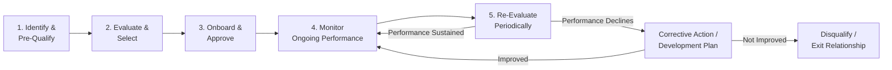
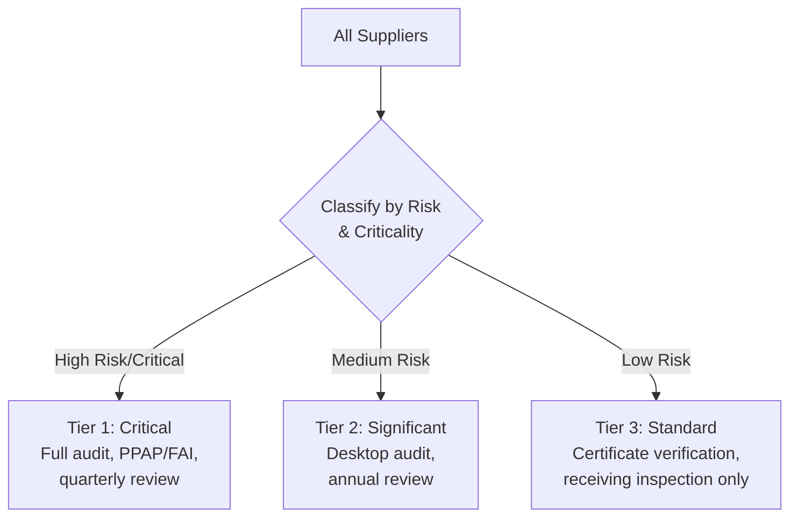

## Supplier Evaluation and Selection Criteria

### Definition and Purpose

Supplier Evaluation and Selection is the structured process by which an organization assesses potential and existing suppliers against defined criteria to determine their capability to consistently provide products or services that meet quality, delivery, cost, and risk requirements. This process forms the foundation of an organization's external provider control system.

In a QMS/ISO context, supplier evaluation directly satisfies:

- **ISO 9001** Clause 8.4 (Control of Externally Provided Processes, Products and Services) — the primary clause governing supplier management
- **ISO 9001** Clause 8.4.1 — requires organizations to determine and apply criteria for evaluation, selection, monitoring, and re-evaluation of external providers
- **ISO 9001** Clause 6.1 (Risk-Based Thinking) — supplier risk is a key input to organizational risk planning
- **IATF 16949** Clause 8.4.1.2 (Supplier Selection Process) — the automotive sector standard, which mandates more prescriptive supplier selection requirements than ISO 9001 alone
- **AS9100** Clause 8.4 — aerospace sector requirements, which include additional flow-down and counterfeit-parts risk criteria

### Key Points

- ISO 9001:2015 explicitly requires documented criteria for **evaluation, selection, monitoring of performance, and re-evaluation** — these are four distinct, ongoing activities, not a one-time gate.
- The type and rigor of controls applied to a supplier must be **proportional to the risk** that supplier's product/service poses to the organization's ability to meet customer requirements.
- Selection criteria should be **multi-dimensional** — quality capability alone is insufficient; delivery, cost, financial stability, and risk exposure must all be assessed.
- Organizations must retain **documented information** (records) of supplier evaluation results and any necessary actions arising from evaluations (Clause 8.4.1).
- A robust process distinguishes between **initial qualification** (before first order) and **ongoing performance monitoring** (after the relationship begins).

### The Supplier Management Lifecycle

### Categories of Supplier Selection Criteria

#### 1. Quality Capability Criteria

- Certification status (e.g., ISO 9001, IATF 16949, AS9100, ISO 13485 — depending on sector)
- Process capability data ($C_p$/$C_{pk}$) for critical characteristics
- Historical quality performance (defect rates, PPM — parts per million)
- Quality system maturity (documented procedures, calibration program, internal audit program)
- Statistical process control implementation

#### 2. Delivery and Capacity Criteria

- On-time delivery (OTD) performance history
- Production capacity relative to organization's demand volume
- Lead time and flexibility to handle demand fluctuations
- Business continuity / disaster recovery planning

#### 3. Financial Stability Criteria

- Financial health indicators (credit rating, financial statement review)
- Company size and revenue relative to order volume (dependency risk)
- Ownership stability / merger-acquisition risk

#### 4. Technical and Engineering Capability

- Design and engineering support capability (for design-responsible suppliers)
- Technology/equipment currency
- New product introduction (NPI) track record

#### 5. Cost Criteria

- Unit price competitiveness
- Total cost of ownership (including COPQ risk, freight, tooling)
- Payment terms

#### 6. Risk and Compliance Criteria

- Geographic/geopolitical risk (single-source, single-region exposure)
- Regulatory compliance (RoHS, REACH, conflict minerals, industry-specific regulations)
- Cybersecurity posture (increasingly relevant for suppliers with system access)
- Environmental, Social, and Governance (ESG) compliance
- Sub-tier supplier visibility (does the supplier itself have controlled sub-suppliers?)

### Weighted Supplier Scorecard Method

A common quantitative approach assigns weighted scores across criteria categories to generate a composite supplier score.

$$Composite\ Score = \sum_{i=1}^{n} (Weight_i \times Score_i)$$

**Example Weighted Scorecard**:

| Criterion Category | Weight | Score (1–5) | Weighted Score |
| --- | --- | --- | --- |
| Quality Capability | 30% | 4 | 1.20 |
| Delivery Performance | 20% | 3 | 0.60 |
| Cost Competitiveness | 20% | 4 | 0.80 |
| Financial Stability | 10% | 5 | 0.50 |
| Technical Capability | 10% | 3 | 0.30 |
| Risk/Compliance | 10% | 4 | 0.40 |
| **Composite Score** | 100% |  | **3.80 / 5.00** |

Organizations typically define approval thresholds (e.g., composite score ≥ 3.5 for full approval, 2.5–3.49 for conditional approval with development plan, < 2.5 for disqualification).

### Risk-Based Supplier Classification

Per Clause 8.4.1's requirement that control type and extent be based on risk, suppliers are commonly segmented:

**Criticality factors typically used for classification**:

- Impact of nonconformance on final product safety/function
- Single-source vs. multi-source availability
- Spend volume
- Complexity of the purchased product/process (special processes, e.g., heat treating, plating, NDT)

### Initial Supplier Evaluation Methods

| Method | Description | Typical Use Case |
| --- | --- | --- |
| Documentation Review | Review of QMS certificates, quality manual, process flow diagrams | Low-risk suppliers, initial screen |
| Supplier Self-Assessment Questionnaire | Supplier completes a standardized survey (quality system, capacity, financial) | Broad initial qualification |
| Desktop/Remote Audit | Document and data review without on-site visit | Medium-risk, geographically distant suppliers |
| On-Site Audit | Physical audit of facility, process, and quality system | High-risk/critical suppliers |
| Sample/First Article Evaluation | Physical evaluation of sample parts (First Article Inspection — FAI, or PPAP in automotive) | New part introduction, process changes |
| Trial Order / Pilot Run | Small initial order to validate real-world performance before full qualification | New suppliers for critical components |

### Ongoing Performance Monitoring (Post-Selection)

Clause 8.4.1 requires monitoring, not just initial selection. Common ongoing metrics:

| Metric | Typical Calculation |
| --- | --- |
| Quality PPM | $\frac{Defective\ Units}{Total\ Units\ Received} \times 1,000,000$ |
| On-Time Delivery % | $\frac{On\text{-}Time\ Shipments}{Total\ Shipments} \times 100\%$ |
| Supplier Corrective Action Response Time | Average days from SCAR issuance to closure |
| Complaint/SCAR Frequency | Number of Supplier Corrective Action Requests per period |

A common tool for ongoing evaluation is a **Supplier Scorecard**, published periodically (monthly/quarterly) and shared back with the supplier to drive continuous improvement — a practice aligned with ISO 9001's emphasis on mutually beneficial supplier relationships.

### Worked Example

**Scenario**: An electronics manufacturer needs to qualify a new PCB supplier for a safety-critical automotive application (IATF 16949 environment).

**Step 1 — Pre-Qualification**: Supplier completes a self-assessment questionnaire; documentation confirms IATF 16949 certification is current and in scope for PCB manufacturing.

**Step 2 — Risk Classification**: Classified as **Tier 1 (Critical)** due to safety-critical application and single-source status for this specific board design.

**Step 3 — On-Site Audit**: Cross-functional team (Quality Engineer, Supplier Quality Engineer, Procurement) conducts an on-site audit assessing SPC implementation, calibration program, and process capability data for key characteristics ($C_{pk} \geq 1.33$ required for safety-critical dimensions).

**Step 4 — PPAP Submission**: Supplier submits a Production Part Approval Process (PPAP) package including control plan, process FMEA, and capability studies for review and sign-off before production approval.

**Step 5 — Trial Order**: A pilot lot of 500 units is ordered and subjected to 100% inspection; PPM and dimensional data reviewed against acceptance criteria.

**Step 6 — Approval and Ongoing Monitoring**: Supplier added to Approved Supplier List (ASL) with quarterly scorecard review and annual re-audit scheduled per risk tier.

### Approved Supplier List (ASL) / Approved Vendor List (AVL)

Organizations are generally expected to maintain a controlled, documented list of approved suppliers as objective evidence that Clause 8.4 selection criteria have been applied — this list itself becomes a controlled QMS document subject to Clause 7.5 (Documented Information) requirements, with a defined process for adding, suspending, or removing suppliers.

### Common Pitfalls

- Selecting suppliers primarily or solely on cost, without weighting quality capability and risk appropriately
- Treating certification (e.g., "they're ISO 9001 certified") as sufficient evidence of capability without verifying actual process capability data
- No defined re-evaluation frequency — supplier approval granted once and never revisited
- Applying identical evaluation rigor to all suppliers regardless of risk/criticality, wasting resources on low-risk suppliers while under-scrutinizing critical ones
- Missing documented evidence (records) of the evaluation criteria and results, creating an audit finding under Clause 8.4.1
- Failing to flow down customer-specific or regulatory requirements to sub-tier suppliers

### Related Topics

- Supplier Audits and Performance Monitoring
- ISO 9001 Clause 8.4 — Control of Externally Provided Processes
- Approved Supplier List (ASL) Management
- Production Part Approval Process (PPAP)
- First Article Inspection (FAI)
- Supplier Corrective Action Requests (SCAR)
- IATF 16949 Supplier Selection Requirements
- Risk-Based Thinking in Supply Chain Management
- Total Cost of Ownership Analysis