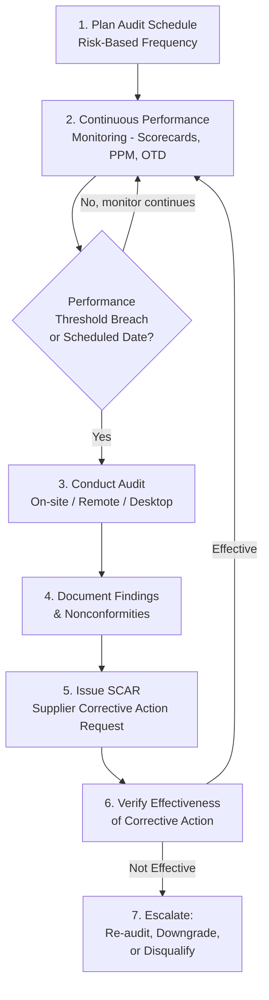
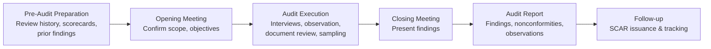
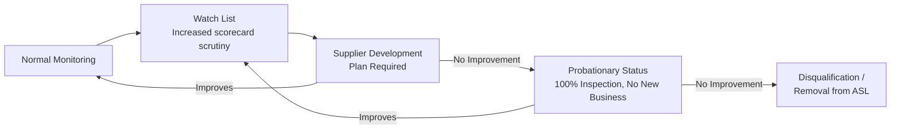

## Supplier Audits and Performance Monitoring

### Definition and Purpose

Supplier Audits and Performance Monitoring encompass the ongoing activities an organization uses to verify that an approved external provider continues to meet quality, delivery, and compliance requirements after initial qualification. While supplier selection is a point-in-time decision, audits and performance monitoring are continuous, cyclical processes that provide objective evidence of sustained supplier capability.

In a QMS/ISO context, this supports:

- **ISO 9001** Clause 8.4.1 — explicitly requires organizations to **monitor** the performance of external providers, not just select them once
- **ISO 9001** Clause 9.2 (Internal Audit) — while supplier audits are technically "second-party" audits (not internal audits), the audit program principles from Clause 9.2 and ISO 19011 guidance apply
- **ISO 19011** (Guidelines for auditing management systems) — the primary reference standard for conducting audits, including second-party supplier audits
- **IATF 16949** Clause 8.4.2.4.1 — mandates second-party audits for supplier risk assessment in the automotive sector
- **ISO 9001** Clause 10.2 — supplier nonconformities identified through monitoring feed into corrective action processes

### Key Points

- Supplier audits are classified as **second-party audits** — conducted by (or on behalf of) the customer organization on its supplier, distinct from first-party (internal) and third-party (certification body) audits.
- Performance monitoring is **continuous and metric-driven** (scorecards, PPM tracking), while audits are **periodic and comprehensive** (process/system verification).
- Audit frequency and depth should be **risk-based**, proportional to the criticality of the supplied product/service (per Clause 8.4.1).
- A mature supplier monitoring program combines **quantitative data** (scorecards, KPIs) with **qualitative verification** (on-site or remote audits) — relying on either alone creates blind spots.
- Findings from both audits and performance data must feed into a **closed-loop corrective action system**, typically via Supplier Corrective Action Requests (SCARs).

### Second-Party Audit vs. Other Audit Types

| Audit Type | Conducted By | Conducted On | Purpose |
| --- | --- | --- | --- |
| First-Party (Internal) | Organization's own auditors | Organization's own processes | Verify internal QMS conformance |
| Second-Party | Customer organization (or their agent) | Supplier | Verify supplier capability/conformance to customer requirements |
| Third-Party (Certification) | Independent certification body | Organization or supplier | Certify conformance to a standard (e.g., ISO 9001 certificate) |

### Supplier Monitoring and Audit Cycle

### Types of Supplier Audits

#### Process Audit

Examines a specific manufacturing or service process against documented procedures and industry standards (e.g., an audit against **VDA 6.3** in automotive, which specifically structures process audits by phase: project management, product/process development, supplier management, process analysis, customer service).

#### System Audit

Comprehensive audit of the supplier's entire quality management system, typically structured against ISO 9001 or a sector-specific standard (IATF 16949, AS9100, ISO 13485).

#### Product Audit

Focuses on the finished product/service itself, verifying it meets specification — distinct from auditing the process that produced it.

#### Desktop/Remote Audit

Document and data review conducted without physical site presence — increasingly used for lower-risk suppliers or as an interim measure between on-site audits.

#### Surveillance Audit

Shorter, more frequent audits focused on previously identified risk areas or prior nonconformities, rather than a full comprehensive audit.

### Risk-Based Audit Frequency Model

| Supplier Risk Tier | Typical Audit Type | Typical Frequency |
| --- | --- | --- |
| Tier 1 — Critical | Full on-site system + process audit | Annually, or per contract requirement |
| Tier 2 — Significant | Desktop audit + targeted process audit | Every 18–24 months |
| Tier 3 — Standard | Certificate verification + data review | Every 2–3 years, or as-needed |
| Any Tier — Post-Nonconformity | Surveillance/follow-up audit | Within defined timeframe post-SCAR closure |

### Key Performance Monitoring Metrics

$$Quality\ PPM = \frac{Defective\ Units\ Received}{Total\ Units\ Received} \times 1,000,000$$

$$On\text{-}Time\ Delivery\ (OTD)\% = \frac{Shipments\ Received\ On\ Time}{Total\ Shipments} \times 100\%$$

$$SCAR\ Closure\ Rate = \frac{SCARs\ Closed\ Within\ Target\ Timeframe}{Total\ SCARs\ Issued} \times 100\%$$

$$Composite\ Supplier\ Rating = (W_{quality} \times Score_{quality}) + (W_{delivery} \times Score_{delivery}) + (W_{cost} \times Score_{cost})$$

### Example Supplier Scorecard (Monthly)

| Supplier | Quality PPM | OTD % | Open SCARs | Composite Rating |
| --- | --- | --- | --- | --- |
| Supplier A | 145 | 98.2% | 0 | A (Preferred) |
| Supplier B | 890 | 91.5% | 2 | B (Approved, Monitor) |
| Supplier C | 3,200 | 84.0% | 4 | C (Conditional — Development Plan Required) |

Organizations commonly define rating bands (e.g., A/B/C or Green/Yellow/Red) with associated actions — a "C" or "Red" rating typically triggers mandatory corrective action, increased inspection (e.g., moving from skip-lot to 100% incoming inspection), or supplier development engagement.

### Audit Execution Process (Typical Structure per ISO 19011 Guidance)

#### Pre-Audit Preparation

- Review prior audit history and open corrective actions
- Review recent scorecard/performance trend data
- Prepare audit checklist scoped to relevant standard (ISO 9001, IATF 16949, customer-specific requirements) and prior risk areas

#### Audit Execution

- Opening meeting confirming scope, objectives, and logistics
- Process walkthroughs and direct observation (gemba-style verification)
- Document and record review (calibration records, training records, control plans)
- Interviews with operators and process owners
- Sampling of production records against control plan requirements

#### Findings Classification

| Finding Type | Definition |
| --- | --- |
| Major Nonconformity | Systemic failure or absence of a required process/control; likely to result in nonconforming product |
| Minor Nonconformity | Isolated lapse in an otherwise functioning process/control |
| Observation | Not a nonconformity but a noted risk or improvement opportunity |
| Opportunity for Improvement (OFI) | Positive suggestion, not tied to a requirement gap |

### Supplier Corrective Action Request (SCAR) Process

A SCAR is the formal mechanism connecting audit/performance findings to required supplier action, typically structured around root cause methodology (often 8D or a simplified DMAIC).

**Typical SCAR Structure**:

1. Problem description and objective evidence (linked to specific audit finding or nonconformance data)
2. Containment action (immediate, e.g., sort existing inventory)
3. Root cause analysis (5 Whys, Fishbone)
4. Corrective action plan with implementation date
5. Verification of effectiveness (often requiring data over a defined period, e.g., 3 months of sustained PPM improvement)
6. Closure sign-off by customer's supplier quality function

### Worked Example

**Scenario**: A medical device manufacturer (ISO 13485 environment) monitors a critical injection-molded component supplier.

**Continuous Monitoring**: Monthly scorecard shows PPM trending upward — 210 (Jan) → 480 (Feb) → 920 (Mar) — crossing the organization's defined 500 PPM threshold for triggering a surveillance audit.

**Triggered Audit**: A remote desktop audit is conducted within 2 weeks, reviewing recent process control records and CAPA history.

**Findings**: Audit reveals a tooling wear issue was identified internally by the supplier in February but not escalated to the customer per the quality agreement's notification requirements — classified as a **Major Nonconformity** (breakdown of the change/deviation notification process).

**SCAR Issued**: Supplier required to submit root cause analysis and corrective action plan within 10 business days.

**Root Cause**: Supplier's internal deviation escalation procedure lacked a defined threshold for customer notification.

**Corrective Action**: Supplier updates their internal procedure to define explicit notification triggers; retrains quality staff; customer requires 3 months of PPM data below 300 before closing the SCAR and removing increased inspection requirements.

**Verification**: PPM data over the following quarter (Apr: 260, May: 190, Jun: 175) confirms sustained improvement; SCAR formally closed with documented effectiveness verification.

### Escalation Path for Chronic Underperformance

### Common Pitfalls

- Relying solely on scorecard/metric data without periodic audits, missing systemic issues not yet reflected in performance numbers
- Relying solely on periodic audits without continuous metrics, missing emerging trends between audit cycles
- Applying uniform audit frequency regardless of supplier risk tier, wasting resources on low-risk suppliers
- SCARs closed based on submitted corrective action plans alone, without verifying actual effectiveness with follow-up data
- No defined escalation path for suppliers who repeatedly fail to sustain corrective actions
- Audit findings not systematically linked back to the Approved Supplier List status or sourcing decisions

### Related Topics

- Supplier Evaluation and Selection Criteria
- ISO 9001 Clause 8.4 — Control of Externally Provided Processes
- ISO 19011 — Guidelines for Auditing Management Systems
- Supplier Corrective Action Requests (SCAR) and 8D Problem Solving
- VDA 6.3 Process Auditing (Automotive)
- Approved Supplier List (ASL) Management
- IATF 16949 Supplier Management Requirements
- Statistical Process Control for Incoming Inspection