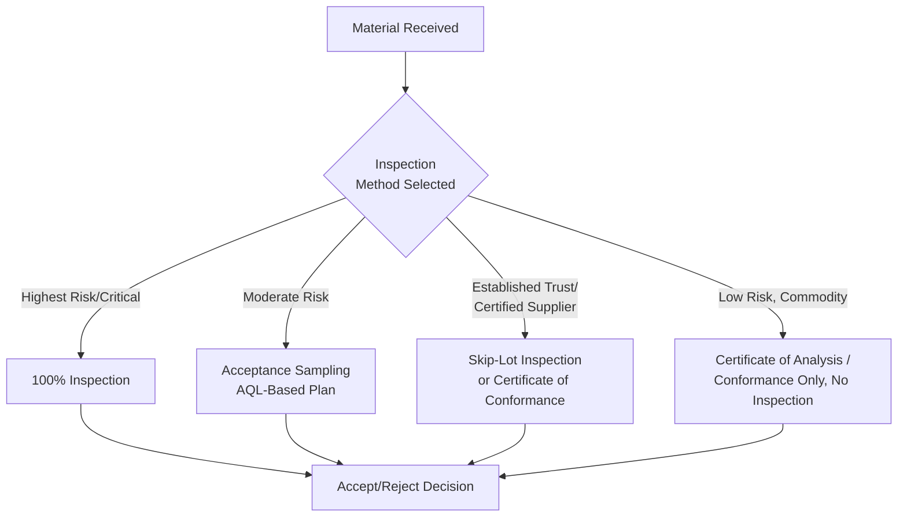
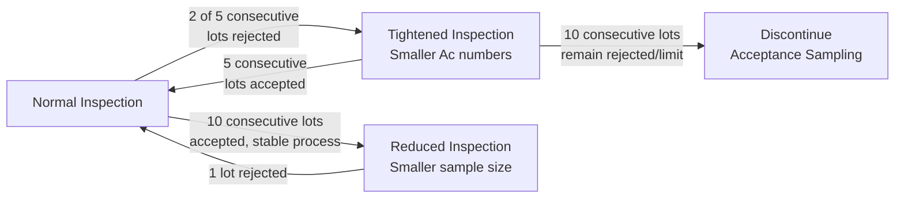

## Incoming Inspection and Acceptance Sampling

### Definition and Purpose

Incoming Inspection is the verification activity performed on purchased materials, components, or products upon receipt to confirm conformance to specified requirements before they are released for use in production or service delivery. Acceptance Sampling is the statistical methodology used to make accept/reject decisions on a lot of incoming material by inspecting a representative sample rather than 100% of the lot, based on probability theory rather than exhaustive inspection.

In a QMS/ISO context, this supports:

- **ISO 9001** Clause 8.4.2 (Type and Extent of Control) — requires organizations to ensure externally provided products/services do not adversely affect the organization's ability to deliver conforming output
- **ISO 9001** Clause 8.4.3 (Information for External Providers) — requires acceptance criteria to be communicated to suppliers
- **ISO 2859 series** (Sampling procedures for inspection by attributes, based on the historical MIL-STD-105E) — the primary international standard governing attribute acceptance sampling
- **ISO 3951 series** (Sampling procedures for inspection by variables) — governs variable acceptance sampling
- **ISO 9001** Clause 8.6 (Release of Products and Services) — incoming inspection is a release-gate control point

### Key Points

- Acceptance sampling is a **statistical risk-management tool**, not a guarantee — it accepts a defined, quantified risk of passing a bad lot or rejecting a good lot, rather than eliminating that risk entirely.
- The method assumes the **lot is the unit of decision** — an entire batch is accepted or rejected based on the sample result, not individual units judged in isolation.
- Sampling plans are defined by an **Acceptable Quality Level (AQL)** — the worst tolerable process average that is still considered acceptable for sampling purposes.
- ISO 9001 does **not mandate** 100% inspection or any specific sampling methodology — it requires the organization to determine controls appropriate to risk (Clause 8.4.2), and acceptance sampling is one common method of meeting that requirement.
- Over-reliance on incoming inspection (an appraisal cost) without addressing supplier process capability (a prevention investment) is generally considered a less mature quality strategy — inspection detects defects but does not prevent them.

### Incoming Inspection Methods Overview

### Statistical Foundation of Acceptance Sampling

Acceptance sampling relies on the **Operating Characteristic (OC) Curve**, which plots the probability of lot acceptance against the actual percent defective in the lot.

**Key parameters**:

| Parameter | Definition |
| --- | --- |
| AQL (Acceptable Quality Level) | Maximum percent defective considered satisfactory as a process average |
| RQL / LTPD (Rejectable/Lot Tolerance Percent Defective) | Percent defective considered unacceptable, associated with low acceptance probability |
| Producer's Risk (α) | Probability of rejecting a lot that is actually at or better than AQL (typically ~5%) |
| Consumer's Risk (β) | Probability of accepting a lot that is actually at or worse than RQL (typically ~10%) |
| Sample Size (n) | Number of units drawn from the lot for inspection |
| Acceptance Number (c) | Maximum number of defectives in the sample that still results in lot acceptance |

The probability of lot acceptance for a given sample plan, assuming a binomial (or hypergeometric for finite lots) distribution, is approximated by:

$$P(accept) = \sum_{d=0}^{c} \binom{n}{d} p^d (1-p)^{n-d}$$

Where $p$ = actual lot fraction defective, $n$ = sample size, $c$ = acceptance number, $d$ = number of defectives found.

### ISO 2859-1 (Attributes Sampling) Structure

ISO 2859-1 provides standardized sampling plan tables indexed by **lot size** and **inspection level**, from which sample size and acceptance/rejection numbers are derived for a chosen AQL.

**Inspection Levels**:

| Level | Use Case |
| --- | --- |
| General Inspection Level I | Reduced sample size; used when less discrimination is needed |
| General Inspection Level II | Standard/default level for most applications |
| General Inspection Level III | Increased sample size; used when greater discrimination is needed |
| Special Levels S-1 to S-4 | Used when small sample sizes are required and larger risk is acceptable |

**Simplified Example Table Excerpt** (illustrative, General Inspection Level II, Normal Inspection):

| Lot Size Range | Sample Size Code | Sample Size (n) | AQL 1.0% Ac/Re | AQL 2.5% Ac/Re |
| --- | --- | --- | --- | --- |
| 91–150 | E | 13 | 0/1 | 1/2 |
| 151–280 | F | 20 | 0/1 | 1/2 |
| 281–500 | G | 32 | 1/2 | 2/3 |
| 501–1200 | H | 50 | 1/2 | 3/4 |
| 1201–3200 | J | 80 | 2/3 | 5/6 |

*(Ac/Re = Acceptance number / Rejection number; a lot is rejected if defectives found ≥ Re)*

[Unverified — actual ISO 2859-1 table values should be confirmed directly against the current published standard before operational use; the figures above illustrate the table structure and format]

### Switching Rules: Normal, Tightened, and Reduced Inspection

ISO 2859-1 incorporates a dynamic switching mechanism based on recent lot history, incentivizing consistent supplier quality:

This mechanism means a supplier with a sustained history of good quality is rewarded with reduced inspection burden (lower sample sizes), while a supplier showing quality degradation automatically triggers tightened scrutiny — operationalizing risk-based control intensity without requiring manual reassessment of every lot.

### Variables Sampling (ISO 3951) vs. Attributes Sampling (ISO 2859)

| Aspect | Attributes Sampling (ISO 2859) | Variables Sampling (ISO 3951) |
| --- | --- | --- |
| Data Type | Pass/fail (conforming/nonconforming) | Continuous measurement (e.g., dimension in mm) |
| Sample Size Required | Generally larger for equivalent protection | Generally smaller for equivalent protection |
| Statistical Assumption | Binomial/hypergeometric distribution | Assumes underlying normal distribution |
| Complexity | Simpler to apply and explain | Requires more statistical sophistication |
| Best Suited For | Go/no-go characteristics, visual defects | Critical dimensional or continuous characteristics |

### Alternative and Complementary Incoming Control Strategies

| Strategy | Description | Best Used When |
| --- | --- | --- |
| 100% Inspection | Every unit inspected | Safety-critical characteristics, new/unproven suppliers, known high-risk processes |
| Skip-Lot Inspection | Only a fraction of lots inspected (e.g., 1 in 5) | Long history of sustained supplier quality performance |
| Certificate of Conformance (CoC) | Supplier self-certifies conformance; no physical inspection | Highly trusted, certified suppliers with strong process capability evidence |
| Statistical Process Control Data Review | Supplier provides SPC charts/capability data instead of physical re-inspection | Mature supplier partnerships with data-sharing agreements |
| Source Inspection | Customer inspects at supplier's facility before shipment | High-value or logistically difficult-to-return items |

### Worked Example

**Scenario**: An electronics assembler receives a lot of 800 connectors from an approved supplier, with an established AQL of 1.0% for critical dimensional defects.

**Step 1 — Determine Sample Size**: Per ISO 2859-1 General Inspection Level II tables, lot size 501–1200 corresponds to sample size code H, requiring a sample of 50 units.

**Step 2 — Determine Acceptance Criteria**: For AQL 1.0% at code H, Acceptance number (Ac) = 1, Rejection number (Re) = 2.

**Step 3 — Inspect Sample**: 50 units randomly drawn and inspected against the critical dimension specification.

**Step 4 — Decision**:

- If 0 or 1 defective units found → **Accept** the lot of 800
- If 2 or more defective units found → **Reject** the lot; initiate supplier containment/SCAR process

**Step 5 — Apply Switching Rule**: If this is the 3rd consecutive accepted lot from this supplier for this part number, inspection continues under Normal rules; a 5th consecutive acceptance would trigger evaluation for **Reduced Inspection** eligibility per the switching rules.

### Risk-Based Application (Linking to Clause 8.4.2)

Organizations are expected to determine the type and extent of incoming controls based on the potential impact of nonconforming supplied product on the organization's ability to meet customer requirements — not apply a single uniform method to all incoming materials.

**Example Risk-Based Decision Matrix**:

| Part Criticality | Supplier History | Recommended Control |
| --- | --- | --- |
| Safety-critical | New/unproven | 100% inspection + source inspection |
| Safety-critical | Long, stable history | Tightened AQL sampling plan (e.g., AQL 0.65%) |
| Standard/functional | New supplier | Normal AQL sampling (e.g., AQL 1.0–2.5%) |
| Standard/functional | Long, stable history | Reduced sampling or skip-lot |
| Commodity/non-critical | Any | Certificate of Conformance only |

### Common Pitfalls

- Selecting an AQL without formally documenting the rationale linking it to risk/criticality, creating an audit gap under Clause 8.4.2
- Treating sample acceptance as a guarantee of zero defects in the accepted lot — acceptance sampling inherently allows a defined nonzero probability of accepting a lot containing defects
- Failing to apply switching rules, missing opportunities to reduce inspection burden on consistently high-performing suppliers (or failing to tighten inspection on declining ones)
- Relying exclusively on incoming inspection as a quality strategy rather than partnering with suppliers to improve upstream process capability (shifting cost from appraisal to prevention)
- Using outdated or incorrectly referenced sampling tables rather than the current published ISO 2859-1/3951 editions

### Related Topics

- Supplier Evaluation and Selection Criteria
- Supplier Audits and Performance Monitoring
- ISO 2859 — Sampling Procedures for Inspection by Attributes
- ISO 3951 — Sampling Procedures for Inspection by Variables
- Statistical Process Control (SPC)
- Process Capability Analysis ($C_p$, $C_{pk}$)
- ISO 9001 Clause 8.4 — Control of Externally Provided Processes
- Prevention, Appraisal, and Failure Cost Categories (PAF Model)