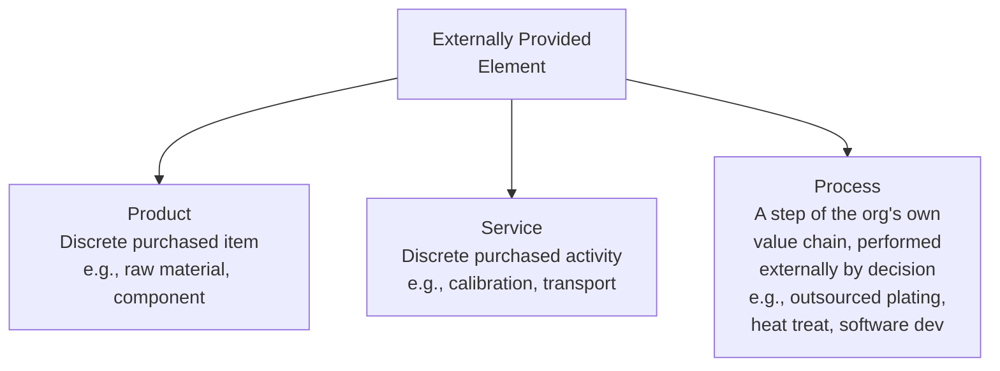
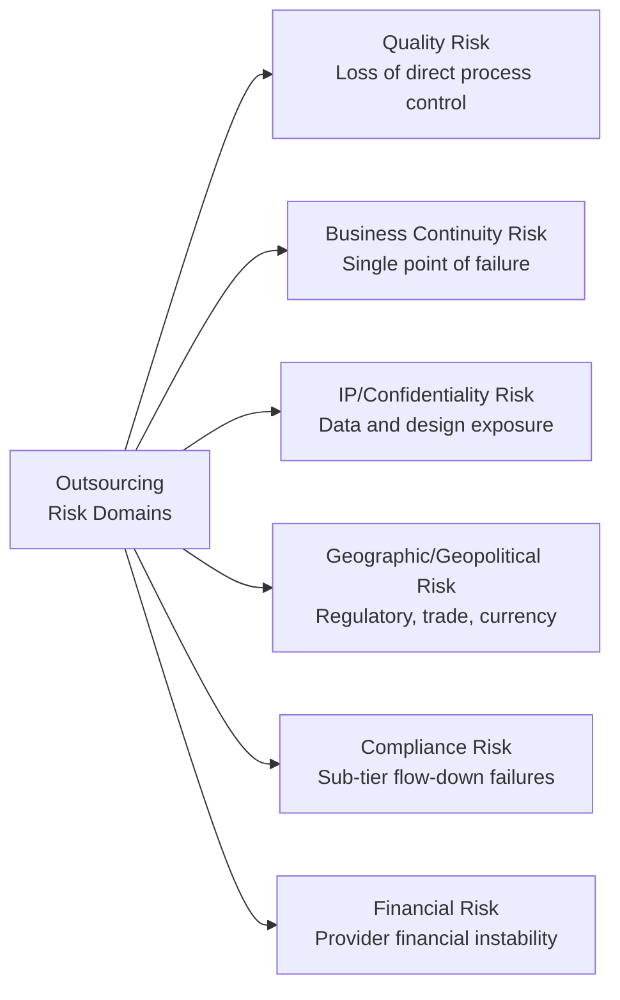
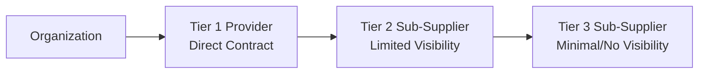

## Managing Externally Provided Processes and Outsourcing Risk

### Definition and Purpose

Managing Externally Provided Processes refers to the controls an organization applies when it outsources a process — as opposed to purchasing a finished product or discrete service — to an external provider, while retaining accountability for the conformity of the final output. This is a distinct and often more complex control challenge than standard supplier management, because the organization does not have direct operational control over the process itself, only over its inputs, outputs, and the contractual/oversight relationship.

In a QMS/ISO context, this is governed primarily by:

- **ISO 9001** Clause 8.4 (Control of Externally Provided Processes, Products and Services) — explicitly extends beyond purchased products to include **outsourced processes**
- **ISO 9001** Clause 4.4.1(c–d) — requires the organization to determine and manage the risks and opportunities associated with its processes, including outsourced ones
- **ISO 9001** Clause 8.4.1, Note — clarifies that an externally provided process remains within the scope of the QMS if the organization retains it as part of its own quality management system, even when physically performed by another party
- **ISO 9001** Clause 6.1 (Risk-Based Thinking) — outsourcing introduces risk categories (loss of control, confidentiality, business continuity) requiring explicit evaluation

### Key Points

- The defining question under Clause 8.4.1 is: **"Is this an externally provided process, product, or service?"** — the standard applies the same control framework to all three, but the mechanisms of control differ substantially for processes.
- **Outsourcing a process does not outsource accountability** — the organization remains responsible to its customers for the conformity of the final product/service, regardless of who performed the underlying process.
- Clause 8.4.1 requires organizations to apply controls when: (a) products/services from external providers are intended for incorporation into the organization's own products/services; (b) products/services are provided directly to the customer on the organization's behalf; or (c) **a process, or part of a process, is provided by an external provider as a result of a decision by the organization**.
- Control mechanisms for outsourced processes tend to rely more heavily on **process audits, defined interfaces, and output verification**, since direct real-time operational oversight is typically unavailable.
- Outsourcing risk extends beyond quality: **business continuity, intellectual property, confidentiality, and geopolitical/geographic concentration risk** are all material considerations.

### Distinguishing Externally Provided Products, Services, and Processes

The critical distinction: a **process** decision means the organization chose to have an external party perform an activity that could otherwise be, or previously was, part of its own operations — such as outsourced heat treatment, plating, sterilization, calibration services, IT infrastructure, or even entire manufacturing steps (contract manufacturing).

### Examples of Commonly Outsourced Processes in QMS Environments

| Category | Examples |
| --- | --- |
| Manufacturing/Special Processes | Heat treating, plating, welding, sterilization, painting |
| Testing and Calibration | Third-party calibration labs, environmental/reliability testing |
| Design and Engineering | Outsourced product design, contract engineering |
| IT and Data Services | Cloud hosting, software development, cybersecurity monitoring |
| Contract Manufacturing | Full or partial product assembly by a contract manufacturer |
| Logistics | Third-party warehousing, distribution, transportation |
| Support Functions | Outsourced calibration management, document control systems |

### Risk Categories in Outsourcing

### Establishing Control Over Externally Provided Processes

Per Clause 8.4.2, the organization must determine and apply criteria for the **type and extent of control** to be applied to an externally provided process, ensuring it does not adversely affect the organization's ability to deliver conforming products/services.

#### 1. Defined Process Interface / Boundary Specification

Clearly document where the organization's process ends and the external provider's process begins, including:

- Input specifications (what is handed off, in what condition/format)
- Output acceptance criteria (what is received back, and against what specification it is verified)
- Handoff and traceability requirements

#### 2. Contractual and Quality Agreement Controls

- **Quality Agreements / Supplier Quality Manuals** specifying applicable standards, process parameters, change notification requirements
- **Service Level Agreements (SLAs)** defining performance expectations (turnaround time, capacity commitments)
- Explicit **flow-down of customer and regulatory requirements** to the external provider (critical in regulated industries — aerospace, medical device, automotive)
- Right-to-audit clauses granting the organization (and potentially its own customers/regulators) access to verify the external provider's process

#### 3. Process Verification Methods

| Method | Description |
| --- | --- |
| Special Process Approval/Certification | For regulated special processes (e.g., NADCAP for aerospace heat treating/plating/NDT), verifying the provider holds required accreditation |
| Process Audits | Second-party audits of the specific outsourced process (see related topic: Supplier Audits) |
| Source Inspection | Organization's representative inspects at the provider's facility before release |
| Statistical Process Control Data Sharing | Provider shares real-time or periodic SPC data for the outsourced process |
| Output/Receiving Verification | Inspection or testing of the returned product/output against specification |
| First Article Inspection (FAI) | Full dimensional/functional verification of the first unit processed under a new or changed outsourced process |

#### 4. Change Management and Notification Requirements

A critical control unique to outsourced processes: since the organization cannot directly observe the process, it depends on the external provider to **proactively notify** of changes (equipment, location, personnel, sub-tier sourcing, process parameters) that could affect conformity. This notification requirement should be explicitly contractually mandated, since a process change made without notification is one of the most common root causes of undetected outsourced-process failures. [Inference — this reflects a widely recognized supply chain quality risk pattern rather than a claim about any specific documented statistic]

### Sub-Tier Supply Chain Visibility

Outsourcing risk compounds when the external provider itself outsources part of the process to their own sub-tier suppliers, creating a multi-tier chain where the originating organization may have little to no visibility.

Mitigation approaches include:

- Contractually requiring Tier 1 providers to flow down the same quality requirements to their own sub-suppliers
- Requiring disclosure/approval rights over any sub-tier outsourcing decisions
- Periodic sub-tier mapping exercises, particularly for safety-critical or regulated supply chains

### Worked Example

**Scenario**: A medical device manufacturer (ISO 13485-certified) outsources the ethylene oxide (EtO) sterilization process for a sterile surgical instrument — sterilization is a **special process** whose effectiveness cannot be fully verified by inspecting the final product alone.

**Step 1 — Classify as Externally Provided Process**: Since sterilization was previously considered for in-house capability and is a decision to outsource a step of the organization's value chain, it is classified under Clause 8.4.1(c) — an externally provided process, not merely a purchased service.

**Step 2 — Establish Control Criteria**: Organization requires the sterilization provider to hold current ISO 11135 (EtO sterilization) validated process certification and requires validation data (Bioburden testing, sterilization validation reports) for the specific product/packaging configuration.

**Step 3 — Contractual Controls**: Quality agreement mandates immediate written notification of any change to sterilization cycle parameters, EtO concentration, load configuration, or facility location.

**Step 4 — Process Verification**: Organization conducts an annual on-site process audit against ISO 11135 requirements and reviews biological indicator (BI) test results for every sterilization lot.

**Step 5 — Output Verification**: Each returned lot includes a Certificate of Sterilization with full cycle parameter documentation and BI results, reviewed and retained as part of the Device History Record before lot release.

**Step 6 — Ongoing Monitoring**: Sterilization cycle parameter trends reviewed quarterly; any BI positive result triggers immediate containment and a formal investigation regardless of final product test results.

### Comparison: Controlling an Externally Provided Process vs. a Purchased Product

| Aspect | Purchased Product | Externally Provided Process |
| --- | --- | --- |
| Primary Control Point | Incoming inspection of the finished item | Process parameters, interim verification, and final output |
| Visibility | Limited to received goods | May require ongoing access to real-time process data |
| Change Risk | Supplier changes a component or material | Supplier changes a process parameter with potentially invisible effects |
| Verification Method | Sampling/inspection against spec | Special process certification, audits, and validation data review |
| Typical Documentation | Certificate of Conformance, inspection records | Process validation records, cycle data, special process certifications |

### Common Pitfalls

- Treating an outsourced process the same as a purchased product, relying only on output inspection when the process itself requires special controls (particularly for special processes where nonconformance cannot be detected by inspection alone, such as heat treating or sterilization)
- Failing to contractually require change notification, discovering process changes only after a nonconformity occurs
- No visibility into sub-tier outsourcing by the direct provider, creating unmanaged risk deep in the supply chain
- Assuming a provider's general ISO 9001 (or sector-specific) certification is sufficient evidence of capability for a specific special process, without verifying process-specific accreditation (e.g., NADCAP for aerospace special processes)
- Underestimating business continuity risk from single-sourcing a critical outsourced process with no qualified alternate provider

### Related Topics

- Supplier Evaluation and Selection Criteria
- Supplier Audits and Performance Monitoring
- ISO 9001 Clause 8.4 — Control of Externally Provided Processes, Products and Services
- Special Process Validation and Certification (e.g., NADCAP)
- Risk-Based Thinking (ISO 9001 Clause 6.1)
- Business Continuity Planning in Supply Chain Management
- Sub-Tier Supplier Visibility and Flow-Down Requirements
- Design and Development Outsourcing Controls