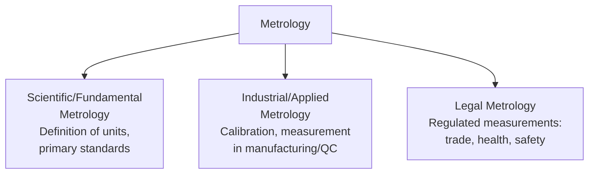
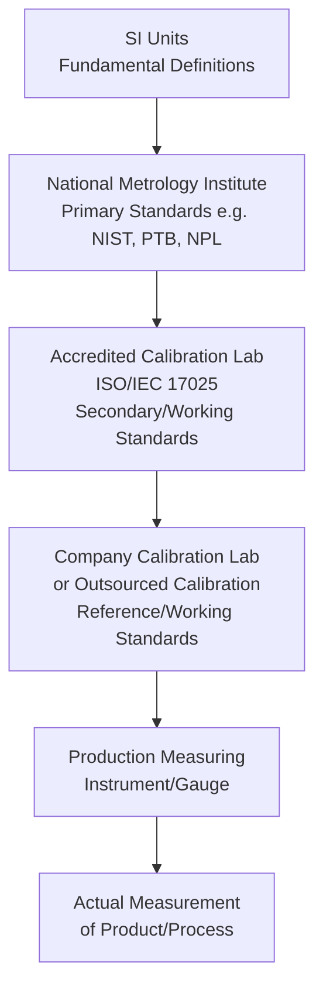

## Fundamentals of Measurement and Metrology

### Definition and Purpose

Metrology is the science of measurement, encompassing the theoretical and practical aspects of ensuring measurements are accurate, reliable, and comparable across time, location, and instrumentation. It provides the foundational discipline underlying all quantitative quality control, calibration, and conformance verification activities within a QMS.

In a QMS/ISO context, metrology fundamentals support:

- **ISO 9001** Clause 7.1.5 (Monitoring and Measuring Resources) — requires suitable, calibrated equipment for verifying conformity
- **ISO/IEC 17025** (General requirements for the competence of testing and calibration laboratories) — the primary standard governing calibration and testing lab competence
- **ISO/IEC Guide 99** (International Vocabulary of Metrology — VIM) — establishes standardized metrology terminology used across ISO standards
- **JCGM 100 (GUM)** — Guide to the Expression of Uncertainty in Measurement, the foundational document for uncertainty calculation methodology
- **ISO 9001** Clause 9.1 (Monitoring, Measurement, Analysis, Evaluation) — all quantitative QMS performance data depends on sound measurement fundamentals

### Key Points

- Metrology is formally divided into three domains: **scientific/fundamental metrology**, **industrial/applied metrology**, and **legal metrology**.
- Every measurement has an associated **uncertainty** — no measurement is perfectly exact, and quantifying this uncertainty is a core metrology discipline, not an afterthought.
- **Traceability** is the unbroken chain of calibrations linking a working measurement back to a recognized national or international standard.
- **Accuracy** and **precision** are distinct, commonly confused concepts — a measurement system can be precise without being accurate, and vice versa.
- The **International System of Units (SI)** provides the globally standardized reference framework upon which all traceable measurement is based.

### The Three Domains of Metrology

**Scientific Metrology**: Establishes and maintains the fundamental definitions of measurement units (e.g., the redefinition of the kilogram based on the Planck constant) and develops primary reference standards, typically the domain of National Metrology Institutes (NMIs) like NIST (USA), NPL (UK), or PTB (Germany).

**Industrial Metrology**: The application of measurement science in manufacturing, quality control, and calibration laboratories — the domain most directly relevant to QMS practitioners.

**Legal Metrology**: Measurements subject to regulatory control because they affect trade, public health, or safety (e.g., fuel pumps, retail scales, breathalyzers, medical dosing equipment).

### Accuracy vs. Precision vs. Trueness

A frequently misunderstood distinction, formally defined in ISO 5725 and the VIM:

| Term | Definition |
| --- | --- |
| Accuracy | Closeness of agreement between a measured value and the true value; combines both trueness and precision |
| Trueness | Closeness of agreement between the average of many measurements and the true/reference value (absence of systematic error/bias) |
| Precision | Closeness of agreement among repeated measurements under specified conditions (absence of random error/scatter) |

**Visual illustration of the four combinations**:

<svg xmlns="http://www.w3.org/2000/svg" viewBox="0 0 640 200" font-family="Arial, sans-serif" font-size="13">
<title>Accuracy vs Precision Illustration (svg_diagram)</title>
<rect x="10" y="10" width="140" height="140" fill="none" stroke="#333" stroke-width="1" />
<circle cx="80" cy="80" r="60" fill="none" stroke="#999" stroke-dasharray="3,3" />
<circle cx="72" cy="75" r="3" fill="#2166ac" />
<circle cx="88" cy="83" r="3" fill="#2166ac" />
<circle cx="78" cy="88" r="3" fill="#2166ac" />
<circle cx="85" cy="72" r="3" fill="#2166ac" />
<circle cx="76" cy="80" r="3" fill="#2166ac" />
<text x="80" y="165" text-anchor="middle">High Accuracy</text>
<text x="80" y="180" text-anchor="middle">High Precision</text>
<rect x="170" y="10" width="140" height="140" fill="none" stroke="#333" stroke-width="1" />
<circle cx="240" cy="80" r="60" fill="none" stroke="#999" stroke-dasharray="3,3" />
<circle cx="230" cy="50" r="3" fill="#b2182b" />
<circle cx="270" cy="95" r="3" fill="#b2182b" />
<circle cx="215" cy="105" r="3" fill="#b2182b" />
<circle cx="255" cy="60" r="3" fill="#b2182b" />
<circle cx="200" cy="70" r="3" fill="#b2182b" />
<text x="240" y="165" text-anchor="middle">High Accuracy</text>
<text x="240" y="180" text-anchor="middle">Low Precision</text>
<rect x="330" y="10" width="140" height="140" fill="none" stroke="#333" stroke-width="1" />
<circle cx="400" cy="80" r="60" fill="none" stroke="#999" stroke-dasharray="3,3" />
<circle cx="345" cy="45" r="3" fill="#2166ac" />
<circle cx="350" cy="52" r="3" fill="#2166ac" />
<circle cx="343" cy="58" r="3" fill="#2166ac" />
<circle cx="352" cy="48" r="3" fill="#2166ac" />
<circle cx="347" cy="55" r="3" fill="#2166ac" />
<text x="400" y="165" text-anchor="middle">Low Accuracy</text>
<text x="400" y="180" text-anchor="middle">High Precision</text>
<rect x="490" y="10" width="140" height="140" fill="none" stroke="#333" stroke-width="1" />
<circle cx="560" cy="80" r="60" fill="none" stroke="#999" stroke-dasharray="3,3" />
<circle cx="520" cy="40" r="3" fill="#b2182b" />
<circle cx="595" cy="105" r="3" fill="#b2182b" />
<circle cx="505" cy="95" r="3" fill="#b2182b" />
<circle cx="580" cy="45" r="3" fill="#b2182b" />
<circle cx="535" cy="115" r="3" fill="#b2182b" />
<text x="560" y="165" text-anchor="middle">Low Accuracy</text>
<text x="560" y="180" text-anchor="middle">Low Precision</text>
</svg>

### Types of Measurement Error

$$Total\ Error = Systematic\ Error\ (Bias) + Random\ Error$$

| Error Type | Characteristics | Common Sources |
| --- | --- | --- |
| Systematic Error (Bias) | Consistent, predictable direction/magnitude; can be corrected via calibration | Instrument miscalibration, environmental offset, consistent operator technique |
| Random Error | Unpredictable, varies in direction/magnitude; cannot be eliminated, only characterized statistically | Environmental fluctuation, operator variation, instrument resolution limits |

### Measurement Uncertainty

Every reported measurement result should be accompanied by a quantified uncertainty, expressed per the **GUM (Guide to the Expression of Uncertainty in Measurement)** framework as:

$$Result = x \pm U \quad (\text{at a stated confidence level, typically } k=2, \approx 95\%)$$

**Uncertainty Budget Components** (Type A and Type B):

| Type | Definition | Example Sources |
| --- | --- | --- |
| Type A | Evaluated by statistical analysis of repeated measurements | Standard deviation of repeated readings |
| Type B | Evaluated by other means (manufacturer specs, prior data, judgment) | Instrument specification tolerance, calibration certificate uncertainty, environmental effects |

**Combined Standard Uncertainty**:

$$u_c = \sqrt{\sum_{i=1}^{n} u_i^2}$$

**Expanded Uncertainty** (applying coverage factor $k$, typically 2 for ~95% confidence):

$$U = k \times u_c$$

### Traceability Chain

Traceability is the property of a measurement result whereby it can be related to a reference (typically a national or international standard) through an unbroken, documented chain of calibrations, each contributing to the stated measurement uncertainty.

Each link in this chain introduces additional uncertainty, meaning uncertainty generally accumulates as one moves down the chain from primary standards toward the shop-floor instrument — a working instrument's total measurement uncertainty is never smaller than the uncertainty of the standard used to calibrate it.

### The International System of Units (SI)

The SI system defines seven base units, from which all other units are derived:

| Base Quantity | SI Unit | Symbol |
| --- | --- | --- |
| Length | metre | m |
| Mass | kilogram | kg |
| Time | second | s |
| Electric current | ampere | A |
| Thermodynamic temperature | kelvin | K |
| Amount of substance | mole | mol |
| Luminous intensity | candela | cd |

Since 2019, all seven base units are defined in terms of fixed values of fundamental physical constants (e.g., the kilogram via the Planck constant, the second via the cesium hyperfine transition frequency), rather than physical artifacts — a change generally referred to as the "SI redefinition." [Unverified — while this redefinition is well-documented in metrology literature, readers requiring precise regulatory or legal citation should confirm against current BIPM (Bureau International des Poids et Mesures) publications]

### Resolution, Sensitivity, and Repeatability

| Term | Definition |
| --- | --- |
| Resolution | Smallest change in a quantity that causes a perceptible change in the instrument's indication |
| Sensitivity | Ratio of change in instrument response to change in the measured quantity |
| Repeatability | Closeness of agreement among successive measurements of the same quantity, under the same conditions (same operator, instrument, location, short time interval) |
| Reproducibility | Closeness of agreement among measurements of the same quantity under changed conditions (different operators, instruments, or labs) |

### Calibration vs. Verification vs. Adjustment

A commonly confused set of related but distinct activities:

| Activity | Definition |
| --- | --- |
| Calibration | Comparison of an instrument's output against a known reference standard, establishing the relationship between indicated and true values, with documented uncertainty — does not itself change the instrument |
| Verification | Confirmation that an instrument still meets specified requirements, often a simpler pass/fail check against tolerance, may or may not include full calibration |
| Adjustment | The physical act of correcting/tuning an instrument to reduce measurement error — a separate step from calibration, sometimes performed immediately after calibration reveals out-of-tolerance readings |

### Worked Example: Basic Uncertainty Calculation

**Scenario**: A caliper is used to measure a part dimension 10 times, yielding a mean of 25.02 mm.

**Type A Uncertainty** (from repeated measurements):

- Standard deviation of the 10 readings, $s = 0.015$ mm
- Standard uncertainty of the mean: $u_A = \frac{s}{\sqrt{n}} = \frac{0.015}{\sqrt{10}} \approx 0.0047\ mm$

**Type B Uncertainty** (from caliper's calibration certificate):

- Calibration certificate states an uncertainty of $\pm 0.010$ mm at $k=2$
- Standard uncertainty: $u_B = \frac{0.010}{2} = 0.005\ mm$

**Combined Standard Uncertainty**:

$$u_c = \sqrt{(0.0047)^2 + (0.005)^2} \approx 0.0069\ mm$$

**Expanded Uncertainty** ($k=2$, ~95% confidence):

$$U = 2 \times 0.0069 \approx 0.0137\ mm$$

**Reported Result**: $25.02 \pm 0.014\ mm$ (at approximately 95% confidence)

### Key Standards Referenced in Metrology Practice

| Standard | Scope |
| --- | --- |
| ISO/IEC Guide 99 (VIM) | International Vocabulary of Metrology — standardized terminology |
| JCGM 100 (GUM) | Guide to the Expression of Uncertainty in Measurement |
| ISO/IEC 17025 | Competence requirements for testing and calibration laboratories |
| ISO 10012 | Measurement management systems — requirements for measurement processes and equipment |
| ISO 5725 series | Accuracy (trueness and precision) of measurement methods and results |

### Common Pitfalls

- Conflating precision with accuracy — assuming a repeatable instrument is necessarily a correct one
- Reporting measurement results without any associated uncertainty statement, making conformance decisions near a tolerance boundary statistically indefensible
- Confusing calibration with adjustment — assuming "calibrating" an instrument automatically corrects it
- Breaking the traceability chain by using an uncalibrated or expired reference standard
- Ignoring environmental factors (temperature, humidity, vibration) that contribute to measurement uncertainty, especially for precision dimensional metrology

### Related Topics

- Calibration Program Management and Intervals
- Measurement System Analysis (Gage R&R)
- ISO/IEC 17025 Laboratory Accreditation
- ISO 10012 Measurement Management Systems
- Measurement Uncertainty Budgets (GUM Methodology)
- Traceability to National/International Standards
- Statistical Process Control (SPC)
- Calibration Equipment and Reference Standards Selection