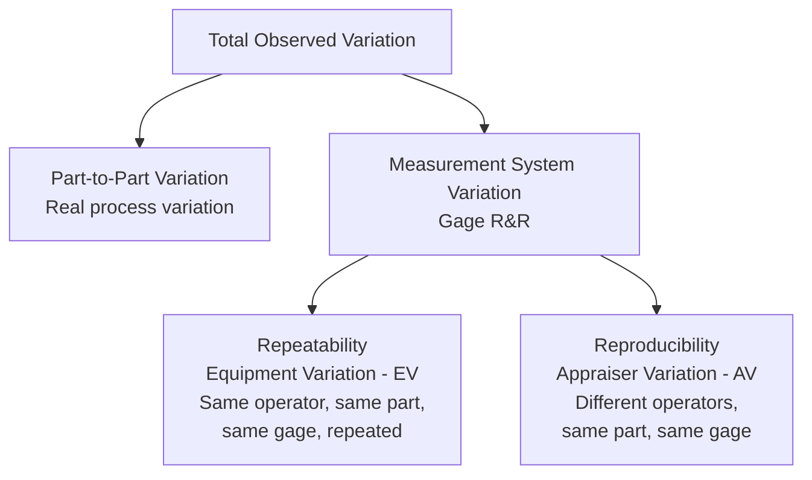
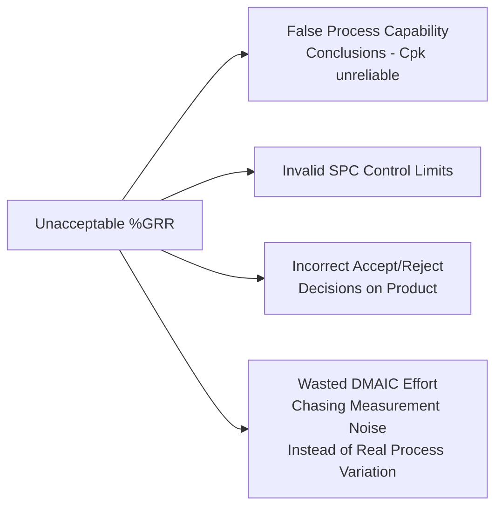

## Measurement System Analysis and Gage Repeatability and Reproducibility

### Definition and Purpose

Measurement System Analysis (MSA) is a structured methodology for evaluating the quality of a measurement system — quantifying how much of the observed variation in data comes from the actual process/part versus the measurement system itself. Gage Repeatability and Reproducibility (Gage R&R) is the specific statistical study within MSA that decomposes measurement system variation into its two primary components: repeatability (equipment variation) and reproducibility (appraiser/operator variation).

In a QMS/ISO context, MSA and Gage R&R support:

- **ISO 9001** Clause 7.1.5.2 (Measurement Traceability) — implicitly requires confidence that measuring equipment produces valid results
- **AIAG MSA Reference Manual** — the primary industry reference (jointly developed by the Automotive Industry Action Group with Ford, GM, and Stellantis/FCA), widely adopted across sectors beyond automotive
- **IATF 16949** Clause 7.1.5.1.1 — explicitly mandates MSA studies per the AIAG MSA methodology for automotive suppliers
- **ISO/IEC 17025** — accredited calibration/testing labs must demonstrate measurement system validity as part of competence requirements
- Six Sigma DMAIC **Measure phase** — MSA (specifically Gage R&R) is a mandatory gate before baseline process capability data can be considered valid

### Key Points

- MSA must be performed **before** relying on any measurement data for process capability studies, SPC, or acceptance decisions — an invalid measurement system invalidates all downstream conclusions drawn from its data.
- Gage R&R decomposes total observed variation into **Part-to-Part variation** (real variation between parts) and **Measurement System variation** (Repeatability + Reproducibility).
- **Repeatability** = variation when the *same* appraiser measures the *same* part multiple times with the *same* gage (equipment variation, EV).
- **Reproducibility** = variation when *different* appraisers measure the *same* part with the *same* gage (appraiser variation, AV).
- The output metric most commonly used for acceptance decisions is **%GRR (percent Gage R&R relative to total variation or tolerance)**.

### Total Observed Variation Decomposition

$$\sigma^2_{Total} = \sigma^2_{Part} + \sigma^2_{GRR}$$

$$\sigma^2_{GRR} = \sigma^2_{Repeatability} + \sigma^2_{Reproducibility}$$

### Repeatability vs. Reproducibility Illustrated

<svg xmlns="http://www.w3.org/2000/svg" viewBox="0 0 620 260" font-family="Arial, sans-serif" font-size="13">
<title>Repeatability vs Reproducibility (svg_diagram)</title>
<rect x="20" y="20" width="270" height="200" fill="none" stroke="#333" />
<text x="155" y="45" text-anchor="middle" font-weight="bold">Repeatability (EV)</text>
<text x="155" y="62" text-anchor="middle" font-size="11">Operator A, same part, 5 trials</text>
<line x1="60" y1="130" x2="250" y2="130" stroke="#999" />
<circle cx="150" cy="130" r="4" fill="#2166ac" />
<circle cx="155" cy="130" r="4" fill="#2166ac" />
<circle cx="148" cy="130" r="4" fill="#2166ac" />
<circle cx="152" cy="130" r="4" fill="#2166ac" />
<circle cx="146" cy="130" r="4" fill="#2166ac" />
<text x="155" y="160" text-anchor="middle" font-size="11">Tight cluster = low EV</text>
<text x="155" y="200" text-anchor="middle" font-size="11">Same equipment,</text>
<text x="155" y="215" text-anchor="middle" font-size="11">same operator variation</text>
<rect x="320" y="20" width="280" height="200" fill="none" stroke="#333" />
<text x="460" y="45" text-anchor="middle" font-weight="bold">Reproducibility (AV)</text>
<text x="460" y="62" text-anchor="middle" font-size="11">3 operators, same part, 1 trial each</text>
<line x1="360" y1="130" x2="580" y2="130" stroke="#999" />
<circle cx="400" cy="130" r="5" fill="#b2182b" />
<text x="400" y="150" text-anchor="middle" font-size="10">Op A</text>
<circle cx="465" cy="130" r="5" fill="#2166ac" />
<text x="465" y="150" text-anchor="middle" font-size="10">Op B</text>
<circle cx="530" cy="130" r="5" fill="#1a9850" />
<text x="530" y="150" text-anchor="middle" font-size="10">Op C</text>
<text x="460" y="200" text-anchor="middle" font-size="11">Spread between operators = AV</text>
</svg>

### Types of MSA Studies

| Study Type | Purpose |
| --- | --- |
| Gage R&R (Crossed) | Standard study; each appraiser measures each part multiple times |
| Gage R&R (Nested) | Used when parts are destroyed during measurement or cannot be measured by multiple appraisers |
| Bias Study | Evaluates systematic difference between observed average and a reference/true value |
| Linearity Study | Evaluates whether bias changes consistently across the operating range of the gage |
| Stability Study | Evaluates whether a gage's measurements remain consistent over time |
| Attribute Agreement Analysis | MSA for pass/fail or attribute (categorical) measurement systems, not continuous data |

### Methodology: Crossed Gage R&R Study (AIAG Standard Approach)

#### Step 1: Study Design

- Select **10 parts** representing the full range of expected process variation (AIAG standard recommendation)
- Select **2–3 appraisers** who normally perform the measurement
- Each appraiser measures each part **2–3 trials**, in random order, blind to prior readings

#### Step 2: Data Collection

Typical data collection matrix (3 appraisers × 10 parts × 3 trials = 90 total measurements):

| Part | Appraiser | Trial 1 | Trial 2 | Trial 3 |
| --- | --- | --- | --- | --- |
| 1 | A | 25.02 | 25.01 | 25.03 |
| 1 | B | 25.00 | 25.02 | 25.01 |
| 1 | C | 25.03 | 25.02 | 25.04 |
| 2 | A | 24.98 | 24.97 | 24.99 |
| ... | ... | ... | ... | ... |

#### Step 3: Statistical Analysis (ANOVA Method — Preferred)

The **ANOVA method** is generally preferred over the older "Average and Range (X-bar/R) method" because it can separately estimate the operator-by-part interaction effect, whereas the X-bar/R method cannot. [Inference — this preference reflects standard current AIAG MSA guidance rather than a claim that the X-bar/R method is invalid for all purposes]

A two-way ANOVA with interaction decomposes variation into:

$$\sigma^2_{Total} = \sigma^2_{Part} + \sigma^2_{Appraiser} + \sigma^2_{Part \times Appraiser} + \sigma^2_{Repeatability}$$

Where Reproducibility = $\sigma^2_{Appraiser} + \sigma^2_{Part \times Appraiser}$

#### Step 4: Calculate %GRR

$$\%GRR = \frac{\sigma_{GRR}}{\sigma_{Total}} \times 100\%$$

Alternative denominator using tolerance (common when the study's purpose is acceptance decision-making rather than process capability):

$$\%GRR_{(tolerance)} = \frac{6 \times \sigma_{GRR}}{Tolerance\ (USL-LSL)} \times 100\%$$

### AIAG Acceptance Criteria for %GRR

| %GRR | Assessment |
| --- | --- |
| Under 10% | Measurement system is acceptable |
| 10% – 30% | May be acceptable depending on application, cost of gage, cost of repair, importance of application |
| Over 30% | Measurement system is unacceptable and needs improvement |

### Number of Distinct Categories (ndc)

A complementary metric indicating how many distinct groups of parts the measurement system can reliably distinguish:

$$ndc = 1.41 \times \left(\frac{\sigma_{Part}}{\sigma_{GRR}}\right)$$

An `ndc` value of **5 or greater** is generally considered acceptable, indicating the measurement system can adequately distinguish part-to-part variation; an `ndc` below 2 indicates the system can only distinguish "good" from "bad," insufficient for process control purposes. [Inference — the ndc ≥ 5 threshold is a standard AIAG-referenced heuristic, not a fixed statistical law]

### Worked Example (Simplified)

**Scenario**: A Gage R&R study on a digital caliper measuring a shaft diameter yields the following variance component estimates from ANOVA analysis:

| Source | Variance Component ($\sigma^2$) |
| --- | --- |
| Part-to-Part | 0.000841 |
| Repeatability (Equipment) | 0.000049 |
| Reproducibility (Appraiser + Interaction) | 0.000016 |
| **Total** | **0.000906** |

**Calculations**:

$$\sigma_{GRR} = \sqrt{0.000049 + 0.000016} = \sqrt{0.000065} \approx 0.00806$$

$$\sigma_{Total} = \sqrt{0.000906} \approx 0.03010$$

$$\%GRR = \frac{0.00806}{0.03010} \times 100\% \approx 26.8\%$$

**Interpretation**: At 26.8%, this measurement system falls in the "may be acceptable depending on application" range (10–30%) — the organization must judge based on the criticality of the characteristic, cost of an improved gage, and downstream risk before deciding whether to accept or require gage improvement.

$$ndc = 1.41 \times \sqrt{\frac{0.000841}{0.000065}} \approx 1.41 \times 3.60 \approx 5.07$$

The `ndc` of approximately 5 sits right at the minimum acceptable threshold, reinforcing that this measurement system is marginal and improvement should be considered before it is relied upon for tight process control decisions.

### Attribute Agreement Analysis (for Pass/Fail Measurement Systems)

When the measurement system produces categorical (attribute) results rather than continuous data (e.g., visual inspection pass/fail, go/no-go gauges), a different MSA approach is used:

| Metric | Description |
| --- | --- |
| Within-Appraiser Agreement | Does the same appraiser reach the same conclusion on repeated trials of the same part? |
| Between-Appraiser Agreement | Do different appraisers reach the same conclusion on the same part? |
| Appraiser vs. Standard Agreement | Do appraisers' conclusions match a known reference/true condition? |
| Kappa Statistic | Statistical measure of agreement beyond what would be expected by chance |

A common acceptance guideline is **Kappa ≥ 0.75** indicating good agreement, though this varies by industry criticality standards. [Unverified — specific Kappa thresholds vary across referenced guidance documents and organizational policy; the AIAG MSA manual should be consulted directly for the exact recommended threshold in a given context]

### MSA Study Design Considerations

- **Blind study**: Appraisers should not know which part they are measuring or see prior results, to avoid bias
- **Random order**: Trial order should be randomized to prevent learning effects or drift from confounding results
- **Representative parts**: The 10 parts should span the actual expected range of process variation — using parts with too little variation will artificially inflate %GRR
- **Trained appraisers**: Appraisers in the study should be representative of those who normally perform the measurement in production, not specially trained experts

### Consequences of an Inadequate Measurement System

### Common Pitfalls

- Selecting parts for the study that don't represent the actual process variation range, distorting %GRR results
- Not blinding the study — appraisers see prior results or part identification, biasing agreement
- Using the older X-bar/R method exclusively when the ANOVA method would reveal a significant part-by-appraiser interaction effect
- Treating %GRR as a one-time check rather than re-verifying periodically or after any gage repair/replacement
- Proceeding with process capability studies or SPC implementation using a measurement system that has never been validated via MSA
- Confusing calibration (traceability to a standard) with MSA (variation characterization) — a perfectly calibrated gage can still have unacceptable %GRR due to operator technique or gage design

### Related Topics

- Fundamentals of Measurement and Metrology
- Calibration Program Management and Intervals
- Process Capability Analysis ($C_p$, $C_{pk}$, $P_p$, $P_{pk}$)
- Statistical Process Control (SPC)
- Six Sigma DMAIC Methodology (Measure Phase)
- AIAG MSA Reference Manual
- IATF 16949 Measurement System Requirements
- Attribute Agreement Analysis and Kappa Statistics