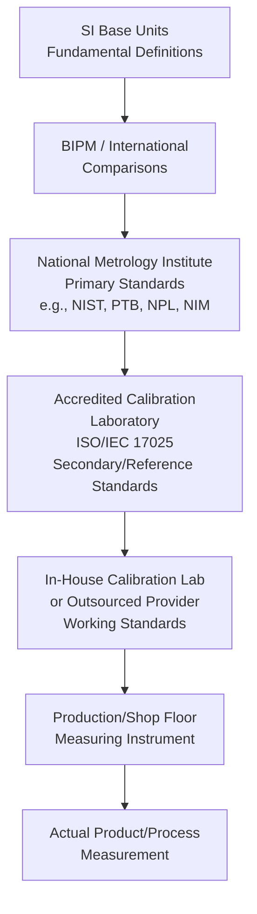
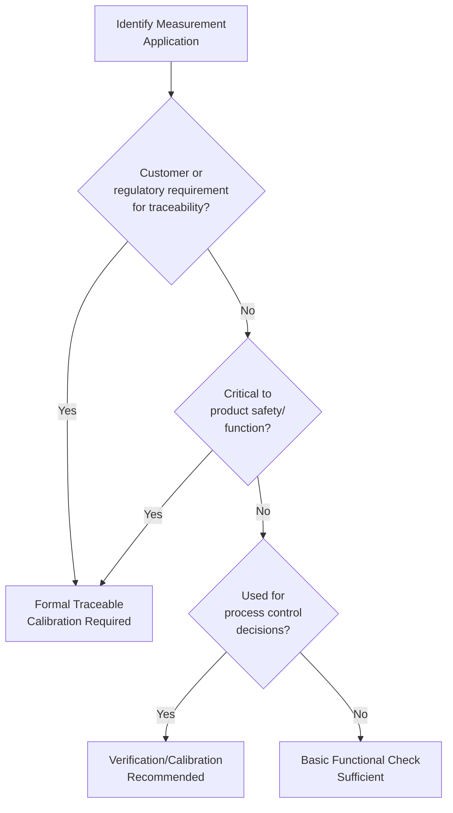
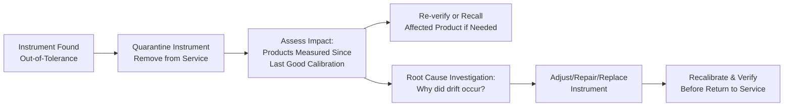

## Calibration Standards and Traceability

### Definition and Purpose

Calibration Standards are reference measurement devices or artifacts of known, documented accuracy used to verify and adjust the accuracy of working instruments. Traceability is the property of a measurement result that allows it to be linked, through an unbroken and documented chain of calibrations, back to a recognized national or international measurement standard, with each link in the chain contributing a quantified uncertainty.

In a QMS/ISO context, this topic directly supports:

- **ISO 9001** Clause 7.1.5.2 (Measurement Traceability) — explicitly requires that where traceability is a requirement, measuring equipment shall be calibrated/verified against measurement standards traceable to international or national standards
- **ISO/IEC 17025** (General requirements for the competence of testing and calibration laboratories) — the primary standard governing accredited calibration laboratories and traceability requirements
- **ISO 10012** (Measurement management systems) — requirements for measurement processes and measuring equipment
- **ISO/IEC Guide 99 (VIM)** — International Vocabulary of Metrology, which formally defines "traceability" and "calibration"

### Key Points

- Traceability requires **documented evidence**, not just a general belief that an instrument is "probably accurate" — each calibration must produce a certificate showing the chain back to a recognized standard.
- Every step in a traceability chain **adds uncertainty** — a working instrument's uncertainty can never be better than the uncertainty of the standard it was calibrated against.
- ISO 9001 Clause 7.1.5.2 requires traceability specifically "where traceability is a requirement" — meaning the organization must first determine which measurements require it, based on customer, regulatory, or internal risk requirements.
- **ISO/IEC 17025 accreditation** of a calibration laboratory provides independent, third-party assurance that the lab's technical competence and traceability claims are valid — accreditation is distinct from mere ISO 9001 certification of a calibration provider.
- When no national/international standard exists for a particular measurement, the organization must document the **basis used for calibration or verification** (e.g., an in-house reference standard, a consensus standard, or a defined internal reference method).

### The Traceability Hierarchy

### Key Organizations in the Traceability Chain

| Level | Organization Type | Examples |
| --- | --- | --- |
| International | International Bureau of Weights and Measures | BIPM (coordinates international comparisons between NMIs) |
| National | National Metrology Institute (NMI) | NIST (USA), PTB (Germany), NPL (UK), NIM (China), NRC (Canada) |
| Accredited Calibration Labs | Third-party accredited labs | Accredited under ISO/IEC 17025 by national accreditation bodies (e.g., A2LA, UKAS, ANAB) |
| In-House/Internal | Organization's own calibration function | Company metrology lab, calibration technicians |

### Types of Reference Standards by Hierarchy Level

| Standard Type | Definition | Typical Use |
| --- | --- | --- |
| Primary Standard | Realizes the definition of a unit directly, with the highest attainable accuracy | Held by NMIs; used to calibrate secondary standards |
| Secondary Standard | Calibrated by comparison to a primary standard | Held by accredited calibration labs; used to calibrate reference/working standards |
| Reference Standard | Highest-accuracy standard available at a given location, used to calibrate working standards | Company metrology lab's master gage blocks, reference weights |
| Working Standard | Used routinely to calibrate or verify measuring instruments | Shop-floor calibration masters, check standards |
| Transfer Standard | Standard used specifically to transport a calibration value between locations/labs | Traveling reference standards for inter-lab comparison |

### Calibration Certificate Contents

A traceable calibration certificate, per ISO/IEC 17025 requirements, should include:

- Unique identification of the instrument calibrated
- Identification of the calibration laboratory and its accreditation status/scope
- Reference to the standards/methods used, with traceability statement
- Environmental conditions during calibration (temperature, humidity, where relevant)
- As-found and as-left readings (before and after any adjustment)
- Measurement results with stated uncertainty
- Traceability chain reference (e.g., accreditation certificate number, NMI reference)
- Date of calibration and, where applicable, recommended recalibration date

### ISO/IEC 17025 Accreditation vs. ISO 9001 Certification for Calibration Providers

A commonly confused distinction:

| Aspect | ISO 9001 Certification | ISO/IEC 17025 Accreditation |
| --- | --- | --- |
| What it Verifies | General quality management system exists and is followed | Specific technical competence to perform defined calibrations/tests, including traceability and uncertainty evaluation |
| Granted By | Certification body | Accreditation body (a distinct, typically government-recognized entity) |
| Scope | Organization-wide QMS | Specific to accredited scope (particular measurements, ranges, uncertainties) |
| Typical Symbol | ISO 9001 certificate | Accreditation certificate + accreditation body logo (e.g., ILAC MRA mark) with defined scope of accreditation |

A calibration provider being ISO 9001 certified alone does **not** establish that their calibration results are technically valid or traceable in the rigorous sense — ISO/IEC 17025 accreditation, with a scope specifically covering the measurement in question, is the relevant credential for verifying traceability claims. [Inference — this distinction reflects standard metrology and quality management guidance rather than a claim about any specific calibration provider]

### Establishing Traceability Requirements: Risk-Based Approach

Per Clause 7.1.5.2, organizations must determine which measurements require formal traceability, typically based on:

### Calibration Intervals

Establishing an appropriate calibration interval balances risk (equipment drifting out of tolerance undetected) against cost (unnecessary calibration frequency).

**Common interval-setting methods**:

| Method | Description |
| --- | --- |
| Manufacturer Recommendation | Initial baseline interval, often conservative |
| Fixed/Default Interval | Common industry defaults (e.g., annual) applied uniformly, simplest but least data-driven |
| Reliability-Targeted (Statistical) Method | Interval adjusted based on historical as-found calibration data, targeting a defined "in-tolerance" reliability percentage (e.g., 95%) |
| Condition-Based/Usage-Based | Interval tied to actual usage hours/cycles rather than calendar time |

**Reliability-Targeted Interval Adjustment Logic**:

$$\text{If}\ In\text{-}Tolerance\ Rate < Target\ (\text{e.g., } 95\%) \rightarrow Shorten\ Interval$$

$$\text{If}\ In\text{-}Tolerance\ Rate \gg Target \rightarrow Consider\ Lengthening\ Interval$$

### Calibration Status and Labeling

Per ISO 9001 Clause 7.1.5.1, organizations must ensure measuring equipment is identified to enable determination of calibration status. Common practices:

- **Calibration stickers/labels** showing calibration date, due date, and technician/lab identifier
- **"Calibration Due" alerts** integrated into calibration management software (CMS)
- **Out-of-service/quarantine labeling** for instruments awaiting calibration, found out-of-tolerance, or pending repair
- **Unique asset identification** (barcode, serial number) linking the physical instrument to its calibration history record

### Handling Out-of-Tolerance (OOT) Conditions

When an instrument is found out-of-tolerance during calibration (the "as-found" condition), ISO 9001 and related standards require an assessment of the potential impact on previously measured/released product:

This backward-looking impact assessment is a critical, often audited element — an out-of-tolerance finding is not just about fixing the instrument going forward, but about determining whether any product accepted using that instrument since its last known-good calibration may now be suspect.

### Worked Example

**Scenario**: A manufacturer's digital micrometer (used for a critical dimension, traceability required per customer contract) is due for annual calibration.

**Step 1 — Send to Accredited Lab**: Instrument sent to a calibration provider holding ISO/IEC 17025 accreditation with a scope explicitly covering micrometers in the relevant range.

**Step 2 — Calibration Performed**: Lab compares the micrometer against gauge blocks that are themselves traceable to a national metrology institute (e.g., NIST), documenting as-found and as-left readings at multiple points across the measurement range.

**Step 3 — As-Found Result**: As-found data shows the micrometer reading 0.015 mm high at the 50 mm reference point — outside the instrument's stated ±0.010 mm tolerance.

**Step 4 — Impact Assessment**: Quality team reviews production records since the last calibration (11 months prior) to identify any parts measured near the specification limit using this specific instrument, flagging them for re-verification.

**Step 5 — Adjustment and Re-Calibration**: Lab adjusts the instrument and performs as-left calibration, confirming it now reads within tolerance across the full range, with an issued calibration certificate stating traceability to NIST reference standards and the measurement uncertainty.

**Step 6 — Root Cause**: Internal investigation determines the drift was likely due to a minor impact event logged in the instrument's usage history; a protective case is issued to prevent recurrence.

**Step 7 — Interval Review**: Given the OOT finding, the calibration interval for this instrument class is reviewed and potentially shortened per the organization's reliability-targeted interval methodology.

### Common Pitfalls

- Using a calibration provider without verifying their ISO/IEC 17025 accreditation scope actually covers the specific instrument type and range being calibrated
- Treating "calibrated" and "in-tolerance" as synonymous — a calibration can legitimately document an out-of-tolerance finding
- No defined process for assessing the impact of an out-of-tolerance finding on previously accepted product
- Applying traceability requirements uniformly to all instruments regardless of risk, rather than using a risk-based determination per Clause 7.1.5.2
- Allowing calibration intervals to remain fixed indefinitely without reviewing actual as-found historical performance data
- Missing or incomplete calibration certificates that don't clearly document the traceability chain and measurement uncertainty

### Related Topics

- Fundamentals of Measurement and Metrology
- Measurement System Analysis and Gage R&R
- ISO/IEC 17025 Laboratory Accreditation Requirements
- ISO 10012 Measurement Management Systems
- Calibration Interval Determination Methods
- Out-of-Tolerance Impact Assessment
- Measurement Uncertainty Budgets (GUM Methodology)
- Calibration Management Software and Asset Tracking