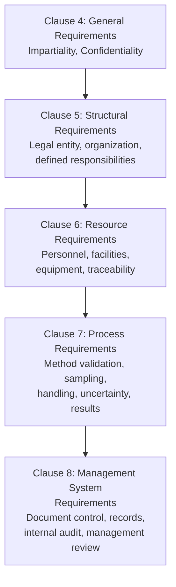
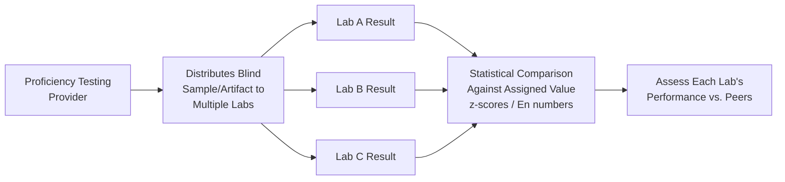
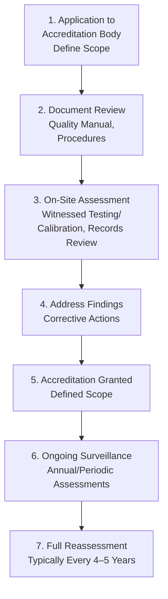

## ISO/IEC 17025 Requirements for Testing and Calibration Laboratories

### Definition and Purpose

ISO/IEC 17025 is the international standard specifying general requirements for the competence, impartiality, and consistent operation of testing and calibration laboratories. Unlike ISO 9001, which addresses general quality management, ISO/IEC 17025 combines quality management system requirements with technical competence requirements specific to laboratory operations — making it the definitive standard for laboratory accreditation worldwide.

In a QMS/ISO context, this standard directly supports:

- **ISO 9001** Clause 7.1.5.2 (Measurement Traceability) — organizations often specify ISO/IEC 17025 accreditation as the qualifying criterion when selecting calibration providers
- **ILAC (International Laboratory Accreditation Cooperation)** — coordinates mutual recognition arrangements (MRA) between national accreditation bodies, enabling international recognition of ISO/IEC 17025 accredited results
- **ISO 15189** — the related but distinct standard for medical testing laboratories (adapts ISO/IEC 17025 principles for clinical contexts)
- **ISO/IEC 17011** — governs the accreditation bodies themselves that grant ISO/IEC 17025 accreditation

### Key Points

- ISO/IEC 17025 is structured around two integrated pillars: **general/management requirements** (similar in spirit to ISO 9001) and **technical requirements** (specific to producing valid, traceable results).
- Accreditation is granted with a **defined scope** — specific tests, calibrations, measurement ranges, and methods — not as a blanket organizational certification.
- The current edition (ISO/IEC 17025:2017) restructured the standard around a **process-based approach** aligned with the High-Level Structure used across modern ISO management system standards, replacing the older, more rigid clause structure of the 2005 edition.
- **Impartiality and confidentiality** are elevated to formal, standalone structural requirements (Clause 4), reflecting the standard's emphasis on laboratories as independent, unbiased sources of measurement/testing data.
- **Measurement uncertainty** and **metrological traceability** are core technical requirements woven throughout the standard, not optional add-ons.

### ISO/IEC 17025:2017 Structure Overview

### Clause 4: General Requirements

**Impartiality**: The laboratory must identify risks to its impartiality on an ongoing basis and demonstrate how it manages/mitigates them — this includes financial, commercial, or other pressures that could compromise objectivity in reporting results.

**Confidentiality**: The laboratory must have documented policies for managing client information, particularly when the laboratory is required by law to release confidential information.

### Clause 5: Structural Requirements

Establishes that the laboratory must be a defined legal entity (or a defined part of one) with:

- Clearly defined organizational structure and management responsibilities
- Identified personnel with authority and resources for technical operations, quality system implementation, and identifying deviations
- Defined relationships with any parent organization to prevent conflicts of interest affecting impartiality

### Clause 6: Resource Requirements

The technical foundation of the standard — resources must be adequate to perform activities competently.

#### 6.2 Personnel

- Competence requirements defined for each function affecting results (education, training, experience, demonstrated skills)
- Documented authorization for personnel performing specific activities (e.g., issuing reports, using specific methods, opinions/interpretations)

#### 6.3 Facilities and Environmental Conditions

- Environmental conditions (temperature, humidity, vibration, electromagnetic interference) must be monitored, controlled, and recorded where they affect result validity
- Access control appropriate to maintain result integrity

#### 6.4 Equipment

- Equipment (including software, measurement standards, reference materials) must be suitable and calibrated/verified before use where relevant
- A defined calibration program with traceability to national/international standards
- Equipment records maintained for each item significant to test/calibration results

#### 6.5 Metrological Traceability

- Required traceability chain to SI units (or reference materials/methods where SI traceability is not technically achievable)
- Documented traceability plan establishing links to appropriate references

#### 6.6 Externally Provided Products and Services

- Requirements for evaluating and selecting external providers (subcontracted calibrations, purchased reference materials) — conceptually parallel to ISO 9001 Clause 8.4

### Clause 7: Process Requirements

This is the most technically detailed section, covering the actual conduct of testing/calibration work.

#### 7.1 Review of Requests, Tenders, and Contracts

Ensures the laboratory has the capability and resources to meet client requirements before accepting work.

#### 7.2 Selection, Verification, and Validation of Methods

- Standard methods should be used where available and appropriate
- Non-standard or laboratory-developed methods require formal **validation** before use, confirming the method is fit for its intended purpose
- **Verification** confirms a standard method, as implemented by the specific lab, performs as expected

#### 7.3 Sampling

Where sampling is part of the scope, a documented sampling plan and method must be in place.

#### 7.4 Handling of Test or Calibration Items

Procedures for transportation, receipt, handling, protection, storage, and disposal of items to prevent deterioration, loss, or damage.

#### 7.5 Technical Records

Sufficient records to permit, as far as possible, identification of factors affecting the result and its uncertainty, and to enable repetition of the activity under conditions as close as possible to the original.

#### 7.6 Evaluation of Measurement Uncertainty

Laboratories must identify contributions to measurement uncertainty and account for them using appropriate analytical methods, per the GUM (Guide to Expression of Uncertainty in Measurement) framework.

$$u_c = \sqrt{\sum_{i=1}^{n} u_i^2} \quad ; \quad U = k \times u_c$$

#### 7.7 Ensuring the Validity of Results

Requires ongoing monitoring via:

- Use of certified reference materials
- Participation in **proficiency testing (PT)** or **interlaboratory comparison** programs
- Use of check/control standards with statistical trend analysis
- Replicate testing/calibration using the same or different methods

#### 7.8 Reporting of Results

Specifies mandatory content for calibration certificates and test reports, including measurement uncertainty (for calibration certificates, generally always required; for test reports, required where relevant to result validity/application).

#### 7.9 Complaints

Formal documented process for receiving, evaluating, and resolving complaints.

#### 7.10 Nonconforming Work

Requires a defined process when any aspect of testing/calibration work does not conform to procedures or client requirements, including evaluation of significance and impact on previously issued results.

#### 7.11 Control of Data and Information Management

Requirements for laboratory information management systems (LIMS), including data integrity, backup, and access control.

### Clause 8: Management System Requirements

Laboratories may choose between two documented options for meeting Clause 8:

- **Option A**: A standalone management system addressing all Clause 8 sub-requirements specifically (document control, records, risk/opportunity actions, improvement, corrective action, internal audit, management review)
- **Option B**: A management system that already satisfies ISO 9001 requirements and additionally supports consistent achievement of Clauses 4–7 — allowing labs with an existing ISO 9001 certification to avoid duplicating management system documentation

### Proficiency Testing and Interlaboratory Comparison

A defining technical assurance mechanism unique to laboratory accreditation, going beyond typical ISO 9001 internal audit requirements:

Common statistical evaluation methods include the **z-score** and **En number**:

$$z = \frac{x_{lab} - x_{assigned}}{\sigma_{PT}}$$

$$E_n = \frac{x_{lab} - x_{assigned}}{\sqrt{U_{lab}^2 + U_{assigned}^2}}$$

A $|z| \leq 2$ or $|E_n| \leq 1$ is generally considered a satisfactory result, though specific acceptance criteria are defined by the proficiency testing scheme provider. [Unverified — thresholds are scheme-specific and should be confirmed against the applicable PT provider's protocol rather than treated as a universal fixed rule]

### Accreditation Process Overview

### Accreditation Bodies and Mutual Recognition

| Region/Country | Example Accreditation Body |
| --- | --- |
| United States | A2LA (American Association for Laboratory Accreditation), ANAB |
| United Kingdom | UKAS (United Kingdom Accreditation Service) |
| Germany | DAkkS |
| International Coordination | ILAC (International Laboratory Accreditation Cooperation) |

Accreditation bodies that are signatories to the **ILAC Mutual Recognition Arrangement (MRA)** provide internationally recognized accreditation, meaning a calibration certificate issued under an ILAC MRA signatory's accreditation is generally accepted as equivalent across other signatory countries — reducing the need for redundant re-testing/re-calibration across borders. [Unverified — the practical scope and acceptance of MRA recognition can vary by industry, regulator, and specific contractual requirements, and should be confirmed for the specific use case]

### ISO/IEC 17025 vs. ISO 9001 Comparison

| Aspect | ISO 9001 | ISO/IEC 17025 |
| --- | --- | --- |
| Primary Focus | General quality management system | Laboratory technical competence + management system |
| Scope of Certification/Accreditation | Organization-wide | Specific, defined scope (tests/calibrations/ranges) |
| Technical Competence Requirements | General (Clause 7.1.5, 7.2) | Highly detailed (method validation, uncertainty, traceability) |
| Impartiality Requirement | Not a standalone formal clause | Standalone, explicit structural requirement (Clause 4) |
| Proficiency Testing | Not required | Explicitly required as part of ensuring validity of results |
| Governing Body | Certification bodies | Accreditation bodies (distinct governance model) |

### Worked Example

**Scenario**: A calibration laboratory seeks ISO/IEC 17025 accreditation for dimensional calibration (gauge blocks, micrometers, calipers) up to 500mm.

**Application**: Lab applies to a national accreditation body, explicitly defining scope as dimensional calibration for specific instrument types and measurement ranges.

**Document Review**: Accreditation body reviews the lab's quality manual, calibration procedures, uncertainty budgets for each measurement type, and personnel competence records.

**On-Site Assessment**: Assessors witness live calibration of a gauge block set, review traceability documentation showing the chain to the national metrology institute, and examine environmental monitoring records (temperature control critical for dimensional metrology).

**Findings**: Minor nonconformity noted — uncertainty budget for micrometer calibration did not adequately account for thermal expansion effects at the lab's operating temperature range.

**Corrective Action**: Lab revises its uncertainty budget methodology and resubmits documentation with justification.

**Accreditation Granted**: Lab receives accreditation with a defined scope (specific instrument types, measurement ranges, and stated best measurement capability/uncertainty for each).

**Ongoing Surveillance**: Annual surveillance visits and participation in a dimensional metrology proficiency testing scheme are required to maintain accreditation status.

### Common Pitfalls

- Assuming a laboratory's accreditation covers all their services, when accreditation scope is narrowly defined and may not cover the specific measurement/range needed
- Confusing ISO 9001 certification of a calibration provider with ISO/IEC 17025 accreditation — the former does not verify technical competence or traceability in the rigorous sense
- Failing to review the accreditation certificate's specific scope document before relying on a calibration certificate for traceability claims
- Underestimating the resource commitment (proficiency testing participation, uncertainty budget development, environmental monitoring) required to achieve and maintain accreditation
- Treating measurement uncertainty evaluation as a formality rather than a substantive technical analysis specific to each measurement type and range

### Related Topics

- Calibration Standards and Traceability
- Fundamentals of Measurement and Metrology
- Measurement Uncertainty (GUM Methodology)
- ISO 10012 Measurement Management Systems
- Proficiency Testing and Interlaboratory Comparison
- ILAC Mutual Recognition Arrangement
- Method Validation and Verification
- ISO 15189 (Medical Laboratory Accreditation)