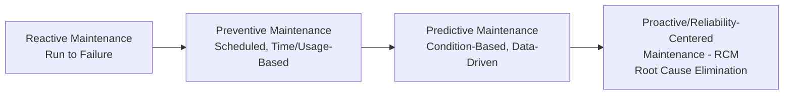
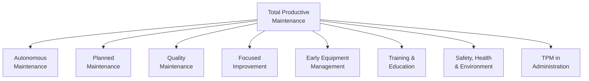
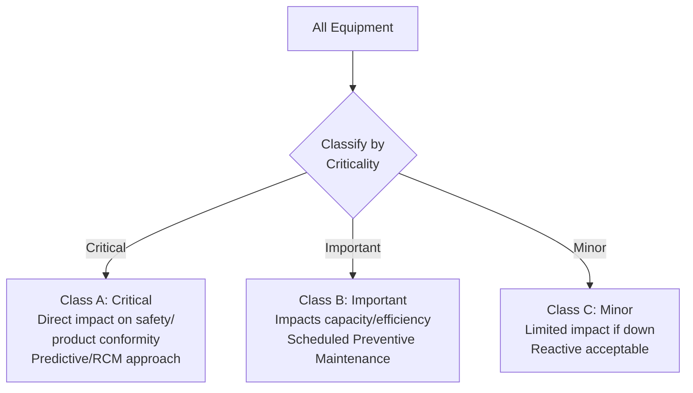
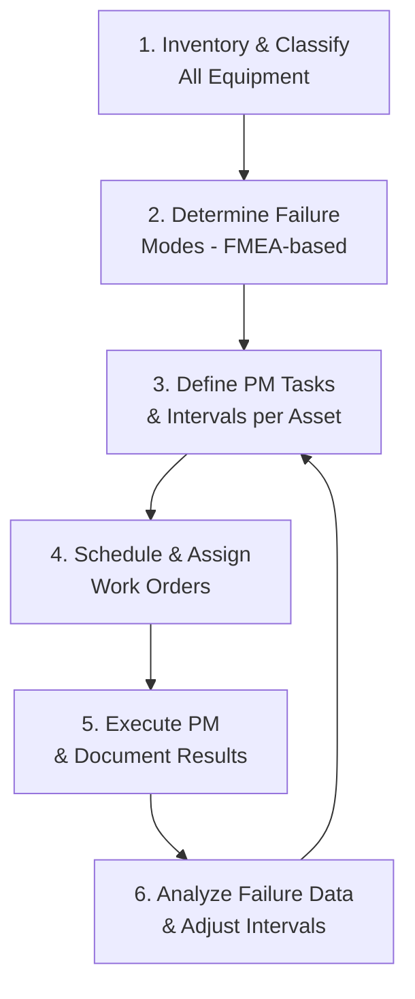

## Equipment Maintenance and Control Programs

### Definition and Purpose

Equipment Maintenance and Control Programs encompass the systematic policies, procedures, and records an organization uses to ensure that production, testing, and measuring equipment remains fit for its intended purpose throughout its operational life. This spans preventive maintenance (keeping equipment functioning reliably), calibration control (ensuring measurement accuracy — covered in depth under separate related topics), and equipment identification/status tracking, all integrated into a coordinated equipment management system.

In a QMS/ISO context, this supports:

- **ISO 9001** Clause 7.1.3 (Infrastructure) — requires the organization to determine, provide, and maintain infrastructure necessary for process operation, explicitly including equipment
- **ISO 9001** Clause 7.1.5 (Monitoring and Measuring Resources) — measuring equipment control requirements
- **ISO 9001** Clause 8.5.1(e) — requires implementation of maintenance activities as part of controlled production/service provision
- **IATF 16949** Clause 8.5.1.5 — Total Productive Maintenance (TPM), which mandates a more prescriptive, structured maintenance system for automotive suppliers
- **ISO 55001** (Asset Management) — provides broader guidance on managing physical assets across their lifecycle, applicable to comprehensive equipment control programs

### Key Points

- Equipment control programs generally distinguish between **production equipment** (tooling, machinery) and **monitoring/measuring equipment** (gauges, test instruments) — the latter carries additional calibration/traceability obligations.
- Maintenance strategy exists on a spectrum from purely **reactive** (fix when broken) to fully **predictive** (data-driven, condition-based intervention before failure) — organizational maturity typically progresses along this spectrum.
- **Unplanned equipment failure** is a common root cause of both quality nonconformities and lost productive capacity, linking equipment maintenance directly to Cost of Poor Quality.
- Every piece of equipment affecting product conformity should have a **unique identification** and a documented maintenance/calibration history traceable to it.
- ISO 9001 Clause 7.1.3 requires maintenance appropriate to the criticality of the equipment's role — not uniform treatment of all assets regardless of risk.

### Maintenance Strategy Spectrum

### Comparison of Maintenance Strategies

| Strategy | Description | Advantages | Disadvantages |
| --- | --- | --- | --- |
| Reactive (Run-to-Failure) | Equipment repaired only after failure occurs | Low planning overhead, minimal cost for non-critical assets | Unpredictable downtime, higher failure-related costs, potential safety risk |
| Preventive (PM) | Scheduled maintenance at fixed time/usage intervals regardless of actual condition | Predictable, reduces unexpected failures | May perform unnecessary maintenance; doesn't account for actual equipment condition |
| Predictive (PdM) | Maintenance triggered by actual measured condition (vibration, temperature, wear indicators) | Maintenance performed only when needed; minimizes both failure and over-maintenance | Requires investment in monitoring sensors/technology and data analysis capability |
| Reliability-Centered Maintenance (RCM) | Systematic analysis of failure modes to determine the most effective maintenance strategy per asset/failure mode | Highly optimized, risk-based approach | Resource-intensive to implement; requires FMEA-level analysis per asset |

### Total Productive Maintenance (TPM) Framework

TPM, a structured approach with particular prominence in automotive and Lean manufacturing environments (referenced explicitly in IATF 16949), organizes maintenance around eight pillars:

**Autonomous Maintenance**: Operators perform basic daily maintenance tasks (cleaning, lubrication, inspection) on their own equipment, building ownership and early defect detection — a hallmark distinguishing TPM from traditional maintenance-department-only models.

**Planned Maintenance**: Scheduled, systematic maintenance activities based on failure data and equipment criticality.

**Quality Maintenance**: Links equipment condition directly to product quality outcomes, identifying and addressing equipment-related root causes of defects.

### Overall Equipment Effectiveness (OEE)

A widely used composite metric for evaluating equipment performance, integrating availability, performance, and quality:

$$OEE = Availability \times Performance \times Quality$$

$$Availability = \frac{Operating\ Time}{Planned\ Production\ Time}$$

$$Performance = \frac{(Ideal\ Cycle\ Time \times Total\ Count)}{Operating\ Time}$$

$$Quality = \frac{Good\ Count}{Total\ Count}$$

**Worked OEE Example**:

| Component | Value |
| --- | --- |
| Planned Production Time | 480 min |
| Downtime (changeovers, breakdowns) | 60 min |
| Operating Time | 420 min |
| Ideal Cycle Time | 1.0 min/unit |
| Total Units Produced | 380 |
| Good Units | 361 |

$$Availability = \frac{420}{480} = 87.5\%$$

$$Performance = \frac{1.0 \times 380}{420} = 90.5\%$$

$$Quality = \frac{361}{380} = 95.0\%$$

$$OEE = 0.875 \times 0.905 \times 0.950 \approx 75.2\%$$

**World-class OEE** is commonly cited in Lean manufacturing literature as 85% or higher, though this benchmark varies substantially by industry and equipment type. [Inference — the 85% figure is a widely repeated industry heuristic rather than a formally standardized universal target]

### Equipment Identification and Status Control

Per ISO 9001's expectation that equipment status be determinable, organizations typically implement:

| Control Element | Purpose |
| --- | --- |
| Unique Asset ID (barcode/serial number) | Links physical equipment to maintenance/calibration history records |
| Status Labels | Visually indicate operational status: In Service, Calibration Due, Out of Service, Quarantine |
| Maintenance/Calibration Due Alerts | Automated notification (via CMMS/CMS software) before scheduled service dates |
| Equipment Master List | Centralized register of all controlled equipment, criticality classification, and responsible owner |

### Equipment Criticality Classification

Consistent with risk-based thinking (Clause 6.1), maintenance rigor should scale with the consequence of equipment failure:

### Computerized Maintenance Management Systems (CMMS)

Modern equipment control programs are typically supported by CMMS software that centralizes:

- Equipment master data and criticality classification
- Preventive maintenance scheduling and work order generation
- Maintenance history and failure/repair records
- Spare parts inventory management
- Integration with calibration management for measuring equipment
- Analytics for Mean Time Between Failures (MTBF) and Mean Time To Repair (MTTR)

$$MTBF = \frac{Total\ Operating\ Time}{Number\ of\ Failures}$$

$$MTTR = \frac{Total\ Downtime\ for\ Repairs}{Number\ of\ Repairs}$$

### Preventive Maintenance Planning Process

### Worked Example

**Scenario**: A food packaging manufacturer implements an equipment control program for its filling line equipment.

**Step 1 — Classification**: The filler nozzle assembly (direct product contact, safety-relevant) is classified Class A (Critical); the case labeling printer is classified Class B (Important, but not safety-critical); a general area exhaust fan is classified Class C (Minor).

**Step 2 — Strategy Assignment**:

- Filler nozzle: Predictive maintenance using pressure/flow sensor monitoring, plus mandatory autonomous maintenance daily inspection checklist by operators
- Label printer: Preventive maintenance every 500 operating hours (print head cleaning, sensor calibration check)
- Exhaust fan: Reactive maintenance, replaced upon failure

**Step 3 — Documentation**: Each asset assigned a unique ID in the CMMS, linked to its maintenance history, and given a visible status label.

**Step 4 — Execution and Tracking**: Filler nozzle predictive sensors flag a pressure deviation trend over 3 weeks; maintenance is scheduled proactively before failure, avoiding an unplanned line stoppage.

**Step 5 — Performance Review**: Quarterly OEE analysis of the filling line shows improvement from 71% to 79% following predictive maintenance implementation on the critical asset, with MTBF for the filler assembly increasing correspondingly.

### Linking Equipment Control to the QMS

| ISO 9001 Requirement | Equipment Program Connection |
| --- | --- |
| Clause 7.1.3 (Infrastructure) | Maintenance program ensures infrastructure remains suitable for process operation |
| Clause 7.1.5 (Monitoring/Measuring Resources) | Calibration control integrated with broader equipment status tracking |
| Clause 8.5.1(e) | Documented maintenance activities as part of controlled production |
| Clause 10.2 (Corrective Action) | Equipment failures feed root cause analysis and corrective action processes |
| Clause 9.1 (Performance Evaluation) | OEE, MTBF, MTTR data feed into performance monitoring and Management Review |

### Common Pitfalls

- Applying a uniform maintenance strategy across all equipment regardless of criticality, over-maintaining low-risk assets while under-maintaining critical ones
- No formal linkage between equipment failure records and the QMS corrective action/root cause process
- Preventive maintenance schedules set once and never revisited against actual failure data
- Missing or inconsistent equipment identification, making it difficult to verify maintenance/calibration status during an audit
- Treating autonomous maintenance (operator-level checks) as optional rather than a formal, documented, and trained responsibility
- Purely reactive maintenance on equipment whose failure has a direct, foreseeable impact on product conformity or safety

### Related Topics

- Calibration Standards and Traceability
- Fundamentals of Measurement and Metrology
- Total Productive Maintenance (TPM) Pillars
- Overall Equipment Effectiveness (OEE) Analysis
- ISO 55001 Asset Management
- Failure Mode and Effects Analysis (FMEA) for Equipment
- ISO 9001 Clause 7.1.3 — Infrastructure Requirements
- Reliability-Centered Maintenance (RCM)