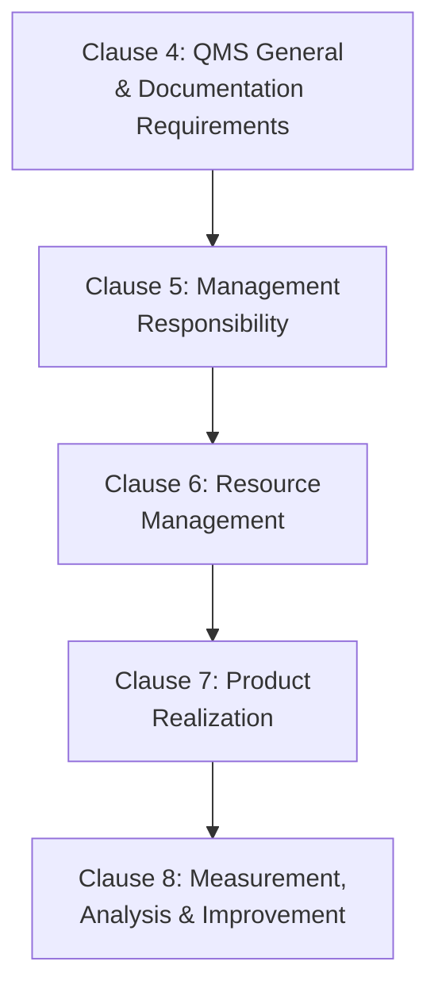
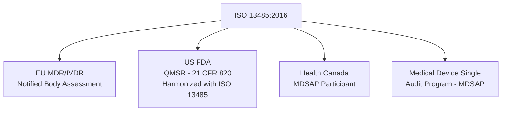

## ISO 13485 Medical Devices Quality Management

### Definition and Purpose

ISO 13485 is the international standard specifying requirements for a Quality Management System where an organization needs to demonstrate its ability to provide medical devices and related services that consistently meet customer and applicable regulatory requirements. Unlike ISO 9001, which emphasizes customer satisfaction and continual improvement broadly, ISO 13485 is structured specifically around **regulatory compliance and product safety/efficacy** as its central organizing principle throughout the device lifecycle.

In a QMS/ISO context, ISO 13485 relates to:

- **ISO 9001** — ISO 13485 was historically based on ISO 9001's structure but has deliberately diverged, particularly in the 2016 revision, to align more closely with regulatory expectations (e.g., FDA, EU MDR) rather than the general Plan-Do-Check-Act continual improvement philosophy
- **EU Medical Device Regulation (MDR) 2017/745** and **In Vitro Diagnostic Regulation (IVDR) 2017/746** — ISO 13485 certification is commonly used as supporting evidence within the EU conformity assessment process, though it does not by itself satisfy MDR/IVDR requirements
- **US FDA Quality System Regulation (QSR), 21 CFR Part 820** — the FDA has moved toward harmonizing its QSR with ISO 13485 (the FDA's Quality Management System Regulation, QMSR, effective transition aligns 21 CFR 820 with ISO 13485:2016)
- **ISO 14971** (Application of risk management to medical devices) — explicitly referenced and integrated throughout ISO 13485's risk-based requirements

### Key Points

- ISO 13485:2016 explicitly states it does **not require, and in several areas deliberately does not include, the same emphasis on continual improvement** found in ISO 9001 — instead prioritizing maintaining the effectiveness of the QMS and regulatory compliance.
- **Risk management** (per ISO 14971) is embedded as a pervasive requirement throughout the product lifecycle, not confined to a single clause.
- The standard requires organizations to identify **applicable regulatory requirements** for each market where the device will be sold, since medical device regulation varies by jurisdiction.
- **Design and development controls** are significantly more prescriptive than ISO 9001's equivalent clause, reflecting the safety-critical nature of medical devices.
- ISO 13485 can be applied by any organization in the medical device supply chain — manufacturers, but also suppliers and service providers to manufacturers.

### ISO 13485:2016 Structure Overview

### Key Structural Differences from ISO 9001

| Aspect | ISO 9001:2015 | ISO 13485:2016 |
| --- | --- | --- |
| High-Level Structure (Annex SL) | Fully aligned | Not aligned — retains older, distinct clause structure |
| Risk-Based Thinking | General requirement throughout | Formalized via mandatory ISO 14971 risk management integration |
| Continual Improvement | Central philosophy (Clause 10.3) | Present but explicitly scoped to maintaining QMS effectiveness, not open-ended improvement |
| Customer Satisfaction | Explicit, formal requirement (Clause 9.1.2) | Present but reframed around complaint handling and post-market surveillance |
| Documented Information | Flexible, risk-based | Highly prescriptive (device master records, device history records) |
| Design Controls | General requirements (Clause 8.3) | Extensively detailed design and development planning, verification, validation, transfer |
| Regulatory Requirements | General reference | Explicit, mandatory determination of applicable regulatory requirements per market |

### Clause 4: Quality Management System (General and Documentation Requirements)

Requires the organization to document its QMS processes, including specific medical device documentation:

- **Device Master Record (DMR)** or equivalent — complete manufacturing specifications for each device type
- **Medical Device File** — regulatory and technical documentation demonstrating conformity to applicable requirements
- Requirements for the QMS to address applicable regulatory requirements specific to each device classification and market

### Clause 5: Management Responsibility

Parallels ISO 9001's leadership requirements but with specific emphasis on:

- Ensuring regulatory requirements are identified and incorporated into the QMS
- Management review inputs specifically including regulatory reporting activities, post-market surveillance data, and complaint feedback

### Clause 6: Resource Management

Addresses infrastructure and work environment with particular attention to:

- **Contamination control** — critical for many device types, requiring documented arrangements to prevent product contamination
- Personnel competence requirements tied specifically to device-related process impact

### Clause 7: Product Realization (Design and Development Controls)

This is the most extensively detailed section compared to ISO 9001, structured around a formal design control framework:

**Design Verification vs. Design Validation**:

| Activity | Question Answered | Method |
| --- | --- | --- |
| Design Verification | Did the design outputs meet the design inputs? | Testing, inspection, analysis, comparison to similar designs |
| Design Validation | Does the device meet user needs and intended use? | Clinical evaluation, simulated/actual use testing, often involving representative users |

**Risk Management Integration (per ISO 14971)**: Risk analysis is required throughout design and development — not as a one-time gate, but continuously updated as design evolves, with risk-benefit analysis required for any residual risk.

$$Risk = Severity \times Probability\ of\ Occurrence$$

### Clause 7 — Purchasing and Traceability Requirements

- **Supplier evaluation** requirements are stringent, with the type/extent of control based on the risk associated with the purchased product and its effect on device conformity
- **Traceability requirements** are more extensive than typical ISO 9001 applications — for implantable devices in particular, full traceability from raw material through distribution, including patient-level traceability where applicable, is often required by associated regulation
- **Sterile device requirements**: specific control requirements for sterilization process validation, environmental conditions, and sterile barrier system integrity

### Clause 8: Measurement, Analysis, and Improvement

Distinctively structured around regulatory and post-market obligations:

| Sub-element | Requirement |
| --- | --- |
| Feedback / Complaint Handling | Formal, documented complaint handling process, often feeding regulatory reporting obligations |
| Reporting to Regulatory Authorities | Explicit requirement to report to regulatory authorities per applicable requirements (e.g., FDA Medical Device Reporting, EU vigilance system) |
| Internal Audit | Similar to ISO 9001, but audit programs must consider regulatory requirements |
| Monitoring and Measurement of Product | Requirements for verification at appropriate stages, with particular attention to acceptance activities and records |
| Control of Nonconforming Product | Detailed requirements including rework controls and documentation |
| Corrective and Preventive Action (CAPA) | Explicit requirement to evaluate need for action and document investigation, distinctly named and structured (the term "CAPA" originates largely from this standard/FDA QSR lineage) |

### Device Classification and Risk-Based Regulatory Requirements

Medical devices are typically classified by risk level (terminology and specific classes vary by jurisdiction), with regulatory scrutiny and QMS rigor scaling accordingly:

| Risk Class (General Concept) | Example Device Types | Typical Regulatory Rigor |
| --- | --- | --- |
| Low Risk | Bandages, non-invasive devices | Minimal premarket regulatory review |
| Moderate Risk | Infusion pumps, diagnostic equipment | Premarket notification/review required |
| High Risk | Implantable devices, life-sustaining equipment | Extensive premarket approval, clinical data typically required |

[Unverified — exact classification schemes, class names, and regulatory pathways differ significantly between jurisdictions (e.g., FDA Class I/II/III vs. EU MDR Class I/IIa/IIb/III) and should be verified against the specific applicable regulation for a given market]

### ISO 13485 and Regulatory Harmonization

**Medical Device Single Audit Program (MDSAP)**: A multi-jurisdictional program (involving regulators from the US, Canada, Brazil, Australia, Japan, and others) allowing a single ISO 13485-based audit to satisfy regulatory requirements across multiple participating countries simultaneously, reducing duplicate audit burden for manufacturers selling in multiple markets. [Unverified — participating jurisdictions and program scope may evolve; current MDSAP program details should be verified against the official program documentation]

### Worked Example

**Scenario**: A company develops a Class II infusion pump for markets in the US and EU.

**Design Controls**: Design inputs include clinical user needs, applicable standards (e.g., IEC 60601 electrical safety), and risk analysis outputs per ISO 14971. Design verification includes bench testing against input specifications; design validation includes simulated-use testing with representative clinical users.

**Risk Management**: A risk management file is maintained per ISO 14971 throughout development, documenting identified hazards (e.g., over-infusion due to software error), risk control measures (software interlocks, alarms), and residual risk acceptability determination.

**Traceability**: Critical components (pump mechanism, control software version) are traceable to specific lots/batches, supporting post-market investigation capability if a field issue arises.

**Regulatory Submission**: Design history file and risk management file support the FDA 510(k) submission (US) and Technical Documentation for CE marking under EU MDR (with Notified Body involvement for Class IIb devices).

**Post-Market Surveillance**: Complaint handling process captures field reports; a significant adverse event trend triggers a formal CAPA investigation and, where required, regulatory reporting (e.g., FDA MDR, EU vigilance reporting).

**Certification**: Company maintains ISO 13485 certification via an accredited certification body, potentially under MDSAP to streamline audits across US, Canadian, and other participating market requirements simultaneously.

### Common Pitfalls

- Assuming ISO 13485 certification alone satisfies all regulatory requirements for market access (e.g., EU MDR CE marking, FDA clearance) — certification supports but does not replace regulatory submissions
- Treating design verification and design validation as interchangeable rather than distinct, both-required activities
- Underestimating the extent of traceability requirements, particularly for implantable or life-sustaining devices
- Applying ISO 9001's open-ended continual improvement philosophy without recognizing ISO 13485's more constrained, regulatory-compliance-focused framing
- Inadequate integration of ISO 14971 risk management as a continuous, living process rather than a one-time design-phase exercise
- Missing or incomplete Device Master Record/Device History Record documentation, a common source of audit nonconformities

### Related Topics

- ISO 14971 — Risk Management for Medical Devices
- EU Medical Device Regulation (MDR) and IVDR
- US FDA Quality System Regulation / QMSR (21 CFR 820)
- Medical Device Single Audit Program (MDSAP)
- Design Controls: Verification vs. Validation
- Device Master Record and Device History Record
- Corrective and Preventive Action (CAPA) Systems
- Post-Market Surveillance and Vigilance Reporting