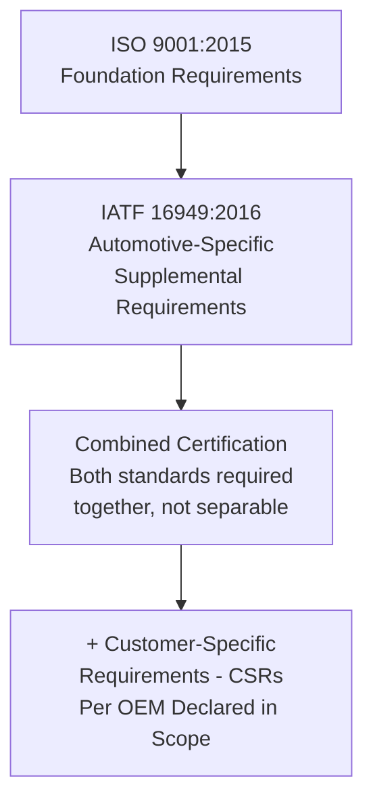
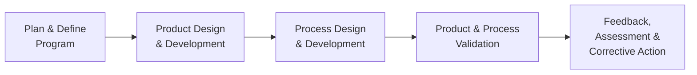
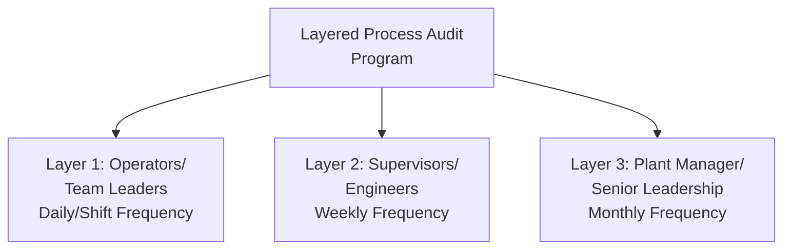
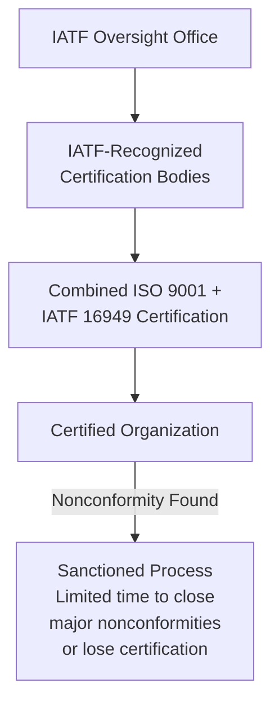

## IATF 16949 Automotive Quality Management

### Definition and Purpose

IATF 16949 is the global technical specification for automotive quality management systems, developed by the International Automotive Task Force (IATF) in conjunction with ISO. It is not a standalone standard but is designed to be implemented **in conjunction with ISO 9001**, adding automotive-industry-specific requirements on top of the ISO 9001 foundation. IATF 16949 replaced the earlier ISO/TS 16949 in 2016.

In a QMS/ISO context, IATF 16949 relates to:

- **ISO 9001:2015** — IATF 16949 cannot be implemented or certified independently; an organization must conform to both ISO 9001 and the IATF 16949 supplemental requirements together
- **Core Tools** — a set of referenced methodologies (APQP, PPAP, FMEA, MSA, SPC) published by AIAG (Automotive Industry Action Group) and, for European OEMs, VDA (Verband der Automobilindustrie)
- **Customer-Specific Requirements (CSRs)** — individual automotive OEMs (Ford, GM, Stellantis, VW, etc.) publish additional requirements that certified suppliers must also satisfy
- **IATF Sanctioned Interpretations** — official clarifications issued by the IATF that carry the same authority as the standard's text itself

### Key Points

- IATF 16949 certification is **not available as a standalone certificate** — certification bodies must issue a combined ISO 9001 + IATF 16949 certificate, and only IATF-recognized certification bodies (oversight body) may issue it.
- The standard mandates the use of specific **Core Tools** (APQP, PPAP, FMEA, MSA, SPC) rather than leaving methodology selection to the organization's discretion, unlike ISO 9001's more flexible approach.
- **Customer-Specific Requirements (CSRs)** are formally incorporated into the certification scope — an organization is only certified as satisfying the specific CSRs of the customers/OEMs it declares.
- The standard places significant emphasis on **defect prevention**, reduction of variation, and waste in the automotive supply chain, reflecting the high-volume, safety-critical nature of automotive manufacturing.
- **Product safety** requirements were substantially strengthened compared to the predecessor ISO/TS 16949, including specific requirements for safety-critical characteristics and traceability.

### Relationship Between ISO 9001 and IATF 16949

### Core Tools Overview

The five AIAG/VDA "Core Tools" are mandated methodologies referenced throughout IATF 16949's requirements:

| Core Tool | Purpose | Applied In |
| --- | --- | --- |
| APQP (Advanced Product Quality Planning) | Structured framework for new product development, ensuring quality is planned in from the start | Design and development phase |
| PPAP (Production Part Approval Process) | Formal process for supplier submission and customer approval of production parts before full production | Production approval gate |
| FMEA (Failure Mode and Effects Analysis) | Systematic risk analysis of potential failure modes, both Design FMEA and Process FMEA | Design and process planning |
| MSA (Measurement Systems Analysis) | Statistical evaluation of measurement system variation (Gage R&R) | Measurement validation |
| SPC (Statistical Process Control) | Ongoing statistical monitoring of process stability and capability | Production process control |

### APQP (Advanced Product Quality Planning) Phases

### PPAP — Production Part Approval Process

PPAP requires suppliers to submit evidence across defined elements (commonly referenced as up to 18 elements) demonstrating the production process is capable of consistently producing parts meeting customer requirements before full production begins.

**Common PPAP Elements**:

- Design records and engineering change documents
- Design FMEA and Process FMEA
- Process flow diagram
- Control plan
- Measurement System Analysis studies
- Dimensional results
- Material and performance test results
- Initial process capability studies ($C_{pk}$)
- Sample production parts
- Part Submission Warrant (PSW) — the formal summary/approval document

**PPAP Submission Levels** (typical AIAG framework):

| Level | Submission Content |
| --- | --- |
| Level 1 | PSW only, submitted to customer |
| Level 2 | PSW with product samples and limited supporting data |
| Level 3 | PSW with product samples and complete supporting data (most common default level) |
| Level 4 | PSW and other requirements as defined by customer |
| Level 5 | PSW with samples and complete data available for review at supplier's facility |

### Key Additional Requirements in IATF 16949 vs. ISO 9001

| Requirement Area | IATF 16949 Addition |
| --- | --- |
| Product Safety | Formal process for identifying safety-related characteristics, controlling them through the product lifecycle, and specific documentation/traceability requirements |
| Embedded Software | Requirements for software development process capability where the product includes embedded software |
| Manufacturing Feasibility | Multidisciplinary review of feasibility during design/quoting phase |
| Contingency Planning | Formal business continuity/contingency plans for utility interruption, labor disputes, key equipment failure, and supply chain disruption |
| Second-Party Audits | Explicit requirements for auditing suppliers (risk-based, using VDA 6.3 or equivalent process audit methodology) |
| Warranty Management | Requirements for warranty analysis and, where applicable, No Trouble Found (NTF) analysis |
| Layered Process Audits (LPA) | Multi-level, multi-frequency audits of production processes conducted by different levels of management |
| Total Productive Maintenance (TPM) | More prescriptive maintenance program requirements than ISO 9001's general infrastructure clause |
| Control Plans | Formal, structured control plan documentation for each phase (prototype, pre-launch, production) |

### Control Plan Structure

A Control Plan is a living document summarizing the controls (both process and product) used to ensure consistent process output — a distinctively automotive-industry-formalized document:

| Control Plan Element | Description |
| --- | --- |
| Process Step | Specific operation being controlled |
| Characteristic | Product/process characteristic being monitored |
| Special Characteristic Designation | Flags safety or key characteristics requiring heightened control |
| Specification/Tolerance | Acceptance criteria |
| Measurement Method | How the characteristic is measured |
| Sample Size/Frequency | Sampling plan for the control |
| Control Method | SPC chart, checklist, error-proofing device |
| Reaction Plan | Documented response if the characteristic is out of control/specification |

### Layered Process Audit (LPA) Concept

LPAs verify that critical process controls (identified as high-risk for defect escape) are being followed consistently, with different organizational levels auditing at different frequencies — creating multiple, overlapping layers of verification for the highest-risk process steps.

### Certification and Oversight Structure

A distinguishing feature of IATF 16949 certification is its stricter, more time-bound nonconformity resolution process compared to typical ISO 9001 certification cycles — major nonconformities generally carry defined, relatively short closure timeframes, with potential certificate suspension for failure to resolve within the allotted period. [Unverified — specific timeframes and sanctioning rules are governed by current IATF rules documentation and should be verified against the official published rules for precise figures]

### Worked Example

**Scenario**: A Tier 1 automotive supplier is developing a new braking system bracket for an OEM customer.

**APQP Phase 1–2**: Cross-functional team develops the design, conducting a Design FMEA identifying potential failure modes (e.g., fatigue cracking under cyclic load) and assigning Risk Priority Numbers to prioritize design mitigations.

**APQP Phase 3**: Process FMEA and Control Plan developed for the manufacturing process (stamping, welding); safety-critical dimensional characteristics identified and flagged as "Special Characteristics" per customer symbol conventions.

**MSA**: Gage R&R study conducted on the coordinate measuring machine (CMM) used to verify critical dimensions, confirming %GRR under 10% before production capability studies begin.

**Initial Process Capability**: $C_{pk}$ studies conducted on safety-critical dimensions during a significant production run, targeting $C_{pk} \geq 1.67$ for the special characteristic (a common automotive-sector target, though specific requirements vary by customer).

**PPAP Submission**: Level 3 PPAP package submitted to the OEM, including PSW, FMEA documents, control plan, capability data, and sample parts; OEM reviews and issues formal production approval.

**Ongoing Production**: SPC charts monitor the special characteristic continuously; Layered Process Audits verify operators are following the control plan's reaction plan procedures; any customer complaint triggers an 8D corrective action process per customer requirements.

### IATF 16949 Problem-Solving Methodology: 8D

While not exclusive to IATF 16949, the **8-Discipline (8D)** problem-solving methodology is the dominant corrective action framework expected across the automotive supply chain:

| Discipline | Activity |
| --- | --- |
| D1 | Establish the team |
| D2 | Describe the problem |
| D3 | Implement and verify interim containment actions |
| D4 | Define and verify root cause(s) |
| D5 | Choose and verify permanent corrective actions |
| D6 | Implement and validate permanent corrective actions |
| D7 | Prevent recurrence (systemic/broader application) |
| D8 | Recognize team and close out |

### Common Pitfalls

- Attempting to pursue IATF 16949 certification as a standalone effort without a fully conformant ISO 9001 system underneath it
- Treating Core Tools (APQP, PPAP, FMEA, MSA, SPC) as optional or informal, when IATF 16949 requires their formal, documented application
- Failing to track and satisfy customer-specific requirements (CSRs) for each OEM customer declared within certification scope
- Inadequate identification and control of safety-related/special characteristics throughout the product lifecycle
- Layered Process Audits performed inconsistently or treated as a paperwork exercise rather than genuine verification of control plan adherence
- Underestimating the more stringent, time-bound nonconformity closure requirements compared to standard ISO 9001 certification maintenance

### Related Topics

- ISO 9001 Quality Management System Requirements
- Advanced Product Quality Planning (APQP)
- Production Part Approval Process (PPAP)
- Failure Mode and Effects Analysis (FMEA) — Design and Process
- Measurement System Analysis and Gage R&R
- Statistical Process Control (SPC)
- VDA 6.3 Process Auditing
- 8D Problem-Solving Methodology
- Layered Process Audits (LPA)