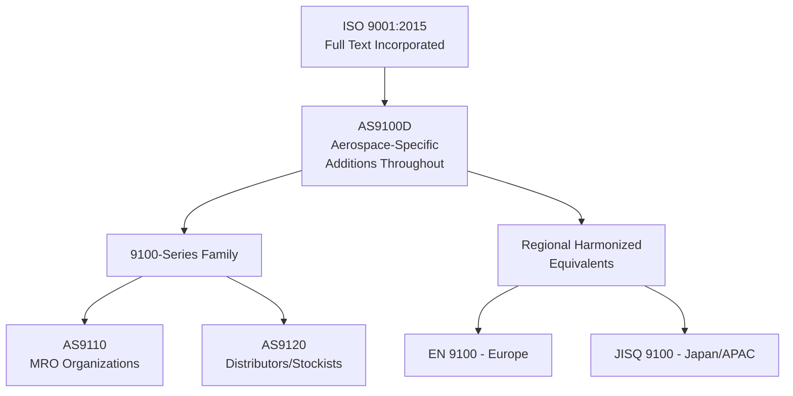
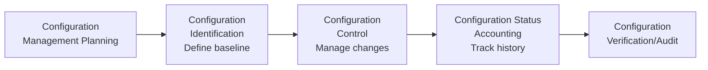
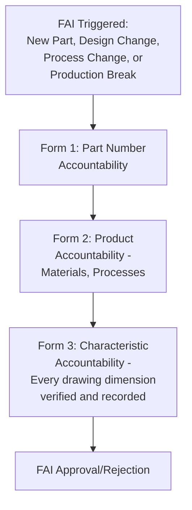
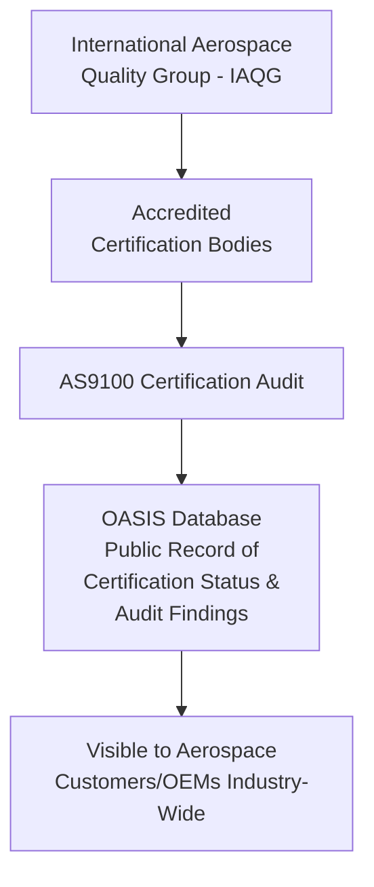

## AS9100 Aerospace Quality Management

### Definition and Purpose

AS9100 is the quality management system standard for the aerospace, aviation, and defense industry, developed and maintained by the International Aerospace Quality Group (IAQG). Like IATF 16949 for automotive, AS9100 is built on the **ISO 9001 foundation** with substantial sector-specific additions addressing the extreme safety, reliability, traceability, and regulatory demands unique to aerospace products — where failure consequences can be catastrophic and product lifecycles span decades.

In a QMS/ISO context, AS9100 relates to:

- **ISO 9001:2015** — AS9100 incorporates the complete ISO 9001 text verbatim, with aerospace-specific additions inserted throughout (denoted in the standard) rather than issued as a wholly separate document
- **AS9110** — the parallel standard for aviation maintenance, repair, and overhaul (MRO) organizations
- **AS9120** — the parallel standard for aerospace distributors/stockists (non-manufacturing)
- **IAQG 9100-Series** — the family of standards, with region-specific numbering (AS9100 in the Americas, EN 9100 in Europe, JISQ 9100 in Japan) that are technically harmonized and mutually recognized
- **OASIS Database** (Online Aerospace Supplier Information System) — the IAQG-managed database of certified organizations and audit results, unique to this sector's certification oversight model

### Key Points

- AS9100 certificates are **not interchangeable regional variants in substance** — AS9100 (Americas), EN 9100 (Europe), and JISQ 9100 (Asia-Pacific) are harmonized to be technically equivalent, allowing mutual recognition across regions.
- **Configuration management** is a formal, mandated requirement — reflecting aerospace products' need for precise control over design changes across long product lifecycles and multiple part revisions.
- **Traceability and counterfeit parts prevention** receive significant emphasis, addressing the aerospace industry's particular vulnerability to counterfeit electronic and mechanical components entering the supply chain.
- The standard requires **risk management** to be applied not just to product/process risk but explicitly to project and program-level risk given aerospace's long development cycles and high stakes.
- Certification audit results are recorded in the **OASIS database**, providing customers across the industry visibility into a supplier's certification status and audit history — a distinctive industry-wide transparency mechanism.

### Relationship Between ISO 9001 and AS9100

### Key Additional Requirements in AS9100 vs. ISO 9001

| Requirement Area | AS9100 Addition |
| --- | --- |
| Configuration Management | Formal process for controlling product configuration/design baseline throughout the lifecycle, including change identification, control, status accounting, and verification |
| Risk Management | Explicit requirement to apply risk management to product realization processes, project execution, and organizational risk |
| Product Safety | Explicit process for addressing product safety throughout the product lifecycle |
| Prevention of Counterfeit Parts | Dedicated requirements to prevent the use of counterfeit or suspect unapproved parts, including personnel awareness and detection methods |
| Special Requirements, Critical Items, Key Characteristics | Formal identification and control system for characteristics with the highest impact on safety, performance, or fit |
| First Article Inspection (FAI) | Formal, structured requirement (often per AS9102) for verifying a representative first unit conforms fully to design requirements before production continues |
| Control of Work Transfer | Requirements for controlling the transfer of work between organizational facilities or to another organization |
| Awareness of Ethical Behavior | Explicit requirement for personnel awareness regarding contribution to product/service conformity and ethical behavior |
| Human Factors | Consideration of human factors in nonconformity management (relevant to industries with significant manual inspection/assembly) |

### Configuration Management

A defining, formally mandated element distinguishing AS9100 from ISO 9001's more general document control requirements:

**Purpose**: Ensures that the exact design configuration of a part or assembly is known, controlled, and traceable at any point in its lifecycle — critical for aerospace products that may remain in service for decades and require precise identification of which design revision is installed on which specific aircraft.

### Critical Items, Key Characteristics, and Special Requirements

| Term | Definition |
| --- | --- |
| Special Requirements | Requirements with high risk of not being met, requiring their inclusion in risk assessment activities |
| Critical Items | Items (parts, materials, processes) having significant effect on product realization/use, including safety, performance, fit, form, function, producibility, or service life; requires specific actions to prevent nonconformity |
| Key Characteristics | Product characteristics or process parameters selected because variation has a significant influence on product fit, performance, service life, or manufacturability |

These designations, typically flowed down from the customer or the organization's own risk analysis, trigger heightened control requirements (increased inspection frequency, SPC, more rigorous documentation) similar in spirit to automotive "special characteristics" but formalized under aerospace-specific terminology.

### First Article Inspection (FAI) — AS9102

AS9100 formally requires FAI, typically executed per the **AS9102** standard, which specifies the structured format and content:

**FAI Triggers** (per typical AS9102 practice):

- First production of a new part number
- A break in production (typically defined as exceeding a specified time period without production)
- Any change to design, materials, manufacturing process/location, or tooling that could affect fit, form, or function
- Change of manufacturing source

### Prevention of Counterfeit Parts

A requirement area with particular prominence in aerospace, given the sector's documented vulnerability to counterfeit electronic components entering long, complex supply chains:

**Common control elements**:

- Purchasing controls favoring authorized/franchised distributors and Original Component Manufacturers (OCMs)
- Personnel training on counterfeit part detection methods
- Incoming inspection/testing protocols specifically designed to detect counterfeit indicators
- Reporting mechanisms (e.g., to industry databases such as GIDEP — Government-Industry Data Exchange Program — in applicable contexts)
- Traceability documentation requirements for the supply chain pedigree of purchased parts

### The OASIS Database and Certification Oversight

Unlike many other management system standards where certification results remain largely private between the certified organization, the certification body, and the accreditation body, AS9100 certification results (including nonconformities and certification status) are recorded in the industry-managed **OASIS database**, providing transparency across the aerospace supply chain — a distinctive oversight mechanism reflecting the industry's collaborative approach to supply chain quality assurance. [Unverified — the specific scope of data publicly vs. restrictively accessible within OASIS, and current program administration details, should be confirmed against current IAQG documentation]

### AS9100 Family Standards Comparison

| Standard | Scope |
| --- | --- |
| AS9100 | Design, development, production, installation, and servicing organizations |
| AS9110 | Maintenance, repair, and overhaul (MRO) organizations for civil/military aircraft |
| AS9120 | Distributors/stockists — organizations that purchase and resell aerospace parts without design/manufacturing activity |
| AS9101 | Audit criteria and methodology used by certification bodies to audit against the 9100-series standards |
| AS9102 | First Article Inspection requirements and reporting format |
| AS9103 | Variation management of key characteristics |
| AS9145 | Advanced Product Quality Planning (APQP) and Production Part Approval Process (PPAP) for aerospace |

### Worked Example

**Scenario**: A Tier 2 aerospace supplier manufactures a machined titanium bracket for a commercial aircraft structural application.

**Risk Management**: Given the structural/safety-critical application, the part is designated with **Key Characteristics** on critical dimensions affecting fatigue life, flowed down from the customer's engineering drawing.

**Configuration Management**: The part's design baseline is controlled under formal configuration management; any engineering change request triggers a documented configuration control process before production of the new revision begins.

**Process Planning**: A Process FMEA identifies potential failure modes in the machining process; special process (heat treatment) is outsourced to a NADCAP-accredited provider, satisfying AS9100's externally provided process control requirements for special processes.

**First Article Inspection**: Per AS9102, a full FAI is conducted on the first production unit of the new revision, verifying and recording every characteristic on the engineering drawing against the AS9102 Form 1/2/3 structure.

**Counterfeit Parts Prevention**: Raw titanium material is purchased only from an approved, traceable source with full material certification; incoming inspection verifies material certification pedigree before release to production.

**Certification Oversight**: The supplier's AS9100 certification status, including any open major/minor nonconformities from the most recent surveillance audit, is visible in the OASIS database to the customer's supply chain quality organization.

### Common Pitfalls

- Treating configuration management as equivalent to standard ISO 9001 document control, missing the more rigorous change control and status accounting requirements
- Inadequate or informal First Article Inspection process, missing required re-triggers after production breaks or process changes
- Insufficient counterfeit parts prevention controls, particularly for electronic components sourced through non-franchised distributors
- Failing to formally designate and control Key Characteristics/Critical Items despite their presence on customer drawings
- Assuming regional 9100-series certificates (AS9100, EN 9100, JISQ 9100) require separate, redundant certification efforts rather than recognizing their harmonized equivalence
- Overlooking special process accreditation requirements (e.g., NADCAP) when outsourcing critical processes like heat treating, plating, welding, or non-destructive testing

### Related Topics

- ISO 9001 Quality Management System Requirements
- First Article Inspection (AS9102)
- Configuration Management Principles
- NADCAP Special Process Accreditation
- Managing Externally Provided Processes and Outsourcing Risk
- Advanced Product Quality Planning (APQP) for Aerospace (AS9145)
- Counterfeit Parts Prevention Programs
- Failure Mode and Effects Analysis (FMEA)