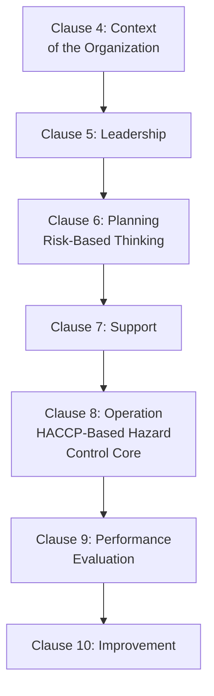
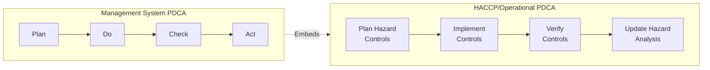
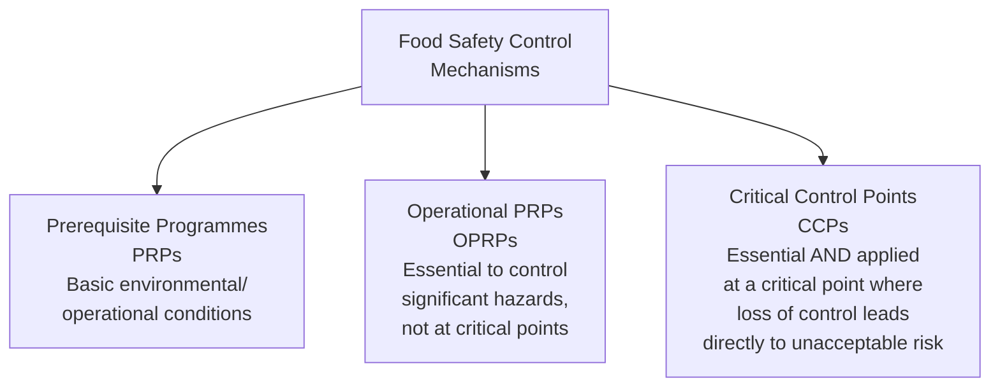
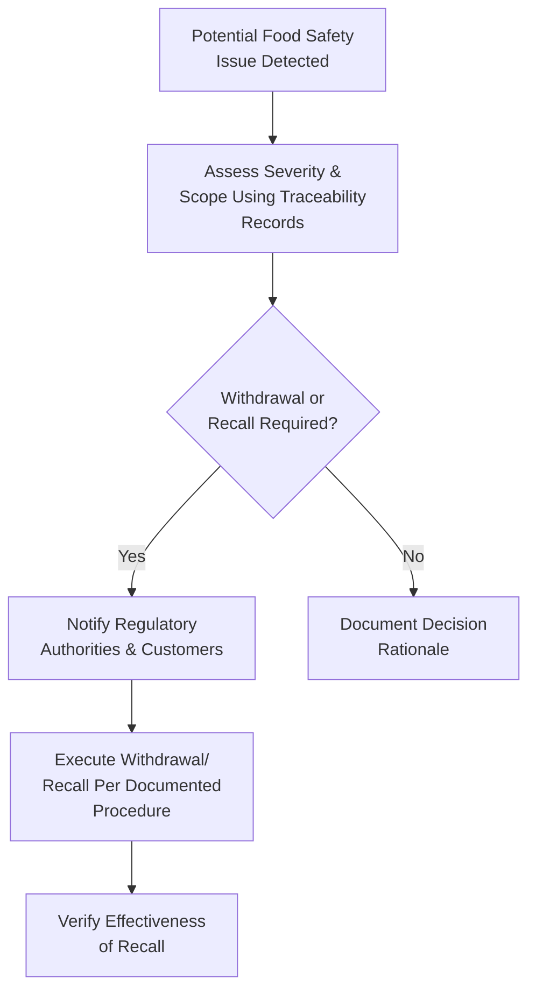

## ISO 22000 Food Safety Management Systems

### Definition and Purpose

ISO 22000 is the international standard specifying requirements for a Food Safety Management System (FSMS), applicable to any organization in the food chain — from primary producers and feed producers through processors, transporters, storage operators, retailers, and food service organizations, as well as related organizations such as packaging manufacturers and equipment suppliers. It combines the general management system approach shared with ISO 9001 with the technical food safety methodology of **HACCP (Hazard Analysis and Critical Control Points)**.

In a QMS/ISO context, ISO 22000 relates to:

- **ISO 9001** — ISO 22000:2018 adopts the same Annex SL High-Level Structure as ISO 9001:2015, enabling more straightforward integration for organizations pursuing both certifications
- **Codex Alimentarius HACCP Principles** — the internationally recognized food safety risk-management methodology developed by the joint FAO/WHO Codex Alimentarius Commission, formally integrated into ISO 22000's technical requirements
- **ISO/TS 22002 series** — Prerequisite Programme (PRP) technical specifications for specific sectors (e.g., ISO/TS 22002-1 for food manufacturing)
- **FSSC 22000 (Food Safety System Certification)** — a GFSI-recognized certification scheme built on ISO 22000 plus the relevant ISO/TS 22002 PRP standard plus additional FSSC requirements
- **GFSI (Global Food Safety Initiative)** — a benchmarking body that recognizes certain food safety certification schemes (including FSSC 22000, but not ISO 22000 alone) as meeting its benchmark requirements for retailer/buyer acceptance

### Key Points

- ISO 22000 alone is **not GFSI-recognized** — many major retailers and food buyers require GFSI-recognized certification, which for ISO 22000-based systems means certifying to **FSSC 22000** (ISO 22000 + sector PRP + additional requirements), not ISO 22000 in isolation. [Unverified — GFSI recognition status of specific schemes can change; current GFSI benchmarking documents should be consulted for the latest recognized scheme list]
- The standard's core food safety methodology is built on **HACCP's seven principles**, formally embedded within the ISO 22000 clause structure.
- ISO 22000 distinguishes between **Prerequisite Programmes (PRPs)**, **Operational PRPs (OPRPs)**, and **Critical Control Points (CCPs)** — three distinct control mechanism types with different levels of rigor.
- Since the 2018 revision, ISO 22000 follows the **Annex SL High-Level Structure**, incorporating explicit risk-based thinking (Clause 6.1) parallel to ISO 9001's approach, in addition to the food-safety-specific hazard analysis methodology.
- The standard requires a formal **Plan-Do-Check-Act cycle applied at two levels**: the overall management system level, and the operational/hazard-control level (embedded within the HACCP-based process).

### ISO 22000:2018 Structure (Annex SL Aligned)

### The Dual PDCA Concept

A distinctive structural feature of ISO 22000 is its **two interacting PDCA cycles**:

The outer cycle governs the overall management system (context, leadership, planning, support, performance evaluation, improvement), while the inner cycle governs the specific technical hazard analysis and control process (Clause 8) — reflecting that food safety requires both organizational governance and detailed technical control.

### HACCP's Seven Principles (Embedded in Clause 8)

| Principle | Description |
| --- | --- |
| 1. Conduct Hazard Analysis | Identify biological, chemical, and physical hazards at each process step |
| 2. Determine Critical Control Points (CCPs) | Identify points where control is essential to prevent/eliminate/reduce a hazard to an acceptable level |
| 3. Establish Critical Limits | Define measurable criteria (e.g., temperature, time, pH) that must be met at each CCP |
| 4. Establish Monitoring Procedures | Define how each CCP will be monitored to ensure critical limits are met |
| 5. Establish Corrective Actions | Define actions to take when monitoring indicates a CCP is not under control |
| 6. Establish Verification Procedures | Confirm the HACCP system is working as intended |
| 7. Establish Record-Keeping and Documentation | Maintain documented evidence of the system's operation |

### Prerequisite Programmes (PRPs), Operational PRPs (OPRPs), and CCPs

| Control Type | Definition | Example |
| --- | --- | --- |
| PRP (Prerequisite Programme) | Basic conditions and activities necessary to maintain a hygienic environment throughout the food chain, suitable for production, handling, and provision of safe products | Pest control, cleaning/sanitation, personnel hygiene, facility design |
| OPRP (Operational PRP) | A PRP identified as essential to control the likelihood of introducing food safety hazards or contamination/proliferation, applied to manage significant hazards but not at a point meeting the strict CCP definition | Metal detection at a non-critical point, specific supplier control measures |
| CCP (Critical Control Point) | A step at which control is essential and application of critical limits distinguishes acceptable from unacceptable levels for that specific hazard | Cooking temperature/time for pathogen elimination, pasteurization parameters |

**Determining whether a control point is a CCP or OPRP** typically uses a structured decision tree analysis, examining whether the hazard can be controlled at that step, whether the step is specifically designed to eliminate/reduce the hazard, and whether subsequent steps can control it if this one fails.

### Clause 8: Operation — Core Technical Requirements

#### 8.2 Prerequisite Programmes (PRPs)

Organizations must establish, implement, and maintain PRPs appropriate to their needs, commonly based on relevant **ISO/TS 22002 series** sector-specific documents.

#### 8.3 Traceability System

A traceability system must be established enabling identification of product lots and their relation to raw material batches, processing/delivery records — essential for effective recall management.

#### 8.4 Emergency Preparedness and Response

Requires documented procedures for managing potential emergency situations and incidents that can impact food safety (e.g., recalls, contamination incidents).

#### 8.5 Hazard Control

The technical core: hazard analysis, establishing the hazard control plan (PRPs, OPRPs, CCPs), and their monitoring/verification — the formalized HACCP application described above.

#### 8.6 Updating Information

Requires updating PRP and hazard control plan information when changes occur (new products, process changes, new hazard information).

#### 8.7 Control of Monitoring and Measuring

Parallel to ISO 9001's measurement resource control requirements, but specifically applied to food safety-critical monitoring equipment.

#### 8.9 Control of Product/Process Nonconformity

Includes specific requirements for handling potentially unsafe products, including **withdrawal and recall** procedures — a food-safety-specific extension beyond general nonconforming product control.

### Traceability and Recall Management

### ISO 22000 vs. FSSC 22000

| Aspect | ISO 22000 Alone | FSSC 22000 |
| --- | --- | --- |
| Base Standard | ISO 22000 | ISO 22000 |
| Prerequisite Programme | Organization determines PRPs, may reference ISO/TS 22002 series | Mandatory use of applicable ISO/TS 22002 sector-specific PRP standard |
| Additional Requirements | None beyond ISO 22000 itself | FSSC-specific additional requirements (food fraud, food defense, allergen management, etc.) |
| GFSI Recognition | Not GFSI-recognized alone | GFSI-recognized scheme |
| Typical Use Case | Organizations without GFSI buyer requirements, or as an internal FSMS foundation | Organizations supplying GFSI-requiring retailers/buyers (common in export-oriented food manufacturing) |

### ISO/TS 22002 Series — Sector-Specific PRPs

| Standard | Sector |
| --- | --- |
| ISO/TS 22002-1 | Food manufacturing |
| ISO/TS 22002-2 | Catering |
| ISO/TS 22002-3 | Farming |
| ISO/TS 22002-4 | Food packaging manufacturing |
| ISO/TS 22002-5 | Transport and storage |
| ISO/TS 22002-6 | Feed and animal food production |

### Worked Example

**Scenario**: A ready-to-eat sandwich manufacturer implements ISO 22000 (pursuing FSSC 22000 certification for retail customer requirements).

**Hazard Analysis**: Cross-functional food safety team conducts hazard analysis across the process flow (receiving, storage, assembly, packaging, distribution), identifying biological hazard (Listeria monocytogenes) as significant at the assembly and cold-chain storage steps.

**Control Point Determination**: Cold storage temperature control is determined to be a **CCP** (critical limit: ≤4°C, continuous monitoring, immediate corrective action if exceeded) since it is the specific point designed to control pathogen growth and no subsequent step will eliminate the hazard. Metal detection at packaging is determined to be an **OPRP** — important but not meeting the strict definitional criteria of a CCP for this particular hazard profile.

**PRPs Established**: Based on ISO/TS 22002-1, PRPs cover facility hygienic design, cleaning and sanitation schedules, pest control, personnel hygiene training, and supplier approval.

**Monitoring and Verification**: Continuous temperature data logging at the CCP with automated alarms; daily verification review of logged data by the food safety team; periodic environmental swabbing to verify overall control effectiveness.

**Traceability**: Lot coding system links each finished product batch back to specific raw material lots and production shift, supporting rapid, scoped recall capability if needed.

**Emergency Preparedness**: A documented recall procedure is tested annually via a mock recall exercise, verifying the traceability system can identify and account for 100% of an affected lot within a defined target timeframe.

### Common Pitfalls

- Confusing CCPs, OPRPs, and PRPs — misclassifying a genuine CCP as an OPRP (or vice versa) undermines the rigor of the control applied
- Pursuing ISO 22000 certification alone when customer/retailer requirements actually mandate a GFSI-recognized scheme (FSSC 22000), causing a mismatch between certification held and market requirements
- Treating PRPs as a one-time setup rather than an ongoing, monitored, and periodically verified program
- Inadequate or untested traceability/recall procedures, discovered to be insufficient only during an actual incident
- Hazard analysis not updated following process, formulation, supplier, or facility changes
- Underestimating the technical rigor required for CCP critical limit validation (demonstrating the limit actually controls the hazard, not just assuming it)

### Related Topics

- HACCP (Hazard Analysis and Critical Control Points) Principles
- FSSC 22000 and GFSI-Recognized Certification Schemes
- ISO/TS 22002 Series Prerequisite Programmes
- Traceability and Recall Management Systems
- Risk-Based Thinking (ISO 9001 Clause 6.1 Parallel)
- Food Fraud and Food Defense Programs
- Allergen Management Systems
- Codex Alimentarius Food Safety Standards