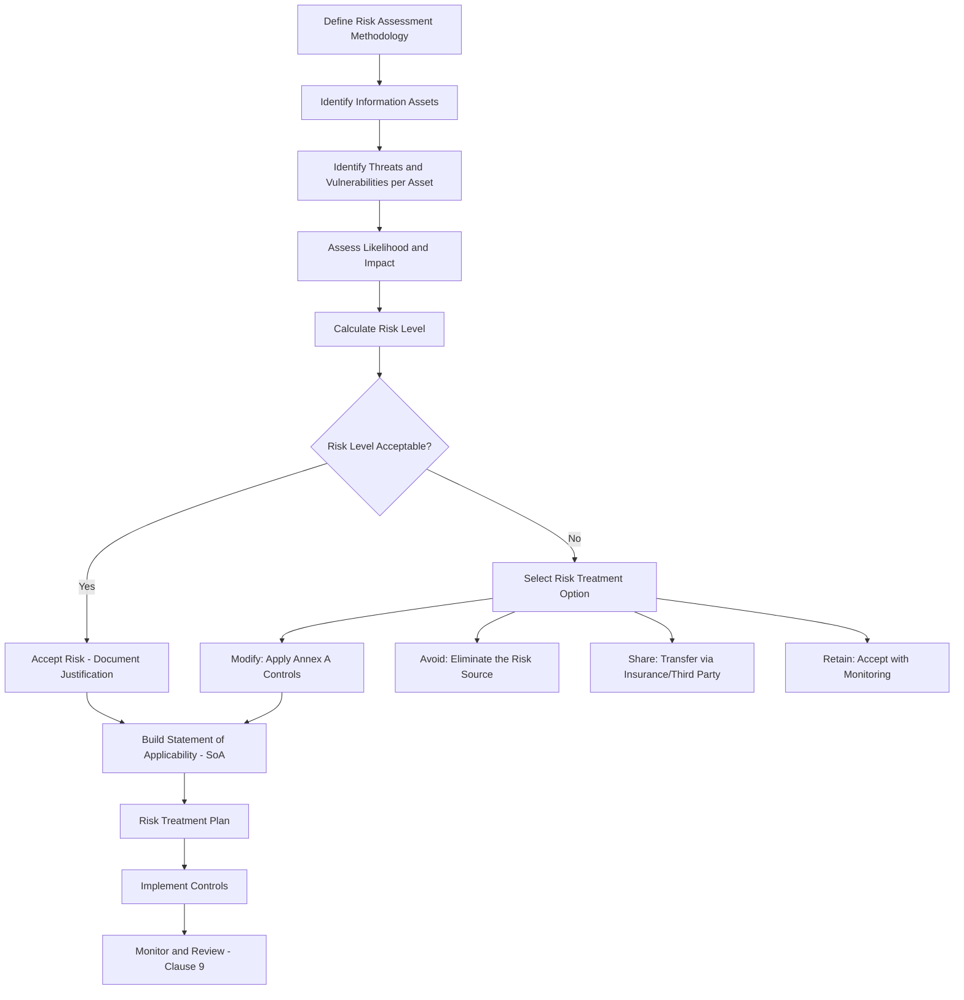
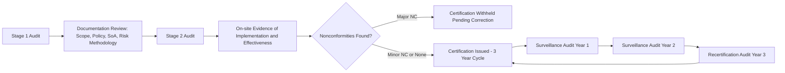

## ISO IEC 27001 Information Security Management

### Overview

ISO/IEC 27001 is the international standard specifying requirements for establishing, implementing, maintaining, and continually improving an Information Security Management System (ISMS). It follows the same Annex SL high-level structure shared by ISO 9001, ISO 14001, and other management system standards, enabling integration into a unified management system. The current edition is ISO/IEC 27001:2022, which updated the Annex A control set to align with ISO/IEC 27002:2022.

### High-Level Structure (HLS) Alignment

Because ISO/IEC 27001 uses Annex SL, its clause structure mirrors ISO 9001's core management system requirements:

| Clause | Title | Parallel in ISO 9001 |
| --- | --- | --- |
| 4 | Context of the Organization | Clause 4 |
| 5 | Leadership | Clause 5 |
| 6 | Planning | Clause 6 |
| 7 | Support | Clause 7 |
| 8 | Operation | Clause 8 |
| 9 | Performance Evaluation | Clause 9 |
| 10 | Improvement | Clause 10 |

**Key Points**

- Organizations with an existing ISO 9001 QMS can leverage shared processes (document control, internal audit, management review, corrective action) as a foundation for ISMS implementation
- ISO/IEC 27001 clauses 4–10 are mandatory requirements (auditable for certification); Annex A is a reference control set

### Core ISMS Requirements (Clauses 4-10)

#### Clause 4: Context of the Organization

- Determine internal/external issues relevant to information security
- Identify interested parties and their information security requirements
- Define the ISMS scope (documented, considering interfaces and dependencies)

#### Clause 5: Leadership

- Top management commitment and information security policy
- Definition of roles, responsibilities, and authorities for information security

#### Clause 6: Planning

- **Risk assessment and risk treatment** (the core mechanism of ISO 27001)
- Information security objectives and planning to achieve them
- Statement of Applicability (SoA) — a mandatory document justifying inclusion/exclusion of each Annex A control

#### Clause 7: Support

- Resources, competence, awareness, communication
- Documented information control (policies, procedures, records)

#### Clause 8: Operation

- Operational planning and control
- Risk assessment execution and risk treatment plan implementation

#### Clause 9: Performance Evaluation

- Monitoring, measurement, analysis, and evaluation
- Internal audit
- Management review

#### Clause 10: Improvement

- Nonconformity and corrective action
- Continual improvement

### The Risk Assessment and Treatment Process

This is the central mechanism distinguishing ISO 27001 from other management system standards — controls are not prescribed universally but selected based on organizational risk context.

#### Risk Calculation Model

A common quantitative/semi-quantitative approach:

$$\text{Risk} = \text{Likelihood} \times \text{Impact}$$

Where Likelihood and Impact are typically scored on ordinal scales (e.g., 1–5), producing a risk matrix. [Inference] The specific scale and matrix thresholds are not prescribed by the standard itself — organizations define their own methodology under Clause 6.1.2, so exact scoring conventions vary by organization and risk framework (e.g., ISO 31000, NIST SP 800-30 alignment).

### Annex A Control Structure (ISO/IEC 27001:2022)

The 2022 revision reorganized controls from 114 controls across 14 domains (2013 edition) into **93 controls across 4 themes**:

| Theme | Control Count | Focus Area |
| --- | --- | --- |
| A.5 Organizational | 37 | Policies, roles, supplier relationships, incident management, business continuity |
| A.6 People | 8 | Screening, terms of employment, awareness/training, disciplinary process |
| A.7 Physical | 14 | Physical security perimeters, equipment, secure disposal, clear desk/screen |
| A.8 Technological | 34 | Access control, cryptography, malware protection, logging, secure development |

**Key Points**

- 11 new controls were introduced in the 2022 revision, including Threat Intelligence (A.5.7), Cloud Services Security (A.5.23), ICT Readiness for Business Continuity (A.5.30), Data Masking (A.8.11), Data Leakage Prevention (A.8.12), Monitoring Activities (A.8.16), Web Filtering (A.8.23), and Secure Coding (A.8.28)
- Controls in Annex A are **not mandatory in full** — the Statement of Applicability (SoA) documents which controls are applied, which are excluded, and the justification for each decision based on risk treatment outcomes
- ISO/IEC 27002:2022 provides implementation guidance for each Annex A control (it is a guidance standard, not certifiable on its own)

### Statement of Applicability (SoA) — Example Structure

| Control Ref | Control Name | Applicable? | Justification | Implementation Status |
| --- | --- | --- | --- | --- |
| A.5.7 | Threat Intelligence | Yes | Risk assessment identified external threat exposure via public-facing services | Implemented — subscribed to CERT feed |
| A.6.3 | Information Security Awareness, Education and Training | Yes | Mandatory per risk treatment plan; addresses human-error risk | In progress — annual training scheduled |
| A.7.4 | Physical Security Monitoring | No | No physical premises requiring monitoring (fully remote organization) | Excluded |
| A.8.23 | Web Filtering | Yes | Mitigates risk of malicious site access identified in threat assessment | Implemented — proxy-based filtering deployed |

### Mandatory Documented Information

- **Key Points**
  - ISMS scope statement
  - Information security policy and objectives
  - Risk assessment and risk treatment methodology
  - Statement of Applicability (SoA)
  - Risk treatment plan
  - Risk assessment results
  - Evidence of competence, monitoring/measurement results, internal audit program and results, management review outputs, nonconformities and corrective actions
  - Records demonstrating the ISMS operation (asset inventory, access logs, incident records, as determined applicable by the SoA)

### Certification Audit Process

### Practical Example: Applying ISO 27001 to a Document Management System

For an organization operating a system such as a municipal document management platform, a representative risk-to-control mapping might look like:

| Identified Risk | Risk Treatment | Applicable Annex A Control(s) |
| --- | --- | --- |
| Unauthorized access to citizen records | Modify | A.8.2 (Privileged Access Rights), A.8.3 (Information Access Restriction) |
| Data loss from system failure | Modify | A.8.13 (Information Backup), A.5.30 (ICT Readiness for Business Continuity) |
| Insider data leakage | Modify | A.8.12 (Data Leakage Prevention), A.5.18 (Access Rights) |
| Malicious file upload | Modify | A.8.7 (Protection Against Malware), A.8.28 (Secure Coding) |
| Third-party hosting provider risk | Share/Modify | A.5.19 (Information Security in Supplier Relationships), A.5.23 (Cloud Services Security) |

[Inference] This mapping is illustrative of a typical control-selection exercise; actual applicable controls depend on the organization's specific risk assessment outcome, not a fixed prescription tied to any particular system type.

### Integration with ISO 9001 (Integrated Management Systems)

| Shared Element | ISO 9001 Reference | ISO 27001 Reference |
| --- | --- | --- |
| Context and interested parties | Clause 4 | Clause 4 |
| Risk-based thinking | Clause 6.1 | Clause 6.1 (formalized via risk assessment methodology) |
| Internal audit | Clause 9.2 | Clause 9.2 |
| Management review | Clause 9.3 | Clause 9.3 |
| Nonconformity and corrective action | Clause 10.2 | Clause 10.2 |
| Document control | Clause 7.5 | Clause 7.5 |

Organizations pursuing both certifications commonly implement an **Integrated Management System (IMS)**, sharing audit programs, document control frameworks, and management review meetings while maintaining distinct risk registers and control sets specific to each standard's scope.

### Common Audit Findings

- **Key Points**
  - Statement of Applicability not kept current with actual risk treatment decisions (a static SoA disconnected from the live risk register)
  - Risk assessment methodology defined but inconsistently applied across departments or asset categories
  - Excluded controls lacking documented justification (a common finding under Clause 6.1.3)
  - Incident management records not demonstrating a closed feedback loop into the risk assessment process
  - Confusion between ISO/IEC 27001 (certifiable requirements) and ISO/IEC 27002 (non-certifiable guidance), leading to internal audits assessing 27002 language as if it were mandatory

**Next Steps**

- ISO/IEC 27002:2022 Control Implementation Guidance
- Risk Assessment Methodologies (ISO 31000, NIST SP 800-30 comparison)
- Statement of Applicability (SoA) Development Workshop
- ISO/IEC 27701 (Privacy Information Management Extension)
- Business Continuity Management (ISO 22301) Integration
- Integrated Management Systems (IMS): ISO 9001 + ISO 27001
- Internal Audit Techniques for ISMS
- Incident Response and Management (A.5.24–A.5.28 Deep Dive)