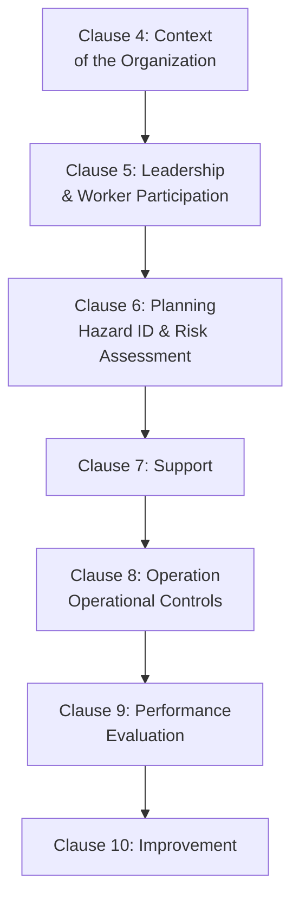
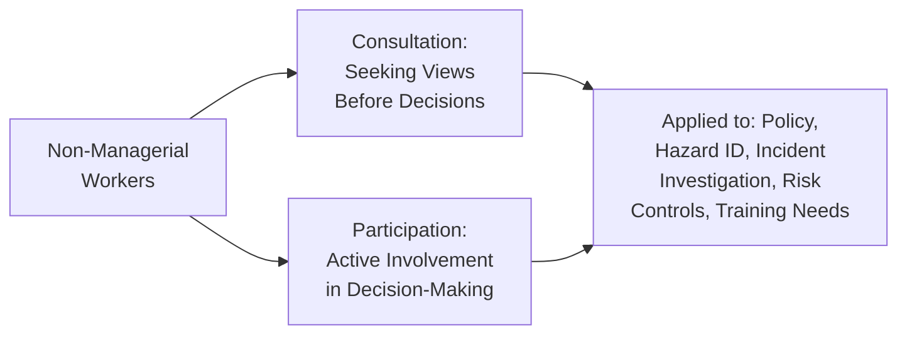
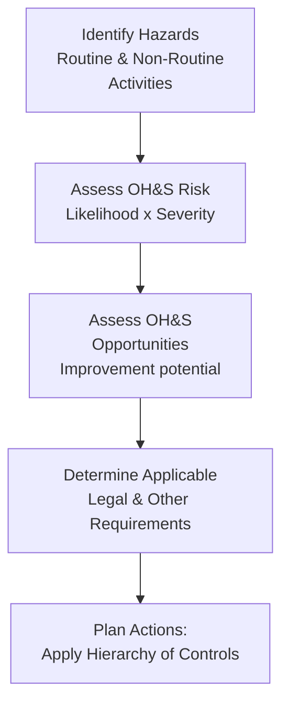
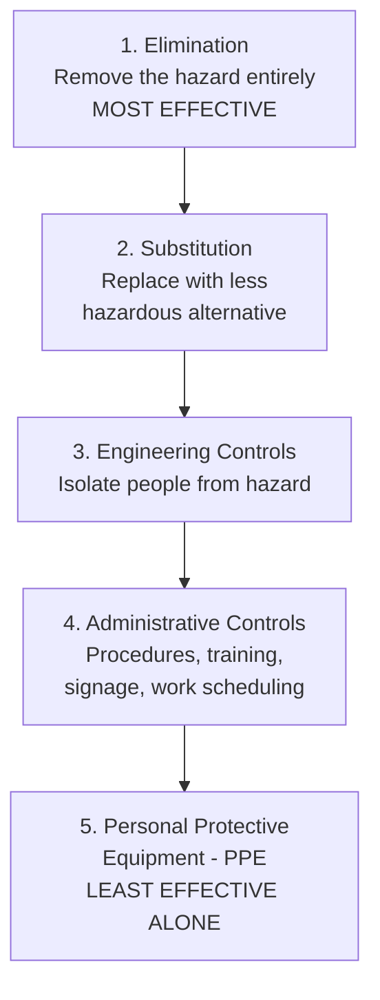
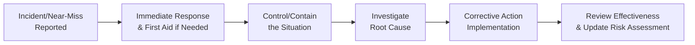

## ISO 45001 Occupational Health and Safety Management

### Definition and Purpose

ISO 45001 is the international standard specifying requirements for an Occupational Health and Safety (OH&S) Management System, enabling organizations to provide safe and healthy workplaces by preventing work-related injury and ill health, as well as proactively improving OH&S performance. Published in 2018, it replaced the earlier, widely adopted OHSAS 18001, which was formally withdrawn after a defined migration period.

In a QMS/ISO context, ISO 45001 relates to:

- **ISO 9001** and **ISO 14001** — ISO 45001 follows the same **Annex SL High-Level Structure**, making it designed for straightforward integration into a combined Quality-Environmental-Safety Integrated Management System (IMS)
- **OHSAS 18001** — the predecessor standard; organizations previously certified to OHSAS 18001 were required to transition to ISO 45001 within a defined migration period after its publication
- **ILO Guidelines on Occupational Safety and Health Management Systems (ILO-OSH 2001)** — ISO 45001 incorporates principles consistent with this International Labour Organization guidance
- Various national OH&S regulatory frameworks (e.g., OSHA in the US, HSE in the UK) — ISO 45001 provides a management system framework but does not replace legal/regulatory compliance obligations, which remain jurisdiction-specific

### Key Points

- ISO 45001 is the **first ISO management system standard built from the start on the Annex SL structure**, rather than being an earlier standard subsequently converted — reflecting its 2018 origin after Annex SL was established.
- A defining conceptual shift from OHSAS 18001: ISO 45001 explicitly requires considering **"worker participation"** and the perspective of workers and other interested parties as a formal structural requirement, not just a general good practice.
- The standard focuses on the interaction between the organization and its **work-related activities**, distinguishing OH&S risk (harm to people) conceptually from general business risk, while still integrating with the organization's overall risk-based thinking.
- ISO 45001 requires organizations to establish processes for **hazard identification** and **assessment of OH&S risks and opportunities**, applying a hierarchy of controls to determine appropriate risk reduction measures.
- **Top management leadership and accountability** are significantly emphasized, including a requirement that OH&S policy and objectives be compatible with the organization's strategic direction, distinct from delegating safety entirely to a safety officer/department.

### ISO 45001:2018 Structure (Annex SL Aligned)

### Key Distinguishing Concepts vs. Other Annex SL Standards

| Concept | ISO 45001-Specific Emphasis |
| --- | --- |
| Worker Participation and Consultation | Formal, structural requirement (Clause 5.4) — not merely encouraged but mandated, including for non-managerial workers |
| Hazard Identification | Distinct, proactive process (Clause 6.1.2.1) distinguishing OH&S hazard identification from general risk assessment |
| Hierarchy of Controls | Explicit requirement to apply a defined hierarchy when determining risk controls (Clause 8.1.2) |
| Incident, Nonconformity, and Corrective Action | OH&S-specific incident investigation requirements (Clause 10.2), distinguishing "incident" (including near-misses) from general "nonconformity" |
| Management of Change | Explicit requirement (Clause 8.1.3) to plan for and control both permanent and temporary changes affecting OH&S |
| Procurement and Contractors | Specific requirements addressing OH&S risks introduced by contracted work and outsourced processes |

### Clause 5.4 — Consultation and Participation of Workers

A structurally emphasized requirement, reflecting the standard's premise that workers themselves hold essential knowledge of workplace hazards:

**Mechanisms for worker participation** (illustrative, not exhaustive):

- Joint health and safety committees
- Worker safety representatives
- Suggestion/reporting systems for hazard identification
- Involvement in incident investigation teams
- Consultation on OH&S objectives and policy development

### Clause 6.1 — Hazard Identification and Risk Assessment

**Categories of hazards typically considered**:

- Physical hazards (noise, vibration, temperature extremes, mechanical hazards)
- Chemical/biological hazards
- Ergonomic hazards (repetitive strain, manual handling)
- Psychosocial hazards (workload, workplace violence, harassment, work organization)
- Hazards from organizational change, new technology, or non-routine activities (maintenance, emergency situations)

### Hierarchy of Controls (Clause 8.1.2)

ISO 45001 mandates applying controls in a defined order of preference, from most to least effective:

This hierarchy reflects the widely accepted occupational safety principle that controls addressing the hazard at its source (elimination, substitution) are inherently more reliable than controls depending on consistent human behavior or equipment use (administrative controls, PPE), which are considered the controls of last resort rather than a first-line solution. [Inference — this reflects standard, widely documented occupational safety engineering principle rather than a claim specific to any single regulatory framework]

### Clause 8.1.3 — Management of Change

Requires a proactive process for planning changes, whether permanent or temporary, including:

- New products, services, processes, or changes to existing ones
- Changes in legal requirements
- Changes in knowledge or information about hazards and OH&S risks
- Developments in knowledge and technology

### Clause 10.2 — Incident, Nonconformity, and Corrective Action

Distinguishes OH&S-specific terminology and process requirements:

| Term | Definition |
| --- | --- |
| Incident | Occurrence arising out of, or in the course of, work that could or does result in injury/ill health; includes both events resulting in harm and "near-misses" |
| Nonconformity | Non-fulfillment of a requirement (parallel to general QMS usage) |
| Corrective Action | Action to eliminate the cause(s) of a nonconformity/incident to prevent recurrence |

**Incident Investigation Process (typical structure)**:

### Legal and Other Requirements Compliance Obligation

Similar to ISO 14001's environmental compliance obligations concept, ISO 45001 requires the organization to determine and have access to applicable legal requirements and other requirements (e.g., industry codes, corporate standards) related to OH&S, and to evaluate compliance with them periodically. This does not replace legal compliance itself — certification to ISO 45001 does not constitute legal compliance certification — but establishes the management system infrastructure to track and evaluate it. [Inference — this reflects standard ISO management system standard practice regarding the relationship between certification and legal compliance, consistent with how compliance obligations are generally framed across Annex SL standards]

### Integration with ISO 9001 and ISO 14001 (Integrated Management Systems)

Because ISO 45001 shares the Annex SL High-Level Structure with ISO 9001 and ISO 14001, organizations frequently pursue an **Integrated Management System (IMS)**:

| Shared Clause Structure Element | Integration Benefit |
| --- | --- |
| Clause 4 (Context) | Single context/stakeholder analysis serving quality, environmental, and safety concerns |
| Clause 5 (Leadership) | Unified leadership commitment statement/policy framework |
| Clause 6 (Planning) | Combined risk/opportunity register spanning quality, environmental, and OH&S risk |
| Clause 9 (Performance Evaluation) | Single internal audit program and management review addressing all three domains |
| Clause 10 (Improvement) | Unified corrective action and continual improvement process |

### Worked Example

**Scenario**: A metal fabrication facility implements ISO 45001 alongside its existing ISO 9001 certification.

**Hazard Identification**: Cross-functional team, including worker safety representatives (per Clause 5.4 worker participation requirement), identifies significant hazards including exposure to welding fumes, manual handling of heavy stock, and machine guarding gaps on older equipment.

**Risk Assessment and Hierarchy of Controls Application**: For welding fume exposure, the team first evaluates **elimination** (not feasible — welding is core to the process), then **substitution** (evaluates lower-fume welding processes where feasible), then **engineering controls** (installs local exhaust ventilation at welding stations), supplemented by **administrative controls** (rotation schedules limiting exposure duration) and **PPE** (respirators) as the final layer — reflecting the hierarchy rather than defaulting to PPE alone.

**Management of Change**: Introduction of a new automated cutting machine triggers a formal management of change review per Clause 8.1.3, including updated risk assessment and operator training before the equipment enters service.

**Incident Investigation**: A near-miss (dropped load, no injury) is reported through the worker reporting system; investigation identifies inadequate load-securing procedure as root cause; corrective action updates the procedure and retrains affected personnel.

**Worker Participation**: Quarterly joint health and safety committee meetings, including non-managerial worker representatives, review incident trends, hazard reports, and proposed risk control changes before implementation.

**Integration**: The facility's internal audit program, originally established for ISO 9001, is expanded to cover ISO 45001 requirements within the same audit cycle, and management review agendas now include both quality and OH&S performance data.

### Common Pitfalls

- Treating worker participation as a formality (e.g., a suggestion box) rather than genuine, structured consultation and involvement in decision-making
- Defaulting to PPE as the primary control measure without first evaluating elimination, substitution, and engineering controls per the mandated hierarchy
- Confusing ISO 45001 certification with legal/regulatory OH&S compliance — the two are related but distinct
- Inadequate hazard identification for non-routine activities (maintenance, emergency response, contractor work), focusing only on routine operational hazards
- Incident investigation processes that stop at immediate cause without pursuing root cause analysis, leading to recurrence
- Failing to apply management of change controls when introducing new equipment, processes, or organizational changes affecting OH&S risk

### Related Topics

- ISO 9001 and ISO 14001 Integration (Annex SL Structure)
- Hierarchy of Controls in Occupational Safety
- Risk-Based Thinking Across Management System Standards
- Incident Investigation and Root Cause Analysis
- Worker Participation and Consultation Mechanisms
- Management of Change (MOC) Processes
- ISO 14001 Environmental Management Systems
- Legal and Regulatory Compliance Obligations Tracking