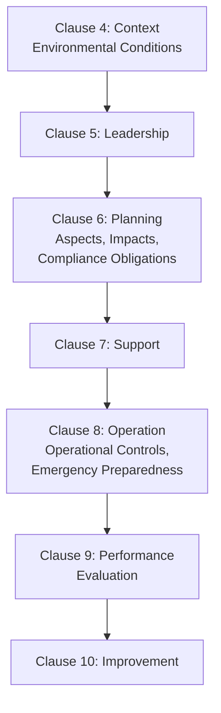
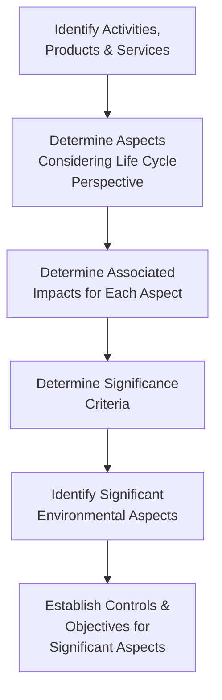
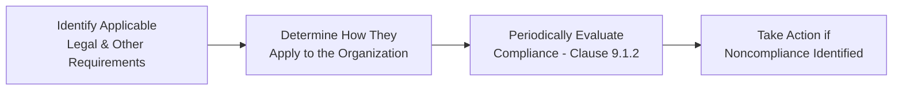

## ISO 14001 Environmental Management Systems

### Definition and Purpose

ISO 14001 is the international standard specifying requirements for an Environmental Management System (EMS), enabling organizations to systematically manage their environmental responsibilities, improve environmental performance, fulfill compliance obligations, and achieve environmental objectives. It is the world's most widely adopted environmental management standard and, like ISO 9001, follows the Annex SL High-Level Structure introduced in the 2015 revision.

In a QMS/ISO context, ISO 14001 relates to:

- **ISO 9001** — both standards share the identical Annex SL High-Level Structure (clause numbering, core text, and terminology), enabling straightforward integration into a combined Quality-Environmental Management System
- **ISO 45001** — shares the same structural framework, commonly integrated together as a Quality-Environmental-Safety Integrated Management System (IMS)
- **ISO 14004** — provides general guidelines on implementing ISO 14001 (guidance document, not a certifiable requirements standard)
- **ISO 14064 series** — greenhouse gas accounting and verification standards, often used alongside ISO 14001 for organizations with formal carbon reporting obligations
- **ISO 50001** — Energy Management Systems standard, frequently integrated with ISO 14001 given the overlap between energy use and environmental impact

### Key Points

- ISO 14001:2015 introduced **"life cycle perspective"** as a formal requirement — organizations must consider environmental aspects not just of their own direct operations, but across the product/service life cycle from raw material acquisition through end-of-life treatment, to the extent the organization can control or influence.
- The standard distinguishes **environmental aspects** (elements of an organization's activities that interact with the environment) from **environmental impacts** (changes to the environment resulting from those aspects) — a foundational conceptual pair unique to environmental management.
- **Compliance obligations** (legal requirements plus other requirements the organization chooses to adopt) must be identified, accessed, and periodically evaluated — though, as with ISO 45001, certification does not itself constitute legal compliance certification.
- ISO 14001 requires organizations to determine the **context of the organization** including environmental conditions that could affect or be affected by the organization (Clause 4.1) — a distinctly environmental extension of the general Annex SL context requirement.
- Since the 2015 revision, top management is required to take greater direct accountability for the EMS's effectiveness, integrating environmental management into core business processes and strategic direction rather than delegating it to an isolated environmental function.

### ISO 14001:2015 Structure (Annex SL Aligned)

### Environmental Aspects vs. Environmental Impacts

A foundational conceptual distinction underlying the entire standard:

| Term | Definition | Example |
| --- | --- | --- |
| Environmental Aspect | An element of an organization's activities, products, or services that interacts (or can interact) with the environment | Discharge of wastewater, air emissions from a boiler, consumption of raw materials |
| Environmental Impact | Any change to the environment, whether adverse or beneficial, wholly or partially resulting from an organization's environmental aspects | Water pollution, depletion of natural resources, habitat degradation, or a positive impact like reduced landfill waste |

$$Aspect \rightarrow Impact$$

*(An aspect is the cause; an impact is the effect on the environment)*

### Clause 6.1.2 — Environmental Aspects Determination Process

**Life Cycle Perspective**: Organizations must consider environmental aspects across stages they can control or influence, which may include:

The extent of control or influence over each life cycle stage generally decreases as the stage moves further from the organization's direct operations (e.g., an organization typically has more direct control over its own production processes than over how a customer ultimately disposes of a finished product), which the standard explicitly acknowledges by scoping the requirement to aspects the organization "can control and those it can influence." [Inference — this reflects the standard's explicit differentiated framing of "control" versus "influence" rather than a claim about any specific organization's actual capabilities]

### Determining Significance of Environmental Aspects

Organizations must establish documented criteria for evaluating which environmental aspects are **significant**, commonly using a weighted scoring approach:

**Typical Significance Criteria**:

- Severity/magnitude of potential environmental impact
- Likelihood/frequency of occurrence
- Scale (local, regional, global impact)
- Regulatory/legal sensitivity
- Stakeholder concern
- Reversibility of the impact

$$Significance\ Score = \sum (Weight_i \times Criterion\ Score_i)$$

**Example Aspect-Impact-Significance Register Entry**:

| Activity | Aspect | Impact | Severity | Likelihood | Regulatory Sensitivity | Significance Score |
| --- | --- | --- | --- | --- | --- | --- |
| Metal degreasing | Solvent vapor emission | Air quality degradation | 4 | 3 | 5 | 48 (Significant) |
| Office operations | Paper consumption | Resource depletion | 1 | 5 | 1 | 7 (Not Significant) |

### Clause 6.1.3 — Compliance Obligations

Requires organizations to determine and have access to applicable legal requirements (regulations, permits, licenses) and other requirements (corporate standards, industry codes, voluntary commitments the organization has adopted) related to its environmental aspects.

### Clause 8: Operation — Operational Controls and Emergency Preparedness

#### 8.1 Operational Planning and Control

Requires establishing controls for significant environmental aspects, consistent with a life cycle perspective, including control or influence over externally provided processes, products, or services relevant to the EMS.

#### 8.2 Emergency Preparedness and Response

Requires organizations to identify potential emergency situations (e.g., spills, releases, fires with environmental consequences) and establish processes to prepare for and respond to them, including periodic testing of planned response actions where practicable.

### Environmental Objectives and Targets

Per Clause 6.2, environmental objectives must be:

- Consistent with the environmental policy
- Measurable (where practicable)
- Monitored
- Communicated
- Updated as appropriate

**Example Objective Cascade**:

| Level | Example |
| --- | --- |
| Policy Commitment | "Reduce environmental footprint of operations" |
| Objective | "Reduce hazardous waste generation by 20% over 3 years" |
| Target | "Reduce solvent-based waste from degreasing process by 15% within 12 months" |
| Action Plan | Implement aqueous degreasing alternative at Line 3; train operators; monitor waste manifests monthly |

### Key Performance Indicators Commonly Tracked

| Metric Category | Example KPIs |
| --- | --- |
| Energy | Total energy consumption, energy intensity per unit produced |
| Water | Water withdrawal volume, water discharge quality parameters |
| Waste | Total waste generated, hazardous waste %, recycling rate |
| Emissions | GHG emissions (Scope 1, 2, and where applicable Scope 3), air pollutant emissions |
| Compliance | Number of regulatory non-compliances, permit exceedances |

### Integration with ISO 9001 and ISO 45001 (Integrated Management Systems)

Because ISO 14001 shares the Annex SL structure with ISO 9001 and ISO 45001, common integration points include:

| Shared Element | Integration Benefit |
| --- | --- |
| Clause 4 (Context) | Combined analysis of quality, environmental, and OH&S internal/external issues |
| Clause 6.1 (Risk and Opportunity) | Unified risk register covering quality risk, environmental aspects, and OH&S hazards |
| Clause 7.2/7.3 (Competence/Awareness) | Combined training matrix addressing quality, environmental, and safety competencies |
| Clause 9.2/9.3 (Internal Audit/Management Review) | Single integrated audit program and management review cycle |

### Worked Example

**Scenario**: A printed circuit board manufacturer implements ISO 14001 alongside existing ISO 9001 certification.

**Context and Scope**: Organization determines its EMS scope covers the manufacturing facility, including consideration of local environmental conditions (proximity to a protected watershed) as a relevant contextual factor per Clause 4.1.

**Aspect Identification**: Cross-functional team identifies aspects across the life cycle, including raw material sourcing (copper, chemicals), production (etching chemical discharge, energy consumption), and end-of-life (customer disposal of boards, which the organization can influence but not directly control).

**Significance Determination**: Etching chemical wastewater discharge scores highest on the significance matrix due to high regulatory sensitivity (discharge permit limits) and proximity to the protected watershed — designated a significant aspect requiring formal operational control.

**Compliance Obligations**: Organization identifies applicable discharge permit limits and monitoring/reporting requirements as legal compliance obligations, tracked in a compliance obligations register with periodic evaluation scheduled per Clause 9.1.2.

**Operational Control**: A documented procedure controls wastewater treatment before discharge, with continuous pH monitoring and defined reaction plan if parameters approach permit limits.

**Objectives and Targets**: An objective to reduce hazardous waste generation by 20% over three years is established, cascading to a specific target and action plan for the etching line.

**Emergency Preparedness**: A spill response procedure for chemical storage areas is documented and tested via an annual tabletop exercise.

**Integration**: Internal audit program, originally ISO 9001-only, expanded to include ISO 14001 requirements within the same audit cycle; management review now includes environmental performance data alongside quality metrics.

### Common Pitfalls

- Treating "environmental aspects" and "environmental impacts" as interchangeable terms rather than the distinct cause-effect pair the standard defines
- Significance determination criteria that are vague or inconsistently applied, producing an aspect register that doesn't reliably distinguish significant from non-significant aspects
- Overlooking life cycle perspective requirements, focusing only on direct on-site operational impacts while ignoring upstream/downstream aspects the organization can influence
- Confusing ISO 14001 certification with legal environmental compliance — the two are related but distinct, and certification does not exempt an organization from regulatory enforcement
- Environmental objectives set without measurable targets or monitoring mechanisms, making progress unverifiable
- Emergency preparedness plans developed but never tested, leaving gaps undiscovered until an actual incident occurs

### Related Topics

- ISO 45001 Occupational Health and Safety Management
- ISO 9001 and Annex SL Integrated Management Systems
- ISO 14064 Greenhouse Gas Accounting and Verification
- ISO 50001 Energy Management Systems
- Life Cycle Assessment (LCA) Methodology
- Environmental Aspects and Impacts Registers
- Compliance Obligations Management
- Emergency Preparedness and Response Planning