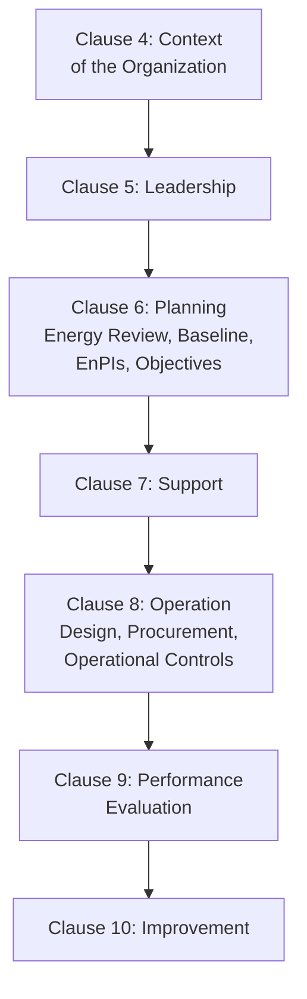
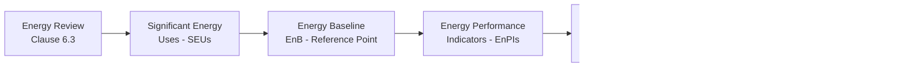
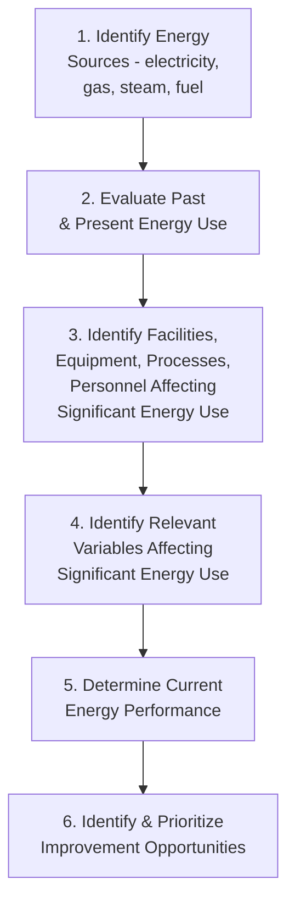
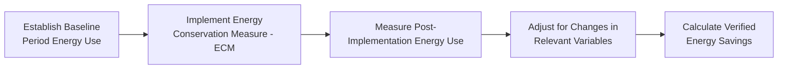

## ISO 50001 Energy Management Systems

### Definition and Purpose

ISO 50001 is the international standard specifying requirements for an Energy Management System (EnMS), enabling organizations to follow a systematic approach for achieving continual improvement in energy performance, including energy efficiency, energy use, and energy consumption. Unlike ISO 14001's broader environmental scope, ISO 50001 is specifically focused on the quantifiable, data-driven management of energy as a distinct organizational resource and performance domain.

In a QMS/ISO context, ISO 50001 relates to:

- **ISO 9001** and **ISO 14001** — shares the Annex SL High-Level Structure (since the ISO 50001:2018 revision), enabling integration into a combined management system
- **ISO 14001** — significant conceptual overlap given energy consumption's direct link to environmental impact (emissions, resource depletion), though ISO 50001 applies substantially more quantitative rigor specifically to energy performance
- **ISO 50006** — Energy baselines and energy performance indicators, providing detailed guidance on the standard's core measurement methodology
- **ISO 50015** — Measurement and verification of energy performance, providing guidance on quantifying and verifying energy savings
- **M&V Protocols** (e.g., IPMVP — International Performance Measurement and Verification Protocol) — commonly referenced frameworks for verifying energy performance improvements in practice

### Key Points

- ISO 50001 introduces a **distinctive quantitative core** not present in the same form in other Annex SL standards: the **Energy Baseline (EnB)** and **Energy Performance Indicators (EnPIs)**, which together create a measurable basis for demonstrating energy performance improvement over time.
- The standard requires an **Energy Review** — a systematic analysis of energy use and consumption, distinct from (though conceptually parallel to) ISO 14001's environmental aspects identification.
- ISO 50001 explicitly requires organizations to identify **Significant Energy Uses (SEUs)** — the areas of energy consumption that account for substantial energy use and/or offer substantial potential for energy performance improvement.
- A defining feature is the **normalization concept**: energy performance must be evaluated relative to relevant variables (production volume, weather/degree-days, occupancy) so genuine efficiency improvement can be distinguished from changes merely caused by external factors.
- The standard is explicitly structured to support, but does not itself certify, participation in **energy efficiency financial incentive programs**, tax credits, or regulatory reporting schemes, which remain jurisdiction- and program-specific.

### ISO 50001:2018 Structure (Annex SL Aligned)

### Core Quantitative Concepts

### Clause 6.3 — Energy Review

The technical core of the standard, requiring organizations to:

1. Analyze energy use and consumption based on measurement and other data
2. Identify areas of significant energy use (SEUs)
3. Identify, prioritize, and record opportunities for improving energy performance

**Energy Review Process**:

### Significant Energy Uses (SEUs)

Defined as energy use accounting for substantial energy consumption and/or offering substantial potential for energy performance improvement. Organizations typically use a Pareto-style analysis to identify SEUs.

**Example SEU Identification (Manufacturing Facility)**:

| Energy Use Area | % of Total Facility Energy | Improvement Potential |
| --- | --- | --- |
| Compressed Air System | 28% | High (common source of leaks/inefficiency) |
| HVAC | 22% | Moderate |
| Production Line Motors | 35% | Moderate-High |
| Lighting | 8% | Low-Moderate (often already optimized) |
| Office/Administrative | 7% | Low |

In this example, Compressed Air and Production Line Motors would likely be designated SEUs given their combined share of consumption and improvement potential, directing the organization's energy management focus and resources accordingly.

### Energy Baseline (EnB)

A quantitative reference against which energy performance is compared, established using data from a specified period appropriate to the organization's energy use and consumption.

$$EnB = f(Energy\ Consumption\ during\ Reference\ Period)$$

**Key requirement**: The EnB must be adjusted (normalized) when EnPIs no longer reflect organizational energy use/consumption, such as after major process changes, or when normalization itself becomes more appropriate given new data.

### Energy Performance Indicators (EnPIs)

Quantitative values or measures of energy performance, as defined by the organization, used to track and demonstrate improvement relative to the baseline.

**Common EnPI Formulations**:

| EnPI Type | Formula/Description |
| --- | --- |
| Simple Ratio | $\frac{Energy\ Consumed}{Production\ Output}$ (e.g., kWh per unit produced) |
| Regression-Based (Normalized) | Statistical model accounting for multiple relevant variables (e.g., production volume, heating/cooling degree-days, occupancy) |
| Simple Consumption | Total energy consumption over a period (least sophisticated, most susceptible to distortion by external factors) |

**Example Normalized EnPI (Regression Model)**:

$$Energy\ Consumption = \beta_0 + \beta_1(Production\ Volume) + \beta_2(Heating\ Degree\ Days) + \varepsilon$$

This type of model allows the organization to distinguish genuine efficiency improvement from consumption changes merely caused by production volume fluctuation or weather variation — a critical distinction, since raw (non-normalized) energy consumption figures alone can be misleading if relevant variables changed between the baseline and current period.

### Relevant Variables and Normalization

| Relevant Variable | Applicable Context |
| --- | --- |
| Production volume/output | Manufacturing facilities |
| Heating/Cooling Degree Days | Climate-sensitive buildings, HVAC-dependent facilities |
| Occupancy levels | Office buildings, hospitality |
| Operating hours | Facilities with variable operating schedules |
| Product mix | Facilities producing multiple product types with different energy intensities |

### Clause 8: Operation — Design, Procurement, and Operational Controls

#### 8.2 Design

Requires organizations to consider energy performance improvement opportunities in the design of new, modified, or renovated facilities, equipment, systems, and processes — applying energy considerations at the point of greatest potential influence (before capital is committed).

#### 8.3 Procurement of Energy Services, Products, Equipment, and Energy

Requires establishing criteria for evaluating energy performance over the planned or expected operating lifetime when procuring energy-using products, equipment, and services — and, where applicable, informing suppliers that procurement is partly evaluated on energy performance.

### Measurement and Verification (M&V)

A critical practical discipline for validating that claimed energy savings from improvement projects are genuine, commonly guided by frameworks such as the **IPMVP (International Performance Measurement and Verification Protocol)**:

$$Verified\ Savings = (Adjusted\ Baseline\ Energy\ Use) - (Actual\ Post\text{-}Implementation\ Energy\ Use)$$

### Worked Example

**Scenario**: A food processing plant implements ISO 50001, targeting reduction in overall energy intensity.

**Energy Review**: Facility-wide energy audit identifies electricity (60%) and natural gas for process heating (40%) as the two energy sources; sub-metering reveals refrigeration systems account for 45% of total electricity consumption, designating refrigeration as the primary SEU.

**Baseline Establishment**: A 12-month baseline period is selected, with energy consumption data collected alongside relevant variables (production volume in tons processed, and ambient temperature affecting refrigeration load).

**EnPI Development**: A regression-based EnPI is developed: $kWh = \beta_0 + \beta_1(Tons\ Processed) + \beta_2(Avg\ Ambient\ Temp)$, allowing normalized performance tracking that separates genuine efficiency gains from seasonal/production-volume effects.

**Improvement Opportunity**: Energy review identifies aging refrigeration compressors operating below design efficiency as a significant improvement opportunity.

**Objective and Action Plan**: An objective to reduce normalized refrigeration energy intensity by 12% over 18 months is established, with an action plan to replace two compressors and implement a compressor sequencing control upgrade.

**Measurement and Verification**: Following implementation, post-project energy data is normalized using the established regression model and compared against the adjusted baseline, confirming a verified 14% reduction in normalized refrigeration energy intensity — exceeding the original target.

**Management Review**: Verified energy performance results, along with ongoing SEU monitoring data, are presented at management review, supporting continued investment in the next prioritized improvement opportunity (compressed air leak detection program).

### ISO 50001 vs. ISO 14001 — Key Distinctions

| Aspect | ISO 14001 | ISO 50001 |
| --- | --- | --- |
| Scope | Broad environmental impact (air, water, waste, resources, energy) | Specifically energy performance |
| Core Quantitative Framework | Aspects/impacts significance determination | Formal Energy Baseline + EnPI + normalization methodology |
| Primary Metric Discipline | Qualitative-to-semi-quantitative significance scoring | Rigorous, often regression-based quantitative performance tracking |
| Typical Driver | Broad environmental stewardship, regulatory compliance | Energy cost reduction, efficiency, often tied to specific ROI-driven projects |

### Common Pitfalls

- Using raw (non-normalized) energy consumption data as the sole performance indicator, producing misleading conclusions when production volume or weather conditions change between periods
- Establishing an Energy Baseline without adequate historical data or relevant variable identification, undermining the credibility of subsequent performance claims
- Failing to identify true Significant Energy Uses, spreading improvement resources across low-impact areas instead of the highest-consumption/highest-potential systems
- Treating energy review as a one-time audit rather than an ongoing, periodically updated analysis
- Claiming energy savings from improvement projects without a rigorous measurement and verification methodology to substantiate the claim
- Overlooking Clause 8.2/8.3 design and procurement requirements, missing the highest-leverage point (new equipment/facility decisions) for embedding energy performance improvement

### Related Topics

- ISO 14001 Environmental Management Systems
- ISO 50006 — Energy Baselines and Energy Performance Indicators
- ISO 50015 — Measurement and Verification of Energy Performance
- IPMVP (International Performance Measurement and Verification Protocol)
- Regression Analysis for Normalized Performance Metrics
- Significant Energy Uses (SEU) Identification
- ISO 9001 and Annex SL Integrated Management Systems
- Energy Conservation Measure (ECM) Project Management