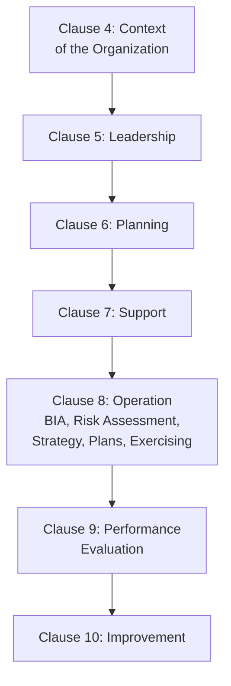
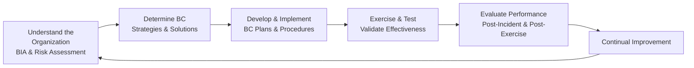
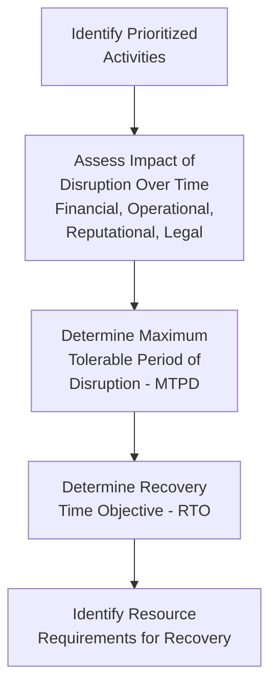
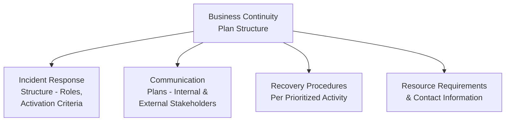

## ISO 22301 Business Continuity Management

### Definition and Purpose

ISO 22301 is the international standard specifying requirements for a Business Continuity Management System (BCMS), enabling organizations to prepare for, respond to, and recover from disruptive incidents while continuing to operate at an acceptable, predefined level. Unlike standards focused on preventing a specific category of harm (quality defects, environmental impact, safety incidents), ISO 22301 addresses organizational **resilience** — the capacity to maintain or rapidly restore critical operations regardless of the specific cause of disruption.

In a QMS/ISO context, ISO 22301 relates to:

- **ISO 9001** — shares the Annex SL High-Level Structure, enabling integration into a broader management system architecture
- **ISO 31000** (Risk Management — Guidelines) — provides the general risk management principles that ISO 22301's business impact analysis and risk assessment activities draw upon
- **ISO 22320** (Emergency Management) and **ISO 22398** (Guidelines for exercises) — related standards supporting specific operational aspects of continuity/emergency response
- **ISO/IEC 27031** — Guidelines for information and communication technology readiness for business continuity, addressing the IT-specific continuity dimension
- **NFPA 1600** and national civil contingency frameworks — related but distinct national/sector-specific continuity and emergency management standards that organizations may need to reconcile with ISO 22301

### Key Points

- ISO 22301 distinguishes itself from general risk management by focusing specifically on **maintaining continuity of prioritized activities during and after disruption**, rather than broader risk prevention across all domains.
- The standard's technical core is the **Business Impact Analysis (BIA)**, which quantifies the consequences of disruption over time and establishes recovery time objectives for prioritized activities.
- **Business continuity strategies and solutions** must be selected based on BIA and risk assessment outputs, not assumed or applied generically across all business functions.
- The standard requires organizations to establish, document, implement, and maintain **business continuity plans (BCPs)**, but explicitly treats planning as insufficient alone — testing/exercising those plans is a mandatory, ongoing requirement.
- Unlike some other Annex SL standards, ISO 22301 places strong emphasis on **exercising and testing** as the mechanism that actually validates whether the BCMS will function during a real disruption, since untested plans carry significant risk of failing under actual crisis conditions. [Inference — this emphasis reflects the standard's explicit structural requirements for exercising programs, a documented feature of the standard rather than a general claim about untested plans]

### ISO 22301:2019 Structure (Annex SL Aligned)

### The Business Continuity Management Lifecycle

### Clause 8.2 — Business Impact Analysis (BIA) and Risk Assessment

#### Business Impact Analysis (BIA)

A systematic process to determine and evaluate the potential effects of disruption to business operations over time, quantifying urgency and priority.

**Key BIA Metrics**:

| Metric | Definition |
| --- | --- |
| Maximum Tolerable Period of Disruption (MTPD) | The maximum time an activity's disruption can be tolerated before the viability of the organization is threatened |
| Recovery Time Objective (RTO) | The target time within which a prioritized activity must be resumed following disruption, always set at or before the MTPD |
| Recovery Point Objective (RPO) | The maximum acceptable amount of data loss, measured in time, typically applied to IT/data systems |
| Minimum Business Continuity Objective (MBCO) | The minimum level of service/output acceptable during a disruption, which may be less than normal operations |

**Relationship**: $RTO \leq MTPD$

#### Risk Assessment

Applied specifically to identify risks of disruption to prioritized activities, distinct from (though informed by) general organizational risk management per ISO 31000 principles.

### Business Continuity Strategies and Solutions (Clause 8.3)

Based on BIA and risk assessment outputs, organizations select strategies addressing key resource categories:

| Resource Category | Example Continuity Strategy |
| --- | --- |
| People | Cross-training, succession planning, remote work capability |
| Premises/Facilities | Alternate site arrangements (hot site, cold site, reciprocal agreements) |
| Technology/IT Systems | Data backup and replication, redundant systems, cloud failover |
| Information/Data | Off-site backup, data recovery procedures |
| Supply Chain | Alternate/backup suppliers, safety stock, supplier continuity requirements |
| Stakeholder Communication | Emergency notification systems, predetermined communication protocols |

### Business Continuity Plans (BCPs) — Clause 8.4

BCPs translate strategy into actionable, documented response procedures:

**Typical BCP Components**:

- Activation criteria and escalation procedures
- Incident response team roles and responsibilities
- Communication protocols (internal staff, customers, suppliers, regulators, media)
- Step-by-step recovery procedures for each prioritized activity
- Resource requirements (alternate facilities, equipment, key contacts)
- Plan review and maintenance schedule

### Clause 8.5 — Exercising and Testing Programme

A structurally emphasized, ongoing requirement — plans must be validated through a systematic exercising program covering varying scope and complexity:

| Exercise Type | Description | Typical Scope |
| --- | --- | --- |
| Tabletop Exercise | Discussion-based walkthrough of a scenario without actual system/resource activation | Team-level, low resource commitment |
| Walkthrough/Orientation | Team reviews plan steps sequentially to confirm understanding | Team-level, moderate depth |
| Simulation Exercise | More realistic scenario-based exercise, may involve simulated system failures | Departmental or cross-functional |
| Full-Scale/Live Exercise | Complete activation of continuity plans and resources, closely mimicking an actual disruption | Organization-wide, highest resource commitment |

Exercise programs are generally recommended to progress in complexity over time, and findings from each exercise should feed back into plan revisions — an exercise that reveals no gaps or improvement opportunities may itself indicate the exercise was insufficiently rigorous. [Inference — this reflects standard business continuity practitioner guidance rather than a specific mandated requirement of the standard's text]

### Post-Incident Review and Continual Improvement

Following either an actual disruption or a significant exercise, ISO 22301 requires evaluation of the response's effectiveness, feeding into corrective action and plan updates — structurally parallel to other Annex SL standards' Clause 10 improvement requirements, but specifically triggered by both real incidents and planned exercises.

### Worked Example

**Scenario**: A regional distribution company implements ISO 22301 to address supply chain and facility disruption risk.

**Business Impact Analysis**: BIA identifies order fulfillment and inventory management as the two most critical prioritized activities. Analysis determines that fulfillment disruption exceeding 24 hours results in significant customer contract penalty exposure, setting an RTO of 12 hours (with MTPD at 24 hours, providing a safety margin).

**Risk Assessment**: Regional flood risk and single-source dependency on one key third-party logistics (3PL) provider are identified as the highest-priority disruption risks to the prioritized activities.

**Strategy Selection**: For facility risk, the company establishes a reciprocal agreement with a partner facility in a different flood zone. For 3PL dependency, a secondary qualified logistics provider is contracted and kept in a "warm" ready state.

**Business Continuity Plan Development**: Detailed BCP documents the activation criteria (e.g., regional flood warning issuance), incident response team roles, communication protocol for notifying customers of potential delays, and step-by-step procedures for activating the reciprocal facility and secondary 3PL.

**Exercising Program**: A tabletop exercise is conducted in Year 1, progressing to a simulation exercise in Year 2 that actually activates communication protocols and tests the secondary 3PL's ability to process a sample order batch within the target RTO.

**Post-Exercise Review**: The Year 2 simulation reveals the secondary 3PL's actual processing time exceeded the 12-hour RTO by 3 hours; this finding triggers a corrective action to renegotiate the 3PL agreement's service level commitment and revise the BCP's resource requirements section.

**Continual Improvement**: Findings are incorporated into the next plan revision, and the exercise program advances toward a full-scale exercise in the following cycle.

### ISO 22301 vs. General Risk Management (ISO 31000)

| Aspect | ISO 31000 (Risk Management) | ISO 22301 (Business Continuity) |
| --- | --- | --- |
| Scope | General framework for managing all organizational risk | Specifically focused on disruption to prioritized activities |
| Certifiable | No (guidance standard only) | Yes (requirements standard, certifiable) |
| Core Technical Tool | Generic risk assessment methodology | Business Impact Analysis (BIA) + risk assessment |
| Primary Output | Risk treatment plans across all risk categories | Business continuity plans + exercising program specifically for continuity |

### Common Pitfalls

- Developing business continuity plans without a rigorous, data-driven BIA underlying RTO/MTPD determinations, resulting in unrealistic or unjustified recovery targets
- Treating plan documentation as the end goal rather than the starting point — plans that are never exercised carry substantial unverified risk
- Exercise programs that never progress beyond low-complexity tabletop exercises, missing the validation value of more realistic simulation or full-scale exercises
- Failing to update BCPs following organizational changes (new facilities, new critical suppliers, org structure changes) that alter the original BIA assumptions
- No formal post-incident or post-exercise review process, missing the opportunity to convert real experience into plan improvement
- Confusing IT disaster recovery planning alone with comprehensive business continuity, which must address people, facilities, and supply chain, not just technology systems

### Related Topics

- ISO 31000 Risk Management Guidelines
- Business Impact Analysis (BIA) Methodology
- ISO/IEC 27031 — ICT Readiness for Business Continuity
- Crisis Communication Planning
- Supply Chain Resilience and Risk Management
- ISO 9001 and Annex SL Integrated Management Systems
- Disaster Recovery Planning (IT-Specific)
- Exercise and Testing Program Design