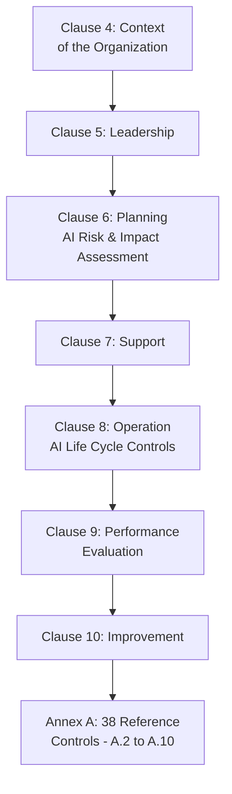
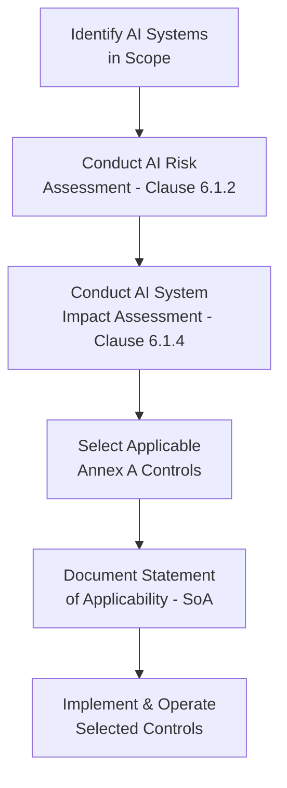
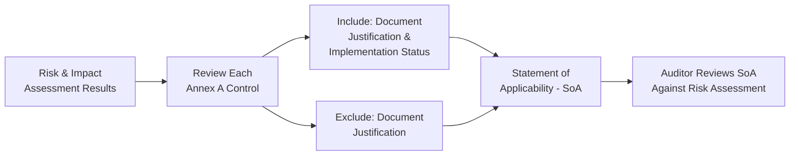

## ISO/IEC 42001 Artificial Intelligence Management Systems

### Definition and Purpose

ISO/IEC 42001:2023 is the international standard specifying requirements for establishing, implementing, maintaining, and continually improving an **Artificial Intelligence Management System (AIMS)**. It specifies the requirements and provides guidance for establishing, implementing, maintaining, and continually improving an AI management system within the context of an organization, and ISO describes it as the world's first AI management system standard, published December 2023 by ISO and IEC. [Microsoft Learn](https://learn.microsoft.com/en-us/compliance/regulatory/offering-iso-42001)[Konfirmity](https://www.konfirmity.com/blog/iso-42001)

In a QMS/ISO context, ISO/IEC 42001 relates to:

- **ISO 9001 and ISO/IEC 27001** — it uses the harmonized structure that ISO applies across its management system standards, set out in Annex SL of the ISO/IEC Directives and shared with ISO/IEC 27001:2022, so the shape is familiar: context, leadership, planning, support, operation, performance evaluation, improvement [Reco](https://www.reco.ai/ciso-hub/iso-42001)
- **ISO/IEC 42006:2025** — sets the additional requirements for bodies that audit and certify AI management systems against ISO/IEC 42001 [Reco](https://www.reco.ai/ciso-hub/iso-42001)
- **ISO/IEC 23894** — gives detailed guidance on the AI risk management that ISO 42001 requires, extending ISO 31000 to AI-specific risks [Konfirmity](https://www.konfirmity.com/blog/iso-42001)
- **ISO/IEC 22989** — supplies the shared AI vocabulary the standard relies on [Konfirmity](https://www.konfirmity.com/blog/iso-42001)
- **NIST AI Risk Management Framework** — a voluntary US framework built around four functions — Govern, Map, Measure, Manage. It is complementary, not competing, and it is not certifiable; its functions map onto ISO 42001's requirements, so work done for the RMF carries directly into an ISO 42001 audit [Konfirmity](https://www.konfirmity.com/blog/iso-42001)

### Key Points

- ISO/IEC 42001 is part of a growing ecosystem of ISO/IEC AI standards; it provides the management system foundation that can be supported by other standards addressing AI concepts, terminology, risk management and governance [ISO](https://www.iso.org/home/insights-news/resources/iso-42001-explained-what-it-is.html)
- Certification for ISO/IEC 42001 is voluntary — ISO does not certify organizations itself; independent certification bodies perform audits. [ISO](https://www.iso.org/home/insights-news/resources/iso-42001-explained-what-it-is.html)
- 42001/AIMS is a sector-specific management system standard for responsible AI that conforms to all generic MSS requirements, with specific considerations, controls, and guidance for AI systems. [UNIDO](https://www.unido.org/sites/default/files/files/2025-07/Microsoft%20-%20Overview%20of%20ISO%20IEC%2042001.pdf)
- A management system is not a technical control or a model test — it is the set of policies, roles, processes, and controls through which an organization consistently governs an activity. ISO 42001 does not tell you which model to use or dictate a fairness threshold; it requires that you have a deliberate, documented, and continually improving system for deciding those things and for catching them when they go wrong. [Konfirmity](https://www.konfirmity.com/blog/iso-42001)
- The audit assesses conformity with ISO/IEC 42001 within the declared scope, while the Statement of Applicability records which Annex A controls were selected or excluded and why — two certified companies can therefore hold very different control sets, which is why sophisticated buyers ask for the scope statement rather than the certificate. [Reco](https://www.reco.ai/ciso-hub/iso-42001)

### ISO/IEC 42001:2023 Structure (Harmonized Structure Aligned)

Much like ISO/IEC 27001 for information security, ISO/IEC 42001 is structured around a continuous improvement cycle and includes Clauses 4–10, covering organizational context, leadership, planning (including risk and impact assessments), support, operation, performance evaluation, and improvement. [NSF](https://www.nsf.org/management-systems/information-security/iso-iec-42001-artificial-intelligence-management-system)

### Clause 6.1 — AI Risk Assessment and Impact Assessment

A key technical differentiator: Clause 6.1 requires systematic identification and evaluation of AI risks, while Clause 9 requires performance measurement against defined indicators; the standard explicitly connects governance activities to measurable outcomes. Per implementation guidance, organizations must conduct and document AI risk assessments (Clause 6.1.2) and AI system impact assessments (Clause 6.1.4) in a structured, auditable register. [arxiv](https://arxiv.org/pdf/2511.21975)[ISMS.online](https://www.isms.online/iso-42001/checklist/)

### Annex A — Reference Controls

ISO/IEC 42001:2023 lists 38 Annex A controls grouped under nine control objectives, numbered A.2 to A.10. The controls cover AI policy, internal organization, resources, impact assessment, the AI life cycle, data, transparency, use, and third-party relationships. [Note: at least one source describes a 39-control count; the widely and consistently cited figure across most current guidance is 38, but exact numbering may vary slightly by publication/update — verify against the current official standard text for precise citation purposes.] [Konfirmity](https://www.konfirmity.com/blog/iso-42001-controls)

| Control Objective | Focus Area |
| --- | --- |
| A.2 | AI Policy |
| A.3 | Internal Organization / Roles and Responsibilities |
| A.4 | Resources for AI Systems |
| A.5 | Assessing Impacts of AI Systems |
| A.6 | AI System Life Cycle |
| A.7 | Data for AI Systems |
| A.8 | Information for Interested Parties |
| A.9 | Use of AI Systems |
| A.10 | Third-Party and Customer Relationships |

Annex A contains 38 reference controls organized under nine control objectives, covering areas such as AI policies, internal organization, resources, impact assessments, data, interested parties, among others. [Reco](https://www.reco.ai/ciso-hub/iso-42001)

**Annex A vs. Annex B**: Annex A and Annex B support different activities — Annex A provides the control framework, Annex B provides guidance for applying the controls. Annex B does not require one universal implementation method; organizations can use different technologies, processes, responsibilities, and documents when those measures effectively address their risks. [Risk Professionals](https://riskprofs.com/iso-42001-annex-a-controls-list/)

### Statement of Applicability (SoA)

Organizations conduct AI risk and impact assessments, select suitable controls, and justify included and excluded controls, maintaining implementation evidence. A control should not be excluded only because it is difficult, expensive, or inconvenient — the justification should be based on the organization's scope, AI role, risks, legal obligations, contractual requirements, and existing controls. This document is a mandatory audit deliverable that maps each control to its status, and auditors review the SoA during Stage 1 to verify that control selection is consistent with the risk assessment and risk treatment plan (a practice paralleling ISO/IEC 27001 certification audits). [ISO 42001 Annex A Controls List: All 38 Controls Explained +2](https://riskprofs.com/iso-42001-annex-a-controls-list/)

### Comparison with ISO/IEC 27001

| Aspect | ISO/IEC 27001 | ISO/IEC 42001 |
| --- | --- | --- |
| Subject | Information security (confidentiality, integrity, availability) | AI system governance across the lifecycle |
| Annex A Control Count | 93 controls in four themes | 38 controls under nine control objectives |
| Unique Focus Areas | Information security controls | Objectives such as impact assessment (A.5) and data governance (A.7) that have no equivalent in an information-security catalogue |
| Control Selection Mechanism | Statement of Applicability | Both use the same mechanism to select controls, the Statement of Applicability, and both treat Annex A as a reference set justified by a risk assessment rather than a mandatory list |

### Related and Supporting AI Standards

| Standard | Role |
| --- | --- |
| ISO/IEC 23894 | Detailed guidance on AI risk management, extending ISO 31000 to AI-specific risks — not itself certifiable |
| ISO/IEC 22989 | Shared AI vocabulary/terminology the standard relies on — not itself certifiable |
| ISO/IEC 42006:2025 | Sets additional requirements for bodies that audit and certify AI management systems against ISO/IEC 42001 |
| ISO/IEC 22989, 23053 | Establish AI terminology and describe concepts in the field of AI |
| NIST AI RMF | Complementary framework emphasizing flexibility, transparency, and accountability, aligning with ISO 31000 and NIST AI RMF |

### Applicability and Typical Adopters

ISO/IEC 42001 is suitable for a wide range of organizations large or small; industries that could find this standard of particular benefit include technology companies developing AI products, and organizations using AI in critical business processes such as financial institutions or healthcare providers. It is applicable to all types of companies in any industry, and is the first international and certifiable management system standard for artificial intelligence management systems. [NSF](https://www.nsf.org/management-systems/information-security/iso-iec-42001-artificial-intelligence-management-system)[DNV](https://www.dnv.com/services/iso-iec-42001-artificial-intelligence-ai--250876/)

### Governance and Ownership Model

Ownership is worth settling at the same time as implementation planning: the management system itself usually sits with compliance, legal, or a quality function, because the clause structure is their native territory. Security often owns or supports the layer underneath, including the inventory, access and permission data, monitoring, and evidence that controls operated. [Reco](https://www.reco.ai/ciso-hub/iso-42001)

### Relationship to AI Regulation

With increasing regulatory scrutiny, businesses need to proactively manage AI risks, including bias, data security and accountability; ISO/IEC 42001 sets the foundation for AI governance and regulatory alignment, and for Swiss companies (as one example), AI governance is especially vital as the EU AI Act and global regulations demand stricter compliance. Certification is generally positioned by providers as supporting evidence of governance maturity rather than a direct substitute for regulatory conformity assessment under region-specific AI legislation (analogous to how ISO 13485 supports, but does not replace, EU MDR conformity assessment). [Inference — this parallel is drawn from the standard's stated purpose and common industry positioning rather than a direct regulatory equivalence claim found in the standard's own text] [KPMG](https://kpmg.com/ch/en/insights/artificial-intelligence/iso-iec-42001.html)

### Worked Example

**Scenario**: A healthcare technology company deploying an AI-based diagnostic support tool implements ISO/IEC 42001.

**Scope Definition**: Organization defines AIMS scope covering the diagnostic support AI system, deliberately starting with one system rather than all AI activity organization-wide — a defensible, well-run scope beats an ambitious one you cannot evidence. [Konfirmity](https://www.konfirmity.com/blog/iso-42001)

**Risk and Impact Assessment**: Per Clause 6.1.2/6.1.4, the team conducts an AI risk assessment (model drift, adversarial inputs, data quality) and a separate AI system impact assessment addressing patient safety, diagnostic bias across demographic groups, and clinician over-reliance — control objective A.5, "Assessing impacts of AI systems," is where fairness, safety, and human-rights considerations get documented and revisited, rather than assumed. [Konfirmity](https://www.konfirmity.com/blog/iso-42001)

**Control Selection**: Organization reviews all 38 Annex A controls against the risk/impact assessment findings, selecting controls under A.5 (impact assessment), A.6 (AI life cycle), A.7 (data governance), and A.9 (use of AI systems) as directly applicable, while documenting justified exclusion of certain third-party relationship controls (A.10) given the system is developed entirely in-house.

**Statement of Applicability**: SoA is compiled documenting each control's inclusion/exclusion rationale, implementation status, and owner, ready for Stage 1 audit review.

**Certification**: An accredited certification body audits the AIMS against the declared scope and SoA, verifying conformity across Clauses 4–10 and the selected Annex A controls, per requirements set out in ISO/IEC 42006 for certification bodies performing such audits.

### Common Pitfalls

- Treating the 38 controls as a checklist — Annex A is a reference set justified by your risk and impact assessments, not a shopping list to tick off; auditors want the reasoning, not just the checkmarks [Konfirmity](https://www.konfirmity.com/blog/iso-42001)
- Scoping too broadly — organizations do not have to put every model in the AIMS on day one [Konfirmity](https://www.konfirmity.com/blog/iso-42001)
- Skipping the impact assessment or treating it as a formality rather than a substantive, revisited analysis [Konfirmity](https://www.konfirmity.com/blog/iso-42001)
- Confusing ISO/IEC 42001 certification with direct compliance to AI-specific regulation (e.g., the EU AI Act), when the standard functions as a governance framework that supports, but does not automatically satisfy, specific regulatory conformity requirements
- Assuming all certified organizations hold equivalent control sets — since two certified companies can hold very different control sets, the Statement of Applicability (not the certificate alone) should be reviewed when evaluating a vendor's actual AI governance posture [Reco](https://www.reco.ai/ciso-hub/iso-42001)
- Excluding an Annex A control solely because implementation is difficult or costly, rather than basing exclusion on documented risk/impact assessment justification

### Related Topics

- ISO/IEC 27001 Information Security Management Systems
- ISO/IEC 23894 — AI Risk Management Guidance
- ISO 31000 Risk Management Guidelines
- ISO/IEC 22989 — AI Concepts and Terminology
- NIST AI Risk Management Framework
- Statement of Applicability (SoA) Development
- AI Impact Assessment Methodology
- EU AI Act and Regional AI Regulatory Frameworks