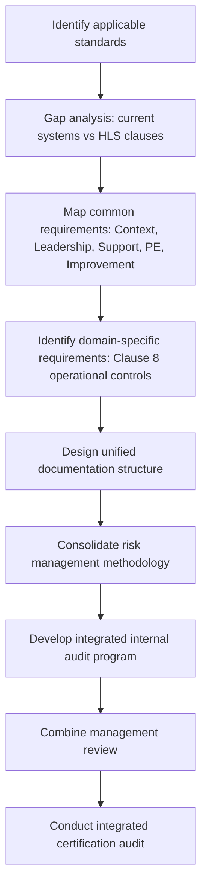

## Principles of Integrating Multiple ISO Standards

### Overview

An Integrated Management System (IMS) combines two or more management system standards (e.g., ISO 9001 for quality, ISO 14001 for environment, ISO 45001 for occupational health and safety, ISO 27001 for information security) into a single, cohesive framework rather than operating them as parallel, siloed systems. Integration is made structurally feasible by the High Level Structure (HLS), formally defined in Annex SL of the ISO/IEC Directives, Part 1, which mandates a common clause sequence, identical core text, and shared terms and definitions across newer ISO management system standards.

### The Basis for Integration: Annex SL / High Level Structure

**Key Points**

- Annex SL defines 10 mandatory clauses that all HLS-conformant standards must follow:
  1. Scope
  2. Normative references
  3. Terms and definitions
  4. Context of the organization
  5. Leadership
  6. Planning
  7. Support
  8. Operation
  9. Performance evaluation
  10. Improvement
- Because clauses 4–10 map one-to-one across standards, an organization can maintain a single documented structure (e.g., one manual, one set of procedures) that satisfies multiple standards simultaneously.
- Core, unmodifiable text and common terms (e.g., "interested party," "risk," "top management," "documented information") remove ambiguity in cross-referencing requirements between standards.
- Standards published or revised before wide HLS adoption (older versions, or standards outside the HLS family) may require a gap analysis and manual mapping rather than automatic clause alignment.

### Core Integration Principles

#### 1. Process-Based Thinking

Rather than maintaining separate procedures per standard, an IMS models the organization as a network of interacting processes. A single process (e.g., "Purchasing") is designed once and annotated with the quality, environmental, and safety controls relevant to it, instead of existing as three duplicate procedures.

#### 2. Risk-Based Thinking

All HLS standards require organizations to determine risks and opportunities related to their objectives (Clause 6.1). Integration allows a unified risk register that captures quality risk, environmental aspect/impact risk, OH&S hazard risk, and information security risk under one methodology, avoiding contradictory risk scoring systems.

#### 3. Common Context and Leadership Requirements

Clause 4 (Context of the Organization) and Clause 5 (Leadership) are nearly identical text across HLS standards. A single "Context and Interested Parties" analysis and a single top-management commitment statement can satisfy the leadership/context obligations of all integrated standards concurrently.

#### 4. Unified Support Processes (Clause 7)

Resources, competence, awareness, communication, and documented information control are consolidated:

- One document control procedure instead of three.
- One competence matrix capturing training needs across quality, environmental, and safety roles.
- One internal communication channel/process satisfying all standards' communication clauses.

#### 5. Integrated Operational Planning and Control (Clause 8)

This is typically the least harmonizable clause because operational content is domain-specific (e.g., ISO 9001's design and development controls vs. ISO 45001's hazard elimination hierarchy). Best practice is to integrate the *procedural shell* (how operations are planned, documented, and controlled) while allowing domain-specific technical content to remain distinct within that shell.

#### 6. Unified Performance Evaluation (Clause 9)

- A single internal audit program can cover multiple standards per audit cycle, using a combined audit checklist mapped to each standard's specific clauses.
- Management review meetings are combined into one meeting with agenda items addressing each standard's required inputs (e.g., customer feedback for 9001, incident data for 45001, environmental compliance for 14001).

#### 7. Unified Improvement Process (Clause 10)

Nonconformity, corrective action, and continual improvement processes are merged into a single corrective action system, with a classification field indicating which management system(s) the nonconformity affects.

### Integration Models

| Model | Description | Typical Use Case |
| --- | --- | --- |
| Full Integration | Single manual, single set of procedures, single audit program covering all standards | Mature organizations, smaller organizations with limited resources |
| Partial/Aligned Integration | Common Clauses 4–7 and 9–10 integrated; Clause 8 operational controls kept standard-specific | Organizations with highly technical, non-overlapping operational domains |
| Coordinated (Parallel) Systems | Separate management systems maintained but formally cross-referenced and jointly audited | Organizations transitioning toward integration, or with legally mandated separate systems |

### Example: Integrated Clause 6.1 (Risk and Opportunity) Mapping

| Standard | Domain-Specific Risk Focus | Integrated Register Field |
| --- | --- | --- |
| ISO 9001 | Risk to product/service conformity and customer satisfaction | Risk Category: Quality |
| ISO 14001 | Environmental aspects and impacts | Risk Category: Environmental |
| ISO 45001 | Hazards and OH&S risk | Risk Category: Safety |
| ISO 27001 | Information security risks to CIA (confidentiality, integrity, availability) | Risk Category: Information Security |

A single risk assessment methodology (e.g., likelihood × severity matrix) is applied across all four categories, with category-specific criteria defined in supporting guidance.

### Diagram: IMS Integration via Annex SL (svg_diagram)

<svg viewBox="0 0 760 420" xmlns="http://www.w3.org/2000/svg">
<rect x="0" y="0" width="760" height="420" fill="#ffffff"/>
<text x="380" y="25" text-anchor="middle" font-size="16" font-weight="bold" fill="#1a1a1a">IMS Integration via Annex SL (svg_diagram)</text>
<rect x="20" y="50" width="200" height="40" rx="6" fill="#dbeafe" stroke="#1e40af"/>
<text x="120" y="75" text-anchor="middle" font-size="13" fill="#1e3a8a">ISO 9001 (Quality)</text>
<rect x="280" y="50" width="200" height="40" rx="6" fill="#dcfce7" stroke="#166534"/>
<text x="380" y="75" text-anchor="middle" font-size="13" fill="#14532d">ISO 14001 (Environment)</text>
<rect x="540" y="50" width="200" height="40" rx="6" fill="#fee2e2" stroke="#991b1b"/>
<text x="640" y="75" text-anchor="middle" font-size="13" fill="#7f1d1d">ISO 45001 (OH&amp;S)</text>
<line x1="120" y1="90" x2="380" y2="150" stroke="#666" stroke-width="1.5"/>
<line x1="380" y1="90" x2="380" y2="150" stroke="#666" stroke-width="1.5"/>
<line x1="640" y1="90" x2="380" y2="150" stroke="#666" stroke-width="1.5"/>
<rect x="230" y="150" width="300" height="50" rx="6" fill="#fef3c7" stroke="#92400e"/>
<text x="380" y="180" text-anchor="middle" font-size="13" font-weight="bold" fill="#78350f">Annex SL / HLS (Common Clauses 4-10)</text>
<line x1="380" y1="200" x2="380" y2="230" stroke="#666" stroke-width="1.5"/>
<rect x="180" y="230" width="400" height="150" rx="6" fill="#f3f4f6" stroke="#374151"/>
<text x="380" y="252" text-anchor="middle" font-size="13" font-weight="bold" fill="#111827">Integrated Management System</text>

<text x="200" y="278" font-size="11" fill="`#111827`">• Unified Context & Leadership (Cl. 4-5)</text>

<text x="200" y="298" font-size="11" fill="`#111827`">• Single Risk Register (Cl. 6)</text>

<text x="200" y="318" font-size="11" fill="`#111827`">• Shared Support Processes (Cl. 7)</text>

<text x="200" y="338" font-size="11" fill="`#111827`">• Domain-Specific Operations (Cl. 8)</text>

<text x="200" y="358" font-size="11" fill="`#111827`">• Combined Audit/Review (Cl. 9-10)</text>

<line x1="380" y1="380" x2="380" y2="400" stroke="#666" stroke-width="1.5"/>
<rect x="260" y="400" width="240" height="0" fill="none"/>
<text x="380" y="405" text-anchor="middle" font-size="11" font-style="italic" fill="#4b5563">Single certification audit cycle</text>
</svg>

### Sequence of Integration (Mermaid)

### Benefits of Integration

- **Reduced duplication**: One document control system, one internal audit program, one management review, instead of N parallel systems.
- **Resource efficiency**: Fewer audit days, shared administrative overhead, consolidated training programs.
- **Consistency**: A single risk methodology and terminology set reduces contradictory interpretations across departments.
- **Holistic decision-making**: Top management views quality, environmental, and safety performance together rather than in isolation, which can surface systemic issues invisible to siloed reviews.

### Common Challenges

- **Clause 8 divergence**: Operational control requirements are the most standard-specific and resist full harmonization; forcing convergence here can produce weak, generic procedures that satisfy no single standard well. [Inference]
- **Resistance from process owners**: Departments accustomed to standalone systems (e.g., a dedicated EHS team) may resist merging documentation ownership.
- **Auditor competence**: Integrated audits require auditors qualified across multiple standards, which can be a resourcing constraint for smaller organizations. [Inference]
- **Legacy standards**: Standards not yet aligned to Annex SL (or older editions still in use during a transition period) require additional manual cross-mapping effort.

### Conclusion

Integrating multiple ISO management system standards is structurally enabled by the Annex SL High Level Structure, which harmonizes clause numbering, core text, and terminology across Clauses 1–10. Effective integration applies process-based and risk-based thinking to unify context, leadership, support, performance evaluation, and improvement activities, while allowing operationally specific requirements (Clause 8) to remain differentiated where domain expertise demands it. The result is a single management system capable of satisfying multiple certifications through one coordinated set of documentation, risk processes, audits, and management reviews.

### Related Topics

- Annex SL / High Level Structure (HLS) in detail
- Gap analysis methodology for IMS transition
- Integrated internal audit programs and combined audit checklists
- Risk and opportunity management across multiple ISO domains (Clause 6.1)
- Integrated management review: agenda design and required inputs
- Certification strategies: combined audits vs. sequential audits vs. multiple certification bodies
- Document control systems for multi-standard organizations
- Case study: ISO 9001 + ISO 14001 + ISO 45001 tri-system integration