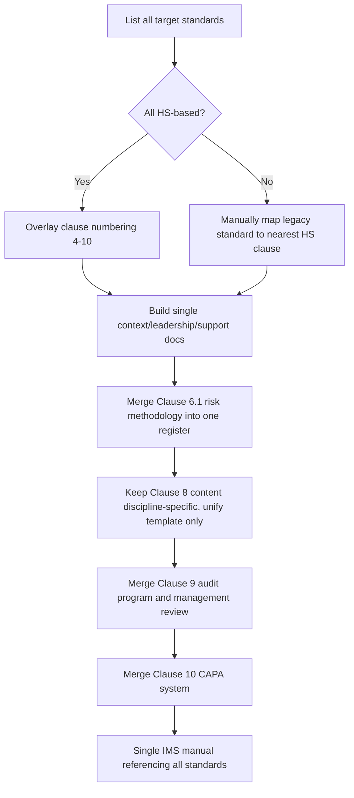

## Leveraging the Harmonized Structure for Integration

### Overview

The Harmonized Structure (HS) — formerly and still commonly referred to as Annex SL, and now designated Annex 2 of the Consolidated ISO Supplement to the ISO/IEC Directives, Part 1 — is the mandatory template that ISO committees use when drafting or revising management system standards (MSS). Its purpose is not integration for its own sake, but to make integration straightforward by design: any two HS-conformant standards already share identical clause structure, identical core text, and a common vocabulary before an organization does any integration work at all. This entry addresses how to actively exploit that structure, clause by clause, to build an integrated management system (IMS).

### Anatomy of the Harmonized Structure

**Key Points**

- 10 top-level clauses, identical in number and title across all HS-based standards:
  1. Scope
  2. Normative references
  3. Terms and definitions
  4. Context of the organization
  5. Leadership
  6. Planning
  7. Support
  8. Operation
  9. Performance evaluation
  10. Improvement
- Identical core text ("common text") is inserted verbatim into each standard for the majority of sub-clauses; committees may only add discipline-specific text, not alter or delete the common text.
- A shared set of core terms and definitions (ISO 9000-independent, defined centrally) — e.g., *organization*, *interested party*, *requirement*, *management system*, *top management*, *risk*, *competence*, *documented information*, *process*, *performance*, *objective*, *conformity*, *nonconformity*, *continual improvement* — is reused rather than redefined per standard.
- Standards built on the HS include ISO 9001, ISO 14001, ISO 45001, ISO 27001, ISO 22301, ISO 20000-1, and ISO 50001, among others.

### Clause-by-Clause Leverage Strategy

#### Clauses 1–3 (Scope, Normative References, Terms and Definitions)

These are largely standard-specific by necessity (scope defines the discipline) but the *definitions layer* can still be leveraged: build one master glossary document that lists the common HS terms once, with discipline-specific terms appended per standard, rather than repeating shared definitions in every manual.

#### Clause 4 (Context of the Organization)

- 4.1 (Understanding the organization and its context) and 4.2 (Understanding needs and expectations of interested parties) are conceptually identical across standards. A single PESTLE/SWOT-style context analysis and one interested-party register can satisfy 4.1/4.2 for every integrated standard.
- 4.3 (Scope of the management system) can be documented as one integrated scope statement covering all systems, or as parallel scope statements built from the same context analysis.
- 4.4 (Management system and its processes) supports one master process map annotated with which standard(s) govern each process.

#### Clause 5 (Leadership)

- 5.1 (Leadership and commitment) and 5.2 (Policy) text is near-identical across standards, enabling a single integrated policy statement (e.g., a combined Quality-Environment-Safety Policy) rather than separate policy documents.
- 5.3 (Roles, responsibilities and authorities) supports one RACI-style responsibility matrix spanning all integrated disciplines.

#### Clause 6 (Planning)

- 6.1 (Actions to address risks and opportunities) is the single most valuable clause to integrate: one risk/opportunity methodology, one register, with a "discipline" tag per entry (quality, environmental, safety, security, etc.).
- 6.2 (Objectives and planning to achieve them) supports one objectives-setting process and one tracking mechanism (e.g., a balanced-scorecard-style dashboard) covering KPIs from every integrated standard.
- 6.3 (Planning of changes), present in most recent HS revisions, supports one management-of-change (MOC) procedure applicable across disciplines.

#### Clause 7 (Support)

- 7.1 (Resources) supports one resource-planning process.
- 7.2 (Competence) and 7.3 (Awareness) support one competence framework/training matrix covering roles across all systems.
- 7.4 (Communication) supports one internal/external communication plan.
- 7.5 (Documented information) supports one document and record control procedure, one document numbering/naming convention, and one document repository — this is typically the highest-value, lowest-effort integration point.

#### Clause 8 (Operation)

The point of maximum divergence. Sub-clause numbering and titles differ meaningfully between standards (e.g., ISO 9001's design and development, ISO 45001's hazard elimination and risk reduction, ISO 27001's Annex A controls). Leverage strategy here is procedural rather than content-level: use one common *template and control logic* (plan → control → verify → record) so that operational procedures look and behave consistently even though their technical content is discipline-specific.

#### Clause 9 (Performance Evaluation)

- 9.1 (Monitoring, measurement, analysis and evaluation) supports one performance-measurement framework and one data-collection cadence.
- 9.2 (Internal audit) supports a single integrated audit program, integrated audit schedule, and combined checklists mapped to each standard's specific requirements.
- 9.3 (Management review) supports one management review meeting with a combined agenda addressing every standard's required inputs and outputs in a single set of minutes.

#### Clause 10 (Improvement)

- 10.1 (General), 10.2 (Nonconformity and corrective action), and 10.3 (Continual improvement) support a single corrective/preventive action (CAPA) system with a classification field for which management system(s) the finding relates to.

### Comparative Clause Mapping Table

| HS Clause | ISO 9001:2015 | ISO 14001:2015 | ISO 45001:2018 | Integration Leverage |
| --- | --- | --- | --- | --- |
| 4.1 | Organization/context | Organization/context | Organization/context | Single context analysis |
| 5.2 | Quality policy | Environmental policy | OH&S policy | Single integrated policy |
| 6.1 | Risk/opportunity re: conformity | Environmental aspects/impacts | Hazard identification | Single risk register, tagged by discipline |
| 7.5 | Documented information | Documented information | Documented information | Single document control system |
| 9.2 | Internal audit | Internal audit | Internal audit | Single audit program |
| 9.3 | Management review | Management review | Management review | Single review meeting |
| 10.2 | Nonconformity/CA | Nonconformity/CA | Incident investigation/CA | Single CAPA system |

### Diagram: Clause Alignment Across Standards (svg_diagram)

<svg xmlns="http://www.w3.org/2000/svg" viewBox="0 0 760 460">
<rect x="0" y="0" width="760" height="460" fill="#ffffff" />
<text x="380" y="24" text-anchor="middle" font-size="15" font-weight="bold" fill="#1a1a1a">Clause Alignment Across Standards (svg_diagram)</text>

<text x="130" y="55" text-anchor="middle" font-size="12" font-weight="bold" fill="`#1e3a8a`">ISO 9001</text>

<text x="380" y="55" text-anchor="middle" font-size="12" font-weight="bold" fill="`#166534`">ISO 14001</text>

<text x="630" y="55" text-anchor="middle" font-size="12" font-weight="bold" fill="`#991b1b`">ISO 45001</text>

<g font-size="11">
<rect x="40" y="70" width="180" height="28" fill="#dbeafe" stroke="#1e40af" />
<text x="130" y="88" text-anchor="middle" fill="#1e3a8a">4. Context</text>
<rect x="290" y="70" width="180" height="28" fill="#dcfce7" stroke="#166534" />
<text x="380" y="88" text-anchor="middle" fill="#14532d">4. Context</text>
<rect x="540" y="70" width="180" height="28" fill="#fee2e2" stroke="#991b1b" />
<text x="630" y="88" text-anchor="middle" fill="#7f1d1d">4. Context</text>



```
<rect x="40" y="108" width="180" height="28" fill="#dbeafe" stroke="#1e40af" />
<text x="130" y="126" text-anchor="middle" fill="#1e3a8a">5. Leadership</text>
<rect x="290" y="108" width="180" height="28" fill="#dcfce7" stroke="#166534" />
<text x="380" y="126" text-anchor="middle" fill="#14532d">5. Leadership</text>
<rect x="540" y="108" width="180" height="28" fill="#fee2e2" stroke="#991b1b" />
<text x="630" y="126" text-anchor="middle" fill="#7f1d1d">5. Leadership</text>

<rect x="40" y="146" width="180" height="28" fill="#dbeafe" stroke="#1e40af" />
<text x="130" y="164" text-anchor="middle" fill="#1e3a8a">6. Planning</text>
<rect x="290" y="146" width="180" height="28" fill="#dcfce7" stroke="#166534" />
<text x="380" y="164" text-anchor="middle" fill="#14532d">6. Planning</text>
<rect x="540" y="146" width="180" height="28" fill="#fee2e2" stroke="#991b1b" />
<text x="630" y="164" text-anchor="middle" fill="#7f1d1d">6. Planning</text>

<rect x="40" y="184" width="180" height="28" fill="#dbeafe" stroke="#1e40af" />
<text x="130" y="202" text-anchor="middle" fill="#1e3a8a">7. Support</text>
<rect x="290" y="184" width="180" height="28" fill="#dcfce7" stroke="#166534" />
<text x="380" y="202" text-anchor="middle" fill="#14532d">7. Support</text>
<rect x="540" y="184" width="180" height="28" fill="#fee2e2" stroke="#991b1b" />
<text x="630" y="202" text-anchor="middle" fill="#7f1d1d">7. Support</text>

<rect x="40" y="222" width="180" height="28" fill="#fef9c3" stroke="#92400e" stroke-dasharray="4,2" />
<text x="130" y="240" text-anchor="middle" fill="#78350f">8. Design/Dev (unique)</text>
<rect x="290" y="222" width="180" height="28" fill="#fef9c3" stroke="#92400e" stroke-dasharray="4,2" />
<text x="380" y="240" text-anchor="middle" fill="#78350f">8. Aspects/Impacts (unique)</text>
<rect x="540" y="222" width="180" height="28" fill="#fef9c3" stroke="#92400e" stroke-dasharray="4,2" />
<text x="630" y="240" text-anchor="middle" fill="#78350f">8. Hazard Control (unique)</text>

<rect x="40" y="260" width="180" height="28" fill="#dbeafe" stroke="#1e40af" />
<text x="130" y="278" text-anchor="middle" fill="#1e3a8a">9. Perf. Eval</text>
<rect x="290" y="260" width="180" height="28" fill="#dcfce7" stroke="#166534" />
<text x="380" y="278" text-anchor="middle" fill="#14532d">9. Perf. Eval</text>
<rect x="540" y="260" width="180" height="28" fill="#fee2e2" stroke="#991b1b" />
<text x="630" y="278" text-anchor="middle" fill="#7f1d1d">9. Perf. Eval</text>

<rect x="40" y="298" width="180" height="28" fill="#dbeafe" stroke="#1e40af" />
<text x="130" y="316" text-anchor="middle" fill="#1e3a8a">10. Improvement</text>
<rect x="290" y="298" width="180" height="28" fill="#dcfce7" stroke="#166534" />
<text x="380" y="316" text-anchor="middle" fill="#14532d">10. Improvement</text>
<rect x="540" y="298" width="180" height="28" fill="#fee2e2" stroke="#991b1b" />
<text x="630" y="316" text-anchor="middle" fill="#7f1d1d">10. Improvement</text>
```

</g>

<text x="380" y="350" text-anchor="middle" font-size="11" fill="`#374151`">Solid blue/green/red = directly harmonizable via common text</text>

<text x="380" y="368" text-anchor="middle" font-size="11" fill="`#78350f`">Dashed yellow = discipline-specific, procedural-shell integration only</text>

<rect x="180" y="395" width="400" height="45" rx="6" fill="#f3f4f6" stroke="#374151" />
<text x="380" y="420" text-anchor="middle" font-size="12" font-weight="bold" fill="#111827">Single IMS Documentation Layer</text>
</svg>

### Practical Leverage Workflow (Mermaid)



### Benefits of Leveraging the HS Directly

- **Lower documentation volume**: shared clauses (4, 5, 7, 9, 10) can drop from N separate documents to one per topic.
- **Faster onboarding for auditors and staff**: one clause structure to learn, applicable to every certification the organization holds.
- **Easier addition of future standards**: because new HS-based standards (e.g., adding ISO 27001 later) slot into the same clause skeleton, expanding the IMS scope requires incremental work rather than a redesign.
- **Reduced audit fatigue**: combined audits against a shared clause structure reduce the number of separate audit visits and interviews required per site.

### Common Pitfalls

- **Over-integrating Clause 8**: forcing genuinely different operational content (e.g., product inspection vs. hazard elimination hierarchy) into one generic procedure can weaken technical rigor. [Inference]
- **Treating common text as customizable**: committees are restricted from altering HS common text, and organizations should likewise avoid rewriting the shared clause language in ways that break equivalence between standards.
- **Ignoring standards outside the HS**: not all quality/management-adjacent standards use the HS (e.g., older or sector-specific standards); these require manual clause-mapping before they can be folded into the harmonized documentation set.
- **Assuming "harmonized" means "identical outcome"**: shared structure aligns *where* requirements sit, not *what* evidence satisfies them — audit evidence still needs to be discipline-appropriate. [Inference]

### Conclusion

The Harmonized Structure is the technical enabler that makes multi-standard integration efficient rather than merely aspirational. By systematically leveraging its identical clause numbering, common text, and shared terminology — clause 4 through clause 7, and clause 9 through clause 10 in particular — an organization can consolidate the majority of its management system documentation into a single set of artifacts, reserving discipline-specific effort for Clause 8 operational content where the underlying technical requirements genuinely diverge.

### Related Topics

- Principles of Integrating Multiple ISO Standards
- Annex SL history and evolution into the Harmonized Structure (Annex 2)
- Building a single integrated risk register across quality, environmental, and safety domains
- Integrated document control and documented information systems
- Designing combined internal audit programs across multiple standards
- Integrated management review: structuring a single multi-standard agenda
- Handling standards outside the Harmonized Structure in an IMS
- Transitioning from parallel to integrated management systems: a phased roadmap