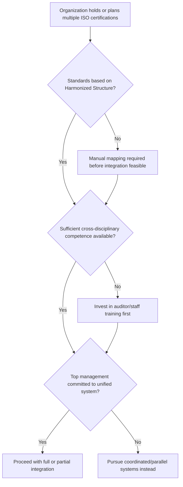

## Benefits and Challenges of an Integrated Management System

### Overview

An Integrated Management System (IMS) consolidates two or more ISO management system standards (e.g., ISO 9001, ISO 14001, ISO 45001, ISO 27001) into one operating framework, enabled structurally by the Harmonized Structure (Annex SL/Annex 2). While integration is technically feasible for any Harmonized-Structure-based standards, the decision to integrate carries real organizational trade-offs. This entry catalogs the benefits and challenges systematically, by category, to support informed decision-making around IMS adoption and scope.

### Benefits

#### 1. Efficiency and Cost Reduction

- **Reduced documentation volume**: shared clauses (Context, Leadership, Support, Performance Evaluation, Improvement) are documented once instead of once per standard.
- **Reduced audit costs**: combined external certification audits (where certification bodies support integrated audits) reduce total audit days compared to fully separate audit cycles for each standard.
- **Shared administrative overhead**: one document control system, one training/competence matrix, and one internal audit program reduce duplicated administrative labor.
- **Lower total cost of ownership over time**: initial integration effort is offset by reduced ongoing maintenance of parallel systems. [Inference]

#### 2. Improved Consistency and Reduced Duplication

- A single risk methodology avoids contradictory risk scoring or terminology between, for example, a quality risk register and a safety hazard register.
- Common terminology (as defined in the Harmonized Structure) reduces miscommunication between departments that previously used discipline-specific jargon for equivalent concepts.
- Uniform document templates and numbering conventions reduce the chance of conflicting or outdated procedures circulating simultaneously.

#### 3. Holistic Management Visibility

- A single management review meeting surfaces quality, environmental, and safety performance together, allowing top management to see cross-domain patterns (e.g., a supplier quality issue that also carries an environmental compliance risk) that siloed reviews might miss.
- Consolidated KPI dashboards support better-informed resource allocation decisions across departments.

#### 4. Streamlined Compliance and Audit Readiness

- One internal audit program mapped against multiple standards' clauses reduces audit fatigue on process owners, who are interviewed once instead of multiple times per year for overlapping topics.
- Consistent documented information formats make it easier to demonstrate compliance to external auditors and regulators across multiple frameworks simultaneously.

#### 5. Improved Employee Engagement and Culture

- A single, coherent management system (rather than three or four competing sets of procedures) reduces confusion for staff who must follow the rules day to day.
- Integration can reinforce a unified organizational culture around quality, safety, and environmental responsibility as facets of the same operational discipline rather than separate compliance burdens. [Inference]

#### 6. Scalability for Future Standards

- Because new Harmonized-Structure-based standards slot into the same clause skeleton, an organization can add certifications (e.g., ISO 27001 for information security, ISO 22301 for business continuity) incrementally without redesigning the entire management system.

### Challenges

#### 1. Complexity of Initial Integration

- Merging existing standalone systems requires a detailed gap analysis to identify where clause content is genuinely equivalent versus where it only appears similar on the surface.
- Legacy standards not built on the Harmonized Structure require manual clause-mapping effort before integration is possible.
- Organizations with deeply entrenched standalone systems (e.g., a mature, decades-old quality system merging with a newly adopted safety system) may face significant rework of existing documentation. [Inference]

#### 2. Risk of Over-Generalization in Operational Controls (Clause 8)

- Operational requirements are the least harmonizable part of most management system standards (e.g., ISO 9001's design and development controls vs. ISO 45001's hierarchy of hazard controls).
- Forcing genuinely distinct operational content into a single generic procedure can weaken the technical rigor each standard individually demands. [Inference]

#### 3. Organizational Resistance and Change Management

- Departments accustomed to owning a standalone system (e.g., a dedicated EHS team with its own procedures and audit cycle) may resist merging documentation ownership or reporting lines.
- Integration often requires renegotiating roles and responsibilities, which can surface territorial or political friction within an organization. [Inference]
- Success typically depends on strong, visible top-management sponsorship, since Clause 5 (Leadership) responsibilities span the entire integrated system rather than a single department.

#### 4. Auditor and Internal Resource Competence

- Internal auditors need cross-disciplinary competence to audit an integrated system effectively; auditors trained only in one discipline (e.g., quality) may not adequately assess environmental or safety-specific requirements embedded in the same integrated process.
- External certification bodies vary in their capability and willingness to conduct combined/integrated audits; not all certification bodies offer single-visit multi-standard audits. [Unverified — varies by certification body and region]

#### 5. Risk of Diluted Focus

- If integration is pursued primarily for cost savings, discipline-specific requirements can receive insufficient attention, especially in Clause 8 operational areas where distinct competencies (e.g., environmental science vs. industrial safety engineering) are required. [Inference]
- Combined management reviews or audits with limited time allocated per topic risk becoming superficial across all disciplines rather than substantive in any. [Inference]

#### 6. Version and Revision Misalignment

- ISO standards are revised on independent cycles (e.g., ISO 9001:2015 vs. ISO 45001:2018), meaning an integrated system may need to accommodate one standard's revised clause content while another remains on an older edition, temporarily reintroducing structural asymmetry.

### Benefits vs. Challenges Summary Table

| Dimension | Benefit | Corresponding Challenge |
| --- | --- | --- |
| Documentation | Reduced volume, single manual | Requires significant upfront gap analysis and rework |
| Risk Management | Unified risk register, consistent methodology | Risk of inadequate discipline-specific risk criteria |
| Audits | Fewer audit days, combined program | Requires cross-trained auditors; not all CBs support it |
| Culture | Unified organizational focus on compliance | Departmental resistance to losing standalone ownership |
| Operational Controls | Shared procedural template | Risk of over-generalizing technically distinct controls |
| Scalability | Easy to add new HS-based standards | Version/revision misalignment across standards over time |

### Diagram: Benefit-Challenge Balance Across IMS Domains (svg_diagram)

<svg xmlns="http://www.w3.org/2000/svg" viewBox="0 0 760 400">
<rect x="0" y="0" width="760" height="400" fill="#ffffff" />
<text x="380" y="24" text-anchor="middle" font-size="15" font-weight="bold" fill="#1a1a1a">Benefit-Challenge Balance Across IMS Domains (svg_diagram)</text>
<line x1="80" y1="200" x2="720" y2="200" stroke="#9ca3af" stroke-width="1" />
<text x="30" y="90" font-size="11" fill="#166534" font-weight="bold">Benefits</text>
<text x="30" y="320" font-size="11" fill="#991b1b" font-weight="bold">Challenges</text>
<rect x="90" y="150" width="140" height="45" fill="#dcfce7" stroke="#166534" />
<text x="160" y="168" text-anchor="middle" font-size="10" fill="#14532d">Documentation</text>
<text x="160" y="184" text-anchor="middle" font-size="9" fill="#14532d">Reduced volume</text>
<rect x="90" y="205" width="140" height="60" fill="#fee2e2" stroke="#991b1b" />
<text x="160" y="223" text-anchor="middle" font-size="10" fill="#7f1d1d">Documentation</text>
<text x="160" y="238" text-anchor="middle" font-size="9" fill="#7f1d1d">Upfront gap</text>
<text x="160" y="252" text-anchor="middle" font-size="9" fill="#7f1d1d">analysis effort</text>
<rect x="250" y="130" width="140" height="65" fill="#dcfce7" stroke="#166534" />
<text x="320" y="148" text-anchor="middle" font-size="10" fill="#14532d">Risk Mgmt</text>
<text x="320" y="163" text-anchor="middle" font-size="9" fill="#14532d">Unified register,</text>
<text x="320" y="177" text-anchor="middle" font-size="9" fill="#14532d">consistent method</text>
<rect x="250" y="205" width="140" height="45" fill="#fee2e2" stroke="#991b1b" />
<text x="320" y="223" text-anchor="middle" font-size="10" fill="#7f1d1d">Risk Mgmt</text>
<text x="320" y="238" text-anchor="middle" font-size="9" fill="#7f1d1d">Discipline dilution</text>
<rect x="410" y="140" width="140" height="55" fill="#dcfce7" stroke="#166534" />
<text x="480" y="158" text-anchor="middle" font-size="10" fill="#14532d">Audits</text>
<text x="480" y="173" text-anchor="middle" font-size="9" fill="#14532d">Fewer audit days</text>
<rect x="410" y="205" width="140" height="65" fill="#fee2e2" stroke="#991b1b" />
<text x="480" y="223" text-anchor="middle" font-size="10" fill="#7f1d1d">Audits</text>
<text x="480" y="238" text-anchor="middle" font-size="9" fill="#7f1d1d">Needs cross-trained</text>
<text x="480" y="252" text-anchor="middle" font-size="9" fill="#7f1d1d">auditors</text>
<rect x="570" y="150" width="140" height="45" fill="#dcfce7" stroke="#166534" />
<text x="640" y="168" text-anchor="middle" font-size="10" fill="#14532d">Culture</text>
<text x="640" y="184" text-anchor="middle" font-size="9" fill="#14532d">Unified focus</text>
<rect x="570" y="205" width="140" height="60" fill="#fee2e2" stroke="#991b1b" />
<text x="640" y="223" text-anchor="middle" font-size="10" fill="#7f1d1d">Culture</text>
<text x="640" y="238" text-anchor="middle" font-size="9" fill="#7f1d1d">Departmental</text>
<text x="640" y="252" text-anchor="middle" font-size="9" fill="#7f1d1d">resistance</text>
</svg>

### Decision Flow: Should an Organization Integrate? (Mermaid)

### Conclusion

An Integrated Management System offers substantial efficiency, consistency, and visibility benefits, largely made possible by the Harmonized Structure's common clauses and terminology. These benefits are counterbalanced by real implementation challenges: the complexity of initial integration, the risk of over-generalizing operationally distinct requirements, organizational resistance to change, and the need for cross-disciplinary competence among auditors and staff. Organizations considering integration should weigh these factors explicitly — full integration is not automatically the optimal choice for every organization, and partial integration or coordinated parallel systems may better preserve discipline-specific rigor where operational requirements diverge significantly.

### Related Topics

- Principles of Integrating Multiple ISO Standards
- Leveraging the Harmonized Structure for Integration
- Integration models: full, partial, and coordinated approaches
- Change management strategies for IMS implementation
- Cross-disciplinary internal auditor training and competence requirements
- Combined vs. sequential external certification audits
- Common failure modes in IMS rollouts and mitigation strategies
- Measuring return on investment for management system integration