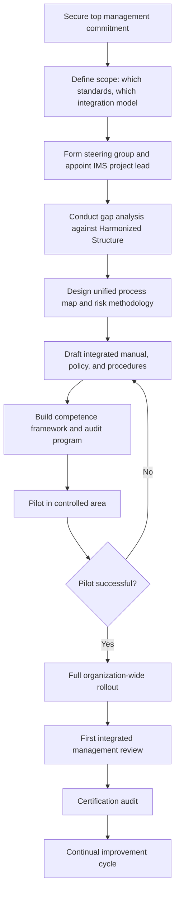

## Developing an Integrated Management System Implementation Strategy

### Overview

Developing an implementation strategy for an Integrated Management System (IMS) is the structured planning phase that translates the *principles* of integration (Harmonized Structure alignment, unified risk management, consolidated documentation) into an executable project. Unlike ad hoc integration, a deliberate strategy sequences activities, allocates resources, defines scope boundaries, and establishes governance to manage the organizational change involved. This entry provides a phased implementation framework applicable to organizations integrating any combination of Harmonized-Structure-based standards (e.g., ISO 9001, ISO 14001, ISO 45001, ISO 27001).

### Strategic Prerequisites

**Key Points**

- Top management commitment must be secured and visible before implementation begins, since Clause 5 (Leadership) responsibilities span the entire integrated scope.
- A business case should be articulated in terms of cost reduction, risk reduction, audit efficiency, and/or strategic positioning (e.g., customer or regulatory requirements driving multi-certification).
- Scope decision: determine which standards will be integrated, and whether the goal is full integration, partial/aligned integration, or coordinated parallel systems (see *Benefits and Challenges of an Integrated Management System*).
- Resourcing decision: identify a project sponsor (typically a senior executive), an IMS project lead/champion, and a cross-functional steering group representing each discipline being integrated.

### Phase 1: Diagnostic and Gap Analysis

- **Inventory existing systems**: catalog all current management system documentation (manuals, procedures, work instructions, records) per standard currently in place.
- **Map against the Harmonized Structure**: for each existing document, identify which HS clause(s) it corresponds to; flag standards not yet HS-aligned for manual mapping.
- **Identify overlap and conflict**: locate areas where two standards impose contradictory or duplicative requirements (e.g., differing risk scoring scales, differing document approval workflows).
- **Assess organizational readiness**: evaluate staff competence, cultural attitudes toward change, and the maturity of existing systems (a well-embedded, mature ISO 9001 system is a stronger integration foundation than a recently certified one). [Inference]
- **Output**: a gap analysis report identifying integration opportunities, conflicts requiring resolution, and estimated effort per clause area.

### Phase 2: Strategy and Design

- **Define the target IMS architecture**: decide the integration model per clause — which clauses (typically 4, 5, 7, 9, 10) will be fully merged into single documents, and which (typically Clause 8 operational content) will retain discipline-specific detail within a common procedural template.
- **Design the unified process map**: build a single set of core, support, and management processes annotated with which standard(s) govern each process step.
- **Design the integrated risk methodology**: select a single risk/opportunity assessment methodology (e.g., likelihood × severity matrix) capable of accommodating quality, environmental, safety, and/or security risk categories under one register with discipline tagging.
- **Design the document control architecture**: establish one document numbering convention, one repository/document management system, one review/approval workflow, and one record-retention schedule.
- **Set implementation milestones and timeline**: sequence work realistically; large multi-standard integrations for complex organizations commonly span 6–18 months depending on scope and organizational size. [Inference]

### Phase 3: Development and Documentation

- **Draft the integrated manual/policy**: produce a single top-level document (or a small set of documents) addressing Clauses 4–10 with discipline-specific annexes where needed.
- **Consolidate policies**: merge separate quality, environmental, and safety (etc.) policy statements into a single integrated policy signed by top management, satisfying Clause 5.2 for each standard.
- **Build the competence and training framework**: create one training matrix mapping roles to required competencies across all integrated disciplines (Clause 7.2/7.3).
- **Develop the integrated internal audit program**: create one audit schedule and combined checklists cross-referencing each standard's specific clause requirements, and identify/train auditors with cross-disciplinary competence.
- **Develop the integrated CAPA (corrective and preventive action) system**: one nonconformity/incident logging and investigation process with a discipline-classification field (Clause 10.2).

### Phase 4: Pilot and Validation

- **Pilot in a controlled area**: trial the integrated documentation and processes in one department, site, or process area before full rollout, to surface practical issues.
- **Conduct internal audits against the new IMS**: validate that the integrated system actually satisfies each standard's specific requirements, not just the common HS clauses.
- **Gather staff feedback**: assess usability of consolidated procedures, particularly at the Clause 8 boundary where discipline-specific content meets the common procedural template.
- **Refine based on pilot findings**: adjust document structure, training materials, or process design before organization-wide deployment.

### Phase 5: Full Rollout and Management Review

- **Deploy organization-wide**: roll out finalized integrated documentation, retire superseded standalone documents, and communicate changes to all affected staff.
- **Conduct the first integrated management review**: hold a single review meeting addressing required inputs/outputs for every integrated standard (customer feedback, environmental compliance status, incident data, risk register updates, audit results, etc.).
- **Pursue certification**: engage the certification body to conduct either a combined/integrated audit (where supported) or coordinated audits against the new integrated documentation.

### Phase 6: Continual Improvement

- **Monitor integrated KPIs**: track performance across all disciplines via the unified performance-evaluation framework (Clause 9.1).
- **Maintain the integrated risk register**: update as context, hazards, aspects, and threats change (Clause 6.1).
- **Periodically reassess integration scope**: as new standards are adopted or existing standards are revised, revisit the IMS architecture to accommodate them incrementally.

### Implementation Governance Structure

| Role | Responsibility |
| --- | --- |
| Executive Sponsor | Secures resources, removes organizational barriers, chairs/attends management review |
| IMS Project Lead | Coordinates gap analysis, design, documentation development, and rollout |
| Discipline Representatives (Quality, EHS, Security, etc.) | Provide technical input for Clause 8 discipline-specific content, validate that integration does not weaken domain rigor |
| Internal Audit Lead | Develops the integrated audit program, trains cross-disciplinary auditors |
| Document Control Owner | Maintains the single document repository, numbering convention, and version control |

### Diagram: IMS Implementation Strategy Phases (svg_diagram)

<svg xmlns="http://www.w3.org/2000/svg" viewBox="0 0 780 320">
<rect x="0" y="0" width="780" height="320" fill="#ffffff" />
<text x="390" y="24" text-anchor="middle" font-size="15" font-weight="bold" fill="#1a1a1a">IMS Implementation Strategy Phases (svg_diagram)</text>
<g font-size="11">
<rect x="20" y="60" width="115" height="70" rx="6" fill="#dbeafe" stroke="#1e40af" />
<text x="77" y="80" text-anchor="middle" fill="#1e3a8a" font-weight="bold">Phase 1</text>
<text x="77" y="96" text-anchor="middle" fill="#1e3a8a">Diagnostic &amp;</text>
<text x="77" y="110" text-anchor="middle" fill="#1e3a8a">Gap Analysis</text>



```
<rect x="150" y="60" width="115" height="70" rx="6" fill="#dcfce7" stroke="#166534" />
<text x="207" y="80" text-anchor="middle" fill="#14532d" font-weight="bold">Phase 2</text>
<text x="207" y="96" text-anchor="middle" fill="#14532d">Strategy &amp;</text>
<text x="207" y="110" text-anchor="middle" fill="#14532d">Design</text>

<rect x="280" y="60" width="115" height="70" rx="6" fill="#fef3c7" stroke="#92400e" />
<text x="337" y="80" text-anchor="middle" fill="#78350f" font-weight="bold">Phase 3</text>
<text x="337" y="96" text-anchor="middle" fill="#78350f">Development &amp;</text>
<text x="337" y="110" text-anchor="middle" fill="#78350f">Documentation</text>

<rect x="410" y="60" width="115" height="70" rx="6" fill="#fee2e2" stroke="#991b1b" />
<text x="467" y="80" text-anchor="middle" fill="#7f1d1d" font-weight="bold">Phase 4</text>
<text x="467" y="96" text-anchor="middle" fill="#7f1d1d">Pilot &amp;</text>
<text x="467" y="110" text-anchor="middle" fill="#7f1d1d">Validation</text>

<rect x="540" y="60" width="115" height="70" rx="6" fill="#ede9fe" stroke="#5b21b6" />
<text x="597" y="80" text-anchor="middle" fill="#4c1d95" font-weight="bold">Phase 5</text>
<text x="597" y="96" text-anchor="middle" fill="#4c1d95">Full Rollout &amp;</text>
<text x="597" y="110" text-anchor="middle" fill="#4c1d95">Mgmt Review</text>

<rect x="670" y="60" width="90" height="70" rx="6" fill="#f3f4f6" stroke="#374151" />
<text x="715" y="80" text-anchor="middle" fill="#111827" font-weight="bold">Phase 6</text>
<text x="715" y="96" text-anchor="middle" fill="#111827">Continual</text>
<text x="715" y="110" text-anchor="middle" fill="#111827">Improvement</text>
```

</g>
<line x1="135" y1="95" x2="150" y2="95" stroke="#666" stroke-width="1.5" marker-end="url(#arrow)" />
<line x1="265" y1="95" x2="280" y2="95" stroke="#666" stroke-width="1.5" marker-end="url(#arrow)" />
<line x1="395" y1="95" x2="410" y2="95" stroke="#666" stroke-width="1.5" marker-end="url(#arrow)" />
<line x1="525" y1="95" x2="540" y2="95" stroke="#666" stroke-width="1.5" marker-end="url(#arrow)" />
<line x1="655" y1="95" x2="670" y2="95" stroke="#666" stroke-width="1.5" marker-end="url(#arrow)" />
<path d="M 715 130 C 715 200, 77 200, 77 130" stroke="#666" stroke-width="1.5" fill="none" marker-end="url(#arrow)" />
<text x="390" y="215" text-anchor="middle" font-size="10" fill="#4b5563">Continual improvement loop feeds back into ongoing gap identification</text>
<text x="390" y="270" text-anchor="middle" font-size="11" font-style="italic" fill="`#374151`">Typical duration: 6-18 months depending on organizational scope and complexity</text>

</svg>

### Implementation Sequencing Logic (Mermaid)



### Common Implementation Risks and Mitigations

| Risk | Mitigation |
| --- | --- |
| Loss of momentum after initial planning | Set visible milestones and executive-level progress reviews |
| Discipline-specific rigor lost in Clause 8 | Involve discipline representatives directly in drafting operational content |
| Staff confusion during transition | Run parallel/pilot period before retiring legacy documents; provide targeted training |
| Certification body unable to support combined audits | Confirm certification body capability early; consider coordinated audits as fallback |
| Standards revised mid-implementation | Build a modular document architecture so individual clauses can be updated without redesigning the entire IMS |

### Conclusion

A sound IMS implementation strategy sequences work through diagnostic gap analysis, deliberate architectural design, documentation development, controlled piloting, full rollout, and continual improvement, underpinned throughout by executive sponsorship and cross-disciplinary governance. The strategy should explicitly decide, clause by clause, where full harmonization is appropriate (typically Clauses 4, 5, 7, 9, and 10) and where discipline-specific rigor must be preserved within a common procedural template (typically Clause 8), rather than treating "integration" as a uniform, all-or-nothing exercise.

### Related Topics

- Principles of Integrating Multiple ISO Standards
- Leveraging the Harmonized Structure for Integration
- Benefits and Challenges of an Integrated Management System
- Change management techniques for multi-standard rollouts
- Designing an integrated internal audit program
- Structuring the first integrated management review meeting
- Selecting and briefing certification bodies for combined audits
- Governance models for ongoing IMS maintenance