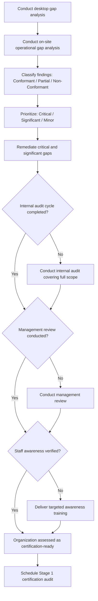

## Gap Analysis and Certification Readiness Assessment

### Overview

A gap analysis is a structured comparison between an organization's current management system practices and the requirements of a target ISO standard (e.g., ISO 9001, ISO 14001, ISO 45001, ISO 27001), performed to identify deficiencies before pursuing certification. Certification readiness assessment extends this comparison into a broader evaluation of whether the organization is genuinely prepared for a certification audit — covering not just documentary compliance but operational maturity, evidence availability, and organizational commitment. Together, these activities form the foundational diagnostic phase of any certification project.

### Purpose and Objectives

**Key Points**

- Identify clauses of the target standard that are fully met, partially met, or not met at all.
- Quantify the scope of remediation work required (documentation, process changes, training, resource allocation) before a certification audit can realistically succeed.
- Reduce the risk of major nonconformities being raised during the formal Stage 1/Stage 2 certification audit, which can delay or fail certification.
- Provide a basis for a realistic implementation timeline and resource plan.
- Establish a baseline against which post-remediation progress can be measured.

### Types of Gap Analysis

#### 1. Desktop (Documentation) Gap Analysis

Compares existing documented information (policies, procedures, records) against each clause of the target standard, without on-site verification. Fast and low-cost, but only reveals documentary gaps, not whether documented processes are actually followed in practice.

#### 2. On-Site (Operational) Gap Analysis

Involves site visits, process observation, and staff interviews to verify that documented processes are implemented as written and that objective evidence (records, data, physical controls) exists to demonstrate conformity. This is closer in rigor to an actual certification audit.

#### 3. Self-Assessment

Conducted internally by the organization's own staff (e.g., a quality manager) using a standard-specific checklist. Lower cost but carries a higher risk of bias or blind spots, since internal staff may be less objective about their own processes. [Inference]

#### 4. Third-Party (Consultant or Pre-Assessment) Gap Analysis

Conducted by an external consultant or, in some cases, the certification body itself as a formal pre-assessment service. Provides greater objectivity and often benchmarks against common findings from real certification audits, but incurs additional cost.

### Gap Analysis Methodology

#### Step 1: Define Scope

Identify the target standard(s), the physical/organizational scope (sites, departments, product/service lines) to be certified, and whether integration with existing management systems is intended.

#### Step 2: Select or Build an Assessment Checklist

Structure the checklist around the Harmonized Structure clauses (4–10) where applicable, ensuring every sub-clause of the target standard is represented as a discrete checklist item.

#### Step 3: Evidence Gathering

- Review existing documented information (policies, procedures, work instructions, records).
- Conduct interviews with process owners and staff at all levels, from top management (Clause 5 evidence) to operational staff (Clause 8 evidence).
- Observe processes in operation where feasible.
- Sample records to verify that documented processes are actually being followed (e.g., checking recent internal audit records, training records, corrective action logs).

#### Step 4: Score and Classify Findings

Each clause or sub-clause is typically classified using a consistent rating scale, for example:

| Rating | Description |
| --- | --- |
| Conformant | Requirement is fully met with objective evidence available |
| Partially Conformant | Requirement is partly addressed; evidence is incomplete or inconsistent |
| Non-Conformant | Requirement is not addressed at all, or evidence is absent |
| Not Applicable | Requirement is legitimately excluded from scope (with documented justification, per Clause 4.3 exclusions where permitted) |

#### Step 5: Prioritize and Report Findings

Findings are typically prioritized by severity and effort required to remediate:

| Priority | Criteria |
| --- | --- |
| Critical | Absence would likely constitute a major nonconformity in a certification audit (e.g., no documented policy, no internal audits conducted) |
| Significant | Would likely constitute a minor nonconformity; partial evidence exists but is inconsistent |
| Minor | Cosmetic or low-risk gaps (e.g., inconsistent document formatting) unlikely to affect audit outcome significantly |

#### Step 6: Develop a Remediation Action Plan

Each identified gap is assigned an owner, a corrective action, and a target completion date, feeding directly into the implementation project plan.

### Certification Readiness Assessment: Beyond the Gap Analysis

A gap analysis identifies *what* is missing; a readiness assessment evaluates whether the organization is *prepared* to demonstrate and sustain conformity under audit conditions. Additional readiness factors include:

- **Evidence maturity**: are records not just present, but consistent over a sufficient time period (most certification bodies expect at least one completed internal audit cycle and one management review before Stage 1)? [Inference]
- **Staff awareness**: can staff at all levels articulate the policy, their role, and relevant procedures when interviewed, not merely recite documentation from memory?
- **Internal audit completion**: has at least one full internal audit cycle covering the entire scope been completed, with resulting corrective actions closed or in progress?
- **Management review completion**: has top management conducted and documented at least one management review addressing all required inputs/outputs for the target standard?
- **Nonconformity and corrective action history**: is there a functioning, evidenced corrective action process, not just a blank log?
- **Risk and opportunity register maturity**: is the Clause 6.1 risk/opportunity process substantively populated and reviewed, not a placeholder document?

### Common Gap Areas Identified in Practice

- **Clause 6.1 (Risk and opportunities)**: often superficially addressed or treated as a formality rather than a substantive, reviewed process. [Inference]
- **Clause 9.1 (Monitoring, measurement, analysis and evaluation)**: organizations frequently lack a clear method for determining what needs to be monitored and how results are analyzed, beyond ad hoc data collection. [Inference]
- **Clause 9.2 (Internal audit)**: incomplete audit programs, audits not covering the full scope, or audits conducted by non-independent personnel.
- **Clause 9.3 (Management review)**: reviews held without addressing all required inputs (e.g., missing risk register updates, missing external/internal issue review).
- **Clause 7.2 (Competence)**: training records exist but are not linked to a documented competence requirement per role.
- **Clause 10.2 (Nonconformity and corrective action)**: corrective actions recorded but root cause analysis is superficial or absent.

### Gap Analysis Output Example

**Output**

| Clause | Requirement Summary | Current Status | Rating | Priority | Action Required |
| --- | --- | --- | --- | --- | --- |
| 4.1 | Determine internal/external issues | Informal awareness only, not documented | Non-Conformant | Critical | Document context analysis (PESTLE/SWOT) |
| 5.2 | Establish and communicate policy | Policy exists but not communicated to all staff | Partially Conformant | Significant | Add policy communication/training step |
| 6.1 | Address risks and opportunities | Risk register exists, last updated 18 months ago | Partially Conformant | Significant | Reinstate periodic risk review cadence |
| 7.5 | Control documented information | Version control inconsistent across departments | Partially Conformant | Significant | Implement centralized document control system |
| 9.2 | Internal audit program | No internal audits conducted to date | Non-Conformant | Critical | Establish and execute audit program before Stage 1 |
| 9.3 | Management review | Not yet conducted | Non-Conformant | Critical | Schedule and conduct first management review |

### Diagram: Gap Analysis to Certification Readiness Flow (svg_diagram)

<svg xmlns="http://www.w3.org/2000/svg" viewBox="0 0 760 380">
<rect x="0" y="0" width="760" height="380" fill="#ffffff" />
<text x="380" y="24" text-anchor="middle" font-size="15" font-weight="bold" fill="#1a1a1a">Gap Analysis to Certification Readiness Flow (svg_diagram)</text>
<rect x="30" y="55" width="160" height="50" rx="6" fill="#dbeafe" stroke="#1e40af" />
<text x="110" y="85" text-anchor="middle" font-size="12" fill="#1e3a8a">Define Scope</text>
<rect x="220" y="55" width="160" height="50" rx="6" fill="#dcfce7" stroke="#166534" />
<text x="300" y="78" text-anchor="middle" font-size="12" fill="#14532d">Build Checklist</text>
<text x="300" y="94" text-anchor="middle" font-size="10" fill="#14532d">(HS Clauses 4-10)</text>
<rect x="410" y="55" width="160" height="50" rx="6" fill="#fef3c7" stroke="#92400e" />
<text x="490" y="85" text-anchor="middle" font-size="12" fill="#78350f">Evidence Gathering</text>
<rect x="600" y="55" width="140" height="50" rx="6" fill="#fee2e2" stroke="#991b1b" />
<text x="670" y="85" text-anchor="middle" font-size="12" fill="#7f1d1d">Score Findings</text>
<line x1="190" y1="80" x2="220" y2="80" stroke="#666" stroke-width="1.5" />
<line x1="380" y1="80" x2="410" y2="80" stroke="#666" stroke-width="1.5" />
<line x1="570" y1="80" x2="600" y2="80" stroke="#666" stroke-width="1.5" />
<line x1="670" y1="105" x2="670" y2="140" stroke="#666" stroke-width="1.5" />
<line x1="670" y1="140" x2="300" y2="140" stroke="#666" stroke-width="1.5" />
<line x1="300" y1="140" x2="300" y2="160" stroke="#666" stroke-width="1.5" />
<rect x="150" y="160" width="300" height="50" rx="6" fill="#ede9fe" stroke="#5b21b6" />
<text x="300" y="182" text-anchor="middle" font-size="12" fill="#4c1d95">Prioritize &amp; Build Remediation Plan</text>
<text x="300" y="198" text-anchor="middle" font-size="10" fill="#4c1d95">(Critical / Significant / Minor)</text>
<line x1="300" y1="210" x2="300" y2="240" stroke="#666" stroke-width="1.5" />
<rect x="120" y="240" width="360" height="80" rx="6" fill="#f3f4f6" stroke="#374151" />
<text x="300" y="262" text-anchor="middle" font-size="12" font-weight="bold" fill="#111827">Readiness Assessment</text>
<text x="300" y="280" text-anchor="middle" font-size="10" fill="#111827">Internal audit completed? Mgmt review held?</text>
<text x="300" y="296" text-anchor="middle" font-size="10" fill="#111827">Staff awareness verified? Evidence mature?</text>
<text x="300" y="312" text-anchor="middle" font-size="10" fill="#111827">CAPA process functioning?</text>
<line x1="300" y1="320" x2="300" y2="345" stroke="#666" stroke-width="1.5" />
<text x="300" y="360" text-anchor="middle" font-size="11" font-weight="bold" fill="#111827">Proceed to Stage 1 Certification Audit</text>
</svg>

### Readiness Decision Logic (Mermaid)

### Relationship to the Certification Audit Process

A thorough gap analysis and readiness assessment directly reduces risk at the formal certification stages:

- **Stage 1 audit**: primarily verifies documentation and readiness for Stage 2; a well-executed gap analysis should mean few or no surprises here.
- **Stage 2 audit**: verifies implementation and effectiveness on-site; readiness assessment factors (evidence maturity, staff awareness, completed internal audit/management review) are precisely what Stage 2 auditors probe.
- Failing to complete an internal audit cycle or management review before Stage 1 is a common and largely avoidable cause of audit delay. [Inference]

### Conclusion

Gap analysis and certification readiness assessment together form the essential diagnostic foundation for a successful ISO certification project. Gap analysis systematically compares current practice against each clause of the target standard, using a documented, on-site, or hybrid methodology to classify and prioritize findings. Readiness assessment extends this by verifying that the organization has not only documented conformity but demonstrated it through completed internal audits, management review, mature evidence, and genuine staff awareness — the same substance a certification auditor will examine during the formal Stage 1 and Stage 2 audits.

### Related Topics

- Stage 1 and Stage 2 certification audit processes
- Designing an internal audit program prior to certification
- Conducting an effective management review for certification readiness
- Common major and minor nonconformities in ISO certification audits
- Selecting a certification body and understanding accreditation
- Building a remediation action plan and project timeline post-gap-analysis
- Evidence and documented information requirements under the Harmonized Structure
- Maintaining certification: surveillance audits and recertification cycles