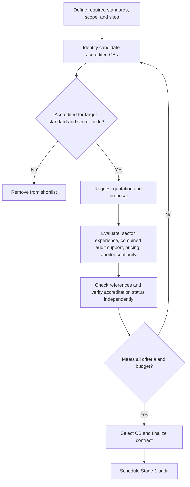

## Selecting an Accredited Certification Body

### Overview

A certification body (CB), also called a registrar, is an independent third-party organization that audits an organization's management system against an ISO standard and, if conformant, issues a certificate of conformity. Selecting an appropriately accredited certification body is a critical decision: it determines whether the resulting certificate is recognized as credible by customers, regulators, and supply chain partners, and it materially affects audit cost, quality, and experience. This entry covers accreditation fundamentals, evaluation criteria, and the selection process.

### Understanding Accreditation

**Key Points**

- Accreditation is the formal recognition, by an independent accreditation body, that a certification body is competent to perform certification audits against specific management system standards.
- Accreditation bodies themselves operate under ISO/IEC 17011, which sets requirements for bodies that accredit conformity assessment bodies.
- Certification bodies operate under ISO/IEC 17021-1, which specifies requirements for bodies providing audit and certification of management systems.
- National accreditation bodies are typically members of the International Accreditation Forum (IAF), which maintains multilateral recognition arrangements (MLA) so that accredited certificates are mutually recognized across member countries' accreditation systems.
- A certification issued by a *non-accredited* certifier may still represent a genuine audit but generally carries less international recognition and may not satisfy customer or regulatory requirements that specifically require accredited certification. [Inference]

### Why Accreditation Matters

- **Market and customer recognition**: many customers, particularly in regulated industries or global supply chains, explicitly require certificates issued by an accredited CB.
- **Audit rigor and consistency**: accredited CBs are themselves subject to periodic assessment by the accreditation body, incentivizing consistent audit quality and adherence to ISO/IEC 17021-1 requirements (auditor competence, impartiality, audit duration calculations, etc.).
- **Impartiality safeguards**: ISO/IEC 17021-1 imposes conflict-of-interest controls (e.g., a CB generally cannot certify an organization to which it has also provided consulting services within a defined period) to protect audit independence.
- **Cross-border recognition**: IAF MLA membership means a certificate from an accredited CB in one country is generally recognized as equivalent to one from an accredited CB in another member country, which matters for multinational organizations and global customers.

### Key Selection Criteria

#### 1. Accreditation Scope Verification

Confirm the CB is accredited by a recognized accreditation body (e.g., a national accreditation body that is an IAF MLA signatory) *specifically* for the standard(s) and industry sector (often identified by IAF/EA sector codes) the organization needs. Accreditation is scope-specific — a CB accredited for ISO 9001 is not automatically accredited for ISO 27001 or for every industry sector under ISO 9001.

#### 2. Industry Sector Experience

Evaluate whether the CB's auditors have relevant sector experience (e.g., manufacturing, software, healthcare, construction) since auditors need sufficient technical understanding to assess Clause 8 operational content meaningfully, even though the Harmonized Structure's common clauses are sector-agnostic.

#### 3. Geographic Coverage and Auditor Availability

For multi-site or multinational organizations, confirm the CB can provide auditors across all required locations, ideally through local or regional offices rather than relying solely on centralized travel, which affects cost and scheduling flexibility.

#### 4. Support for Integrated/Combined Audits

If the organization operates or plans an Integrated Management System (IMS) across multiple standards, confirm the CB offers combined audits (a single audit visit assessing multiple standards concurrently) rather than requiring fully separate audit cycles per standard.

#### 5. Reputation and Track Record

- Request references from existing clients in similar industries.
- Review the CB's standing with its accreditation body (accreditation bodies typically publish or can confirm accreditation status and scope on request).
- Consider how long the CB has held accreditation for the relevant standard, as a proxy for audit program maturity. [Inference]

#### 6. Cost Structure and Contract Terms

- Request a detailed quotation covering: initial certification audit (Stage 1 and Stage 2), annual surveillance audits, and the recertification audit (typically every three years).
- Clarify audit duration calculations — ISO/IEC 17021-1 requires audit time to be calculated based on factors like organizational headcount, number of sites, and process complexity, so wildly low quotes may indicate insufficient audit duration rather than genuine efficiency. [Inference]
- Understand contract length, cancellation terms, and any additional fees (e.g., for scope changes, additional sites, or unscheduled audits following a major nonconformity).

#### 7. Auditor Competence and Continuity

- Ask whether the CB assigns a consistent lead auditor across the audit cycle, which supports continuity of understanding of the organization's context, versus rotating auditors each cycle.
- Confirm auditor qualifications relevant to the specific standard(s) (e.g., IRCA-registered auditors, or equivalent recognized competence schemes).

#### 8. Communication and Responsiveness

Evaluate responsiveness during the sales/quotation process as an indicator of ongoing service quality — CBs slow to respond to inquiries may be similarly slow when scheduling audits or resolving post-audit administrative matters. [Inference]

### Evaluation Comparison Table

| Criterion | Questions to Ask |
| --- | --- |
| Accreditation | Which accreditation body accredits you for this standard and sector code? |
| Sector Experience | How many clients do you certify in our industry? |
| Combined Audits | Can you audit multiple standards in a single visit? |
| Auditor Continuity | Will we have a consistent lead auditor across the 3-year cycle? |
| Pricing Transparency | What is the full 3-year cost including surveillance and recertification? |
| Audit Duration | How is audit duration calculated for our organization size and scope? |
| References | Can you provide references from similarly sized/sector clients? |
| Nonconformity Handling | What is your process and timeline for closing corrective actions post-audit? |

### The Selection Process

#### Step 1: Define Requirements

Determine which standard(s), scope (sites, departments, products/services), and whether integrated/combined audits are needed.

#### Step 2: Shortlist Accredited CBs

Identify candidate CBs accredited by a recognized, IAF MLA-signatory accreditation body for the required standard(s) and sector code(s).

#### Step 3: Request Quotations and Proposals

Issue a request for proposal (RFP) or quotation to shortlisted CBs, providing consistent scope information to enable like-for-like comparison.

#### Step 4: Evaluate Responses

Score proposals against the criteria above — not on price alone, since audit duration and auditor competence directly affect audit value and risk of missed nonconformities. [Inference]

#### Step 5: Check References and Accreditation Status

Contact provided references and, where possible, independently verify the CB's current accreditation status and scope with the relevant accreditation body.

#### Step 6: Select and Contract

Finalize the contract, confirming audit dates, audit duration, pricing for the full three-year cycle (initial + two surveillance audits), and terms for scope changes or additional sites.

### Diagram: Certification Body Accreditation Hierarchy (svg_diagram)

<svg xmlns="http://www.w3.org/2000/svg" viewBox="0 0 700 380">
<rect x="0" y="0" width="700" height="380" fill="#ffffff" />
<text x="350" y="24" text-anchor="middle" font-size="15" font-weight="bold" fill="#1a1a1a">Certification Body Accreditation Hierarchy (svg_diagram)</text>
<rect x="230" y="50" width="240" height="50" rx="6" fill="#ede9fe" stroke="#5b21b6" />
<text x="350" y="72" text-anchor="middle" font-size="12" fill="#4c1d95">International Accreditation Forum</text>
<text x="350" y="88" text-anchor="middle" font-size="10" fill="#4c1d95">(IAF Multilateral Recognition Arrangement)</text>
<line x1="350" y1="100" x2="350" y2="130" stroke="#666" stroke-width="1.5" />
<rect x="230" y="130" width="240" height="50" rx="6" fill="#dbeafe" stroke="#1e40af" />
<text x="350" y="152" text-anchor="middle" font-size="12" fill="#1e3a8a">National Accreditation Body</text>
<text x="350" y="168" text-anchor="middle" font-size="10" fill="#1e3a8a">(operates per ISO/IEC 17011)</text>
<line x1="350" y1="180" x2="350" y2="210" stroke="#666" stroke-width="1.5" />
<rect x="230" y="210" width="240" height="50" rx="6" fill="#dcfce7" stroke="#166534" />
<text x="350" y="232" text-anchor="middle" font-size="12" fill="#14532d">Certification Body</text>
<text x="350" y="248" text-anchor="middle" font-size="10" fill="#14532d">(operates per ISO/IEC 17021-1)</text>
<line x1="350" y1="260" x2="350" y2="290" stroke="#666" stroke-width="1.5" />
<rect x="150" y="290" width="180" height="50" rx="6" fill="#fef3c7" stroke="#92400e" />
<text x="240" y="312" text-anchor="middle" font-size="12" fill="#78350f">Client Organization</text>
<text x="240" y="328" text-anchor="middle" font-size="10" fill="#78350f">(receives certificate)</text>
<rect x="370" y="290" width="180" height="50" rx="6" fill="#fee2e2" stroke="#991b1b" />
<text x="460" y="312" text-anchor="middle" font-size="12" fill="#7f1d1d">Auditors</text>
<text x="460" y="328" text-anchor="middle" font-size="10" fill="#7f1d1d">(perform on-site assessment)</text>
<line x1="330" y1="315" x2="370" y2="315" stroke="#666" stroke-width="1" stroke-dasharray="3,2" />
</svg>

### Selection Decision Flow (Mermaid)

### Common Pitfalls in Certification Body Selection

- **Choosing solely on lowest price**: unusually low quotes may reflect insufficient audit duration relative to organizational size and complexity, increasing the risk of a superficial audit. [Inference]
- **Failing to verify sector-specific accreditation scope**: a CB may hold general accreditation for a standard without accreditation for the organization's specific industry sector code.
- **Overlooking combined-audit capability**: organizations pursuing an IMS may unknowingly select a CB unable to conduct combined audits, resulting in duplicated audit visits and costs.
- **Ignoring auditor continuity**: frequent auditor rotation can extend the learning curve for the CB in each audit, potentially affecting audit efficiency and consistency. [Inference]
- **Neglecting to confirm impartiality**: engaging a CB that has also provided significant consulting services to the organization can create a conflict of interest under ISO/IEC 17021-1 impartiality requirements.

### Conclusion

Selecting an accredited certification body requires verifying not just that a CB *is* accredited, but that it is accredited for the specific standard, scope, and industry sector relevant to the organization, by a recognized accreditation body within the IAF's multilateral recognition framework. Beyond accreditation status, organizations should evaluate sector experience, combined-audit capability, auditor continuity, transparent and appropriately calculated pricing, and reputation, since these factors materially affect both the credibility of the resulting certificate and the practical value of the audit process itself.

### Related Topics

- Gap Analysis and Certification Readiness Assessment
- Stage 1 and Stage 2 certification audit processes
- ISO/IEC 17021-1 requirements for certification bodies
- ISO/IEC 17011 and the role of national accreditation bodies
- Understanding IAF sector codes and scope statements
- Surveillance audits and the three-year certification cycle
- Managing nonconformities raised during certification audits
- Switching certification bodies: process and considerations