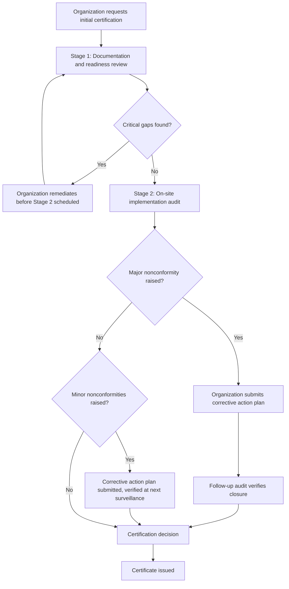

## Stage 1 and Stage 2 Certification Audits

### Overview

The initial certification audit for an ISO management system standard is conducted in two distinct stages, as required by ISO/IEC 17021-1 (Conformity assessment — Requirements for bodies providing audit and certification of management systems). Stage 1 assesses documentation and readiness; Stage 2 assesses actual implementation and operating effectiveness on-site. Both stages must be completed and findings addressed before a certification body (CB) can issue an initial certificate. This two-stage structure is designed to reduce the risk of a failed or superficial certification audit by front-loading a readiness check before committing full audit resources to Stage 2.

### Regulatory and Standards Basis

**Key Points**

- ISO/IEC 17021-1 mandates the two-stage structure for initial certification audits (though not necessarily for surveillance or recertification audits, which follow a different cadence — see *Surveillance audits and the three-year certification cycle*).
- Audit duration for both stages combined is calculated by the CB based on factors including organizational headcount, number of sites, process complexity, and risk, per ISO/IEC 17021-1 requirements — it is not an arbitrary figure set independently by sales negotiation. [Inference]
- Both stages are typically conducted by the same lead auditor (and audit team, for larger scopes) to maintain continuity of understanding.

### Stage 1 Audit

#### Purpose

Stage 1 verifies that the organization's management system is sufficiently developed and documented to justify proceeding to a full on-site Stage 2 audit. It is a readiness check, not a full conformity assessment.

#### Typical Activities

- **Review of documented information**: the auditor examines the management system manual/policy, key procedures, and evidence of Clause 4 (context, scope), Clause 5 (leadership, policy), and Clause 6 (risk/opportunities, objectives) content.
- **Verification of legal and regulatory compliance status**: particularly critical for ISO 14001 and ISO 45001, where legal/regulatory obligations form part of the standard's requirements.
- **Confirmation of internal audit and management review completion**: the auditor checks whether at least one internal audit cycle and one management review have been conducted covering the intended certification scope.
- **Site and scope confirmation**: the auditor confirms the physical locations, processes, and organizational boundaries match what will be certified, and identifies any special considerations (shift patterns, seasonal operations, multiple sites) relevant to planning Stage 2.
- **Stage 2 audit planning**: based on Stage 1 findings, the auditor finalizes the Stage 2 audit plan, including which processes, sites, and personnel will be sampled.

#### Typical Outputs

- A Stage 1 report identifying any findings that must be resolved before Stage 2 can proceed (e.g., missing legal register, incomplete risk assessment, no internal audit conducted).
- Confirmation (or delay) of the Stage 2 audit date, contingent on resolution of any critical Stage 1 findings.

#### Location

Stage 1 is often, though not always, conducted on-site; some CBs conduct Stage 1 remotely (document review plus a short on-site or virtual visit) depending on organizational context and CB practice. [Unverified — varies by certification body]

### Stage 2 Audit

#### Purpose

Stage 2 (the "certification audit" proper) evaluates whether the management system is effectively implemented and operating in practice, conforming to all applicable requirements of the standard.

#### Typical Activities

- **Process-based auditing**: auditors follow key processes end-to-end (e.g., order-to-delivery, incident reporting, document control) rather than simply working clause-by-clause, to assess how requirements interact in real operations.
- **Interviews across all levels**: from top management (verifying Clause 5 leadership commitment and policy awareness) to operational staff (verifying Clause 8 operational control awareness and competence).
- **Objective evidence sampling**: auditors sample records — internal audit reports, corrective actions, training records, calibration records, incident logs, supplier evaluations — to verify that documented processes are genuinely followed, not just described on paper.
- **On-site observation**: auditors observe actual operations, physical controls, and conditions relevant to the standard (e.g., housekeeping and hazard controls for ISO 45001; waste handling and emissions controls for ISO 14001; access controls and data handling for ISO 27001).
- **Verification of Stage 1 findings closure**: any issues identified in Stage 1 are checked for resolution.
- **Closing meeting**: auditors present findings, including any nonconformities, to management before departing.

#### Nonconformity Classification

| Classification | Definition | Effect on Certification |
| --- | --- | --- |
| Major Nonconformity | Absence or complete breakdown of a system requirement; or a number of minor nonconformities against the same requirement indicating a systemic issue | Certification withheld until corrective action is verified, typically via a follow-up visit |
| Minor Nonconformity | An isolated lapse or weakness that does not indicate a systemic breakdown | Certification may proceed; corrective action plan required, verified at next audit (often the first surveillance audit) |
| Observation / Opportunity for Improvement | Not a nonconformity, but a noted area of potential improvement or emerging risk | No formal corrective action required; informational only |

#### Typical Outputs

- A Stage 2 audit report detailing conformities, nonconformities (major/minor), and observations.
- A recommendation (or non-recommendation) for certification, submitted to the CB's internal certification decision process (a technically independent review, separate from the audit team, per ISO/IEC 17021-1 impartiality requirements).

### Stage 1 vs. Stage 2 Comparison

| Aspect | Stage 1 | Stage 2 |
| --- | --- | --- |
| Primary Focus | Documentation and readiness | Implementation and effectiveness |
| Depth | High-level review | Detailed, evidence-based sampling |
| Typical Duration | Shorter (often 1 day to a fraction of total audit time) | Majority of total calculated audit duration |
| Key Question | "Is the system ready to be audited?" | "Does the system actually work as intended?" |
| Outcome | Go/no-go decision for Stage 2, plus Stage 2 plan | Certification recommendation |

### The Certification Decision Process

Following Stage 2, the audit team's report and recommendation are submitted to the CB's certification decision function — a process required by ISO/IEC 17021-1 to be independent of the audit itself, meaning the auditors who conducted the audit do not make the final certification decision. This impartiality safeguard prevents auditor bias or relationship pressure from influencing certification outcomes.

### Diagram: Stage 1 / Stage 2 Audit Flow (svg_diagram)

<svg xmlns="http://www.w3.org/2000/svg" viewBox="0 0 760 400">
<rect x="0" y="0" width="760" height="400" fill="#ffffff" />
<text x="380" y="24" text-anchor="middle" font-size="15" font-weight="bold" fill="#1a1a1a">Stage 1 / Stage 2 Audit Flow (svg_diagram)</text>
<rect x="30" y="55" width="300" height="120" rx="6" fill="#dbeafe" stroke="#1e40af" />
<text x="180" y="78" text-anchor="middle" font-size="13" font-weight="bold" fill="#1e3a8a">Stage 1 Audit</text>
<text x="180" y="98" text-anchor="middle" font-size="10" fill="#1e3a8a">Document review</text>
<text x="180" y="114" text-anchor="middle" font-size="10" fill="#1e3a8a">Legal compliance check</text>
<text x="180" y="130" text-anchor="middle" font-size="10" fill="#1e3a8a">Internal audit/mgmt review confirmed</text>
<text x="180" y="146" text-anchor="middle" font-size="10" fill="#1e3a8a">Scope confirmation</text>
<text x="180" y="162" text-anchor="middle" font-size="10" fill="#1e3a8a">Stage 2 plan finalized</text>
<rect x="430" y="55" width="300" height="120" rx="6" fill="#dcfce7" stroke="#166534" />
<text x="580" y="78" text-anchor="middle" font-size="13" font-weight="bold" fill="#14532d">Stage 2 Audit</text>
<text x="580" y="98" text-anchor="middle" font-size="10" fill="#14532d">Process-based on-site audit</text>
<text x="580" y="114" text-anchor="middle" font-size="10" fill="#14532d">Interviews at all levels</text>
<text x="580" y="130" text-anchor="middle" font-size="10" fill="#14532d">Evidence/record sampling</text>
<text x="580" y="146" text-anchor="middle" font-size="10" fill="#14532d">Nonconformities identified</text>
<text x="580" y="162" text-anchor="middle" font-size="10" fill="#14532d">Closing meeting</text>
<line x1="330" y1="115" x2="430" y2="115" stroke="#666" stroke-width="1.5" marker-end="url(#arrow2)" />
<line x1="580" y1="175" x2="580" y2="210" stroke="#666" stroke-width="1.5" />
<rect x="430" y="210" width="300" height="50" rx="6" fill="#fef3c7" stroke="#92400e" />
<text x="580" y="232" text-anchor="middle" font-size="12" fill="#78350f">Independent Certification Decision</text>
<text x="580" y="248" text-anchor="middle" font-size="10" fill="#78350f">(separate from audit team)</text>
<line x1="580" y1="260" x2="580" y2="290" stroke="#666" stroke-width="1.5" />
<rect x="430" y="290" width="300" height="50" rx="6" fill="#fee2e2" stroke="#991b1b" />
<text x="580" y="312" text-anchor="middle" font-size="12" fill="#7f1d1d">Certificate Issued</text>
<text x="580" y="328" text-anchor="middle" font-size="10" fill="#7f1d1d">(subject to major NC closure if any)</text>
<text x="380" y="380" text-anchor="middle" font-size="11" font-style="italic" fill="`#4b5563`">Both stages required before initial certification per ISO/IEC 17021-1</text>

</svg>

### Audit Sequence Logic (Mermaid)

### Preparing for Stage 1 and Stage 2

- **Before Stage 1**: complete at least one full internal audit cycle and one management review covering the full intended scope; ensure the management system manual and key procedures are finalized and communicated (see *Gap Analysis and Certification Readiness Assessment*).
- **Between Stage 1 and Stage 2**: promptly resolve any Stage 1 findings; use the gap between stages (commonly weeks to a few months) to reinforce staff awareness and close documentation gaps.
- **Before Stage 2**: brief staff at all levels on likely interview topics relevant to their role; ensure objective evidence (records) for at least one full operating cycle is available for auditor sampling.
- **After Stage 2**: respond to any nonconformities with a timely, root-cause-based corrective action plan, since certification is typically contingent on the CB's acceptance of this plan (for major nonconformities, verified before certificate issuance; for minor nonconformities, verified at the next audit).

### Common Pitfalls

- **Treating Stage 1 as a formality**: proceeding to Stage 2 without genuinely resolving Stage 1 findings increases the risk of major nonconformities during Stage 2. [Inference]
- **Insufficient evidence history**: certifying too soon after implementation, before enough operating cycles have produced sufficient objective evidence for auditors to sample.
- **Staff unpreparedness**: staff who can recite procedures but cannot explain their practical application during interviews often trigger conformity concerns even when the underlying process is sound. [Inference]
- **Superficial root cause analysis in corrective actions**: addressing the symptom of a nonconformity without identifying and addressing the underlying root cause risks recurrence at the next audit.

### Conclusion

The two-stage certification audit structure required under ISO/IEC 17021-1 separates readiness verification (Stage 1) from implementation verification (Stage 2), reducing the risk of committing full audit resources to an organization that is not genuinely prepared. Stage 1 confirms documentation, legal compliance awareness, and completion of foundational activities (internal audit, management review); Stage 2 verifies, through process-based auditing, interviews, and evidence sampling, that the management system operates effectively in practice. Certification decisions are made independently of the audit team, and nonconformities identified at either stage must be addressed through evidenced corrective action before or shortly after certificate issuance.

### Related Topics

- Gap Analysis and Certification Readiness Assessment
- Selecting an Accredited Certification Body
- Major vs. minor nonconformity classification and corrective action
- Surveillance audits and the three-year certification cycle
- ISO/IEC 17021-1 requirements for certification bodies
- Preparing staff for certification audit interviews
- Root cause analysis techniques for corrective actions
- Recertification audits and maintaining continuous conformity