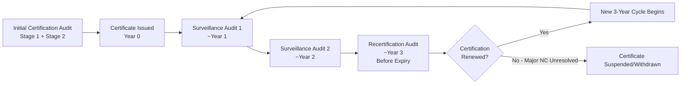
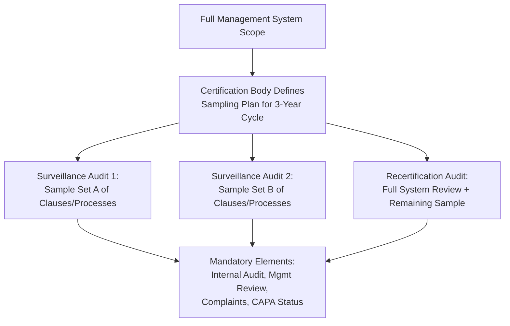
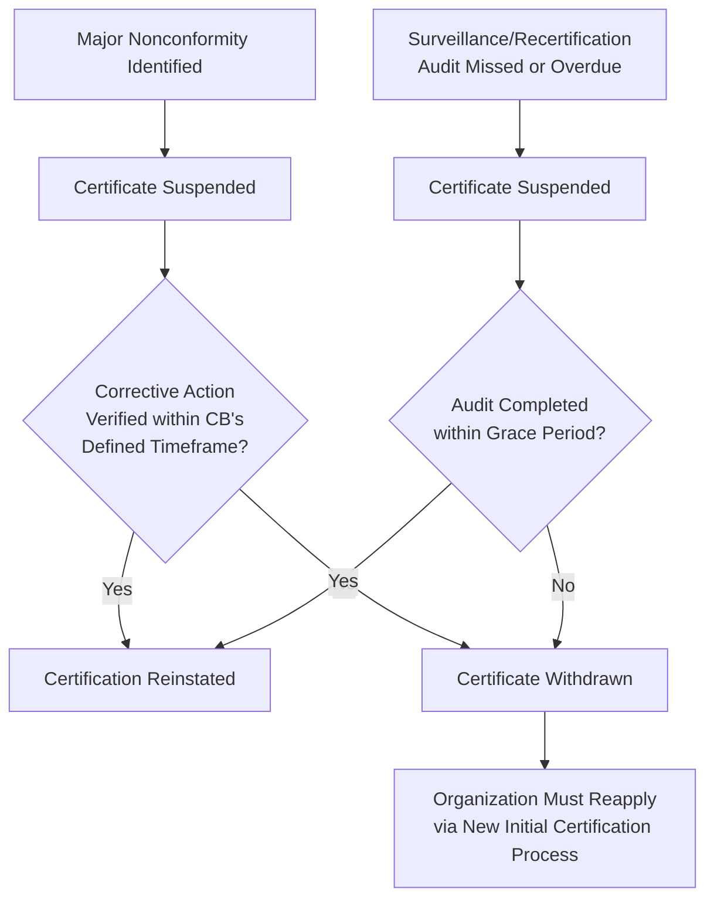

## Surveillance Audits and Recertification Cycles

### Overview

Once an organization achieves ISO management system certification (e.g., ISO 9001, ISO 27001, ISO 14001), certification is not a one-time event. Accredited certification bodies (CBs) require ongoing conformity assessment through a structured three-year certification cycle consisting of periodic surveillance audits and a recertification audit, governed primarily by ISO/IEC 17021-1 (Conformity assessment — Requirements for bodies providing audit and certification of management systems).

### The Standard Three-Year Certification Cycle

**Key Points**

- The certificate is valid for three years from the certification decision date, contingent on successful completion of surveillance audits within that period
- Surveillance audits typically occur at intervals of approximately 12 months (minimum once per 12-month period, per ISO/IEC 17021-1 requirements), though exact scheduling is set by the certification body
- The recertification audit must be completed **before** the certificate's expiry date to avoid a lapse in certification status

### Surveillance Audits

#### Purpose and Scope

Surveillance audits are periodic, partial audits conducted between certification/recertification cycles to confirm the management system continues to conform to the standard's requirements and remains effectively implemented. They are narrower in scope than the initial certification audit or recertification audit.

**Key Points**

- Surveillance audits do not re-audit the entire management system in one visit; instead, they sample specific clauses/processes on a rotating basis across the cycle, ensuring all applicable requirements are covered across the full cycle
- Mandatory elements typically reviewed at every surveillance audit include: internal audit results, management review, handling of complaints, effectiveness of corrective actions from previous nonconformities, progress on planned improvement activities, and continued use of the certification mark/logo (where applicable)
- Surveillance audit duration is generally shorter than the initial or recertification audit — [Inference] often cited as approximately one-third of the initial audit duration, though the precise calculation depends on the certification body's audit time calculation methodology (per IAF MD 5) and organizational scope/complexity

#### Surveillance Audit Sampling Logic

#### Findings and Nonconformity Classification

| Finding Type | Definition | Typical Consequence |
| --- | --- | --- |
| **Major Nonconformity** | Absence or total breakdown of a required system element, or a nonconformity that raises significant doubt about the effectiveness of the management system | Certification suspended or withheld until verified correction (often requires a follow-up or special audit) |
| **Minor Nonconformity** | A single, isolated lapse that does not affect overall system capability | Corrective action plan required, verified at next scheduled audit (or sooner, per CB policy) |
| **Observation / Opportunity for Improvement (OFI)** | Not a nonconformity, but a noted area of risk or potential improvement | No mandatory corrective action; tracked for organizational awareness |

**Key Points**

- Accumulation of multiple minor nonconformities against the same clause across audits may be escalated to a major nonconformity, since it indicates a systemic rather than isolated failure
- Certification bodies operate under strict timelines (commonly around 90 days, though this varies by CB and accreditation body policy) for the organization to submit and have accepted a corrective action response following a nonconformity, particularly a major one

### Recertification Audit

#### Purpose and Scope

The recertification audit (also called the renewal audit) occurs before certificate expiry and evaluates the continued conformity and effectiveness of the entire management system, taking into account performance over the full preceding certification cycle.

**Key Points**

- Scope is broader than a surveillance audit — it functions similarly to a Stage 2 audit but also considers the overall effectiveness trend of the system over the three-year period, including sustained resolution of prior nonconformities
- ISO/IEC 17021-1 requires the certification body to review the performance of the management system over the entire certification cycle, not just a snapshot at the time of the audit
- A successful recertification audit results in issuance of a new certificate with a new three-year validity period; the recertification audit should be completed and the certification decision made prior to expiry of the existing certificate to maintain continuity

#### Comparison: Surveillance vs. Recertification Audit

| Attribute | Surveillance Audit | Recertification Audit |
| --- | --- | --- |
| Frequency | ~Annually (within the 3-year cycle) | Once per 3-year cycle (before expiry) |
| Scope | Partial/sampled | Full management system |
| Duration | Shorter | Comparable to or approaching initial certification audit duration |
| Outcome | Continued certification (with any required corrective actions) | New 3-year certificate issued |
| Review of Historical Performance | Limited to period since last audit | Full cycle performance review |

### Certificate Suspension, Withdrawal, and Lapse

**Key Points**

- If a scheduled surveillance or recertification audit is missed or delayed beyond the certification body's allowable timeframe, the certificate may be suspended, and if unresolved, subsequently withdrawn
- A withdrawn certificate generally requires the organization to undergo the full initial certification process again (Stage 1 + Stage 2), rather than a simplified reinstatement
- Suspension differs from withdrawal: suspension is a temporary state pending correction, while withdrawal is a termination of the certification requiring reapplication

### Audit Duration Calculation Factors

Certification bodies calculate audit duration (including surveillance audits) based on factors defined in IAF Mandatory Document 5 (IAF MD 5), including:

- Number of employees (effective personnel) within the certification scope
- Number of sites/locations
- Complexity of processes and risk profile
- Number of applicable ISO clauses/Annex A controls (for standards like ISO 27001)
- Prior audit history and effectiveness of the management system

[Unverified] Exact numeric audit-day tables are published by IAF MD 5 and vary by scheme (QMS, EMS, ISMS); organizations should consult their certification body's audit program plan for scope-specific duration, since figures are not static across all accreditation bodies globally.

### Practical Example: Certification Timeline

An organization certified to ISO 9001:2015 on **January 15, 2024**:

| Milestone | Target Date | Activity |
| --- | --- | --- |
| Certificate Issued | Jan 15, 2024 | Initial certification (Stage 1 + Stage 2 complete) |
| Surveillance Audit 1 | ~Nov–Dec 2024 | Sampled clauses; review of internal audit/mgmt review since certification |
| Surveillance Audit 2 | ~Nov–Dec 2025 | Sampled remaining clauses; CAPA follow-up from SA1 |
| Recertification Audit | ~Oct–Nov 2026 (before Jan 15, 2027 expiry) | Full system review; cycle performance evaluation |
| New Certificate Issued | Before Jan 15, 2027 | New 3-year cycle begins |

**Key Points**

- Scheduling surveillance and recertification audits with sufficient lead time before expiry is critical — most CBs will not permit indefinite postponement, and a lapse in certification can affect customer contracts requiring valid certification as a condition of supply

### Organizational Responsibilities Between Audits

- **Key Points**
  - Maintaining and updating documented information reflecting actual current practice (not "audit-ready" documentation disconnected from daily operations)
  - Conducting internal audits and management reviews on schedule, since these are the most commonly sampled elements in surveillance audits
  - Tracking closure and effectiveness verification of corrective actions from prior nonconformities
  - Notifying the certification body of significant changes to the management system scope, organizational structure, or key processes, as such changes can affect the audit plan and, in some cases, trigger a special/extraordinary audit

### Common Findings Across Surveillance/Recertification Cycles

- **Key Points**
  - Internal audit programs that exist on paper but are not executed to the planned schedule or with adequate coverage across the 3-year cycle
  - Management review inputs/outputs not demonstrating a genuine feedback loop into planning and resource decisions
  - Corrective actions closed based on containment (fixing the immediate symptom) rather than root cause, resulting in recurrence flagged at the next audit
  - Organizational changes (new sites, major process changes, personnel turnover in key QMS roles) not communicated to the certification body, creating scope misalignment discovered during the audit itself

**Next Steps**

- Internal Audit Program Design and Execution (Clause 9.2)
- Management Review Inputs and Outputs (Clause 9.3)
- Corrective Action and Root Cause Analysis (Clause 10.2)
- ISO/IEC 17021-1 Requirements for Certification Bodies
- IAF Mandatory Documents (MD 1, MD 5) Overview
- Multi-Site Certification and Sampling Rules
- Transition Audits (Standard Revision Transitions, e.g., ISO 9001:2015 to future revisions)
- Special/Extraordinary Audits Triggered by Complaints or Major Organizational Change