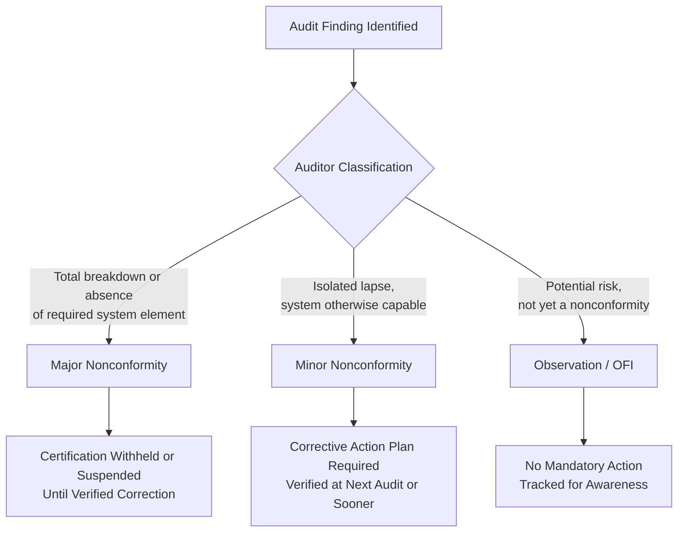
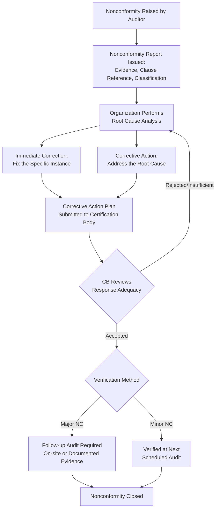

## Managing Nonconformities During Certification Audits

### Overview

Nonconformities identified during certification audits (initial, surveillance, or recertification) represent gaps between the management system's actual implementation and the requirements of the applicable standard, the organization's own documented procedures, or applicable statutory/regulatory requirements. How an organization identifies, classifies, responds to, and closes these findings directly determines whether certification is granted, maintained, suspended, or withdrawn. This process is governed by ISO/IEC 17021-1 (certification body requirements) and, for the organization's internal handling, aligns with Clause 10.2 (Nonconformity and Corrective Action) of Annex SL-based standards.

### Nonconformity Classification

**Key Points**

- **Major Nonconformity**: A nonconformity that affects the capability of the management system to achieve intended results, represents a total breakdown in meeting a requirement, or raises significant doubt that conformity can be achieved. Also triggered when multiple minor nonconformities against the same clause or requirement demonstrate a systemic (rather than isolated) failure
- **Minor Nonconformity**: A single, isolated instance of failure to meet a requirement that does not, on its own, indicate the system is incapable of achieving its intended outcomes
- **Observation / Opportunity for Improvement (OFI)**: Not a nonconformity against the standard; a noted area of risk, inefficiency, or potential future issue that the auditor flags without requiring formal corrective action

[Inference] The precise threshold for escalating repeated minor findings into a major nonconformity is a matter of auditor judgment guided by certification body procedures rather than a fixed numeric rule specified in ISO/IEC 17021-1 itself.

### The Nonconformity Response Lifecycle

#### Correction vs. Corrective Action

A critical distinction often confused in practice:

| Term | Definition | Example |
| --- | --- | --- |
| **Correction** | Action taken to eliminate a detected nonconformity itself (the immediate symptom) | Reprinting a document that was found to be an obsolete revision |
| **Corrective Action** | Action taken to eliminate the **root cause** of the nonconformity, preventing recurrence | Implementing a document control software check to prevent obsolete revisions from being issued in the first place |

**Key Points**

- A response addressing only correction without corrective action is a common reason certification bodies reject a nonconformity response as inadequate
- Root cause analysis tools commonly used include the 5 Whys, Fishbone (Ishikawa) diagrams, and Failure Mode and Effects Analysis (FMEA) for more complex or safety-critical nonconformities

### Root Cause Analysis Example: 5 Whys

**Nonconformity**: Internal audit records show planned audits were not completed for two departments within the scheduled cycle.

| Step | Question | Answer |
| --- | --- | --- |
| Why 1 | Why were the audits not completed? | The internal auditor assigned to those departments left the organization mid-cycle |
| Why 2 | Why was the audit not reassigned? | There was no formal process for reassigning audits when an auditor becomes unavailable |
| Why 3 | Why was there no reassignment process? | The internal audit program did not include contingency planning |
| Why 4 | Why did the audit program lack contingency planning? | The audit program was designed assuming static auditor availability |
| Why 5 (Root Cause) | Why was that assumption made? | The audit program procedure was not reviewed or updated since initial ISMS/QMS implementation, and turnover risk was not considered |

**Resulting Corrective Action**: Update the internal audit procedure to require a backup auditor assignment and a documented reassignment trigger when planned auditor availability changes.

### Timeframes for Response

**Key Points**

- Certification bodies typically require organizations to submit a corrective action plan within a defined window after the nonconformity is issued — [Unverified] commonly cited as approximately 30 days for the initial response plan, though exact timeframes are set by each certification body's own procedures and are not uniformly mandated by ISO/IEC 17021-1
- For major nonconformities, full implementation and verification of effectiveness is often required within a shorter window (commonly cited as around 90 days) to avoid certification being withheld or suspended — again, this figure varies by certification body policy
- For minor nonconformities, verification may be deferred to the next scheduled surveillance or recertification audit, provided a credible corrective action plan is accepted in the interim

### Verification of Corrective Action Effectiveness

Verification is not merely confirming the corrective action was implemented — it requires evidence the root cause was actually addressed and the nonconformity has not recurred.

| Verification Method | When Typically Used |
| --- | --- |
| Documentary evidence review (records, updated procedures) | Minor nonconformities; straightforward corrections |
| Follow-up audit (on-site or remote) | Major nonconformities; complex systemic issues |
| Verification at next scheduled surveillance audit | Minor nonconformities where risk of recurrence before the next audit is low |
| Extended monitoring period | Nonconformities involving process performance trends (e.g., recurring defect rates) that require observation over time to confirm effectiveness |

### Practical Example: Managing a Major Nonconformity

**Scenario**: During a Stage 2 audit for ISO/IEC 27001, the auditor finds that access rights for terminated employees were not revoked in a timely manner for three of five sampled cases, with one case showing access retained 45 days post-termination — a direct nonconformity against Annex A control A.5.18 (Access Rights) and the organization's own offboarding procedure.

**Classification**: Major — the pattern across multiple sampled cases indicates a systemic breakdown rather than an isolated lapse, and the finding involves a security-relevant control.

**Organizational Response**:

1. **Immediate correction**: Revoke access for the identified terminated employees immediately upon notification
2. **Root cause analysis**: 5 Whys reveals that offboarding notifications from HR to IT were manual (email-based) with no tracking or escalation mechanism, and no periodic access review was conducted to catch gaps
3. **Corrective action**:
   - Implement an automated offboarding workflow triggered by HR system status change
   - Introduce a quarterly access review control (potentially mapped to A.8.2 Privileged Access Rights and A.5.18)
4. **Evidence submitted to CB**: Updated procedure documentation, screenshots/configuration of the automated workflow, and a sample of subsequent offboarding cases processed correctly under the new process
5. **Verification**: Certification body conducts a follow-up audit (given major classification) focused specifically on the corrected process before certification is confirmed

### Common Pitfalls in Nonconformity Management

- **Key Points**
  - Submitting a corrective action plan addressing only the specific audit sample cited, without extending the fix system-wide (e.g., correcting the three identified employee accounts but not auditing all other terminated employees within the same period)
  - Treating certification body feedback on rejected corrective action plans as a formality rather than iterating meaningfully on the root cause analysis
  - Closing nonconformities based on documentation updates alone without operational evidence the change is actually functioning (a "paper fix")
  - Failing to consider whether a nonconformity found in one area/process indicates a similar risk elsewhere in the organization (cross-functional root cause impact)
  - Missing certification body response deadlines, which can escalate a major nonconformity into certificate suspension independent of whether the underlying technical fix was reasonable

### Appeals and Disputes

**Key Points**

- ISO/IEC 17021-1 requires certification bodies to maintain a documented appeals process, allowing organizations to formally contest a nonconformity classification or audit decision they believe was applied incorrectly
- Appeals are typically handled by personnel within the certification body who were not involved in the original audit decision, to maintain impartiality
- [Unverified] Specific appeal timeframes and procedures vary by certification body and should be confirmed against the CB's own published appeals policy rather than assumed to follow a universal timeline

**Next Steps**

- Root Cause Analysis Techniques (5 Whys, Fishbone, FMEA)
- Corrective Action Procedure Design (Clause 10.2)
- Internal Audit Program Design and Execution
- Surveillance Audits and Recertification Cycles
- ISO/IEC 17021-1 Certification Body Requirements
- Risk-Based Thinking and Preventive Action Integration
- Management Review as a CAPA Escalation Mechanism
- Building an Effective Nonconformity Tracking/CAPA System