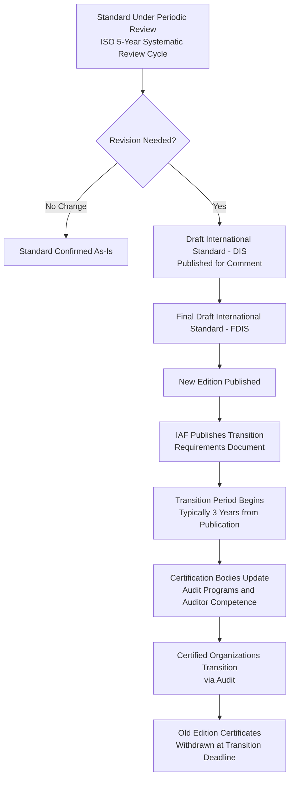
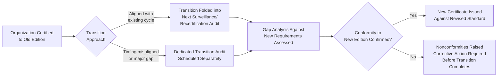
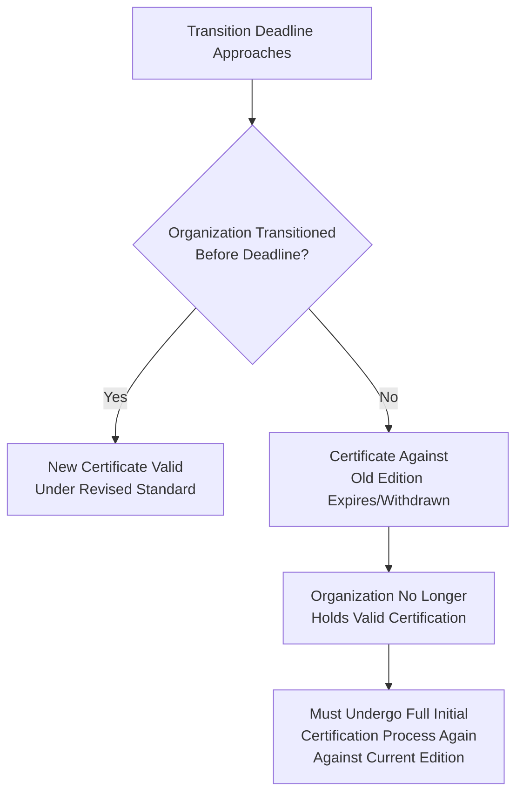

## Transitioning Certification to a Revised Standard

### Overview

When an ISO management system standard undergoes a formal revision (e.g., ISO 9001:2008 → ISO 9001:2015, or ISO/IEC 27001:2013 → ISO/IEC 27001:2022), certified organizations must transition their certification from the previous edition to the new edition within a defined transition period. This process is governed by International Accreditation Forum (IAF) mandatory documents and coordinated by the accreditation body and certification body, ensuring a consistent, time-bound global transition rather than an indefinite dual-standard state.

### The Standard Revision Lifecycle

**Key Points**

- ISO standards undergo periodic systematic review (commonly every five years) to determine whether revision, confirmation without change, or withdrawal is warranted
- Upon publication of a revised standard, the IAF typically issues a transition document specifying the mandatory transition period (commonly three years from the publication date of the new edition, though the exact duration is set per revision, not a fixed universal rule across all standards)
- After the transition deadline, certificates issued against the withdrawn (old) edition are no longer valid, and certification bodies must have withdrawn or transitioned all certificates by that date

### Transition Pathways

Certification bodies generally offer two primary pathways for organizations to transition:

| Pathway | Description | Typical Use Case |
| --- | --- | --- |
| **Combined Transition + Surveillance/Recertification Audit** | The transition assessment is integrated into an already-scheduled surveillance or recertification audit | Most common approach; minimizes additional audit cost/disruption |
| **Dedicated Transition Audit** | A standalone audit specifically focused on the gap between old and new standard requirements | Used when the revision introduces substantial new requirements (e.g., context of the organization, risk-based thinking) not easily assessed within a routine surveillance scope, or when timing does not align with the existing audit schedule |

### Organizational Transition Process

#### Phase 1: Gap Analysis

**Key Points**

- Compare the organization's current management system against the new/revised clause structure and requirements
- Identify clauses that are entirely new (no prior equivalent), clauses that have been substantially reworded, and clauses that remain materially unchanged
- Document the gap analysis as evidence of a structured transition approach — certification bodies commonly expect to see this as part of transition audit evidence

#### Phase 2: Implementation of Changes

- Update documented information (policies, procedures, risk registers, objectives) to reflect new or revised requirements
- Provide training/awareness to relevant personnel on changed requirements (particularly where the revision introduces new concepts, e.g., "context of the organization" and "risk-based thinking" introduced in the 2015 revision of ISO 9001)
- Where applicable, revise the Statement of Applicability, risk assessment methodology, or control mappings (relevant for standards like ISO/IEC 27001 where Annex A control sets themselves may be restructured)

#### Phase 3: Internal Verification

- Conduct an internal audit specifically covering the new/changed requirements before the external transition audit
- Perform a management review addressing the transition, including resource needs and residual risks

#### Phase 4: Transition Audit

- External auditor assesses conformity to the new edition's requirements, often combined with the routine surveillance/recertification audit scope
- Nonconformities raised follow the standard nonconformity management process (correction, root cause analysis, corrective action, verification)

### Example: ISO 9001:2008 to ISO 9001:2015 Transition (Illustrative)

This transition is a well-documented historical example illustrating the scale of change a revision can introduce:

| Area of Change | 2008 Edition | 2015 Edition |
| --- | --- | --- |
| Structure | Standalone clause structure | Annex SL high-level structure (harmonized across MSS) |
| Risk Approach | Preventive action (Clause 8.5.3) | Risk-based thinking integrated throughout (Clause 6.1) |
| Documentation | "Documents" and "Records" as separate terms | Unified "Documented Information" |
| Management Representative | Explicitly required role | Requirement removed; responsibilities distributed among top management/roles |
| Context of Organization | Not explicitly required | New Clause 4 requirement |
| Preventive Action | Dedicated clause (8.5.3) | Absorbed into risk-based thinking (no standalone clause) |

[Inference] The 2008-to-2015 transition is used here as a widely documented reference case; the general transition mechanics described (gap analysis, transition audit, deadline-based certificate withdrawal) apply analogously to other standard revisions (e.g., ISO/IEC 27001:2013 to 2022), though the specific content differences depend on the particular revision.

### Consequences of Missing the Transition Deadline

**Key Points**

- Missing the transition deadline is treated more severely than a routine lapsed surveillance audit — the old edition itself ceases to be a valid certification basis industry-wide, not merely for one organization's certificate
- Organizations relying on certification for contractual, regulatory, or customer-qualification purposes should plan transition well ahead of the deadline, since certification bodies typically experience scheduling capacity constraints as the deadline approaches (many organizations attempting to transition simultaneously)

### Practical Example: Planning a Transition Timeline

An organization certified to ISO/IEC 27001:2013, with the 2022 edition published and a three-year transition window:

| Milestone | Timing Relative to Publication | Activity |
| --- | --- | --- |
| New edition published | Month 0 | ISO/IEC 27001:2022 released |
| Gap analysis initiated | Month 3–6 | Internal review against restructured Annex A (93 controls, 4 themes) |
| SoA and risk assessment updated | Month 6–12 | Statement of Applicability remapped to new control structure |
| Internal audit against new requirements | Month 12–18 | Verify readiness ahead of external transition audit |
| Transition audit (combined with surveillance) | Month 18–24 | External verification; nonconformities resolved if raised |
| New certificate issued | Before Month 36 (deadline) | Certification against ISO/IEC 27001:2022 confirmed |

**Key Points**

- Scheduling the transition audit with meaningful buffer before the deadline (rather than at the last available surveillance cycle) allows time to resolve any nonconformities without risking certificate lapse

### Common Pitfalls

- **Key Points**
  - Treating the transition as a documentation relabeling exercise rather than substantively addressing new requirements (e.g., renaming a "preventive action" procedure to "risk-based thinking" without genuinely restructuring the underlying process)
  - Delaying transition planning until close to the deadline, resulting in scheduling conflicts with certification body auditor availability
  - Failing to update cross-referenced documents (e.g., integrated management system manuals referencing old clause numbers) consistently across the entire documented information set
  - Assuming the transition audit will be a light-touch review, when in practice auditors assess substantive conformity to new/changed requirements with the same rigor as any other audit finding

**Next Steps**

- Gap Analysis Methodology for Standard Revisions
- Annex SL High-Level Structure Deep Dive
- Risk-Based Thinking Implementation (Clause 6.1)
- Surveillance Audits and Recertification Cycles
- Managing Nonconformities During Certification Audits
- Statement of Applicability Remapping (ISO/IEC 27001 2013→2022)
- Internal Audit Program Updates for Revised Standards
- IAF Mandatory Documents Governing Transition Requirements