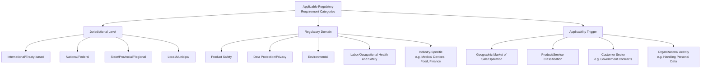
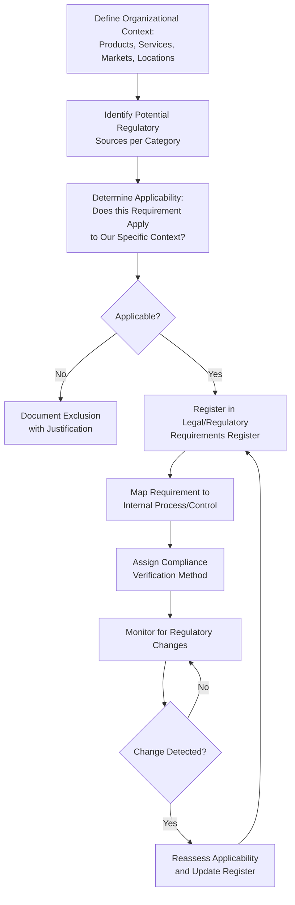

## Identifying Applicable Regulatory Requirements

### Overview

Identifying applicable regulatory requirements is a foundational activity within a Quality Management System, underpinning ISO 9001 Clause 4.2 (Understanding the Needs and Expectations of Interested Parties), Clause 6.1 (Actions to Address Risks and Opportunities), and specific product/service-related legal requirements referenced in Clause 8.2.2 and Clause 8.3.3. Failure to correctly identify applicable regulations creates compliance risk that can invalidate conformity claims even when internal quality processes are otherwise sound.

### Why Regulatory Identification Matters in QMS Context

**Key Points**

- ISO 9001 does not itself specify regulatory content — it requires the organization to determine which statutory and regulatory requirements apply to its products, services, and operations, and to build compliance verification into its processes
- Regulatory requirements often define the **minimum acceptable quality/safety threshold**, distinct from customer requirements which may exceed (but cannot fall below) regulatory minimums
- Non-identification of an applicable regulation is a systemic root cause frequently found underlying nonconformities related to product recalls, legal noncompliance, or customer complaints tied to unmet statutory obligations

### Categories of Regulatory Requirements

### The Regulatory Identification Process

#### Step-by-Step Breakdown

**1. Define Organizational Context**

- What products/services are offered, and what are their technical/functional classifications?
- In which geographic jurisdictions does the organization operate, sell, or have customers?
- What organizational activities occur (e.g., processing personal data, handling hazardous materials, employing staff, discharging emissions)?

**2. Identify Potential Regulatory Sources**

| Source Type | Examples |
| --- | --- |
| Government legal/regulatory databases | National gazettes, government agency websites (e.g., FDA, EPA, national data protection authorities) |
| Industry/sector associations | Trade body compliance bulletins, sector-specific standards bodies |
| Legal counsel or compliance consultants | Retained legal advisors, compliance subscription services |
| Customer/contractual flow-down requirements | Contracts specifying applicable regulations as a condition of supply |
| Certification/accreditation body guidance | Sector-specific certification schemes referencing regulatory baselines |

**3. Determine Applicability**

Not every regulation within a domain applies to every organization — applicability is typically triggered by specific, definable criteria (e.g., processing data of EU residents triggers GDPR applicability regardless of where the organization is headquartered; handling personal data of Philippine data subjects triggers the Data Privacy Act of 2012 regardless of sector).

**4. Register and Map**

Maintain a **Legal and Regulatory Requirements Register** — a controlled document (per Clause 7.5) listing each applicable requirement, the internal process/control addressing it, and the responsible owner.

### Legal and Regulatory Requirements Register — Example Structure

| Requirement | Jurisdiction | Applicability Trigger | Internal Process/Control | Owner | Last Reviewed |
| --- | --- | --- | --- | --- | --- |
| Data Privacy Act of 2012 (RA 10173) | Philippines | Processing personal data of Philippine residents | Data privacy policy, consent management, breach notification procedure | Data Protection Officer | Quarterly |
| Local Government Code — Records Retention Requirements | Philippines (LGU-level) | Government document management operations | Records retention schedule, archival procedure | Records Officer | Annually |
| Occupational Safety and Health Standards | Philippines | Employer with physical workplace | Safety committee, incident reporting, PPE provisioning | HSE Officer | Annually |
| Anti-Red Tape Act (RA 11032) | Philippines | Government service delivery / transactions with citizens | Citizen's Charter, service turnaround time monitoring | Process Owner | Annually |

[Inference] This register format reflects a common structure used across QMS implementations; specific column requirements are not prescribed by ISO 9001 itself, which only requires that applicable statutory/regulatory requirements be determined and addressed, leaving the documentation format to the organization's discretion.

### Monitoring for Regulatory Change

**Key Points**

- Regulations are not static — amendments, new implementing rules and regulations (IRRs), or entirely new legislation can alter applicability or compliance obligations
- Common monitoring mechanisms include subscribing to regulatory agency bulletins/newsletters, periodic legal counsel review, industry association updates, and scheduled reviews built into the management review cycle (Clause 9.3)
- A regulatory change that affects an existing control should trigger the organization's change management process (Clause 8.5.6) to assess and implement necessary updates before the new requirement takes effect where a compliance deadline applies

### Distinguishing Regulatory Requirements from Customer and Voluntary Requirements

| Requirement Type | Source | Mandatory? | Example |
| --- | --- | --- | --- |
| Statutory/Regulatory | Government/legal authority | Yes — legally binding | Data privacy law, product safety standard |
| Contractual/Customer | Customer agreement | Yes, within the contract's scope | Customer-specified delivery tolerance |
| Voluntary/Certification Standard | Industry consensus standard (e.g., ISO) | No, unless contractually required | ISO 9001 certification (unless customer mandates it) |
| Internal Policy | Organization's own decision | Self-imposed | Internal quality target exceeding regulatory minimum |

**Key Points**

- A single product/service may be subject to requirements from all four categories simultaneously; the QMS must ensure the applicable regulatory floor is never violated even where customer or internal targets are more stringent
- Where a customer requirement conflicts with a regulatory requirement, the regulatory requirement takes precedence as the non-negotiable baseline, and the conflict should be flagged and resolved (typically requiring customer negotiation or contract amendment)

### Practical Example: Government Document Management System Context

For an organization developing or operating a system such as a local government unit's document management platform, applicable regulatory identification might include:

1. **Data Privacy Act of 2012 (RA 10173)** — triggered by processing citizen personal data (names, addresses, application details) within the system
2. **Freedom of Information (FOI) / local transparency ordinances** — triggered by the system's role in facilitating public records access
3. **Anti-Red Tape Act / Ease of Doing Business Act (RA 11032)** — triggered by the system supporting government transaction processing with defined turnaround times
4. **National Archives of the Philippines Act (RA 9470)** — triggered by records retention and disposal schedule requirements for government documents
5. **Cybersecurity-related issuances** (e.g., DICT circulars applicable to government information systems) — triggered by the system's role as a government ICT platform

[Inference] The specific applicable regulations for any given system depend on the organization's actual jurisdiction, sector, and system function; the list above is illustrative of the *category* of analysis required, not a definitive compliance checklist, and should be verified against current legal text and, where warranted, qualified legal counsel.

### Common Pitfalls

- **Key Points**
  - Assuming regulatory scope based only on the organization's headquarters location, overlooking extraterritorial application (e.g., data protection laws applying based on the location of data subjects, not the processing organization)
  - Treating regulatory identification as a one-time exercise at QMS implementation rather than an ongoing monitored activity
  - Confusing industry best-practice guidance (non-binding) with actual statutory requirements (binding), leading to either over- or under-investment in compliance controls
  - Failing to cascade regulatory requirements down to relevant operational processes, resulting in a register that exists as a document but is disconnected from actual process controls
  - Overlooking sector-specific regulatory bodies in favor of only general national law (e.g., missing a specific agency circular that supplements a broader statute)

**Next Steps**

- Legal and Regulatory Requirements Register Design
- Regulatory Change Management and Monitoring Systems
- Data Privacy and Protection Compliance (Context-Specific)
- Statutory Requirements in Product/Service Design (Clause 8.3.3)
- Compliance Obligations under ISO 14001 (Environmental) and ISO 45001 (OH&S)
- Records Retention and Archival Regulatory Requirements
- Contract Review for Regulatory Flow-Down Requirements (Clause 8.2.2)
- Integrating Legal Compliance into Management Review (Clause 9.3)