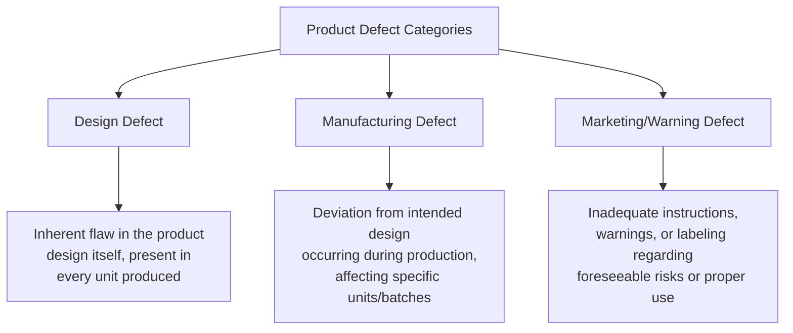
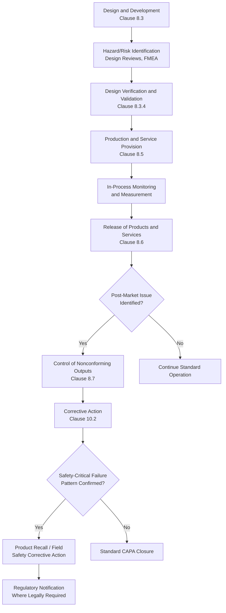
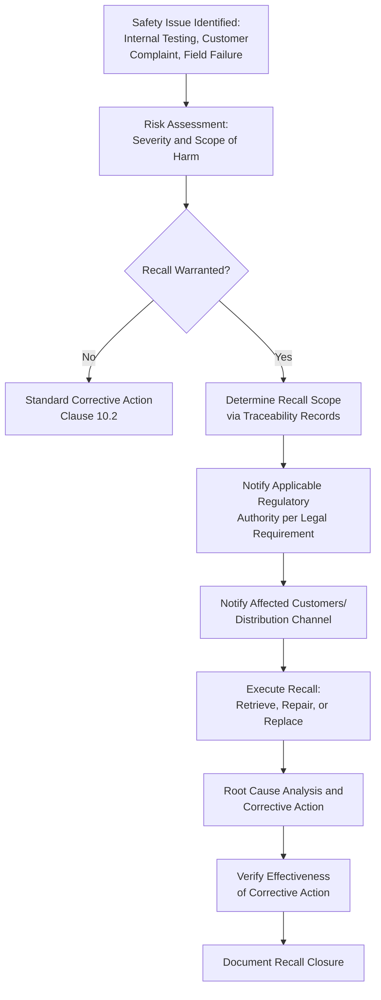

## Product Safety and Liability Considerations

### Overview

Product safety and liability considerations address the organizational obligation to design, produce, and deliver products and services that do not pose unreasonable risk of harm, and the legal consequences that arise when that obligation is not met. Within a Quality Management System, this connects directly to ISO 9001 Clause 8.3 (Design and Development), Clause 8.5 (Production and Service Provision), Clause 8.7 (Control of Nonconforming Outputs), and the broader regulatory compliance framework established under Clause 4.2 and Clause 6.1. Product liability is the legal mechanism through which failures in these QMS processes translate into financial, legal, and reputational consequences.

### Product Safety vs. Product Liability

| Concept | Definition | Focus |
| --- | --- | --- |
| **Product Safety** | The proactive discipline of designing, testing, and manufacturing products to eliminate or minimize foreseeable risk of harm | Prevention — engineering and process controls |
| **Product Liability** | The legal responsibility (civil, and in some jurisdictions criminal) an organization bears when a defective product causes harm | Consequence — legal and financial exposure after harm occurs |

**Key Points**

- Robust product safety practices are the primary mechanism for reducing product liability exposure; the two are causally linked but conceptually distinct
- A QMS does not itself eliminate liability risk, but a well-documented, consistently followed QMS provides critical evidence of due diligence and reasonable care if liability is later contested

### Categories of Product Defects (Liability Basis)

Product liability claims in most jurisdictions are analyzed against three defect categories:

| Defect Type | QMS Process Most Relevant | Example |
| --- | --- | --- |
| Design Defect | Clause 8.3 (Design and Development), design verification/validation | A product design lacking a required safety guard, present in all units |
| Manufacturing Defect | Clause 8.5 (Production Control), Clause 9.1 (Monitoring/Measurement) | A specific batch produced with a material substitution error causing structural weakness |
| Marketing/Warning Defect | Labeling control, technical documentation review | Missing warning label about a known chemical hazard, or unclear usage instructions leading to foreseeable misuse |

### Liability Standards Across Jurisdictions

**Key Points**

- Liability standards vary significantly by jurisdiction and are not harmonized by ISO standards themselves — ISO 9001 does not define legal liability standards, only requiring the organization to determine and meet applicable statutory/regulatory and customer requirements
- Common liability theories in various legal systems include **strict liability** (liability without need to prove negligence, common in many product liability regimes), **negligence** (failure to exercise reasonable care), and **breach of warranty** (failure to meet express or implied product performance claims)
- [Unverified] The specific liability regime applicable to any given organization depends on the jurisdiction(s) where the product is sold/used and where harm occurs; this varies enough across countries and even sub-national jurisdictions that organizations should consult qualified legal counsel for their specific market exposure rather than rely on a generalized framework

### Integrating Product Safety into the QMS Process Flow

### Key Risk Management Tools for Product Safety

#### Failure Mode and Effects Analysis (FMEA)

A structured method to identify potential failure modes, their effects, and prioritize mitigation based on risk.

$$\text{Risk Priority Number (RPN)} = \text{Severity} \times \text{Occurrence} \times \text{Detection}$$

Where each factor is typically scored on a scale (commonly 1–10), with higher RPN values indicating higher-priority failure modes requiring design or process mitigation.

**Key Points**

- Design FMEA (DFMEA) is applied during Clause 8.3 design activities to identify inherent design risks before production
- Process FMEA (PFMEA) is applied during Clause 8.5 production planning to identify manufacturing-stage risks

#### Design Verification and Validation

| Activity | Purpose | QMS Reference |
| --- | --- | --- |
| Design Verification | Confirms design outputs meet design input requirements (did we design it right?) | Clause 8.3.4 |
| Design Validation | Confirms the resulting product meets requirements for its intended use (did we design the right thing?) | Clause 8.3.4 |

### Traceability as a Liability Defense Mechanism

**Key Points**

- Traceability (Clause 8.5.2) enables an organization to isolate affected units/batches in the event of a discovered defect, limiting recall scope and providing evidence of controlled production during liability proceedings
- Without adequate traceability, an organization may be forced into broader, more costly recalls (entire product lines rather than specific batches) because it cannot demonstrate which units are actually affected
- Records demonstrating conformity at the time of release (Clause 8.6) serve as key evidence that reasonable quality controls were in place, relevant to a negligence-based liability defense

### Product Recall Process Overview

**Key Points**

- Regulatory notification obligations for product recalls (timing, format, authority) are jurisdiction- and sector-specific (e.g., consumer product safety agencies, medical device regulators, food safety authorities each have distinct notification regimes) [Unverified — specific notification thresholds and timeframes must be confirmed against the applicable regulator, not assumed generically]
- A recall's root cause analysis should feed back into design/process FMEAs to prevent recurrence in future product iterations, closing the loop per Clause 10.2 and Clause 10.3

### Practical Example: Applying Liability Considerations to a Government-Facing Software System

While product liability doctrine originates primarily from physical/manufactured goods, analogous "service liability" or professional negligence exposure applies to software systems affecting public services, such as a government document management platform:

| Traditional Product Liability Concept | Software/Service Analogue |
| --- | --- |
| Design Defect | Systemic flaw in system architecture causing data loss or incorrect processing for all users (e.g., a flawed approval workflow logic) |
| Manufacturing Defect | A deployment-specific bug or configuration error affecting a subset of users/transactions, not present in the core design |
| Marketing/Warning Defect | Inadequate user documentation or missing warnings about data handling limitations, leading to foreseeable misuse |
| Traceability | Audit logs and version control enabling isolation of which transactions/users were affected by a specific defect |
| Recall | Rollback/patch deployment, affected-user notification, and data correction for impacted records |

[Inference] This mapping is an illustrative analogy to frame risk thinking for software/service contexts; it does not constitute a legal determination that traditional product liability doctrine applies identically to software, since applicable liability theories for software/service defects (e.g., negligence, breach of contract, sector-specific regulation) depend heavily on jurisdiction and the specific legal characterization of the system involved.

### Common Pitfalls

- **Key Points**
  - Treating design validation as complete once internal testing passes, without adequately simulating real-world foreseeable misuse scenarios
  - Inadequate traceability granularity, forcing overly broad recalls that could have been narrower with better batch/lot/version tracking
  - Warning/labeling reviewed only for regulatory technical compliance, not for actual comprehensibility by the intended end user
  - Corrective action from a safety-related nonconformity closed without updating the relevant FMEA, allowing the same risk to persist undetected in future design iterations
  - Delayed internal escalation of safety-relevant field issues due to unclear internal reporting thresholds for what constitutes a "safety" versus routine quality complaint

**Next Steps**

- Design and Development Verification and Validation (Clause 8.3.4)
- Failure Mode and Effects Analysis (FMEA) Methodology
- Traceability and Identification Requirements (Clause 8.5.2)
- Control of Nonconforming Outputs (Clause 8.7)
- Corrective Action and Root Cause Analysis (Clause 10.2)
- Product Recall Planning and Execution
- Identifying Applicable Regulatory Requirements
- Warranty and Contractual Liability Provisions