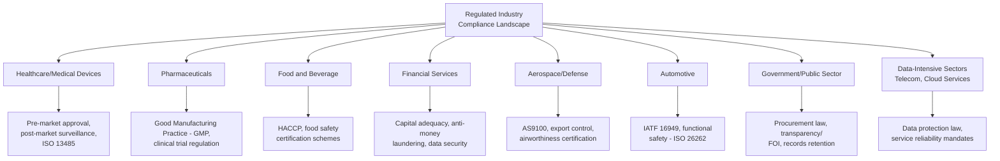
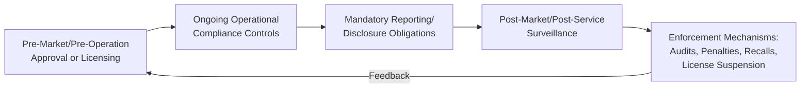

## Compliance Obligations Across Regulated Industries

### Overview

Regulated industries — those subject to sector-specific statutory oversight beyond general commercial law — impose compliance obligations that layer on top of, and often exceed, the baseline requirements of generic management system standards like ISO 9001. Understanding how compliance obligations vary across industry sectors is essential for correctly scoping a QMS, since the applicable regulatory floor, evidentiary requirements, and enforcement mechanisms differ substantially by sector. This builds directly on the general regulatory identification process (Clause 4.2, Clause 6.1) and interacts closely with product safety/liability considerations (Clause 8.3, Clause 8.7).

### Why Industry Sector Changes Compliance Obligations

**Key Points**

- Regulated industries typically exist because the potential consequence of failure (harm to health, safety, financial systems, environment, or public trust) is disproportionately severe compared to ordinary commercial goods/services
- Sector-specific regulators often have authority to impose obligations beyond what a generic QMS standard requires — including mandatory qualification/licensing, pre-market approval, continuous reporting, and specific record retention periods
- ISO 9001 remains sector-neutral by design; sector-specific management system standards (e.g., ISO 13485 for medical devices, IATF 16949 for automotive) exist precisely to translate ISO 9001's generic framework into sector-specific mandatory requirements

### Comparative Overview of Regulated Industry Sectors

### Sector-Specific Compliance Frameworks — Comparative Table

| Sector | Key Regulatory Mechanism | Sector-Specific Management Standard | Primary Regulatory Concern |
| --- | --- | --- | --- |
| Medical Devices | Pre-market approval/clearance, post-market surveillance | ISO 13485 | Patient safety, device performance |
| Pharmaceuticals | Good Manufacturing Practice (GMP), clinical trial approval | ICH guidelines, national GMP regulations | Drug safety, efficacy, purity |
| Food and Beverage | Hazard Analysis and Critical Control Points (HACCP) | ISO 22000, FSSC 22000 | Food safety, contamination prevention |
| Financial Services | Capital adequacy, licensing, anti-money laundering (AML) | ISO/IEC 27001 (information security), sector-specific frameworks | Financial stability, fraud prevention, data protection |
| Aerospace/Defense | Airworthiness certification, export control | AS9100 | Flight safety, national security |
| Automotive | Functional safety validation, supplier qualification | IATF 16949, ISO 26262 | Vehicle safety, defect prevention at scale |
| Government/Public Sector | Procurement law, public records law, service standards | Varies by jurisdiction (e.g., Anti-Red Tape Act in the Philippines) | Transparency, accountability, equitable service delivery |
| Data-Intensive Services | Data protection law, sector-specific privacy rules | ISO/IEC 27001, ISO/IEC 27701 | Data privacy, breach prevention, service continuity |

[Inference] This table synthesizes commonly recognized sector-standard associations; specific applicable standards and their mandatory vs. voluntary status vary by jurisdiction, customer contract requirements, and market of operation, so organizations should verify current requirements against their specific regulatory authority rather than treat this table as a compliance checklist.

### Common Structural Elements Across Regulated Industry Compliance

Despite sector differences, regulated industry compliance obligations tend to share structural patterns:

**Key Points**

- **Pre-market/pre-operation approval**: Many regulated sectors require regulatory clearance before a product/service can be offered (e.g., medical device clearance, financial services licensing, pharmaceutical approval) — distinct from voluntary certification, this is a legal precondition to operate
- **Ongoing operational compliance controls**: Continuous adherence requirements (e.g., GMP for pharma, HACCP for food) that must be maintained throughout the product/service lifecycle, not just verified once
- **Mandatory reporting/disclosure**: Sector regulators frequently require periodic or event-triggered reporting (e.g., adverse event reporting in medical devices, suspicious transaction reporting in financial services, data breach notification)
- **Post-market surveillance**: Ongoing monitoring for issues after release/deployment, often with regulatory-mandated timeframes for investigation and corrective action
- **Enforcement mechanisms**: Regulated industries typically carry more severe enforcement consequences than generic commercial regulation — license suspension/revocation, mandatory recalls, and in serious cases, criminal liability for individuals

### Compliance Obligation Layering

A regulated organization typically must satisfy compliance obligations at multiple layers simultaneously:

| Layer | Example | Enforced By |
| --- | --- | --- |
| Generic legal/commercial law | Contract law, general consumer protection | National courts, general consumer protection agency |
| Sector-specific statute | Medical device regulation, banking law | Sector regulator (e.g., health authority, central bank) |
| Voluntary/certifiable management standard | ISO 13485, IATF 16949 | Accredited certification bodies |
| Customer/contractual requirements | Customer-specific quality agreements, audit rights | Direct customer enforcement via contract |
| Internal policy | Internal quality targets exceeding regulatory minimums | Internal governance |

**Key Points**

- These layers are cumulative, not substitutive — achieving ISO 9001 or a sector-specific management standard certification does **not** exempt an organization from underlying statutory regulatory obligations; certification demonstrates a management system capable of meeting requirements, but the legal obligation exists independently
- Conflicts between layers should always resolve in favor of the more stringent applicable requirement, with statutory/regulatory requirements forming the non-negotiable floor

### Practical Example: Government/Public Sector Compliance Layering

For an organization such as a local government unit implementing a document management system, compliance obligations layer as follows:

| Layer | Applicable Obligation |
| --- | --- |
| Generic legal | Civil Code provisions on contracts, general administrative law |
| Sector-specific statute | Anti-Red Tape Act / Ease of Doing Business Act (service turnaround requirements), Data Privacy Act of 2012, National Archives Act (records retention) |
| Voluntary management standard | ISO 9001 (if the LGU pursues certification for service quality), ISO/IEC 27001 (if pursuing information security certification) |
| Customer/citizen expectation | Transparency, accessibility, timely processing (often codified via a Citizen's Charter) |
| Internal policy | Internal service-level targets exceeding statutory minimum turnaround times |

[Inference] This layering example illustrates the general structural pattern applicable to public sector compliance; the specific statutes and their exact requirements should be verified against current Philippine law and the specific LGU's applicable ordinances, since this reflects a generalized compliance framework rather than a definitive legal compliance audit.

### Cross-Border Regulatory Complexity

**Key Points**

- Organizations operating across multiple jurisdictions face compounded complexity: the same product/service may be regulated differently (or not at all) depending on the jurisdiction of sale, operation, or the location of affected individuals (particularly relevant for data protection law, which often applies extraterritorially based on data subject location)
- Harmonization efforts exist in some sectors (e.g., ICH guidelines for pharmaceuticals across major markets, mutual recognition agreements for certain product certifications) but do not eliminate the need for jurisdiction-specific compliance verification
- [Unverified] The degree of regulatory harmonization varies significantly by sector and region; organizations should not assume compliance in one jurisdiction satisfies obligations in another without explicit verification

### Common Pitfalls

- **Key Points**
  - Assuming a sector-specific management standard certification (e.g., ISO 13485) fully satisfies statutory regulatory obligations, when certification and legal compliance are related but distinct requirements
  - Failing to monitor for regulatory changes specific to the sector, since regulated industries often see more frequent regulatory updates than general commercial law
  - Underestimating the compliance burden of mandatory reporting obligations, which require operational processes (not just documentation) to detect and report triggering events within regulator-defined timeframes
  - Treating cross-border operations as a single compliance exercise rather than jurisdiction-by-jurisdiction analysis, particularly for data protection and product approval requirements
  - Overlooking the interaction between sector regulation and general QMS processes — e.g., a sector-mandated reporting obligation not being integrated into the organization's nonconformity/corrective action process (Clause 10.2), resulting in fragmented compliance tracking

**Next Steps**

- Identifying Applicable Regulatory Requirements
- Product Safety and Liability Considerations
- ISO 13485 Medical Devices Quality Management
- IATF 16949 Automotive Quality Management
- ISO 22000 / HACCP Food Safety Management
- ISO/IEC 27701 Privacy Information Management
- Mandatory Reporting and Regulatory Disclosure Processes
- Cross-Border Compliance Strategy for Multi-Jurisdictional Operations