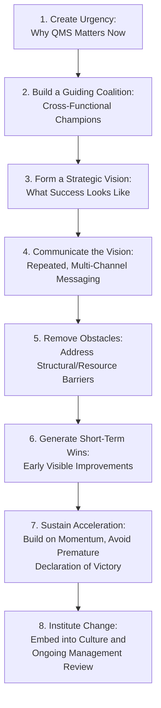
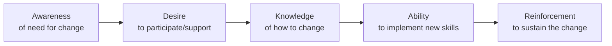
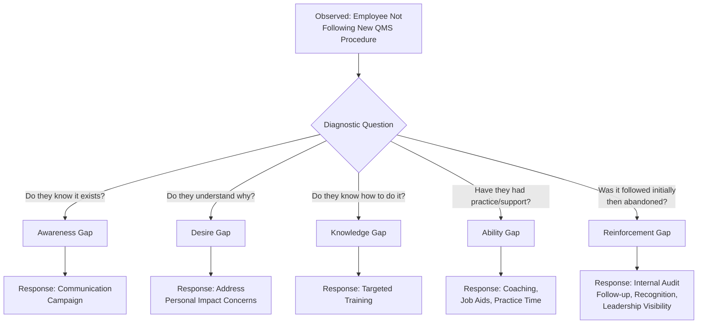

## Change Management Principles for QMS Adoption

### Overview

Change management, in the organizational behavior sense, addresses the human and cultural dimension of implementing a Quality Management System — distinct from Clause 8.5.6 (Control of Changes), which governs technical/operational change control. Even a technically sound QMS design fails to deliver intended results if the people expected to operate within it do not understand, accept, and consistently follow it. This chapter area draws on established organizational change models to explain why QMS adoption succeeds or fails, and connects to Clause 5 (Leadership), Clause 7.2–7.3 (Competence and Awareness), and Clause 9.3 (Management Review).

### Why QMS Implementations Fail on the People Dimension

**Key Points**

- A frequently cited pattern in QMS implementation failure is achieving technical/documentary compliance (procedures written, records created) while genuine behavioral adoption lags — commonly described as a "paper system" disconnected from actual practice
- Resistance to QMS adoption often stems not from disagreement with the quality objective itself, but from perceived added burden, unclear personal benefit, or past negative experience with poorly implemented change initiatives
- [Inference] The specific failure rate of QMS implementations attributable to change management (versus technical design flaws) is not something that can be precisely quantified from a single authoritative source; the pattern described here reflects widely discussed themes in quality management and organizational change literature rather than a specific benchmarked statistic

### Kotter's 8-Step Change Model Applied to QMS Adoption

John Kotter's organizational change model is commonly applied to QMS implementation as a structured approach to managing the human adoption curve.

#### Mapping Kotter's Steps to QMS Implementation Activities

| Kotter Step | QMS Implementation Activity | ISO 9001 Clause Linkage |
| --- | --- | --- |
| Create Urgency | Present cost-of-poor-quality data, customer complaint trends, or lost business due to lack of certification | Clause 4.1 (Context), Clause 6.1 (Risk) |
| Guiding Coalition | Appoint process owners and internal QMS champions across departments, not solely a single "quality manager" | Clause 5.3 (Roles and Responsibilities) |
| Strategic Vision | Define what the organization gains (reduced rework, customer trust, market access) beyond "passing the audit" | Clause 5.1, Clause 6.2 (Objectives) |
| Communicate Vision | Regular briefings, visible leadership messaging, not a single kickoff announcement | Clause 7.4 (Communication) |
| Remove Obstacles | Address workload concerns, provide adequate time/resources for documentation and training | Clause 7.1 (Resources) |
| Short-Term Wins | Pilot the QMS in one department/process first, publicize early improvements | Clause 8.1 (Operational Planning) |
| Sustain Acceleration | Expand successful pilot practices organization-wide; avoid stopping at initial certification | Clause 10.3 (Continual Improvement) |
| Institute Change | Embed QMS practices into onboarding, performance reviews, and standard operating rhythm | Clause 7.2 (Competence), Clause 9.3 (Management Review) |

### The ADKAR Model as a Complementary Individual-Level Framework

While Kotter's model addresses organizational-level change sequencing, the ADKAR model (Prosci) addresses the individual psychological stages required for a person to adopt a new way of working — directly relevant to why specific employees resist or struggle with new QMS procedures.

**Key Points**

- **Awareness**: Employees must understand *why* the QMS is being implemented (regulatory requirement, customer demand, competitive necessity) — awareness gaps commonly manifest as employees viewing new procedures as arbitrary bureaucracy
- **Desire**: Understanding the "why" does not guarantee willingness; desire is influenced by perceived personal impact (does this make my job harder or easier, is there a WIIFM — "what's in it for me")
- **Knowledge**: Even willing employees need actual training on new procedures, forms, or software (directly satisfying Clause 7.2 Competence requirements)
- **Ability**: Knowledge alone does not guarantee capability — practical application, coaching, and time to build proficiency are required before full compliance can be reasonably expected
- **Reinforcement**: Without ongoing reinforcement (audits, recognition, correction of drift), new behaviors tend to erode back toward prior habits over time — this is the stage most often neglected, leading to post-certification regression

### Diagnosing Where Resistance Originates

**Key Points**

- A common implementation error is applying a training solution (Knowledge) to what is actually an Awareness or Desire gap — additional training does not resolve resistance rooted in not understanding or not wanting the change
- Diagnosing the specific gap before selecting an intervention avoids wasted effort and repeated resistance

### Leadership's Role in QMS Change Adoption

**Key Points**

- ISO 9001 Clause 5.1 explicitly requires top management to demonstrate leadership and commitment to the QMS — this directly parallels change management literature's consistent finding that visible, sustained senior leadership involvement is a primary driver of successful adoption
- "Management commitment" that consists only of signing the quality policy, without visible ongoing engagement (attending management reviews, referencing quality objectives in operational meetings, allocating adequate resources), is a commonly cited gap between documented commitment and behavioral adoption
- Middle management plays a distinct role as the translation layer between strategic intent and daily operational behavior; middle-management buy-in gaps are a frequently cited cause of adoption failure even when top management is genuinely supportive

### Resistance Management Techniques

| Technique | Description | When Most Applicable |
| --- | --- | --- |
| Participative design | Involve process-level employees in designing procedures for their own work, rather than imposing procedures top-down | High-complexity or highly variable processes where frontline knowledge is essential |
| Phased/pilot rollout | Implement in one area first, refine based on lessons learned, then scale | Large or multi-site organizations, complex process changes |
| Champion networks | Identify respected informal leaders (not necessarily formal managers) to model and advocate for new behaviors | Organizations with strong informal social influence structures |
| Transparent rationale communication | Explicitly connect QMS requirements to tangible outcomes (fewer complaints, less rework, contract eligibility) | Addressing Desire-stage resistance (WIIFM) |
| Reinforcement through audit and recognition | Regular internal audits paired with positive recognition for compliance, not only correction of noncompliance | Sustaining adoption post-initial-rollout (Reinforcement stage) |

### Practical Example: Applying Change Management to a Curriculum/Documentation Pipeline Rollout

Consider an organization introducing a new structured documentation standard (analogous to introducing standardized reference material formatting across a technical content team):

| ADKAR Stage | Applied Action |
| --- | --- |
| Awareness | Present examples of inconsistency problems caused by the lack of a standard format (e.g., difficulty parsing content downstream, rework from ambiguous headers) |
| Desire | Demonstrate how standardization reduces individual rework and review cycles for content creators themselves, not just organizational benefit |
| Knowledge | Provide a clear formatting specification/template and worked examples |
| Ability | Run a pilot batch with feedback before full-scale rollout; provide a review checklist |
| Reinforcement | Periodic spot-checks against the standard, with corrections framed as calibration rather than punitive audit |

[Inference] This example illustrates general ADKAR application logic to a documentation-standardization context; it is a generic illustration of the model's mechanics rather than a claim about any specific organization's actual implementation experience.

### Common Pitfalls

- **Key Points**
  - Declaring victory after initial certification audit success, neglecting the "Institute Change" (Kotter) or "Reinforcement" (ADKAR) stage, leading to post-certification behavioral regression
  - Treating QMS training as a one-time event rather than an ongoing competence-building process tied to Clause 7.2
  - Underestimating middle-management's role as the primary interface through which employees experience the QMS day-to-day
  - Applying uniform change management tactics across a diverse workforce without accounting for different resistance sources (Awareness vs. Desire vs. Ability gaps requiring different interventions)
  - Excluding frontline employees from procedure design, resulting in documented procedures that do not reflect actual operational reality and are consequently not followed

**Next Steps**

- Kotter's 8-Step Change Model — Detailed Application
- ADKAR Model — Individual Change Diagnostics
- Leadership and Commitment Requirements (Clause 5.1)
- Competence, Training, and Awareness (Clause 7.2–7.3)
- Internal Communication Strategies for QMS (Clause 7.4)
- Building a QMS Champion Network
- Management Review as a Reinforcement Mechanism (Clause 9.3)
- Overcoming Documentation-Practice Gaps ("Paper Systems")