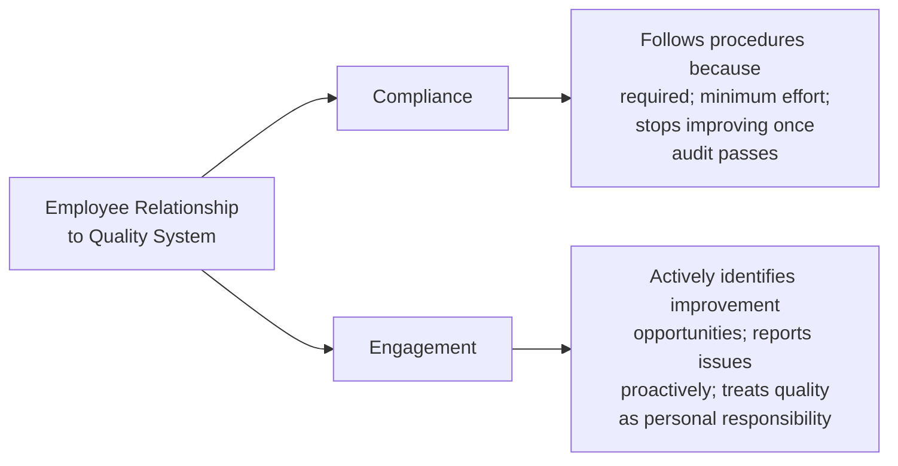
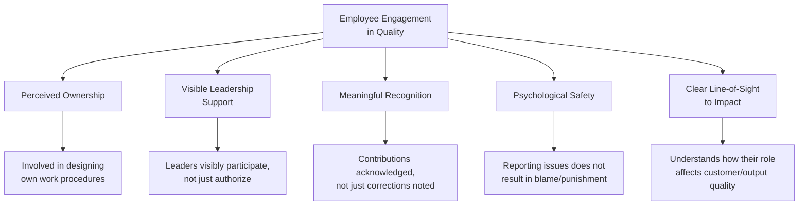
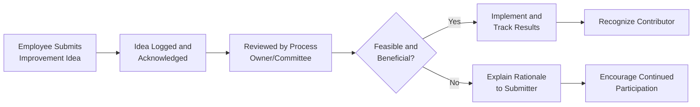

## Employee Engagement in Quality Initiatives

### Overview

Employee engagement in quality initiatives refers to the degree to which personnel at all organizational levels actively participate in, contribute to, and take ownership of quality-related activities, rather than passively complying with imposed procedures. This is distinct from, though closely related to, change management (which addresses adoption of a specific change) — engagement is the sustained state of active involvement that determines whether a QMS continues to improve after initial implementation. This connects to ISO 9001 Clause 5.3 (Roles, Responsibilities and Authorities), Clause 7.3 (Awareness), Clause 7.4 (Communication), and Clause 10.3 (Continual Improvement).

### Compliance vs. Engagement: A Critical Distinction

**Key Points**

- Compliance is necessary but insufficient for a QMS that genuinely drives continual improvement (Clause 10.3) — a compliant-only workforce follows what is written but does not generate the improvement input a QMS depends on
- Engagement is characterized by proactive behaviors: voluntarily reporting near-misses or minor nonconformities before they escalate, suggesting process improvements without being asked, and self-correcting deviations without requiring managerial intervention
- A workforce operating at "compliance only" is more likely to produce a documentation-practice gap (a "paper system"), since procedures are followed narrowly and literally rather than applied with judgment toward the underlying quality intent

### Drivers of Engagement in Quality Initiatives

#### Detail on Each Driver

| Driver | Description | QMS Clause Linkage |
| --- | --- | --- |
| Perceived Ownership | Employees who help design the procedures they follow are more invested in their success than those handed procedures top-down | Clause 8.1 (Operational Planning) |
| Visible Leadership Support | Leadership participation in quality activities (attending reviews, acting on employee-raised issues) signals genuine priority, not just policy language | Clause 5.1 (Leadership and Commitment) |
| Meaningful Recognition | Acknowledging quality contributions (not only correcting quality failures) reinforces the desired behavior | Clause 7.4 (Communication) |
| Psychological Safety | Employees must trust that reporting a problem or near-miss will not result in punitive consequences, or reporting behavior will be suppressed | Clause 9.1 (Monitoring), Clause 10.2 (Nonconformity) |
| Line-of-Sight to Impact | Understanding how an individual task connects to overall product/service quality and customer outcomes increases intrinsic motivation | Clause 7.3 (Awareness) |

### Psychological Safety and Nonconformity Reporting

**Key Points**

- Psychological safety is a particularly critical engagement driver for quality systems specifically, because much of the input a QMS depends on (near-misses, minor errors, process deviations) requires employees to voluntarily self-report information that could reflect poorly on themselves
- Organizations with punitive responses to reported nonconformities (blame-oriented root cause analysis, disciplinary action for honest reporting) tend to see reporting rates decline over time — problems do not stop occurring, they simply stop being reported, creating a false impression of improved performance
- [Inference] The relationship between psychological safety and reporting behavior is a well-established theme in quality and safety management literature (particularly in high-reliability industries); however, the specific magnitude of reporting suppression in any given organization cannot be generalized without direct measurement of that organization's reporting trends

### Mechanisms for Structured Employee Engagement

#### 1. Suggestion Systems / Kaizen-Style Idea Programs

A structured channel for employees to submit process improvement ideas, often paired with a review and implementation tracking mechanism.

**Key Points**

- The feedback loop closure (step D–F above) is critical — ideas submitted but never acknowledged or explained, even when rejected, are a common cause of suggestion system participation decline over time
- Recognition need not be financial; visible acknowledgment (naming the contributor, sharing the improvement's impact) is frequently cited as equally or more effective for sustaining participation

#### 2. Quality Circles / Cross-Functional Improvement Teams

Small groups of employees, often from the same work area, who meet regularly to identify and solve quality-related problems within their own domain.

**Key Points**

- Quality circles originated in Japanese manufacturing quality practice and remain a recognized mechanism for translating frontline knowledge into process improvement
- Effectiveness depends on genuine authority to influence process changes within their scope — circles that only generate recommendations without any implementation pathway tend to lose engagement over time

#### 3. Internal Audit Participation as an Engagement Tool

**Key Points**

- Involving employees from various departments as trained internal auditors (auditing areas other than their own) is a dual-purpose engagement mechanism: it builds cross-functional quality awareness while distributing ownership of the audit function beyond a dedicated quality department
- This approach directly supports Clause 9.2 (Internal Audit) while simultaneously serving as a competence-building and engagement mechanism under Clause 7.2–7.3

### Recognition and Incentive Design Considerations

| Approach | Benefit | Risk if Poorly Designed |
| --- | --- | --- |
| Recognition tied to defect/error reduction metrics alone | Focuses attention on measurable quality outcomes | Can incentivize underreporting of defects to protect personal/team metrics |
| Recognition tied to reporting/improvement behavior (process metrics) | Encourages the proactive behaviors engagement aims to build | Requires careful definition to avoid gaming (e.g., submitting trivial suggestions to inflate counts) |
| Team-based recognition | Reinforces collective ownership, reduces individual blame dynamics | May dilute individual accountability if not balanced with clear role clarity |
| Purely individual recognition | Clear attribution of contribution | Can undermine collaborative problem-solving if overly competitive |

**Key Points**

- Incentive design should be evaluated for unintended behavioral consequences, particularly the risk that outcome-based metrics (e.g., "fewest defects reported") can inadvertently discourage the very reporting behavior a QMS depends on
- [Inference] This risk (metrics driving underreporting rather than genuine improvement) is a widely discussed principle in quality management and behavioral measurement literature, generally described under the broader concept that "what gets measured and rewarded gets optimized for — including in unintended ways"

### Measuring Engagement in Quality Initiatives

Engagement is inherently harder to measure directly than compliance, but several indirect indicators are commonly used:

| Indicator | What It Suggests |
| --- | --- |
| Volume and quality of voluntarily submitted improvement suggestions | Active engagement vs. passive compliance |
| Ratio of near-miss/minor issue reports to actual nonconformities found in audits | Higher voluntary reporting relative to audit-discovered issues suggests better self-reporting culture |
| Internal audit participation rate (as auditors, not just auditees) | Willingness to take on quality ownership roles |
| Employee survey responses regarding perceived value/burden of QMS procedures | Direct measure of Desire-stage sentiment (see ADKAR model) |
| Time-to-report for identified issues | Shorter reporting delays may suggest lower fear of consequence |

[Inference] These indicators are commonly used proxies in quality management practice rather than metrics standardized or mandated by ISO 9001 itself; the standard requires monitoring of QMS performance (Clause 9.1) but does not prescribe specific engagement metrics.

### Practical Example: Building Engagement in a Curriculum Development Context

Applied to a structured content-generation environment (e.g., a technical documentation or reference-material pipeline), engagement mechanisms might include:

| Mechanism | Application |
| --- | --- |
| Suggestion system | Content creators can flag formatting spec ambiguities or propose template improvements through a lightweight submission channel |
| Recognition | Acknowledging contributors whose suggested spec changes get adopted, visible to the broader team |
| Psychological safety | Errors found in published reference material are treated as spec/process improvement opportunities rather than individual failures, encouraging self-reporting of mistakes before they propagate |
| Line-of-sight to impact | Contributors understand how consistent formatting affects downstream parseability/usability of the material, not just "because the spec says so" |

[Inference] This is a generic illustration applying engagement principles to a documentation-pipeline context; it does not describe a specific documented case study, but demonstrates how the general mechanisms above translate to a non-manufacturing, content-oriented workflow.

### Common Pitfalls

- **Key Points**
  - Launching a suggestion system or quality circle initiative with enthusiasm but no sustained resourcing for review/implementation, causing rapid decline in submissions once employees perceive the channel as non-functional
  - Punitive or blame-oriented responses to self-reported nonconformities, which suppress future voluntary reporting regardless of stated organizational intent
  - Recognition systems that unintentionally reward metric optimization (e.g., fewer reported defects) rather than genuine quality behavior (more proactive reporting and improvement)
  - Treating engagement as a one-time culture initiative rather than a continuously reinforced element of daily operations and leadership behavior
  - Excluding frontline employees from quality circles or improvement teams in favor of only management-level participation, undermining the frontline-knowledge advantage these mechanisms are designed to capture

**Next Steps**

- Change Management Principles for QMS Adoption
- Leadership and Commitment Requirements (Clause 5.1)
- Internal Audit Program Design (Clause 9.2)
- Communication Strategies for QMS (Clause 7.4)
- Continual Improvement Mechanisms (Clause 10.3)
- Psychological Safety in Quality and Safety Culture
- Quality Circles and Kaizen Event Facilitation
- Designing Non-Punitive Nonconformity Reporting Systems