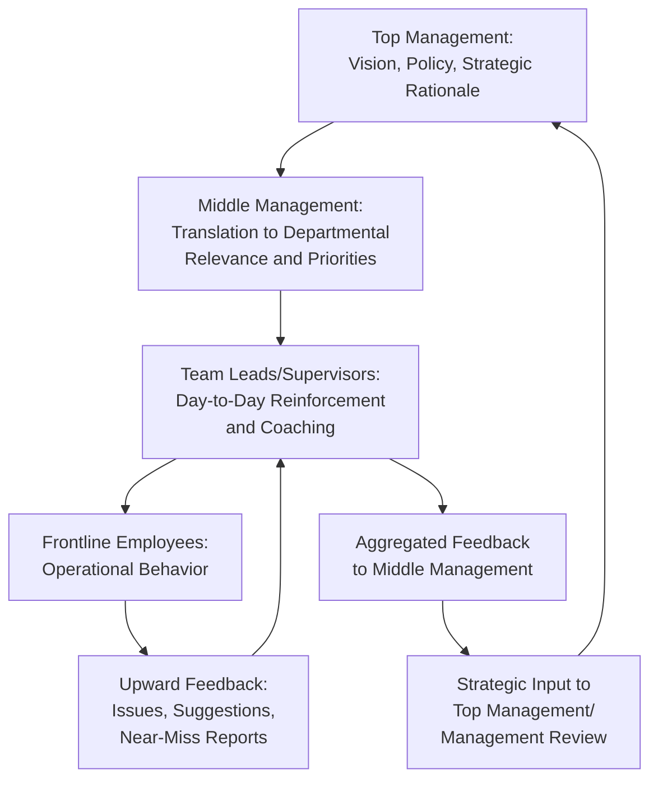
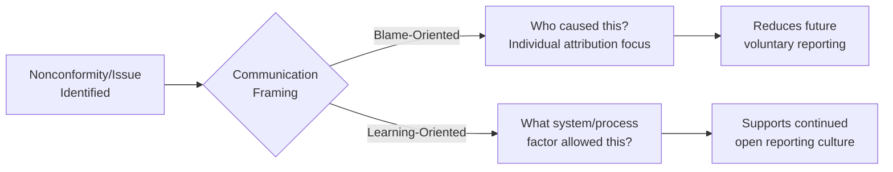

## Communication Strategies for Driving Quality Culture

### Overview

Communication strategy is the mechanism through which quality objectives, values, and expectations are transmitted, reinforced, and internalized across an organization. Distinct from a single communication event (e.g., a policy announcement), a communication *strategy* is a deliberate, sustained system of messaging designed to shape quality culture over time. This directly satisfies ISO 9001 Clause 7.4 (Communication) and underpins Clause 5.1 (Leadership and Commitment), Clause 5.2 (Quality Policy), and the broader change management and engagement mechanisms covered elsewhere in this chapter.

### ISO 9001 Clause 7.4 Requirements as a Communication Planning Framework

Clause 7.4 requires the organization to determine internal and external communications relevant to the QMS, addressing:

| Element | Question Addressed |
| --- | --- |
| **What** | What content needs to be communicated? |
| **When** | At what frequency or triggering event? |
| **With whom** | Which audience (internal departments, external customers/suppliers/regulators)? |
| **How** | Which channel or method? |
| **Who communicates** | Who is responsible for originating the communication? |

**Key Points**

- Clause 7.4 is deliberately structural rather than prescriptive — it does not mandate specific messaging content, but requires the organization to have deliberately planned its communication approach rather than relying on ad hoc or inconsistent messaging
- A documented communication plan mapping these five elements is commonly used as evidence of Clause 7.4 conformity during audits

### Communication Planning Matrix — Example Structure

| Message | Audience | Frequency/Trigger | Channel | Owner |
| --- | --- | --- | --- | --- |
| Quality Policy and Objectives | All employees | Onboarding + annual refresh | Town hall, intranet posting | Top Management |
| Internal audit findings and trends | Department heads, process owners | Quarterly | Management review meeting | Quality Manager |
| Nonconformity/corrective action status | Affected process teams | As raised, tracked to closure | CAPA tracking system, team meetings | Process Owners |
| Customer complaint trends | Relevant operational teams | Monthly | Dashboard, department meetings | Customer Service/Quality |
| Regulatory change updates | Compliance-affected roles | As identified | Email bulletin, register update | Compliance Officer |
| Recognition of quality contributions | All employees | Ongoing/as earned | Team meetings, internal newsletter | Direct Managers |

### The Cascading Communication Model

Quality culture messaging is most effective when it flows through multiple organizational layers rather than relying solely on top-down broadcast or bottom-up reporting.

**Key Points**

- One-way top-down communication (policy announcements without a return channel) is a commonly cited limitation in quality culture communication — sustainable culture requires the upward feedback loop as much as the downward messaging
- Middle management and team leads function as the critical "translation layer" — messaging that stops at this level without further cascading to frontline employees, or reinforcement that stops without escalating feedback upward, breaks the loop at that point

### Message Consistency and Repetition

**Key Points**

- A single communication event, however well-crafted, is generally insufficient to shift established behavior or embed a cultural value — repetition across multiple channels and over time is a recurring theme in organizational communication and change literature
- Consistency across leadership levels matters: if senior leadership messaging emphasizes quality priority but middle management's day-to-day actions (e.g., prioritizing speed over documented procedure under deadline pressure) contradict that message, the contradictory behavior tends to carry more weight with employees than the formal messaging
- [Inference] The principle that "actions communicate more powerfully than words" in organizational culture contexts is a widely cited theme in leadership and change management literature, though the relative weighting of behavior versus messaging is not something precisely quantifiable in a general sense

### Channel Selection Considerations

| Channel Type | Strengths | Limitations |
| --- | --- | --- |
| Town halls / all-hands meetings | High visibility, direct leadership presence | Infrequent; limited two-way interaction at scale |
| Team/department meetings | Allows direct dialogue, context-specific relevance | Message consistency depends on individual manager delivery |
| Intranet/documented policy postings | Persistent reference, auditable evidence of communication | Passive; does not guarantee comprehension or engagement |
| Visual management (dashboards, boards) | Continuous visibility of quality metrics/status | Requires regular updating to remain credible; stale boards undermine trust |
| Email/digital bulletins | Wide reach, documented distribution | Prone to being ignored amid general email volume |
| Informal/one-on-one coaching | High personalization, addresses individual concerns directly | Resource-intensive; harder to scale or standardize |

**Key Points**

- Relying on a single channel (commonly email or a single posted policy) is a frequent gap identified in communication audits — effective quality culture communication typically layers multiple channels reinforcing the same message
- Visual management tools (e.g., quality metric dashboards visible in work areas) function as a form of continuous, ambient communication distinct from discrete messaging events, but require active maintenance to avoid becoming a credibility liability if left outdated

### Communicating Nonconformities and Corrective Actions Without Undermining Psychological Safety

A particularly sensitive communication challenge is disseminating information about quality failures (nonconformities, audit findings, customer complaints) in a way that reinforces learning rather than triggering blame-avoidance behavior.

**Key Points**

- Framing communication around systemic/process factors rather than individual attribution is generally associated with sustaining the voluntary reporting behavior that engagement and quality culture depend on
- This does not mean individual accountability is absent from a QMS, but the *communication framing* of routine nonconformity discussion (e.g., in team meetings, dashboards) should emphasize process learning rather than public individual blame, reserving individual accountability discussions for appropriate private/managerial channels when warranted

### Practical Example: Communication Plan for a QMS Rollout Milestone

For an organization communicating progress on a new document control system rollout (relevant to a document management system context):

| Stage | Message | Audience | Channel |
| --- | --- | --- | --- |
| Pre-launch | Why the new system is being introduced, expected benefits, timeline | All affected staff | Town hall + written FAQ |
| Launch | How-to guidance, where to get help, who to contact with issues | Direct users | Training sessions + quick-reference job aid |
| Early adoption (first weeks) | Known issues being addressed, early positive results, encouragement to report problems | Direct users, supervisors | Team meetings + dedicated feedback channel |
| Stabilization | Confirmed resolution of early issues, updated procedures reflecting lessons learned | All affected staff | Updated documentation + follow-up briefing |
| Ongoing | Periodic reminders, recognition of good practice, updates on further improvements | All affected staff | Recurring team meeting agenda item |

[Inference] This staged plan illustrates general communication planning principles applied to a system-rollout scenario; it is a generic template rather than a specific documented case, and actual timing/channels should be adapted to the organization's actual structure and culture.

### Common Pitfalls

- **Key Points**
  - Treating a single kickoff announcement as sufficient communication for a sustained cultural or procedural change, without planned repetition or reinforcement
  - Communication plans that exist as a document (satisfying audit evidence) without genuine operational execution — messages planned but not actually delivered on schedule
  - Blame-oriented framing of nonconformity communication, inadvertently suppressing future voluntary reporting
  - Inconsistency between leadership messaging and middle-management behavior, undermining message credibility regardless of communication quality
  - Relying solely on passive channels (email, intranet postings) for messages requiring genuine behavioral change, without interactive or reinforcing channels

**Next Steps**

- Communication Requirements (Clause 7.4) — Detailed Requirements
- Leadership and Commitment (Clause 5.1)
- Employee Engagement in Quality Initiatives
- Change Management Principles for QMS Adoption
- Visual Management and Quality Dashboards
- Non-Punitive Nonconformity Communication Design
- Management Review as a Communication Mechanism (Clause 9.3)
- Internal Marketing Techniques for Quality Programs