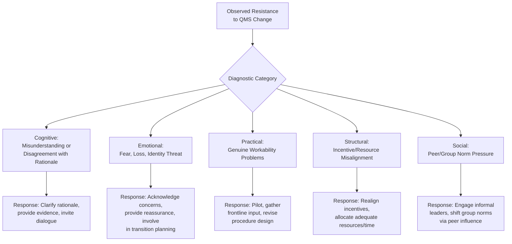
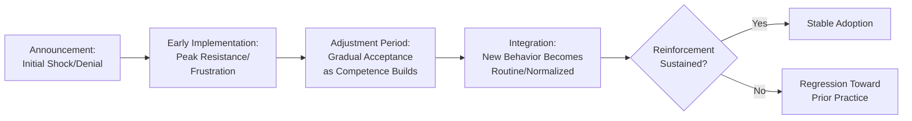
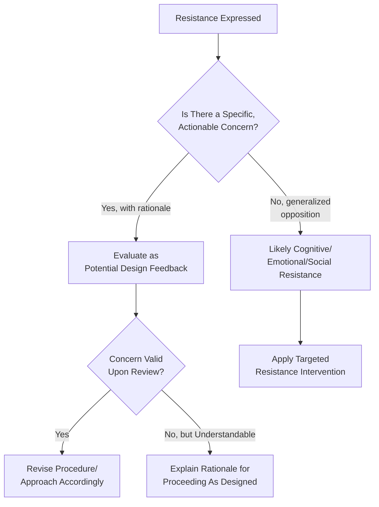

## Overcoming Resistance to Quality System Change

### Overview

Resistance to quality system change is the set of behaviors — active or passive — through which individuals or groups oppose, delay, or undermine the adoption of new or revised QMS practices. This topic focuses specifically on diagnosing the sources of resistance and applying targeted interventions, extending the general change management (Kotter/ADKAR) and engagement principles covered elsewhere in this chapter into a dedicated resistance-management discipline. It connects to ISO 9001 Clause 5.1 (Leadership), Clause 7.3 (Awareness), and Clause 9.3 (Management Review) as the ongoing mechanism for detecting and addressing sustained resistance.

### Resistance Is Not a Single Phenomenon

**Key Points**

- Resistance manifests differently depending on its source, and a single generic intervention (e.g., "more training") is frequently applied to all forms of resistance despite being effective for only some — this mismatch is a primary reason resistance-reduction efforts fail
- Resistance can be **active** (explicit refusal, vocal opposition, formal complaints) or **passive** (nominal compliance without genuine adoption, gradual reversion to old practices, malicious compliance where procedures are followed in ways that predictably fail)
- Not all resistance is irrational or purely obstructive — resistance sometimes surfaces legitimate flaws in the proposed change (e.g., a new procedure that is genuinely impractical for actual working conditions), and treating all resistance as a people problem rather than sometimes a valid signal is itself a common management error

### Sources of Resistance — Diagnostic Framework

#### Detail on Each Resistance Source

| Source | Description | Example in QMS Context |
| --- | --- | --- |
| Cognitive | The individual does not understand or does not agree with the stated rationale for the change | "Why do we need to document this? We've always done it fine without paperwork." |
| Emotional | Change is perceived as a threat to job security, competence, status, or established identity | A long-tenured employee perceives new standardized procedures as implying their prior methods were inadequate |
| Practical | The change genuinely does not work well under actual operating conditions as designed | A new inspection procedure requires equipment or time not actually available on the production floor |
| Structural | Existing incentive systems, performance metrics, or resource allocation contradict the new expected behavior | Employees are measured on speed/output volume, while the new QMS procedure adds time-consuming verification steps |
| Social | Peer group norms or informal leadership discourage compliance, independent of individual belief | A respected informal leader openly dismisses the new procedure, influencing peer behavior regardless of formal messaging |

**Key Points**

- Structural resistance is particularly important to identify because no amount of communication or training resolves it — if the organization's actual incentive structure rewards behavior contrary to the QMS requirement, resistance will persist until that misalignment is corrected
- Distinguishing practical resistance (a legitimate design flaw) from emotional or cognitive resistance prevents the error of dismissing valid frontline feedback as mere "resistance to change"

### The Resistance Curve Over Time

**Key Points**

- Resistance commonly peaks not at the announcement stage but during early implementation, when the gap between old (familiar, fluent) and new (unfamiliar, effortful) ways of working is most acutely felt
- Expecting resistance to disappear immediately after initial rollout, rather than anticipating a gradual adjustment curve, leads organizations to prematurely conclude an intervention has failed when it may simply be in the expected peak-resistance phase
- Without sustained reinforcement (see ADKAR's Reinforcement stage), even successfully adopted behavior can regress toward prior practice — resistance management is not a one-time event resolved at "integration"

### Intervention Strategies by Resistance Type

#### For Cognitive Resistance

- Present concrete evidence connecting the change to tangible outcomes (reduced rework, avoided customer complaints, audit/regulatory necessity)
- Create structured opportunities for questions and dialogue rather than one-way announcement-only communication
- Use peer testimonials from earlier pilot participants who initially shared the same skepticism

#### For Emotional Resistance

- Acknowledge the legitimacy of the emotional response explicitly, rather than dismissing concerns as irrational
- Frame the change as building on existing competence/experience rather than invalidating it
- Involve affected individuals directly in transition planning, giving them agency in how the change is implemented for their own role

#### For Practical Resistance

- Treat frontline objections as a design-feedback signal rather than a compliance problem to be overcome
- Pilot the change in a controlled scope before full rollout, explicitly incorporating frontline feedback into procedure revisions
- Reassess procedure design against actual working conditions (time, equipment, staffing) rather than idealized conditions

#### For Structural Resistance

- Audit existing performance metrics and incentive structures for contradiction with new QMS requirements
- Adjust metrics/incentives to reward the desired behavior (e.g., incorporating quality/compliance metrics alongside speed/output metrics)
- Ensure adequate resource allocation (time, staffing, tools) is genuinely provided, not merely announced

#### For Social Resistance

- Identify and engage informal opinion leaders early, ideally before general rollout, so they become advocates rather than skeptics encountered publicly for the first time
- Leverage peer-to-peer influence (respected colleagues modeling the new behavior) rather than relying solely on top-down authority messaging
- Address visible non-compliance by influential individuals promptly and consistently, since unaddressed high-visibility resistance can normalize continued resistance across the group

### Distinguishing Legitimate Feedback from Obstructive Resistance

**Key Points**

- A specific, actionable objection ("this step adds 20 minutes we don't have in the current shift schedule") warrants genuine evaluation as potential design feedback rather than automatic classification as resistance to be overcome
- Generalized, non-specific opposition ("this is just more bureaucracy") is more likely to reflect cognitive, emotional, or social resistance sources requiring the targeted interventions above rather than procedural redesign

### Practical Example: Resistance Diagnosis in a Records Digitization Initiative

**Scenario**: A government office transitioning from paper-based to digital document management encounters resistance from long-tenured records staff.

| Observed Behavior | Likely Resistance Source | Diagnostic Basis |
| --- | --- | --- |
| Staff continue maintaining parallel paper files "just in case" | Emotional (loss of familiar competence, distrust of new system reliability) | No specific technical objection raised; behavior reflects security-seeking rather than a stated concern |
| Staff report the scanning workflow adds significant time not accounted for in daily processing quotas | Structural | Specific, quantifiable concern tied to existing performance metrics (processing quotas) |
| A senior records officer publicly questions the initiative's necessity in team meetings, and junior staff visibly defer to that skepticism | Social | Resistance concentrated around an informal influence figure, spreading to otherwise neutral staff |
| Staff report the digital system's search function does not support the filing conventions used for historical records | Practical | Specific, technical, verifiable workability concern |

**Applied Response**:

- The structural concern (processing quotas) triggers a review of performance metrics to ensure digitization time is accounted for, not penalized
- The practical concern (search/filing convention mismatch) triggers a genuine system configuration review rather than dismissal
- The social resistance is addressed by engaging the senior records officer directly, understanding their specific concerns, and where addressed, inviting them to become a visible pilot advocate rather than leaving their skepticism unaddressed in team settings
- The emotional resistance (parallel paper-keeping) is addressed through reassurance, phased confidence-building (demonstrating system reliability over time), and acknowledging the legitimacy of caution during a transition rather than mandating immediate abandonment of paper backups

[Inference] This scenario is a generic illustration constructed to demonstrate the diagnostic framework's application to a records-digitization context; it does not describe a specific documented case study.

### Common Pitfalls

- **Key Points**
  - Applying a single intervention (most commonly, additional training or repeated messaging) uniformly across all resistance, regardless of its actual source
  - Dismissing practical, specific objections as "resistance to change" rather than evaluating them as potentially legitimate design feedback
  - Failing to identify and engage informal social influence leaders before general rollout, encountering their opposition publicly and reactively instead
  - Underestimating structural resistance by assuming communication and willingness alone can overcome a genuine incentive misalignment
  - Expecting resistance to be fully resolved immediately post-rollout, leading to premature judgment that an implementation has failed during what is actually an expected peak-resistance phase

**Next Steps**

- Change Management Principles for QMS Adoption
- ADKAR Model — Individual Change Diagnostics
- Employee Engagement in Quality Initiatives
- Communication Strategies for Driving Quality Culture
- Incentive and Performance Metric Alignment for Quality Behavior
- Pilot Program Design for QMS Rollouts
- Leadership and Commitment Requirements (Clause 5.1)
- Building a QMS Champion Network