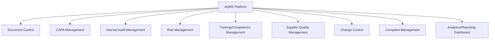
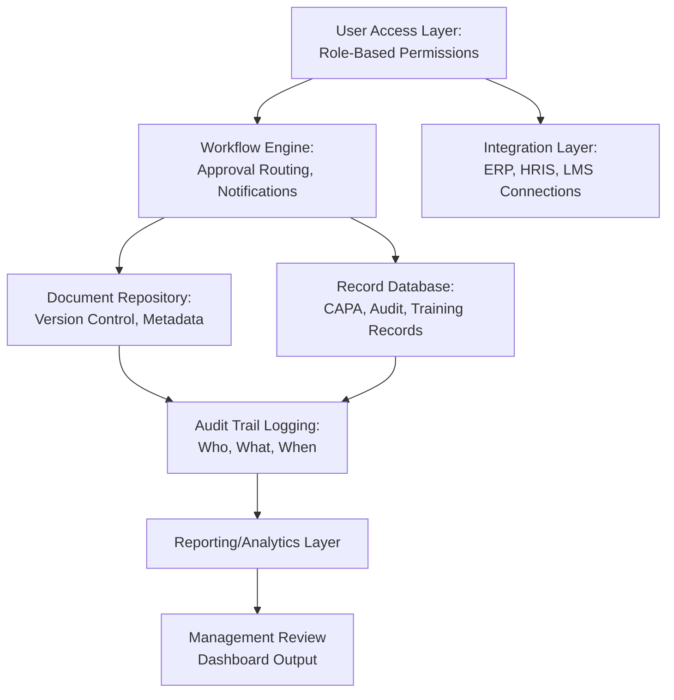
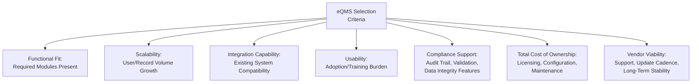

## Quality Management Software and eQMS Platforms

### Overview

Electronic Quality Management System (eQMS) platforms are software applications designed to digitize, automate, and centralize the processes required by management system standards such as ISO 9001, replacing or supplementing paper-based and spreadsheet-based quality management. This falls under the broader Quality 4.0 movement — the application of digital technologies to quality management practice — and directly supports ISO 9001 Clause 7.5 (Documented Information), Clause 9.1 (Monitoring and Measurement), Clause 9.2 (Internal Audit), and Clause 10.2 (Nonconformity and Corrective Action) through structured digital workflows.

### Why Organizations Adopt eQMS Platforms

**Key Points**

- Manual/paper-based or spreadsheet-based QMS management scales poorly with organizational size and process complexity, particularly for traceability, version control, and cross-referencing related records (e.g., linking a nonconformity to its root cause analysis, corrective action, and verification evidence)
- eQMS platforms provide structural enforcement of controls (Clause 7.5) that are difficult to guarantee manually — for example, preventing an obsolete document revision from being accessed, or automatically routing an approval workflow to the correct authorized role
- Centralization of quality records improves audit readiness (surveillance/recertification audits) by enabling rapid evidence retrieval, rather than manual compilation across dispersed files

### Core eQMS Functional Modules

#### Module-to-Clause Mapping

| eQMS Module | Primary Function | ISO 9001 Clause Reference |
| --- | --- | --- |
| Document Control | Version control, approval workflows, controlled distribution, obsolescence prevention | Clause 7.5 |
| CAPA Management | Nonconformity logging, root cause analysis tracking, corrective action workflow and verification | Clause 10.2 |
| Internal Audit Management | Audit scheduling, checklist execution, finding tracking, closure verification | Clause 9.2 |
| Risk Management | Risk register, risk assessment scoring, treatment plan tracking | Clause 6.1 |
| Training/Competence Management | Training record tracking, competency matrix, certification expiry alerts | Clause 7.2 |
| Supplier Quality Management | Supplier evaluation, scorecards, incoming inspection records | Clause 8.4 |
| Change Control | Change request workflow, impact assessment, approval routing | Clause 8.5.6 |
| Complaint Management | Customer complaint intake, investigation tracking, resolution/closure | Clause 9.1.2, Clause 10.2 |
| Analytics/Reporting Dashboard | Real-time visibility into quality KPIs, trend analysis for management review | Clause 9.1, Clause 9.3 |

### eQMS Implementation Architecture (General Pattern)

**Key Points**

- **Audit trail logging** is a functionally critical component distinguishing eQMS platforms from generic document storage — it provides immutable evidence of who performed which action and when, directly supporting traceability requirements and audit evidence integrity
- **Workflow engines** enforce process discipline structurally (e.g., a document cannot be published without required approvals completed in sequence), reducing reliance on individual diligence to follow a written procedure correctly
- Integration with adjacent systems (ERP for production data, HRIS for personnel records, LMS for training completion) reduces duplicate data entry and improves data consistency across the organization's broader information ecosystem

### Build vs. Buy vs. Configure: eQMS Sourcing Approaches

| Approach | Description | Considerations |
| --- | --- | --- |
| Commercial off-the-shelf (COTS) eQMS | Purchase a vendor platform (e.g., dedicated QMS software vendors) with standard modules | Faster deployment; may require process adaptation to fit vendor's workflow assumptions; ongoing licensing cost |
| Configurable platform (low-code/no-code) | Build on a flexible platform (e.g., a workflow/database platform) configured specifically to the organization's processes | Higher customization; requires internal or contracted configuration expertise; longer initial setup |
| Custom-built in-house | Develop a bespoke system tailored precisely to organizational workflows | Maximum flexibility; highest development/maintenance burden; requires sustained internal technical capability |
| Hybrid (spreadsheet/document tools + point solutions) | Combine general-purpose tools (shared drives, spreadsheets) with point solutions for specific modules (e.g., a dedicated CAPA tracker) | Lowest upfront cost; weakest structural enforcement and traceability; common in smaller organizations as an interim state |

**Key Points**

- [Inference] The choice among these approaches is highly dependent on organizational size, budget, regulatory complexity, and internal technical capacity; no single approach is universally superior, and the appropriate choice varies enough by context that a generic recommendation would be misleading
- Organizations in heavily regulated sectors (e.g., medical devices, pharmaceuticals) often require eQMS platforms with specific validation capabilities (demonstrating the software itself performs reliably for its intended quality-critical use) — a consideration less critical for general commercial QMS applications

### Data Integrity Considerations (Particularly Relevant to Regulated Industries)

For sectors where eQMS records serve as regulatory evidence (e.g., pharmaceutical GMP, medical device manufacturing), data integrity principles commonly referenced include the **ALCOA+** framework:

| Principle | Meaning |
| --- | --- |
| Attributable | Clear record of who performed/recorded an action |
| Legible | Records must be readable and understandable |
| Contemporaneous | Recorded at the time the activity occurred |
| Original | Source data preserved, not only summaries |
| Accurate | Free from error, reflecting the true event |
| Complete | All data included, including any repeat/reanalysis |
| Consistent | Chronologically consistent, sequenced appropriately |
| Enduring | Preserved for the required retention period |
| Available | Accessible for review/audit throughout the retention period |

**Key Points**

- ALCOA+ originated primarily in pharmaceutical/GMP regulatory guidance contexts but is increasingly referenced more broadly in eQMS data integrity discussions across regulated industries
- [Unverified] The specific regulatory expectation for ALCOA+ compliance and its enforcement rigor varies by sector and jurisdiction; organizations in regulated industries should verify specific data integrity requirements against their applicable regulator's current guidance rather than treat ALCOA+ as a universally mandated checklist

### Evaluating eQMS Platform Selection Criteria

**Key Points**

- Usability is frequently underweighted in eQMS selection relative to functional feature checklists, despite being a primary driver of actual adoption (connecting back to the change management and engagement principles covered elsewhere in this curriculum) — a feature-complete platform that employees find cumbersome to use tends to see workaround behavior (e.g., informal parallel tracking) that undermines the centralization benefit the platform was intended to provide

### Practical Example: eQMS Considerations for a Government Document Management Context

For an organization such as a local government unit implementing or evaluating a document management system with quality-management-relevant functionality, key considerations include:

| Consideration | Relevance |
| --- | --- |
| Role-based access control | Ensures only authorized personnel can approve/release documents, supporting segregation of duties expected in public sector governance |
| Audit trail logging | Supports transparency and accountability requirements common in public sector operations, beyond QMS-specific needs |
| Records retention scheduling | Must align with statutory records retention requirements (e.g., National Archives regulations), not solely internal quality policy |
| Integration with citizen-facing service systems | Where the document system supports public transaction processing, integration considerations extend beyond internal QMS to service delivery performance monitoring |
| Data privacy controls | Given handling of personal data of constituents, access controls and audit logging intersect with data protection compliance obligations |

[Inference] This example illustrates general eQMS evaluation considerations applied to a public-sector document management context; specific platform requirements depend on the particular system's actual scope, applicable regulations, and organizational IT governance policies.

### Common Pitfalls

- **Key Points**
  - Selecting an eQMS platform based primarily on vendor feature lists without adequately assessing actual usability and likely adoption behavior among end users
  - Migrating to an eQMS platform without first clarifying and streamlining the underlying process design — digitizing an inefficient manual process merely automates the inefficiency rather than resolving it
  - Inadequate user training and change management during eQMS rollout, leading to parallel informal tracking systems that undermine the platform's centralization value
  - Underestimating configuration/customization effort required to align a generic platform with organization-specific workflows, leading to scope and timeline overruns
  - Neglecting data migration quality when transitioning from legacy (paper or spreadsheet) records, resulting in incomplete historical traceability within the new system

**Next Steps**

- Document Control Systems and Workflow Design (Clause 7.5)
- CAPA (Corrective and Preventive Action) System Design
- Digital Audit Trail Requirements and Data Integrity (ALCOA+)
- Change Management Principles for QMS Adoption
- Integrating eQMS with Enterprise Systems (ERP, LMS, HRIS)
- Quality 4.0: Overview of Digital Quality Management Trends
- Risk Management Software Modules and Risk Register Design
- Validation Requirements for Quality Software in Regulated Industries