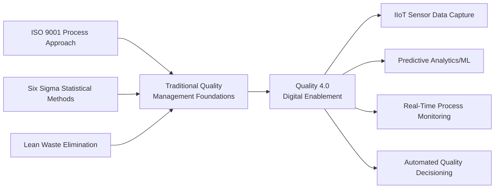
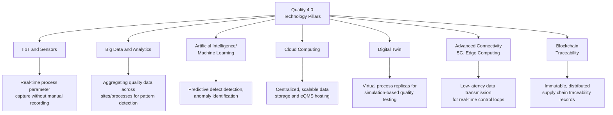
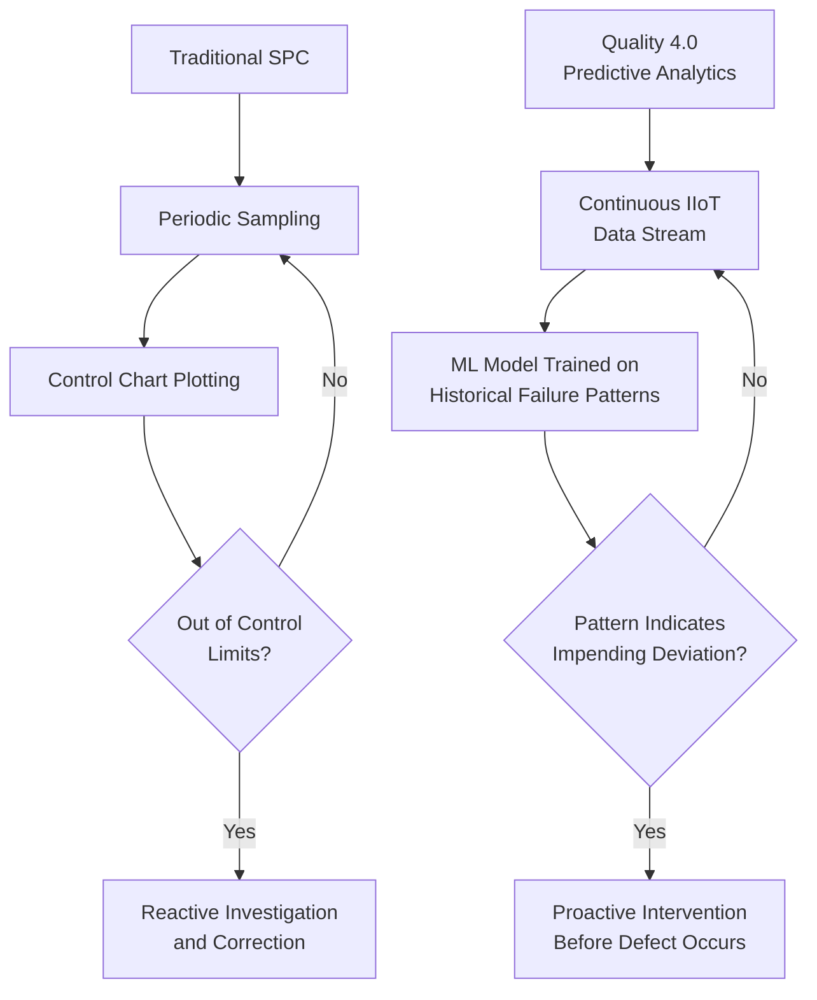
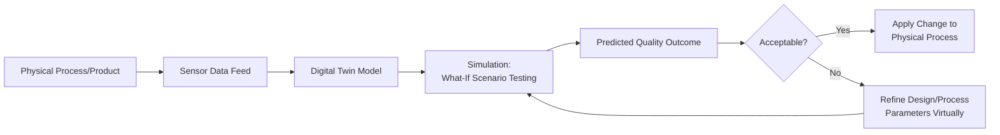
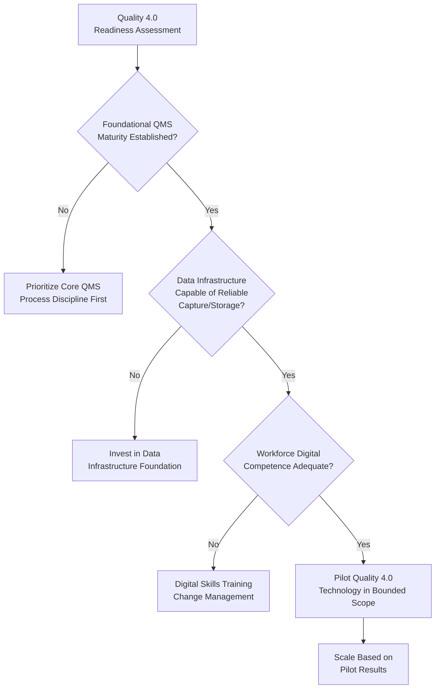

## Quality 4.0 and Industry 4.0 Integration

### Overview

Quality 4.0 refers to the application of Industry 4.0 digital technologies — the Industrial Internet of Things (IIoT), big data analytics, artificial intelligence/machine learning, cloud computing, and cyber-physical systems — to traditional quality management practice. Rather than replacing established quality management principles (ISO 9001, Six Sigma, Lean), Quality 4.0 extends their reach and precision by enabling real-time data capture, predictive analytics, and automated decision support across the quality management lifecycle.

### Conceptual Relationship: Quality 4.0 as an Extension, Not a Replacement

**Key Points**

- Quality 4.0 does not introduce new quality principles per se; it changes the *speed, granularity, and predictive capability* with which existing principles (statistical process control, root cause analysis, risk-based thinking) can be applied
- Organizations without a mature underlying quality management foundation (clear process definitions, established metrics, disciplined data practices) generally derive limited benefit from Quality 4.0 technology investment — [Inference] a commonly cited principle in Quality 4.0 literature is that digital tools amplify existing process maturity rather than substitute for its absence, meaning a poorly controlled process generates unreliable data regardless of how sophisticated the analytics layer is

### Core Technology Pillars of Quality 4.0

#### Application of Each Pillar to Quality Management

| Technology | Traditional QMS Equivalent | Quality 4.0 Enhancement |
| --- | --- | --- |
| IIoT/Sensors | Manual measurement recording, periodic sampling | Continuous, automated real-time measurement without human data entry error |
| Big Data/Analytics | Retrospective trend analysis (e.g., quarterly quality reports) | Real-time and near-real-time pattern detection across larger, more granular datasets |
| AI/Machine Learning | Reactive defect detection after occurrence | Predictive defect/failure detection before occurrence, based on pattern recognition in process data |
| Cloud Computing | On-premises document/record storage | Scalable, centrally accessible eQMS infrastructure supporting multi-site consistency |
| Digital Twin | Physical prototype testing | Virtual simulation of process/product behavior before physical implementation, reducing testing cost/time |
| Edge Computing | Centralized data processing with latency | Localized data processing enabling faster response for time-critical quality control decisions |
| Blockchain | Paper-based or siloed database traceability records | Distributed, tamper-evident traceability records across multi-party supply chains |

### Statistical Process Control Evolution: SPC to Predictive Quality Analytics

Traditional Statistical Process Control (SPC) relies on periodic sampling and control charts to detect when a process drifts outside acceptable limits, typically reacting after a shift is detected.

**Key Points**

- The shift from reactive (traditional SPC) to predictive (Quality 4.0) quality control is often cited as the central value proposition of Quality 4.0 — detecting the *precursor conditions* to a defect rather than the defect itself after it has already occurred
- $$UCL = \bar{x} + 3\sigma, \quad LCL = \bar{x} - 3\sigma$$ remains the standard traditional control limit calculation underlying SPC; Quality 4.0 does not replace this statistical foundation but supplements it with pattern recognition across dimensions and variables that manual SPC charting typically cannot practically track simultaneously

### Predictive Maintenance as a Quality 4.0 Application

**Key Points**

- Predictive maintenance uses IIoT sensor data (vibration, temperature, acoustic signatures) combined with machine learning models to forecast equipment failure before it occurs, distinct from traditional preventive maintenance (fixed-schedule servicing regardless of actual equipment condition)
- This connects directly to quality outcomes because unplanned equipment failure or gradual equipment degradation is a common root cause of manufacturing defects (a manufacturing defect category under product liability considerations) — predicting and preventing equipment failure reduces the associated defect risk
- [Unverified] The specific accuracy and cost-effectiveness of predictive maintenance models vary substantially based on data quality, sensor deployment density, and the specific failure modes being modeled; general claims of cost/downtime reduction percentages found in vendor marketing materials should be treated with appropriate skepticism absent independent verification for the specific application context

### Digital Twin Applications in Quality Management

A digital twin is a virtual representation of a physical process, product, or system, continuously updated with real-world data to enable simulation and analysis without disrupting actual operations.

**Key Points**

- Digital twins allow design or process changes to be tested virtually before physical implementation, directly supporting Clause 8.3.4 (Design Verification and Validation) by reducing the cost and time of physical prototype iteration
- This is most valuable for complex, high-cost, or safety-critical products/processes where physical trial-and-error testing is expensive or risky (e.g., aerospace components, complex manufacturing lines)

### Blockchain for Supply Chain Traceability

**Key Points**

- Blockchain's core property relevant to quality management is creating a distributed, tamper-evident record of transactions/events across multiple parties (suppliers, manufacturers, distributors) without requiring a single trusted central authority to maintain the record
- This directly supports traceability requirements (Clause 8.5.2) in complex multi-party supply chains, particularly relevant to product recall scenarios where rapid, verifiable identification of affected batches across supply chain participants is critical
- [Inference] Blockchain adoption specifically for quality/supply chain traceability remains an area of active development and varying maturity across industries; its practical adoption should be evaluated against the specific traceability problem being solved rather than assumed to be a default or necessary solution, since simpler centralized traceability database solutions may be adequate for many organizational contexts

### Organizational Readiness for Quality 4.0 Adoption

**Key Points**

- Attempting Quality 4.0 technology adoption without first establishing foundational process discipline (a recurring theme connecting back to this curriculum's change management and QMS adoption content) commonly results in "garbage in, garbage out" analytics — sophisticated tools analyzing unreliable underlying process data
- Workforce digital competence and change management considerations (covered under Change Management Principles for QMS Adoption) apply directly to Quality 4.0 initiatives, since resistance to new digital tools follows similar patterns to resistance to any other QMS change

### Practical Example: Quality 4.0 Applied to a Government Document Processing Context

While Quality 4.0's origins are predominantly manufacturing-centric, the underlying data-driven quality principles extend to service/administrative contexts such as government document processing:

| Manufacturing Quality 4.0 Concept | Government Document Processing Analogue |
| --- | --- |
| IIoT sensor data capture | System-generated timestamps and status logs captured automatically as documents move through workflow stages |
| Predictive defect detection | Predictive flagging of applications likely to require correction/rejection based on historical pattern data (e.g., incomplete submission patterns) |
| Real-time process monitoring dashboard | Live dashboard of processing turnaround times against service-level targets (relevant to Anti-Red Tape Act compliance) |
| Predictive maintenance | Predictive identification of system components (server load, database performance) likely to cause processing delays before they occur |

[Inference] This is an illustrative conceptual mapping to demonstrate how Quality 4.0 principles generalize beyond manufacturing contexts; it does not describe an implemented or documented case study, and actual applicability depends on the specific system's data infrastructure and analytics capability.

### Common Pitfalls

- **Key Points**
  - Investing in Quality 4.0 technology (sensors, analytics platforms, AI models) before establishing disciplined underlying process control, resulting in analytics built on unreliable data
  - Treating Quality 4.0 as a purely technological initiative without addressing the accompanying change management and workforce competence requirements
  - Overestimating the accuracy or readiness of predictive models (particularly AI/ML-based) without adequate validation against the specific organizational context and failure modes
  - Adopting complex technologies (e.g., blockchain) for traceability problems that could be adequately addressed with simpler, less resource-intensive solutions
  - Failing to integrate Quality 4.0 data outputs into actual decision-making processes (management review, CAPA) — generating dashboards and analytics that are viewed but not acted upon

**Next Steps**

- Quality Management Software and eQMS Platforms
- Statistical Process Control (SPC) Fundamentals
- Predictive Maintenance Implementation Approaches
- Digital Twin Technology for Design Validation
- Blockchain in Supply Chain Traceability
- Change Management Principles for QMS Adoption
- Risk-Based Thinking and Data-Driven Decision Making (Clause 6.1)
- Machine Learning Model Validation for Quality Applications