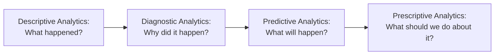
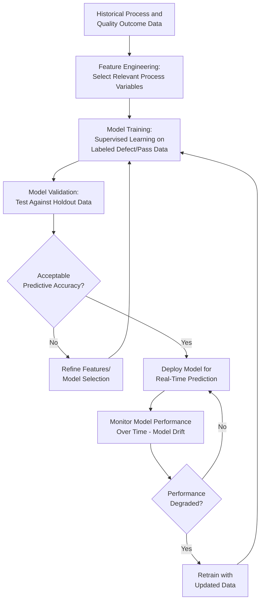
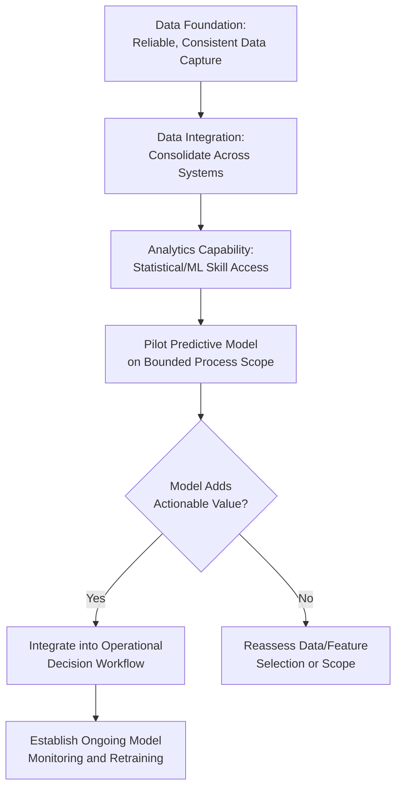

## Data Analytics and Predictive Quality Management

### Overview

Data analytics and predictive quality management encompass the methods and techniques used to extract actionable insight from quality-related data, progressing from descriptive understanding of past performance to predictive and prescriptive capability for anticipating and preventing future quality issues. This builds directly on Quality 4.0's technological foundation and connects to ISO 9001 Clause 9.1 (Monitoring, Measurement, Analysis and Evaluation), Clause 6.1 (Risk-Based Thinking), and Clause 10.3 (Continual Improvement).

### The Analytics Maturity Spectrum

| Analytics Type | Core Question | Typical QMS Application | Common Technique |
| --- | --- | --- | --- |
| Descriptive | What happened? | Monthly defect rate reports, complaint volume summaries | Basic statistics, control charts, dashboards |
| Diagnostic | Why did it happen? | Root cause analysis of a defect spike | Pareto analysis, correlation analysis, fishbone diagrams |
| Predictive | What will likely happen? | Forecasting probability of defect occurrence based on process parameters | Regression models, machine learning classification |
| Prescriptive | What should be done? | Automated recommendation of optimal process parameter adjustment | Optimization algorithms, simulation-based decision support |

**Key Points**

- Most traditional QMS implementations operate primarily at the descriptive and diagnostic levels (Clause 9.1's monitoring/measurement/analysis requirements are satisfiable at this level); predictive and prescriptive capability represents the Quality 4.0 extension beyond baseline ISO 9001 conformity
- Progression through this spectrum generally requires increasing data volume, quality, and organizational analytics maturity — attempting predictive analytics without reliable descriptive-level data foundations tends to produce unreliable predictions

### Statistical Foundations Underlying Predictive Quality Models

#### Process Capability as a Predictive Input

Process capability indices quantify how well a process performs relative to specification limits, forming a foundational input for predicting future defect probability if the process remains statistically stable.

$$C_p = \frac{USL - LSL}{6\sigma}$$

$$C_{pk} = \min\left(\frac{USL - \bar{x}}{3\sigma}, \frac{\bar{x} - LSL}{3\sigma}\right)$$

Where $USL$ and $LSL$ are the upper and lower specification limits, $\bar{x}$ is the process mean, and $\sigma$ is the process standard deviation.

**Key Points**

- $C_p$ assumes the process is centered between specification limits; $C_{pk}$ accounts for actual process centering, making it the more informative index when a process mean is offset from the specification midpoint
- A $C_{pk}$ value below 1.0 generally indicates a process producing a non-trivial proportion of output outside specification limits under normal variation, while values above 1.33 are commonly cited as indicating a capable process — [Inference] specific threshold conventions (e.g., 1.33, 1.67) vary by industry standard and customer requirement rather than being universally fixed by ISO 9001 itself

#### Regression-Based Predictive Models

A common approach for predicting a quality outcome (e.g., defect probability, dimensional deviation) as a function of process input variables:

$$Y = \beta_0 + \beta_1X_1 + \beta_2X_2 + \dots + \beta_nX_n + \epsilon$$

Where $Y$ is the predicted quality outcome, $X_1$ through $X_n$ are process input variables (temperature, pressure, material batch characteristics, etc.), $\beta$ coefficients represent each variable's estimated influence, and $\epsilon$ is the error term.

**Key Points**

- Regression models provide interpretable coefficients showing which process variables most influence quality outcomes, supporting root cause understanding in addition to prediction
- More complex relationships (non-linear interactions between variables) often require machine learning approaches (e.g., random forests, gradient boosting) rather than linear regression, at the cost of reduced interpretability — a common trade-off in predictive quality modeling between accuracy and explainability

### Machine Learning Approaches in Predictive Quality Management

**Key Points**

- **Model drift** — the degradation of a predictive model's accuracy over time as underlying process conditions change — is a critical ongoing management consideration distinct from one-time model development; a model trained on historical data can become unreliable if the process itself evolves (new materials, equipment, suppliers) without corresponding model retraining
- Common supervised learning techniques applied to quality prediction include logistic regression (for binary pass/fail prediction), decision trees/random forests (for interpretable non-linear relationships), and neural networks (for complex pattern recognition in high-dimensional sensor data)
- [Unverified] The specific choice of machine learning technique appropriate for a given quality prediction problem depends heavily on data volume, feature complexity, interpretability requirements, and available technical expertise; no single technique is universally optimal across quality management applications

### Anomaly Detection for Early Warning

Distinct from predicting a specific defect outcome, anomaly detection identifies process behavior that deviates from established normal patterns, flagging it for investigation before a defined failure threshold is crossed.

| Method | Description | Typical Application |
| --- | --- | --- |
| Statistical thresholding | Flag data points beyond a defined number of standard deviations from the mean | Simple, interpretable; foundational SPC-adjacent technique |
| Multivariate anomaly detection | Identify unusual *combinations* of variables even when each individual variable is within normal range | Detecting subtle process drift not visible in single-variable control charts |
| Unsupervised clustering | Group historical data patterns and flag new data that does not fit established clusters | Useful when labeled defect data is scarce or defect modes are not fully characterized in advance |

**Key Points**

- Multivariate anomaly detection addresses a known limitation of traditional single-variable SPC charts — some quality-relevant process drifts only become apparent when considering the interaction of multiple variables simultaneously, which single-variable control charts cannot detect

### Building a Predictive Quality Analytics Capability — Implementation Considerations

**Key Points**

- A predictive model that generates accurate predictions but is not integrated into an actual operational decision workflow (e.g., an automated alert triggering a specific corrective response) provides limited practical value — the model's output must connect to an action, not remain a standalone analytical exercise
- Starting with a bounded pilot scope (a single process line or product family) before organization-wide deployment allows validation of both model accuracy and organizational workflow integration before broader investment

### Practical Example: Predictive Quality Analytics for Government Service Processing

Applied to a service/administrative context such as a government document processing system, predictive quality analytics concepts translate as follows:

| Manufacturing Predictive QC Concept | Government Service Processing Analogue |
| --- | --- |
| Predicting defect probability from process parameters | Predicting likelihood an application will be rejected/returned based on submission characteristics (completeness, applicant history patterns) |
| Process capability ($C_{pk}$) | Service-level capability: proportion of transactions processed within target turnaround time relative to the required standard |
| Anomaly detection on process variables | Flagging unusual processing delay patterns in specific departments or transaction types for investigation before they become systemic backlogs |
| Model drift monitoring | Re-evaluating prediction models periodically as policy changes, staffing changes, or seasonal application volume shifts alter underlying patterns |

[Inference] This mapping illustrates how predictive analytics concepts generalize from manufacturing to service-oriented quality contexts; it is a conceptual illustration rather than a description of a specific implemented system, and actual feasibility depends on the availability of sufficiently granular historical data.

### Common Pitfalls

- **Key Points**
  - Building predictive models on insufficient or poor-quality historical data, producing predictions that appear statistically sound but do not generalize to real operating conditions
  - Failing to monitor for model drift, resulting in predictive accuracy silently degrading over time as process conditions evolve without corresponding model updates
  - Prioritizing model complexity/sophistication over interpretability in contexts where understanding *why* a prediction was made is operationally important (e.g., for root cause-driven corrective action)
  - Treating predictive analytics as a standalone technical exercise disconnected from actual operational decision-making workflows, limiting practical impact despite technical accuracy
  - Applying advanced predictive techniques prematurely, before establishing reliable descriptive/diagnostic analytics foundations (accurate, consistent underlying data capture)

**Next Steps**

- Statistical Process Control (SPC) and Process Capability Analysis
- Quality 4.0 and Industry 4.0 Integration
- Quality Management Software and eQMS Platforms
- Root Cause Analysis Techniques (5 Whys, Fishbone, FMEA)
- Machine Learning Model Validation for Quality Applications
- Risk-Based Thinking and Data-Driven Decision Making (Clause 6.1)
- Monitoring, Measurement, Analysis and Evaluation (Clause 9.1)
- Building a Data Governance Framework for Quality Analytics