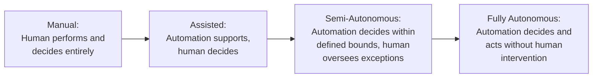
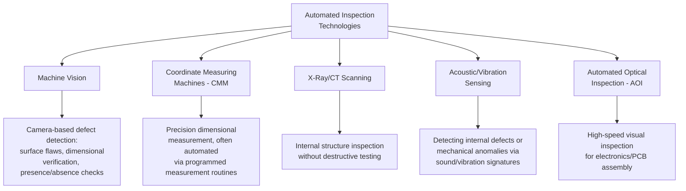
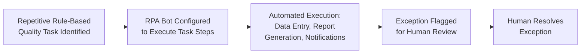

## Automation and Artificial Intelligence in Quality Processes

### Overview

Automation and artificial intelligence (AI) in quality processes extend beyond predictive analytics (covered previously) into the direct execution of quality-related tasks — inspection, decision-making, documentation, and workflow routing — with reduced or eliminated human intervention. This represents the operational deployment layer of Quality 4.0, connecting predictive/diagnostic insight to automated action, and intersects with ISO 9001 Clause 8.5 (Production and Service Provision), Clause 8.6 (Release of Products and Services), and Clause 7.1.5 (Monitoring and Measurement Resources).

### Spectrum of Automation in Quality Processes



**Key Points**

- Most current industrial and quality-process automation operates at the Assisted or Semi-Autonomous levels rather than Fully Autonomous — human oversight of exceptions and edge cases remains a common design pattern, particularly where consequences of an incorrect automated decision are significant (safety-critical or high-value products/services)
- The appropriate level of automation for a given quality process is a risk-based decision (Clause 6.1) — higher-consequence decisions generally warrant retained human oversight even where technically feasible to fully automate

### Automated Inspection Technologies



#### Machine Vision Systems in Detail

Machine vision combines cameras, lighting, and image-processing algorithms (increasingly incorporating deep learning models) to perform visual inspection tasks traditionally requiring human visual judgment.

| Application | Traditional Manual Approach | Machine Vision Enhancement |
| --- | --- | --- |
| Surface defect detection | Human visual inspection, subject to fatigue and inconsistency | Consistent, tireless inspection at production line speed |
| Dimensional verification | Manual measurement tools (calipers, gauges) | Automated optical measurement without physical contact |
| Presence/absence verification | Visual checklist confirmation | Automated detection of missing components at high speed |
| Label/print quality verification | Visual proofreading | Automated character recognition and print quality scoring |

**Key Points**

- Machine vision systems incorporating deep learning (convolutional neural networks) can detect subtle or complex defect patterns that rule-based traditional machine vision struggles with, but require substantial labeled training data (example images of both acceptable and defective items) to achieve reliable accuracy
- [Inference] The specific accuracy improvement of AI-based machine vision over traditional rule-based systems varies considerably by application, defect type, and training data quality/quantity; vendor-claimed accuracy figures should be validated against the specific inspection task rather than assumed to generalize

### AI-Assisted Decision Support in Quality Processes

Beyond physical inspection, AI applies to quality-related decision workflows:

| Application | Function |
| --- | --- |
| Automated nonconformity classification | Suggesting likely defect category/severity based on description text or sensor data patterns, supporting (not replacing) human classification |
| Root cause suggestion | Pattern-matching current issues against historical nonconformity/CAPA records to suggest likely root causes based on similarity |
| Automated document review | Flagging inconsistencies, missing sections, or non-compliant language in procedures/records for human review |
| Supplier risk scoring | Aggregating supplier performance data (delivery, quality, compliance history) into an automated risk score supporting supplier qualification decisions |
| Complaint triage | Automated categorization and priority routing of incoming customer complaints based on text analysis |

**Key Points**

- These applications are generally framed as "decision support" rather than "decision replacement" — human review remains standard practice for consequential decisions (e.g., final CAPA closure, supplier disqualification), with AI reducing the manual effort required to reach an informed decision rather than eliminating human judgment entirely
- Automated classification/suggestion tools require ongoing accuracy monitoring, since misclassification (e.g., under-classifying a major nonconformity as minor) could propagate incorrect handling through the quality system if human review is not maintained as a check

### Robotic Process Automation (RPA) in Quality Administration

Distinct from AI/machine learning, Robotic Process Automation applies rule-based automation to repetitive, structured administrative tasks within quality processes.



| RPA Application in QMS | Example |
| --- | --- |
| Automated data entry | Transferring inspection results from a measurement device into the eQMS record without manual re-typing |
| Scheduled report generation | Automatically compiling and distributing monthly quality KPI reports |
| Notification/escalation | Automatically alerting a process owner when a CAPA approaches its due date without manual tracking |
| Cross-system data reconciliation | Automatically comparing records across an ERP and eQMS system to flag discrepancies |

**Key Points**

- RPA differs fundamentally from AI/ML in that it automates *defined, rule-based* processes rather than learning patterns from data — it is best suited to structured, repetitive tasks with clear, unambiguous rules rather than tasks requiring judgment or pattern recognition
- RPA is often a lower-cost, faster-to-implement automation entry point compared to AI/ML initiatives, since it does not require model training or large historical datasets — commonly used as an early Quality 4.0 adoption step

### Risk Considerations for AI in Quality-Critical Decisions

```mermaid
flowchart TD
    A[AI Applied to<br/>Quality Decision] --> B{Consequence of<br/>Incorrect Decision}
    B -->|Low/Reversible| C[Higher Autonomy<br/>Acceptable]
    B -->|High/Safety-Critical/<br/>Irreversible| D[Retain Human<br/>Oversight/Final Authority]
    A --> E{Model Explainability<br/>Adequate for Context?}
    E -->|No, "black box"| F[Additional Scrutiny/<br/>Validation Required]
    E -->|Yes, interpretable| G[Supports Audit/<br/>Regulatory Defensibility]
```

**Key Points**

- Model explainability (the ability to understand *why* an AI system reached a particular conclusion) is particularly important in quality contexts subject to audit or regulatory scrutiny — a "black box" model that cannot explain its classification of a nonconformity or defect may be difficult to defend during an audit or in liability proceedings
- Bias in training data — if historical quality records reflect inconsistent past human judgment (e.g., inconsistent historical defect classification) — can be inherited and perpetuated by AI models trained on that data, a consideration relevant to model validation before deployment
- [Unverified] Regulatory guidance on AI use in quality-critical decisions (particularly in regulated industries such as medical devices or pharmaceuticals) is an actively evolving area; organizations should verify current regulatory expectations with their specific sector regulator rather than assume general AI governance principles fully satisfy sector-specific requirements

### Validation Considerations for Automated Quality Systems

**Key Points**

- Automated inspection and decision systems used in quality-critical applications typically require validation demonstrating the automated system performs at least as reliably as the manual process it replaces, before full deployment reliance
- This connects to Clause 7.1.5 (Monitoring and Measurement Resources), which requires monitoring/measurement equipment to be suitable and, where relevant, calibrated/verified — an automated inspection system is a measurement resource subject to analogous suitability verification
- Ongoing performance monitoring post-deployment (analogous to model drift monitoring in predictive analytics) is necessary since automated system performance can degrade due to changing conditions (e.g., camera lens degradation affecting machine vision accuracy, or evolving product variants not represented in original training data)

### Practical Example: Automation Applied to a Document Management Workflow

For a document management system context (e.g., processing government service applications), automation and AI applications might include:

| Traditional Manual Task | Automation/AI Enhancement |
| --- | --- |
| Manual review for application completeness | Automated completeness checking flagging missing required fields/attachments before routing to human reviewer |
| Manual routing to correct department based on request type | Automated classification and routing based on document content/type |
| Manual tracking of processing deadlines | RPA-based automated deadline monitoring and escalation notifications |
| Manual detection of duplicate submissions | Automated duplicate detection via record matching algorithms |
| Human review of every submission regardless of risk | Risk-based triage: automated low-risk approval for straightforward cases, human review reserved for flagged exceptions |

[Inference] This is a generic illustration of how automation/AI concepts apply to administrative document processing; it does not describe a specific implemented system, and actual feasibility depends on data structure, volume, and the specific risk tolerance for automated versus human-reviewed decisions in that context.

### Common Pitfalls

- **Key Points**
  - Deploying AI-based quality decision tools without adequate validation against the specific organizational context, relying on generalized vendor performance claims
  - Fully automating consequential decisions (e.g., final product release, major nonconformity classification) without retaining meaningful human oversight, particularly where explainability is limited
  - Neglecting ongoing performance monitoring of automated systems post-deployment, allowing gradual degradation (equipment wear, changing product variants) to go undetected
  - Training AI models on historical data reflecting inconsistent or biased past human judgment, perpetuating those inconsistencies at scale rather than correcting them
  - Treating RPA and AI/ML as interchangeable solutions, applying complex AI approaches to problems that simple rule-based automation would address more reliably and at lower cost

**Next Steps**

- Data Analytics and Predictive Quality Management
- Quality 4.0 and Industry 4.0 Integration
- Machine Vision and Automated Optical Inspection Systems
- Monitoring and Measurement Resources (Clause 7.1.5)
- Model Explainability and AI Governance in Regulated Contexts
- Robotic Process Automation (RPA) Implementation Approaches
- Design Verification and Validation (Clause 8.3.4)
- AI Bias Detection and Mitigation in Quality Data