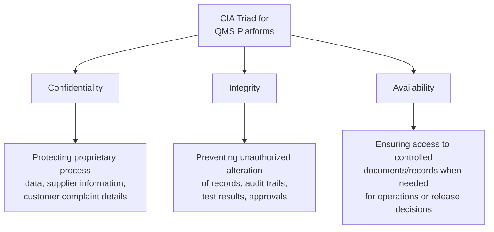
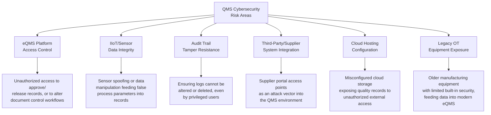
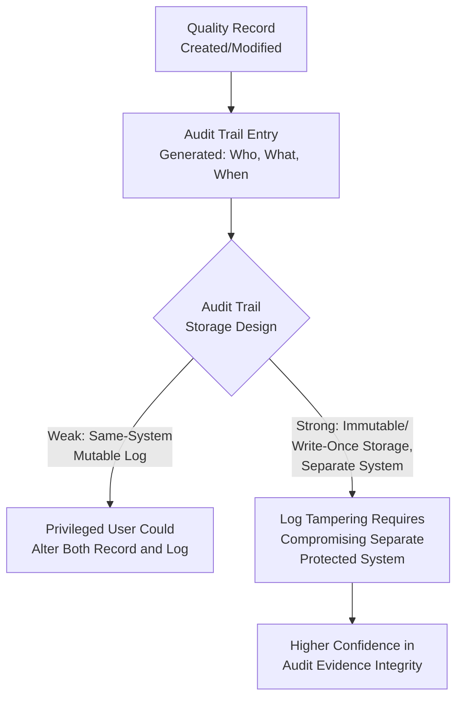
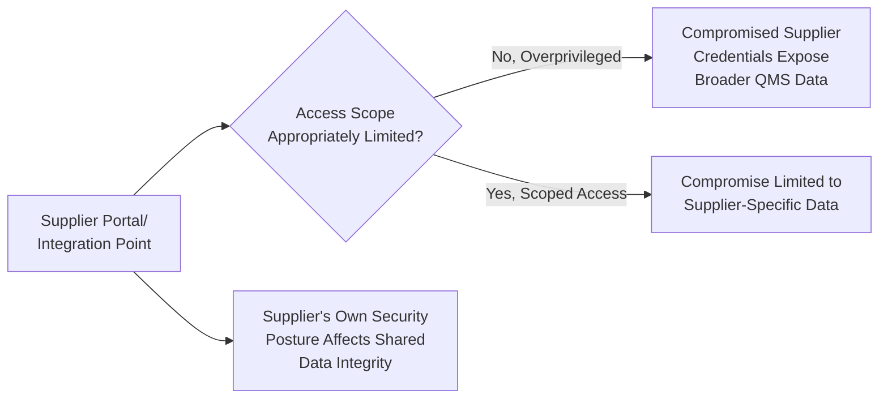

## Cybersecurity Considerations for Digital QMS Platforms

### Overview

As Quality Management Systems increasingly rely on digital eQMS platforms, IIoT sensor networks, and cloud infrastructure, they inherit the cybersecurity risk profile of any critical business information system. A compromised QMS platform threatens not only data confidentiality but the integrity of quality records themselves — a falsified or corrupted quality record can mask nonconformities, undermine traceability, and expose the organization to both safety and regulatory liability. This topic connects ISO/IEC 27001 information security principles directly to the operational integrity of ISO 9001-based quality systems, particularly Clause 7.5 (Documented Information) and Clause 8.5.2 (Identification and Traceability).

### Why QMS Platforms Are a Distinct Cybersecurity Concern

**Key Points**

- Unlike generic business data, QMS records often serve as legal/regulatory evidence (audit trails, release records, CAPA documentation) — unauthorized alteration is not merely a confidentiality breach but a potential falsification of compliance evidence with legal consequence
- QMS platforms frequently integrate with operational technology (OT) environments (IIoT sensors, manufacturing execution systems, SCADA-adjacent equipment monitoring), extending the cybersecurity attack surface beyond traditional IT boundaries into environments historically designed with less security hardening
- Availability matters distinctly for QMS platforms: a ransomware-induced outage of a document control system can halt production or service release entirely if approved procedures/records become inaccessible, tying cybersecurity directly to operational continuity

### The CIA Triad Applied to QMS Data

**Key Points**

- **Integrity** carries disproportionate weight for QMS platforms relative to many other business systems, because the entire evidentiary value of a quality record (Clause 7.5) depends on confidence that it has not been altered after creation
- A breach affecting integrity — e.g., a threat actor altering inspection results to show false conformity — is arguably more damaging to a QMS than a confidentiality breach, since it can propagate undetected nonconforming product/service release downstream

### QMS-Specific Cybersecurity Risk Areas

### Mapping ISO/IEC 27001 Annex A Controls to QMS Platform Protection

| Annex A Control Area | Application to eQMS/QMS Platform Context |
| --- | --- |
| A.8.2/A.8.3 (Privileged Access Rights, Access Restriction) | Role-based access control ensuring only authorized personnel can approve documents, close CAPAs, or release products/services |
| A.8.15 (Logging) | Comprehensive, tamper-evident audit trail logging for all record creation, modification, and approval actions |
| A.8.16 (Monitoring Activities) | Continuous monitoring for anomalous access patterns (e.g., unusual bulk record modification, access outside normal hours) |
| A.5.23 (Cloud Services Security) | Security configuration review for cloud-hosted eQMS platforms, including data residency and vendor security posture |
| A.5.19 (Supplier Relationships) | Security requirements extended to third-party eQMS vendors and integrated supplier portals |
| A.8.13 (Information Backup) | Ensuring quality records remain recoverable in the event of ransomware or system failure, without compromising integrity of restored data |
| A.8.24 (Use of Cryptography) | Encryption of quality data at rest and in transit, particularly for records containing sensitive product/process information |
| A.8.7 (Protection Against Malware) | Endpoint protection for systems accessing/hosting the eQMS, particularly relevant where legacy OT systems have limited native protection |

### Audit Trail Integrity: A QMS-Specific Priority

**Key Points**

- A common weakness in QMS platform design is storing audit trail logs within the same mutable database as the records they track, meaning a sufficiently privileged (or compromised) account could alter both the record and its own audit trail simultaneously
- Stronger designs use write-once or append-only log storage, ideally in a system architecturally separated from the primary record database, so that tampering with a record requires separately compromising the audit trail mechanism — this connects to the ALCOA+ data integrity principles referenced in regulated-industry eQMS contexts
- This concern is directly relevant to certification audit evidence credibility: if an auditor cannot trust that audit trail records are tamper-resistant, the evidentiary value of all downstream conformity claims is weakened

### Operational Technology (OT) Security Considerations

**Key Points**

- Manufacturing equipment and IIoT sensors feeding data into predictive quality analytics or automated inspection systems often run on legacy operating systems or protocols not designed with modern security practices, creating a security gap distinct from standard IT infrastructure
- OT environments frequently prioritize availability and safety (a compromised safety interlock is a physical hazard) over confidentiality, requiring security approaches (network segmentation, monitoring without disrupting real-time control loops) that differ from standard IT security practice
- [Unverified] The specific security frameworks and standards applicable to OT/industrial control system security (e.g., IEC 62443) involve considerations beyond general ISO/IEC 27001 guidance; organizations with significant OT integration into their QMS should evaluate applicable OT-specific security standards rather than relying solely on general IT-oriented Annex A controls

### Third-Party and Supply Chain Risk in QMS Context

**Key Points**

- Supplier quality management modules (referenced in the eQMS platform overview) often require external supplier access to submit quality data, inspection results, or certificates of conformance — each such integration point is a potential attack vector requiring its own scoped access control
- A supplier's own cybersecurity posture affects the integrity of data they submit into the organization's QMS; this connects to Clause 8.4 (Control of Externally Provided Processes), extending supplier evaluation criteria to include cybersecurity practices where the supplier has direct system integration

### Incident Response Considerations Specific to QMS Platforms

**Key Points**

- A cybersecurity incident affecting a QMS platform requires assessment not only of data confidentiality impact (standard incident response practice) but of potential integrity impact on quality records already relied upon for product/service release decisions
- If an incident raises doubt about the integrity of historical quality records (e.g., ransomware with evidence of prior undetected access), the organization may need to reassess whether products/services released based on those records require re-verification — a consideration extending incident response into product safety/liability territory (connecting to Clause 8.6 Release of Products and Services and Clause 8.7 Control of Nonconforming Outputs)
- Certification bodies may need to be notified of significant incidents affecting the integrity of certified management system records, depending on the certification body's specific policy and the materiality of the incident

### Practical Example: Cybersecurity Considerations for a Government Document Management System

For a system such as a local government unit's document management platform, cybersecurity considerations intersect directly with both ISO/IEC 27001 and public sector data protection obligations:

| Risk Area | Consideration |
| --- | --- |
| Access control for document approval workflows | Ensuring only authorized officials can approve/release official documents, preventing unauthorized alteration of government records |
| Audit trail integrity | Critical for public accountability and potential legal/administrative proceedings referencing document history |
| Citizen personal data protection | Intersects with Data Privacy Act of 2012 obligations, given the system's handling of constituent personal information |
| Availability for public service continuity | System outages directly affect the organization's ability to meet statutory service turnaround requirements (Anti-Red Tape Act) |
| Legacy system integration | Government systems often integrate with older, potentially less-secured legacy databases or interfaces requiring careful security boundary design |

[Inference] This example illustrates general cybersecurity consideration categories applicable to a government document management context; specific technical security requirements should be developed based on an actual risk assessment of the system's particular architecture, in consultation with information security expertise, rather than derived solely from this generalized illustration.

### Common Pitfalls

- **Key Points**
  - Treating eQMS platform cybersecurity as solely an IT department responsibility, disconnected from quality management ownership, resulting in gaps between security controls and actual QMS record integrity requirements
  - Storing audit trail logs in the same mutable system as the records they track, undermining tamper-evidence in the event of a privileged account compromise
  - Insufficiently scoping third-party/supplier access to integrated QMS modules, creating unnecessarily broad exposure from a single compromised external credential
  - Neglecting OT/IIoT-specific security considerations by applying only standard IT security frameworks to manufacturing equipment and sensor networks
  - Failing to consider product/service integrity re-verification needs following a cybersecurity incident, treating it purely as a data breach rather than a potential quality record integrity event

**Next Steps**

- ISO/IEC 27001 Information Security Management (Detailed Controls)
- Quality Management Software and eQMS Platforms
- Data Integrity Principles (ALCOA+) for Regulated Industries
- Control of Externally Provided Processes (Clause 8.4)
- Incident Response Planning for Quality-Critical Systems
- IEC 62443 Industrial Control System Security Overview
- Control of Nonconforming Outputs Following System Incidents (Clause 8.7)
- Cloud Services Security for eQMS Hosting (Annex A.5.23)