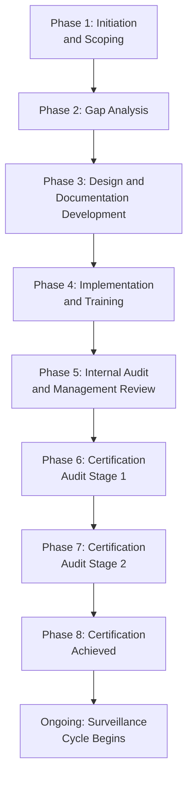
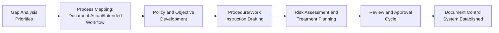
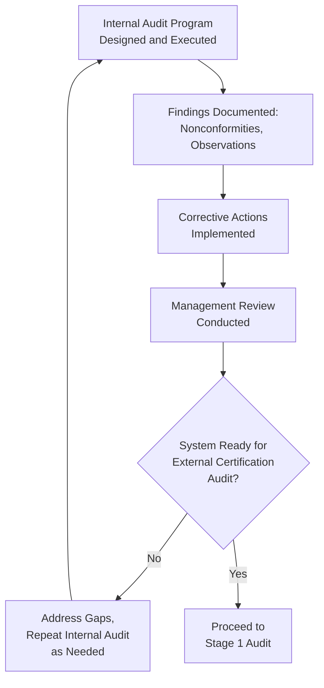
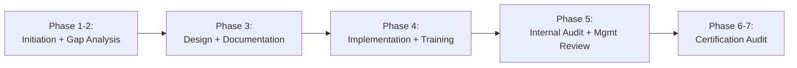

## Project Planning for QMS Implementation

### Overview

Project planning for QMS implementation applies structured project management discipline to the process of building, deploying, and certifying a Quality Management System. Unlike a purely technical or documentation exercise, QMS implementation is a cross-functional organizational project with defined phases, resource requirements, dependencies, and success criteria. This synthesizes the technical requirements covered throughout this curriculum (clause structure, risk assessment, documentation) with the change management and stakeholder considerations covered separately, into an executable project plan.

### QMS Implementation Project Lifecycle

### Phase 1: Initiation and Scoping

**Key Points**

- Define the ISMS/QMS scope: which sites, products/services, processes, and organizational units are included, and explicitly what is excluded and why (relevant to Clause 4.3)
- Secure top management sponsorship and commitment early — Clause 5.1 requirements are not merely a documentation exercise but a genuine resourcing and engagement commitment that must be established at project initiation, not retrofitted later
- Establish a project charter defining objectives, success criteria (e.g., "achieve ISO 9001 certification by [date]"), budget, and a named project sponsor and project lead

#### Key Deliverables — Phase 1

| Deliverable | Purpose |
| --- | --- |
| Project charter | Formal authorization, scope, objectives, sponsor identification |
| Scope statement | Boundaries of the management system (sites, processes, exclusions) |
| Stakeholder register | Identification of affected departments, roles, and their level of involvement |
| High-level timeline | Target certification date working backward to phase milestones |

### Phase 2: Gap Analysis

**Key Points**

- Assess current state against the target standard's clause requirements, identifying which requirements are already substantively met (even if undocumented), which are partially met, and which require development from scratch
- Gap analysis output directly informs project scope refinement and resource estimation — a organization further from conformity requires proportionally more implementation time and effort
- This phase should engage process owners across the organization, not solely the project lead, since accurate current-state assessment requires input from those who actually perform the work

#### Gap Analysis Output Structure — Example

| Clause/Requirement | Current State | Gap | Priority |
| --- | --- | --- | --- |
| 4.1 Context of the Organization | Not formally documented | Full development required | High |
| 7.2 Competence | Informal on-the-job training exists | Formalize competence records and matrix | Medium |
| 8.5.1 Production Control | Established but undocumented work instructions | Document existing practice | Medium |
| 9.2 Internal Audit | No internal audit program exists | Full program design and auditor training required | High |

### Phase 3: Design and Documentation Development

**Key Points**

- Documentation should reflect actual intended operational practice, developed collaboratively with process owners, rather than generic templates disconnected from real workflow — a recurring theme connecting to the documentation-practice gap ("paper system") risk covered in change management content
- Risk assessment (Clause 6.1, or the more formal risk methodology required by ISO/IEC 27001 Clause 6.1.2) should be conducted during this phase, since risk treatment decisions directly shape which controls/procedures are ultimately required
- Establishing document control conventions (numbering, approval workflow, version control) early in this phase prevents rework later as document volume grows

### Phase 4: Implementation and Training

**Key Points**

- This phase operationalizes the documented system — procedures move from draft to active use, records begin to be generated in the course of normal operations, and personnel receive training on new/changed requirements (Clause 7.2)
- This is the phase where change management principles (covered in this curriculum's Change Management chapter) are most critical — resistance typically peaks during early implementation, and structured communication/engagement mechanisms should be actively applied here, not reserved for a separate initiative
- A phased or pilot rollout (implementing in one department/process first before full-scale deployment) is commonly used to surface practical issues before organization-wide commitment, reducing the risk of large-scale rework

### Phase 5: Internal Audit and Management Review

**Key Points**

- At least one full internal audit cycle covering the entire management system scope should be completed before the external certification audit, providing evidence the organization has verified its own conformity (a mandatory requirement, not merely good practice)
- Management review (Clause 9.3) should explicitly address certification readiness as an agenda item, with top management making an informed go/no-go decision on proceeding to external audit based on internal audit results and CAPA closure status

### Phase 6-7: Certification Audit (Stage 1 and Stage 2)

**Key Points**

- Stage 1 audit assesses documentation readiness and confirms the organization understands and has appropriately scoped the management system before Stage 2 proceeds
- Stage 2 audit assesses actual operational conformity and effectiveness through on-site evidence gathering, interviews, and record review
- Nonconformities identified at either stage follow the standard nonconformity management process (correction, root cause analysis, corrective action, verification) before certification is granted

### Project Timeline Considerations

| Phase | Relative Duration Consideration |
| --- | --- |
| Initiation and Gap Analysis | Shorter phase; duration scales with organizational size/complexity |
| Design and Documentation | Often the longest phase, particularly for organizations starting with minimal existing documentation |
| Implementation and Training | Requires sufficient time for genuine operational adoption, not merely procedure distribution |
| Internal Audit and Management Review | Should not be compressed — inadequate internal audit coverage is a common cause of unexpected Stage 2 findings |
| Certification Audit | Timing depends on certification body scheduling availability, which may itself require advance booking |

[Inference] Specific phase durations vary enormously based on organizational size, existing process maturity, resource dedication (full-time project team versus part-time alongside regular duties), and standard complexity (a single-site ISO 9001 implementation differs substantially in scope from a multi-site ISO/IEC 27001 implementation); providing a generic timeline in weeks/months would misrepresent the genuine variability across implementation contexts, so relative sequencing and dependency is emphasized here over fixed duration estimates.

### Resource Planning Considerations

| Resource Type | Consideration |
| --- | --- |
| Project leadership | A dedicated or substantially allocated project lead, distinct from a purely part-time responsibility layered onto an existing full workload |
| Cross-functional participation | Process owners across departments contributing to gap analysis, documentation, and internal audit — not concentrated solely in a quality department |
| External expertise (optional) | Consultants or contracted specialists for gap analysis, documentation drafting, or internal audit training, particularly valuable where internal expertise in the target standard is limited |
| Training budget | Both role-specific competence training and general QMS awareness training across the organization |
| Certification body engagement | Early engagement with a certification body to understand their specific audit program requirements, scheduling lead times, and quoted audit duration (per IAF MD 5 factors) |

### Risk Management Within the Implementation Project Itself

**Key Points**

- The QMS implementation project is itself subject to standard project risk management — common risks include scope creep (attempting to over-engineer documentation beyond what the standard requires), inadequate resource dedication (treating implementation as an unfunded side project), and change management failure (technically complete documentation with poor actual adoption)
- Certification date targets should build in buffer for nonconformity resolution following Stage 1/Stage 2 audits, rather than assuming a first-pass certification with zero required corrective action

### Practical Example: Implementation Project Structure for a Government Document Management System

For an organization such as a local government unit pursuing ISO 9001 and/or ISO/IEC 27001 certification for a document management platform, a project plan might structure as:

| Phase | Key Activities Specific to This Context |
| --- | --- |
| Initiation | Define scope: which LGU departments/services are included; secure mayor's office/department head sponsorship |
| Gap Analysis | Assess existing manual/paper-based processes against target standard(s); identify data privacy and records retention gaps specifically |
| Design | Develop procedures aligned with both QMS requirements and applicable statutory requirements (Anti-Red Tape Act turnaround standards, Data Privacy Act, National Archives requirements) |
| Implementation | Phased rollout by department, with particular attention to change management given potential resistance from long-tenured staff (connecting to resistance management principles) |
| Internal Audit | Train personnel across departments as internal auditors to build cross-functional ownership |
| Certification | Engage certification body with public-sector/government-service experience where available |

[Inference] This structure illustrates general project planning principles applied to a government document management certification context; actual project scope, timeline, and resourcing depend on the specific organization's size, existing process maturity, and applicable regulatory framework.

### Common Pitfalls

- **Key Points**
  - Underestimating the Design and Documentation phase duration, particularly for organizations with minimal pre-existing formal documentation
  - Treating the implementation project as a quality department initiative rather than a genuinely cross-functional organizational project with appropriate resourcing across departments
  - Compressing the internal audit phase to meet an aggressive certification date target, resulting in inadequate self-verification before external audit and higher risk of Stage 2 findings
  - Failing to build change management activities into the project plan explicitly, treating documentation completion as equivalent to implementation completion
  - Setting a certification date target without adequate buffer for corrective action cycles following Stage 1/Stage 2 nonconformities

**Next Steps**

- Gap Analysis Methodology (Detailed Techniques)
- Documentation Development and Document Control (Clause 7.5)
- Change Management Principles for QMS Adoption
- Internal Audit Program Design and Execution (Clause 9.2)
- Management Review Inputs and Outputs (Clause 9.3)
- Certification Audit Process: Stage 1 and Stage 2
- Resource Planning and Project Risk Management for QMS Projects
- Building a QMS Implementation Team and Governance Structure