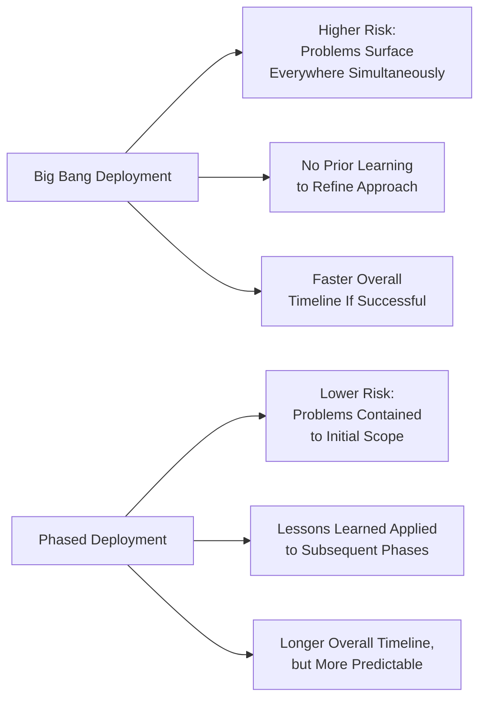
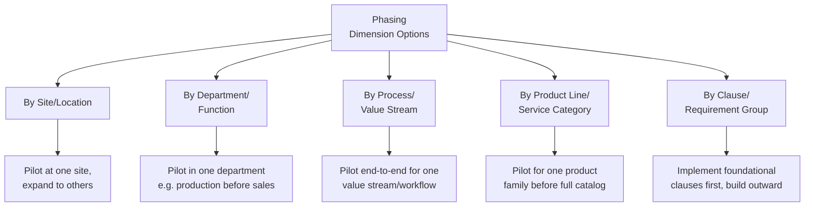
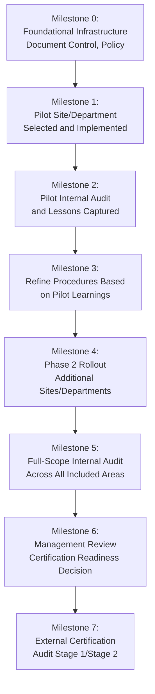
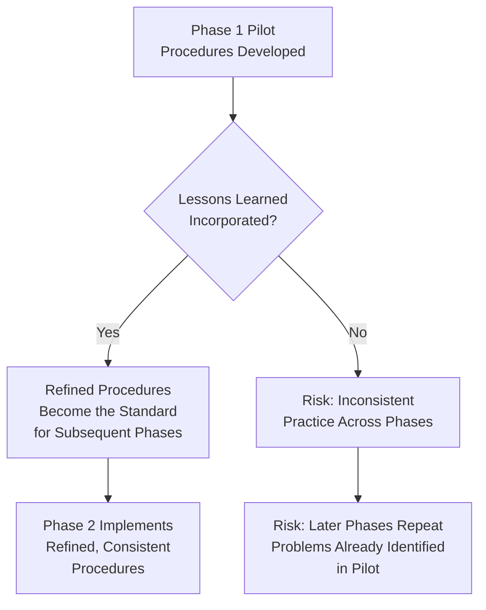

## Phased Implementation Strategy and Milestones

### Overview

Phased implementation strategy addresses *how* a QMS rollout is sequenced across an organization — by site, department, process, or product line — rather than attempting simultaneous organization-wide deployment. This is a tactical execution decision within the broader project planning framework, chosen deliberately to manage risk, build organizational learning, and demonstrate early value before full-scale commitment. It connects directly to change management principles (piloting reduces resistance exposure) and project risk management (limiting the blast radius of implementation problems).

### Why Phase Rather Than Deploy All at Once ("Big Bang")

**Key Points**

- Big bang deployment is occasionally appropriate for small, single-site organizations with low process complexity, where the coordination overhead of phasing exceeds its risk-reduction benefit
- Phased deployment is generally preferred for larger, multi-site, or process-diverse organizations, since it allows the organization to learn from and correct implementation issues in a contained scope before they propagate organization-wide
- [Inference] The choice between phased and big-bang approaches is a risk-tolerance and resource-availability decision rather than one approach being universally superior; the specific right choice depends on organizational size, complexity, and the criticality of the processes involved

### Common Phasing Dimensions

| Phasing Dimension | Best Suited For | Consideration |
| --- | --- | --- |
| By Site/Location | Multi-site organizations with similar operations across sites | Allows site-specific lessons before broader rollout; risk of inconsistency if sites are not truly similar |
| By Department/Function | Organizations where departments operate relatively independently | Clear ownership boundaries; risk of cross-functional process gaps if interfaces between departments are not addressed early |
| By Process/Value Stream | Organizations with distinct, separable end-to-end workflows | Captures full workflow complexity in the pilot; may cut across multiple departments requiring coordinated buy-in |
| By Product Line/Service Category | Organizations with diverse offerings of differing complexity/risk | Allows starting with lower-risk or higher-priority product lines; may leave gaps in shared/common processes |
| By Clause/Requirement Group | Organizations building foundational QMS infrastructure first | Establishes core infrastructure (document control, internal audit) before adding operational complexity; slower to reach full-scope readiness |

### A Representative Phased Rollout Sequence

### Selecting the Right Pilot Scope

**Key Points**

- An effective pilot scope is typically selected based on a balance of manageable complexity (not the organization's most complicated or highest-risk process) and genuine representativeness (not so simple or atypical that lessons learned fail to generalize to the rest of the organization)
- Selecting a pilot area with an engaged, receptive team (rather than the area with the most anticipated resistance) is a commonly used tactic to generate an early success story that can be used to build momentum and credibility for subsequent phases — connecting to Kotter's "generate short-term wins" change management principle
- Pilot areas should have clearly defined success criteria established *before* the pilot begins (e.g., specific process metrics, audit findings threshold, or user feedback benchmarks), to enable an objective go/no-go decision on proceeding to the next phase rather than a subjective judgment call

### Milestone Definition and Tracking

| Milestone Type | Example | Success Criteria |
| --- | --- | --- |
| Infrastructure milestone | Document control system operational | All Phase 1 procedures approved and accessible through the control system |
| Pilot completion milestone | Pilot department internal audit completed | Audit conducted; nonconformities documented and corrective actions initiated |
| Refinement milestone | Procedures updated based on pilot feedback | Defined number of pilot-identified issues resolved and incorporated into revised documentation |
| Expansion milestone | Phase 2 sites/departments onboarded | Training completed; initial records being generated in new scope areas |
| Readiness milestone | Full-scope internal audit and management review completed | No unresolved major nonconformities; management review formally confirms certification readiness |

**Key Points**

- Milestones should be defined with objective, verifiable completion criteria rather than vague target states ("department is comfortable with the new process" is difficult to verify objectively; "internal audit conducted with zero unresolved major nonconformities" is verifiable)
- Tracking milestone completion against the original project plan (Project Planning for QMS Implementation) allows early identification of schedule slippage, enabling corrective action (e.g., additional resourcing, scope adjustment) before delays compound across subsequent phases

### Managing Consistency Across Phases

**Key Points**

- A key risk in phased implementation is allowing each phase to develop its own variant practices without central coordination, resulting in a fragmented management system rather than a genuinely unified one by the time full scope is reached
- A central project governance function (connecting to the project leadership role established in project planning) should own the responsibility of capturing pilot lessons learned and ensuring they are systematically incorporated into the standard used for subsequent phases, rather than leaving each phase to independently rediscover the same issues

### Practical Example: Phased Rollout for a Multi-Department Government Organization

For an LGU implementing a QMS across multiple departments (e.g., business permits, civil registry, treasury), a phased approach might look like:

| Phase | Scope | Rationale |
| --- | --- | --- |
| Foundational | Document control system, QMS policy, core procedures | Establishes shared infrastructure before any department-specific rollout |
| Phase 1 (Pilot) | Business Permits and Licensing Office | Relatively contained, high public visibility (strong candidate for an early win under Anti-Red Tape Act turnaround pressure), receptive leadership |
| Phase 2 | Civil Registry | Builds on Phase 1 lessons; moderate complexity, distinct workflow from Phase 1 |
| Phase 3 | Treasury/Revenue Collection | Often higher complexity/risk (financial controls); benefits from organizational QMS maturity gained in Phases 1-2 before tackling this scope |
| Full-Scope Readiness | All included departments | Full internal audit and management review before certification audit |

[Inference] This phasing example illustrates general sequencing logic (starting with a contained, receptive, high-visibility area and progressing to higher-complexity areas); actual department selection and sequencing should be based on the specific organization's structure, readiness, and strategic priorities rather than treated as a fixed template.

### Common Pitfalls

- **Key Points**
  - Selecting a pilot scope based on convenience or availability rather than genuine representativeness, resulting in lessons that do not generalize to subsequent phases
  - Failing to define objective success criteria before the pilot begins, leading to ambiguous or contested go/no-go decisions on proceeding to subsequent phases
  - Allowing later phases to develop inconsistent variant practices due to inadequate central coordination of lessons learned from earlier phases
  - Treating phase transitions as calendar-driven (moving to the next phase on schedule regardless of pilot outcome) rather than criteria-driven (moving forward only once defined success criteria are genuinely met)
  - Underestimating the time required to properly capture, analyze, and incorporate pilot lessons learned before expanding scope, compressing this step to preserve an aggressive overall timeline

**Next Steps**

- Project Planning for QMS Implementation
- Change Management Principles for QMS Adoption
- Pilot Program Design and Success Criteria Definition
- Internal Audit Program Design and Execution (Clause 9.2)
- Building a QMS Champion Network
- Document Control and Version Consistency Across Sites (Clause 7.5)
- Resource Planning and Project Risk Management for QMS Projects
- Management Review as a Certification Readiness Gate (Clause 9.3)