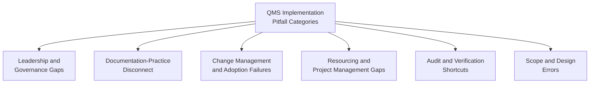
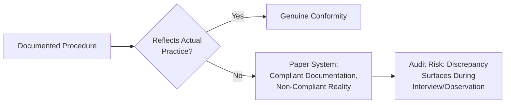
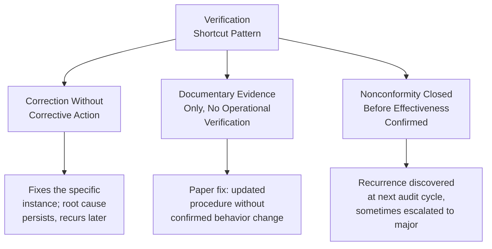
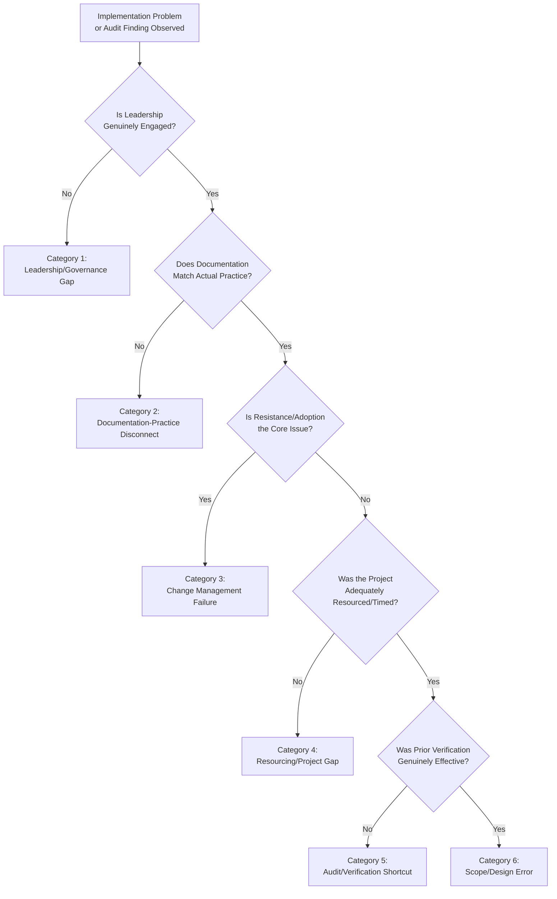

## Common Implementation Pitfalls and How to Avoid Them

### Overview

This item consolidates and structures the recurring failure patterns referenced individually throughout this curriculum's implementation-focused content — project planning, phased rollout, change management, and documentation — into a single diagnostic reference. Rather than introducing new concepts, it organizes known QMS implementation pitfalls by root cause category, cross-referencing the specific clauses and mechanisms already covered that either cause or resolve each pattern.

### Pitfall Categories Overview

### Category 1: Leadership and Governance Gaps

| Pitfall | Description | Consequence |
| --- | --- | --- |
| Delegated-only commitment | Top management authorizes the QMS but does not visibly participate (attending management reviews, referencing quality in operational decisions) | Clause 5.1 nonconformity; organization perceives QMS as a compliance exercise rather than genuine priority |
| Single-person ownership | QMS responsibility concentrated in one "quality manager" role without cross-functional process owner engagement | System collapses or stagnates if that individual leaves; lack of organizational ownership |
| Management review as formality | Reviews conducted to satisfy Clause 9.3 documentation requirements without genuine decision-making or resource allocation outcomes | Continual improvement (Clause 10.3) becomes nominal rather than substantive |

**Key Points**

- These gaps are addressed directly by the leadership and engagement principles covered in Change Management Principles for QMS Adoption and Employee Engagement in Quality Initiatives — the technical fix (writing a quality policy) does not resolve a genuine leadership engagement gap
- Middle management's translation role is a frequently overlooked leadership gap distinct from top management commitment — visible top-level support does not guarantee consistent middle-management reinforcement

### Category 2: Documentation-Practice Disconnect ("Paper Systems")

**Key Points**

- This pattern arises when documentation is developed by a quality department or consultant in isolation, without genuine process owner and frontline input — connecting directly to the participative design principle covered under resistance management
- Auditors specifically probe for this gap through direct observation and employee interviews cross-referenced against documented procedures (a standard Stage 2 audit technique) — this pitfall is not a low-detection-risk shortcut
- The fix is structural, not remedial: involve process owners in original documentation development (Project Planning Phase 3) rather than attempting to retrofit alignment after the gap is discovered during an audit

### Category 3: Change Management and Adoption Failures

| Pitfall | Root Cause (ADKAR Diagnostic) | Reference |
| --- | --- | --- |
| Training without buy-in | Addressing a Desire-stage gap with a Knowledge-stage intervention | Change Management Principles for QMS Adoption |
| Post-certification regression | No sustained Reinforcement mechanism after initial adoption | Employee Engagement in Quality Initiatives |
| Unaddressed informal leader resistance | Social resistance source not engaged before general rollout | Overcoming Resistance to Quality System Change |
| Punitive nonconformity handling | Blame-oriented framing suppressing voluntary reporting | Communication Strategies for Driving Quality Culture |

**Key Points**

- This category is the most extensively cross-referenced in this curriculum precisely because it is a commonly cited root cause underlying failures that superficially appear technical (e.g., an audit finding of "procedure not followed" often traces back to one of these adoption-stage gaps rather than a documentation defect)

### Category 4: Resourcing and Project Management Gaps

**Key Points**

- Treating QMS implementation as an unfunded addition to existing workloads, without dedicated project leadership time, is a frequently cited cause of stalled or indefinitely delayed implementations (Project Planning for QMS Implementation, Phase 1)
- Compressing the internal audit phase to meet an aggressive certification date target, sacrificing genuine self-verification for schedule adherence (Project Planning, Phase 5)
- Setting certification date targets without buffer for corrective action cycles following Stage 1/Stage 2 nonconformities, creating pressure to rush corrective action quality over genuine root cause resolution
- Selecting an unrepresentative pilot scope in a phased rollout, producing lessons that fail to generalize to subsequent phases (Phased Implementation Strategy and Milestones)

### Category 5: Audit and Verification Shortcuts

**Key Points**

- These patterns are detailed extensively in Managing Nonconformities During Certification Audits — the common thread is prioritizing rapid closure of an audit finding over genuine resolution, which typically resurfaces the same or a related finding in a subsequent audit cycle
- A corrective action addressing only the specific sampled instance an auditor cited, without extending the fix to the full population of potentially affected cases, is a specific and frequently cited variant of this pattern

### Category 6: Scope and Design Errors

| Pitfall | Description |
| --- | --- |
| Regulatory identification gaps | Assuming regulatory scope based only on headquarters location, missing extraterritorial or sector-specific requirements (Identifying Applicable Regulatory Requirements) |
| Over-engineered documentation | Developing documentation far beyond what the standard or organizational risk actually requires, adding burden without corresponding conformity benefit |
| Certification-standard-as-compliance-substitute | Assuming sector-specific management standard certification (e.g., ISO 13485) fully satisfies underlying statutory regulatory obligations (Compliance Obligations Across Regulated Industries) |
| Missed standard transition deadlines | Failing to plan revision transitions with adequate buffer before mandatory deadlines (Transitioning Certification to a Revised Standard) |

### Consolidated Root-Cause Diagnostic Flow

**Key Points**

- This diagnostic sequence is intended as a structured starting point for root cause investigation when an implementation problem's category is not immediately obvious — most real-world implementation failures involve more than one category simultaneously (e.g., a documentation-practice disconnect often co-occurs with a change management failure, since both stem from documentation developed without frontline involvement)

### Prevention Summary by Project Phase

| Project Phase (per Project Planning for QMS Implementation) | Primary Pitfall Risk | Primary Mitigation |
| --- | --- | --- |
| Initiation | Leadership/governance gap | Secure genuine top management sponsorship, not nominal authorization |
| Gap Analysis | Scope/design error | Engage process owners; verify regulatory scope comprehensively |
| Design and Documentation | Documentation-practice disconnect | Collaborative documentation development with process owners |
| Implementation and Training | Change management failure | Apply structured change management (Kotter/ADKAR), not documentation distribution alone |
| Internal Audit and Management Review | Audit/verification shortcut | Genuine root cause analysis, not correction-only closure |
| Certification Audit | Resourcing/project gap | Adequate schedule buffer for corrective action cycles |
| Post-Certification (Surveillance) | Change management failure (regression) | Sustained reinforcement, not one-time adoption effort |

### Practical Example: Multi-Category Failure in a Government Document Management Rollout

**Scenario**: An LGU's document management QMS implementation shows the following symptoms at Stage 2 audit: staff observed maintaining informal parallel tracking spreadsheets alongside the official system; a senior officer's resistance visibly influencing team behavior; and a corrective action from an earlier internal audit finding closed based on updated procedure wording alone.

| Symptom | Category | Underlying Issue |
| --- | --- | --- |
| Parallel spreadsheet tracking | Category 3 (Change Management) | Ability/Reinforcement gap — insufficient confidence or follow-through post-training |
| Senior officer influence | Category 3 (Change Management) | Social resistance not engaged before rollout |
| Corrective action closed on wording alone | Category 5 (Audit/Verification Shortcut) | Correction without corrective action; no operational verification |

[Inference] This composite scenario illustrates how multiple pitfall categories commonly co-occur and compound in a real implementation; it is a constructed illustrative example rather than a specific documented case.

### Common Pitfalls

*(Note: this item's "Common Pitfalls" section is nested within its own subject matter — the categories above collectively constitute this section's content, cross-referenced above rather than repeated separately here.)*

**Next Steps**

- Project Planning for QMS Implementation
- Phased Implementation Strategy and Milestones
- Change Management Principles for QMS Adoption
- Overcoming Resistance to Quality System Change
- Managing Nonconformities During Certification Audits
- Employee Engagement in Quality Initiatives
- Communication Strategies for Driving Quality Culture
- Building a Sustainable Post-Certification Governance Model