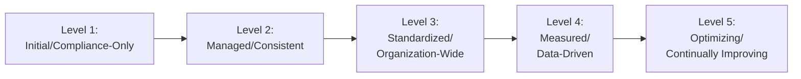
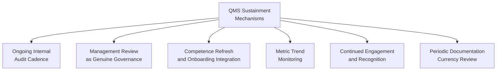
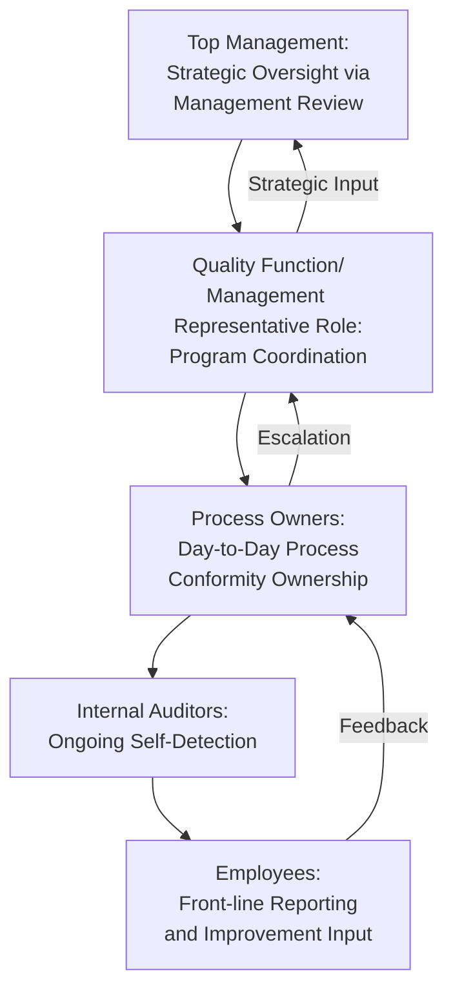
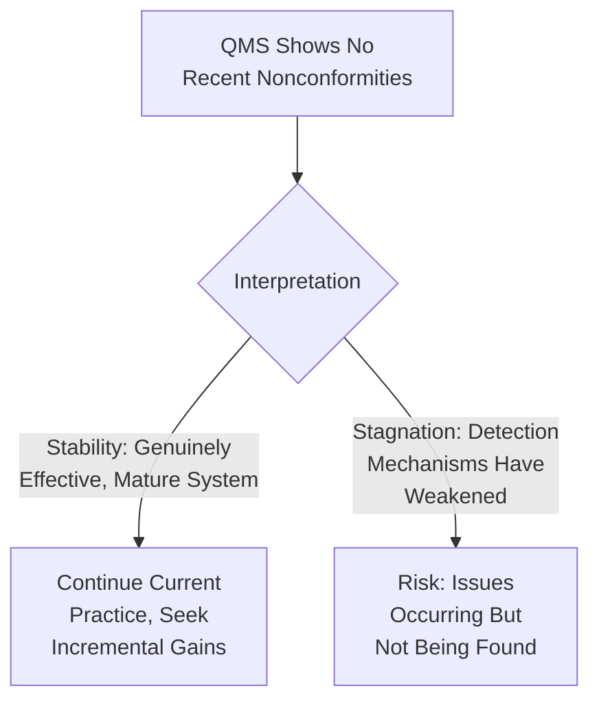

## Sustaining and Maturing the Quality Management System

### Overview

Sustaining and maturing a QMS addresses the post-certification phase of the QMS lifecycle: the ongoing discipline required to prevent regression toward pre-implementation practices, and the progressive evolution of the system from baseline conformity toward genuine performance-driving maturity. This closes the loop opened by Project Planning for QMS Implementation and directly counters the "post-certification regression" failure pattern identified in Common Implementation Pitfalls, drawing on Clause 9.3 (Management Review), Clause 10.3 (Continual Improvement), and the ADKAR Reinforcement stage.

### Why Sustainment Requires Distinct Effort from Implementation

**Key Points**

- Achieving certification demonstrates the system was capable of conformity at a specific point in time (the audit); it does not guarantee the same discipline persists once the acute pressure of the certification deadline is removed
- The behavioral patterns that drove implementation (heightened attention, dedicated project resourcing, visible leadership focus) often naturally diminish once certification is achieved, unless deliberately replaced with an ongoing sustainment mechanism
- This is the organizational parallel to the ADKAR model's Reinforcement stage — the most commonly neglected stage precisely because it lacks a natural deadline or milestone to drive attention, unlike the certification date that focused effort during implementation

### The QMS Maturity Model

| Maturity Level | Characteristics | Primary Risk at This Level |
| --- | --- | --- |
| Level 1: Initial/Compliance-Only | Procedures exist and are followed to pass audits; minimal proactive improvement activity | Documentation-practice disconnect ("paper system"); regression risk high |
| Level 2: Managed/Consistent | Procedures consistently followed; nonconformities addressed reactively | Improvement remains reactive rather than anticipatory |
| Level 3: Standardized/Organization-Wide | Consistent practice across all sites/departments; internal audit program mature | Standardization achieved but not yet leveraged for performance insight |
| Level 4: Measured/Data-Driven | Quality metrics actively inform decisions; trend analysis drives proactive action | Requires genuine data quality and analytical capability (Quality 4.0 foundation) |
| Level 5: Optimizing/Continually Improving | Improvement is embedded in culture; employees at all levels proactively identify and act on improvement opportunities | Sustaining this level requires continuous reinforcement; genuine risk of complacency after long stability |

**Key Points**

- [Inference] This five-level structure is a generalized synthesis reflecting common maturity-model logic used across quality management literature (drawing conceptually on frameworks such as CMMI); ISO 9001 itself does not mandate or define a specific maturity model, only requiring continual improvement (Clause 10.3) without specifying its staged progression
- Most organizations immediately post-certification sit at Level 1 or transitioning into Level 2 — reaching Level 4-5 maturity is a multi-year sustained effort, not an automatic consequence of initial certification

### Core Sustainment Mechanisms

#### Ongoing Internal Audit Cadence

**Key Points**

- Internal audits should continue at a planned, risk-based frequency post-certification, not merely to satisfy surveillance audit sampling expectations, but as the organization's own primary self-detection mechanism for drift back toward non-conformity
- Audit scope and depth can evolve with maturity — Level 1-2 organizations typically benefit from broad conformity-focused audits, while Level 4-5 organizations can shift emphasis toward effectiveness and improvement-opportunity-focused audits

#### Management Review as Genuine Governance

**Key Points**

- Sustained maturity requires management review (Clause 9.3) to function as substantive governance — resourcing decisions, objective revisions, and risk reassessment — rather than a periodic reporting formality
- A common sustainment indicator is whether management review outputs (Clause 9.3's required "opportunities for improvement" and "any need for changes") demonstrably lead to resource allocation or process changes, versus being documented and then not acted upon

#### Competence Refresh and Onboarding Integration

**Key Points**

- New employee onboarding must embed QMS competence and awareness from the start (Clause 7.2-7.3), preventing the "tribal knowledge decay" pattern where original implementation-era training fades as long-tenured staff who received it depart or as new staff join without equivalent exposure
- Periodic refresher training/awareness activities counter the natural erosion of procedural discipline over time, particularly for infrequently-performed processes where skill/familiarity decay is more pronounced

#### Metric Trend Monitoring

**Key Points**

- Sustained maturity depends on monitoring quality metrics (Clause 9.1) as *trends* over time rather than only point-in-time snapshots — a single period's acceptable performance does not indicate a stable state, while a gradual multi-period trend (even within acceptable limits) can be an early warning of drift before it becomes an actual nonconformity
- This connects to the predictive quality analytics content covered in Quality 4.0 — organizations progressing toward Level 4-5 maturity increasingly use trend and predictive analysis rather than relying solely on reactive nonconformity detection

#### Continued Engagement and Recognition

**Key Points**

- The engagement mechanisms covered in Employee Engagement in Quality Initiatives (suggestion systems, quality circles, recognition) require ongoing resourcing and responsiveness to remain functional — these mechanisms atrophy specifically when the feedback loop (acknowledgment, implementation, explanation of rejection) is not sustained past the initial rollout period
- Sustained psychological safety around nonconformity reporting is a continuous leadership responsibility, not a one-time cultural announcement — a single punitive response to a reported issue, even years after initial implementation, can meaningfully suppress future reporting

#### Periodic Documentation Currency Review

**Key Points**

- Documented procedures require periodic review against actual current practice, since operational reality naturally evolves (new equipment, personnel changes, informal process refinements) even when the underlying documented procedure is not formally updated (connecting to Clause 8.5.6 Control of Changes, which should trigger documentation updates when changes occur)
- Documentation review cadence itself should be planned (e.g., as part of the management review cycle or a defined document review schedule) rather than left to occur only reactively when a discrepancy is discovered during an audit

### Sustainment Governance Structure

**Key Points**

- Sustainment requires the same distributed ownership structure emphasized during implementation — concentrating post-certification responsibility in a single quality role recreates the single-person-ownership pitfall identified in implementation pitfalls, with the added risk that sustained attention naturally wanes without distributed accountability

### Distinguishing Stagnation from Stability

**Key Points**

- An absence of nonconformities is ambiguous — it can indicate genuine system maturity or a weakening detection mechanism (audits becoming superficial, reporting culture eroding); distinguishing between these requires periodically validating the detection mechanism itself (e.g., through audit program effectiveness review or occasional deliberately rigorous deep-dive audits), not merely observing the absence of findings
- [Inference] This is a widely recognized principle in quality and safety management — a declining reported-incident count can reflect either genuine improvement or reporting suppression, and organizations should treat a sudden or sustained drop in findings as a prompt for verification rather than automatic reassurance

### Practical Example: Sustainment Plan for a Government Document Management QMS

Following initial certification of a QMS covering a document management platform, a sustainment plan might include:

| Sustainment Element | Applied Activity |
| --- | --- |
| Internal audit cadence | Quarterly rotating audits across departments, maintained at the same rigor as pre-certification audits |
| Management review | Standing quarterly agenda item reviewing service turnaround trend data against Anti-Red Tape Act targets, with documented resource decisions |
| Onboarding integration | New LGU staff receive QMS awareness training as a mandatory onboarding step, not a one-time historical rollout event |
| Metric trending | Monthly dashboard review of processing time trends, flagging gradual drift even within acceptable service-level bounds |
| Engagement continuity | Sustained suggestion channel with a committed monthly review cadence, regardless of submission volume |
| Documentation review | Annual scheduled review of all procedures against current operational practice, independent of audit findings |

[Inference] This plan illustrates general sustainment mechanism categories applied to a government document management context; actual cadence and resourcing should be calibrated to the organization's specific risk profile and available capacity.

### Common Pitfalls

- **Key Points**
  - Reducing internal audit frequency or rigor once certification is achieved, under the assumption that certification itself confirms lasting conformity
  - Allowing management review to become a reporting formality once the urgency of initial certification has passed, losing its function as genuine governance
  - Failing to integrate QMS competence into standard onboarding, causing gradual competence decay as the original implementation-trained workforce turns over
  - Interpreting an absence of nonconformities as confirmed stability without verifying that detection mechanisms (audit rigor, reporting culture) remain genuinely effective
  - Treating certification as the project's end point rather than a milestone within a continuing maturity progression, leaving no owner or mechanism responsible for post-certification advancement

**Next Steps**

- Common Implementation Pitfalls and How to Avoid Them
- Management Review Inputs and Outputs (Clause 9.3)
- Continual Improvement Methodologies (Clause 10.3)
- Employee Engagement in Quality Initiatives
- Data Analytics and Predictive Quality Management
- Internal Audit Program Planning (Clause 9.2)
- Surveillance Audits and Recertification Cycles
- Building a Long-Term Quality Culture Governance Structure